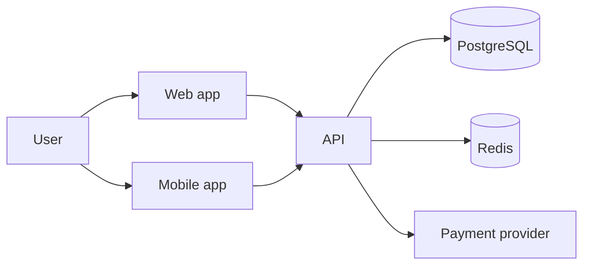

# Architecture Overview

_Last updated: YYYY-MM-DD · Owner: _

## 1. System context
<What the system does, users, external systems.>

## 2. Components
| Component | Responsibility | Tech | Repo/path |
|---|---|---|---|

## 3. Data
- Main entities and ownership
- Multi-tenancy model
- Data stores and what lives where

## 4. Key flows
<Auth flow, main business flow — sequence diagrams if useful.>

## 5. Infrastructure & environments
<Hosting, environments, networking, CI/CD.>

## 6. Security
<AuthN/AuthZ model, secrets management, encryption, compliance scope.>

## 7. Observability
<Logs, metrics, alerts, error tracking.>

## 8. Known limitations & future work
