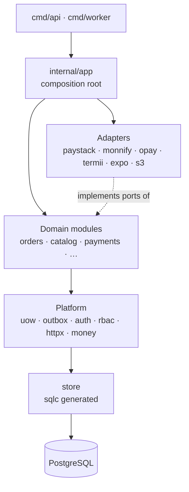
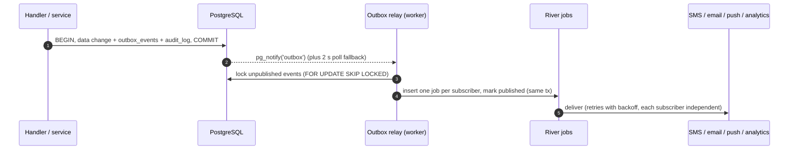
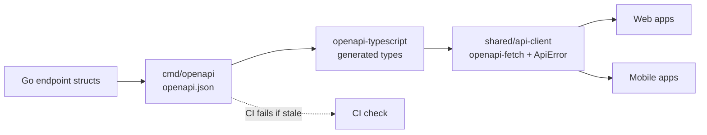
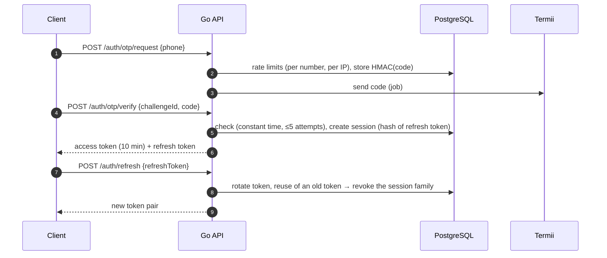
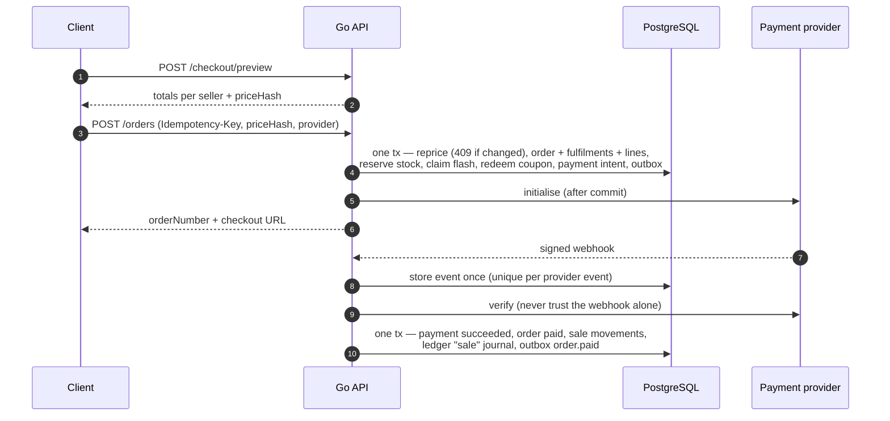
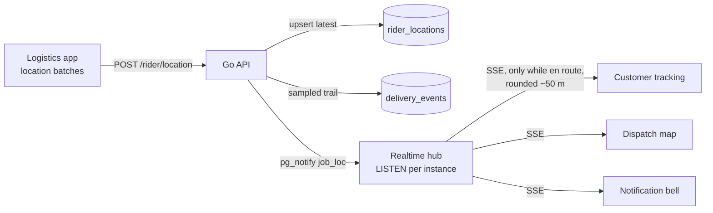
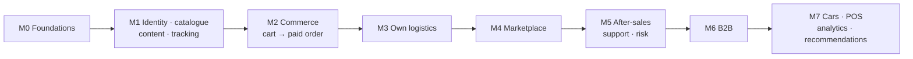

# TechShop backend plan (Go API)

The complete plan for the Go API in `backend/`. It's built on the existing scaffold (Gin, pgx/v5, goose and sqlc as Go tools, caarlos0/env, slog) and on the data model in [`database.md`](database.md).

**Status:** plan. Only `/health` exists today. Nothing here is implemented.

**Related docs:**
- Data model: [`database.md`](database.md) and [`database/`](database/schema.sql)
- Proposed schema deltas: [`schema-changes.md`](schema-changes.md)
- Cross-plan decisions: [`architecture-decisions.md`](architecture-decisions.md)
- Mobile: [`mobile.md`](mobile.md)
- Recommendations: [`recommendations.md`](recommendations.md)

**Superseding decisions** (each recorded in [`plan.md`](plan.md)):
- the migration order in `database.md` §9 is revised (§4.1);
- about 30 schema deltas;
- new libraries: Huma (OpenAPI), River (jobs), aws-sdk-go-v2 (S3) and maroto (PDF).

---

## 0. Fixes to the current scaffold (first)

| File | Problem | Fix |
|---|---|---|
| `internal/server/server.go` | Gin trusts all proxies, so client IPs can be spoofed | `SetTrustedProxies(cfg.TrustedProxies)` |
| `internal/middleware/cors.go` | `Idempotency-Key`, `X-Request-ID`, `Accept-Language` not allowed; nothing exposed | Add them; expose `X-Request-ID, Idempotent-Replayed, Retry-After, Location` |
| `internal/middleware/logger.go` | No request or user ID; 5xx logged at Info | Rewrite (§5.2) |
| `internal/server/server.go` | The 15 s write timeout kills streams | SSE handlers extend their own deadline (`http.ResponseController`) |
| `internal/database/postgres.go` | Hard-coded pool size; no statement timeout | `DB_MAX_CONNS`; `statement_timeout` + `idle_in_transaction_session_timeout` on connect |
| `internal/handler/health.go` | One endpoint for liveness and readiness | Keep `/health`; add `/health/live` and `/health/ready` (DB + migration version) |
| `cmd/api/main.go` | Default logger | Logger from config (`LOG_LEVEL`, JSON, context fields) |

---

## 1. Architecture

### 1.1 Modular monolith

One Go module, several binaries built from the same code.

```text
backend/
  cmd/
    api/        HTTP server (optional in-process worker for local dev)
    worker/     background jobs, outbox relay, scheduled jobs
    migrate/    runs migrations (production migration job)
    seed/       reference + demo data
    openapi/    writes the OpenAPI spec to shared/api-client/openapi.json
  db/
    migrations/  goose, embedded
    queries/     sqlc input, one file per domain
    seed/dev/    demo catalogue mirrored from the web fixtures
  internal/
    app/          composition root (wires every module)
    config/ database/ server/ middleware/ store/   (existing)
    # platform
    httpx/ auth/ rbac/ idempotency/ ratelimit/ uow/ outbox/ jobs/ audit/
    crypto/ money/ clock/ validate/ storage/ observability/ realtime/
    # domains
    identity/ staff/ sellers/ business/ catalog/ inventory/ purchasing/
    pricing/ marketing/ cart/ orders/ quotes/ payments/ ledger/ payouts/
    logistics/ aftersales/ cars/ support/ risk/ content/ pos/ notify/
    files/ analytics/ tracking/ recs/ platform/
```

**Each domain package** contains `module.go` (wiring and routes), `service.go` (rules), `http.go` (endpoints and DTOs), `states.go` (transition table from `states.md`), `events.go`, `jobs.go` and tests.

**No separate repository layer.** sqlc's generated queries *are* the repository, and tests run against real Postgres.

**Dependencies flow one way:**



**Rules:**
- A module uses another module only through an interface it declares itself.
- Provider adapters are wired only in `app`.
- Handlers never call `store` directly.
- Each module's queries touch only the tables it owns ([`database/access.md`](database/access.md) §4).
- `depguard` in golangci-lint enforces this.

### 1.2 Transactions across modules: unit of work

`uow.Run(ctx, pool, func(tx *uow.Tx) error)`:
1. Opens one transaction.
2. Gives every module the same `tx.Q` (sqlc bound to the transaction).
3. Collects outbox events, audit entries and job inserts.
4. Writes those buffered rows **in the same commit** as the data change.
5. Retries on serialization failures and deadlocks.

**Rule: no network calls inside a transaction.** Provider calls happen before or after, via jobs.

### 1.3 Events, outbox and background jobs

**River** (Postgres-native Go job queue) handles jobs: transactional inserts, retries, unique jobs, scheduled and periodic jobs with leader election. No Redis or broker is needed. Its tables are added through a goose migration, so goose stays the single migration authority.



**Production layout:**
- `cmd/worker` is a separate deployment from the same image.
- Locally, `WORKER_IN_PROCESS=true` keeps a single process.

**Scheduled jobs:**

| Job | When |
|---|---|
| Expire unpaid orders (verify with the provider first) | every minute |
| Payment status sweep | every 5 min |
| Provider reconciliation | daily 03:00 WAT |
| Payout run | business days 10:00 WAT |
| Transfer status sweep | every 15 min |
| Quote expiry, invoice overdue + reminders | hourly / daily |
| Promotion and banner scheduler | every minute |
| Cart abandonment (reminders only with marketing consent) | hourly |
| Support auto-close | daily |
| Inventory integrity (Σ movements = on hand) | nightly |
| Ledger trial balance (= 0) | nightly |
| Cleanup (idempotency keys, codes, sessions, uploads) | hourly |
| NDPA retention (anonymise deleted users; purge old locations and events) | daily |
| Expo push receipts | every 15 min |
| Invoice PDF render | on `invoice.issued` |
| Recommendation exports | nightly (see [`recommendations.md`](recommendations.md)) |

---

## 2. API design

### 2.1 Framework and contract

**Huma v2 on Gin:**
- Endpoints are defined as Go structs, from which it generates **OpenAPI 3.1**.
- Requests are validated against the schema.
- Errors are **RFC 9457 problem+json**.
- Per-endpoint metadata (`permission`, `idempotency`, `rateLimit`, `audience`) drives the middleware.

**Contract pipeline:**



**Wire format** (see [`architecture-decisions.md`](architecture-decisions.md)):
- camelCase fields; snake_case enum values (`uk_used`).
- Money as `{ amount: kobo, currency: "NGN" }`.
- Timestamps in RFC 3339 UTC; business dates in WAT.
- UUID IDs, plus human references (`TS-10482`).

**Versioning:** `/api/v1`, additive changes only. Removals use `Deprecation` and `Sunset` headers. `GET /api/v1/app-config` gives minimum mobile versions.

### 2.2 Authentication

One identity (`users`). Capabilities come from memberships (seller, business, staff, rider).

| Client | Login | Second factor | Session |
|---|---|---|---|
| Market web / customer app | Phone OTP or password | — | 30 days |
| Wholesale | Email + password or phone OTP | optional TOTP | 30 days |
| Seller Centre | Password | OTP on new device; TOTP recommended | 14 days |
| Staff portal | Email + password | **TOTP required**; step-up for approvals | 12 h (5 min access token) |
| Logistics app | Phone OTP + device binding | biometric/PIN unlock | 7 days |

**Tokens:**
- **Access token:** a JWT (Ed25519, key rotation by `kid`), 10 min (5 min for staff). It carries no permissions, so revoking access works immediately.
- **Refresh token:** a random opaque value. Only its hash is stored, it rotates on every use, and reuse revokes the whole session family.
- **Web:** the Next.js apps keep tokens in their own `httpOnly` cookies (backend-for-frontend pattern) and send `Authorization: Bearer` to the API. The API is cookie-free.
- **Mobile:** stores the refresh token in `expo-secure-store`.

**Secrets at rest:**
- Passwords: argon2id.
- OTPs: HMAC-SHA256 with a server pepper. 5 attempts, single use.



**Authorisation:**
- `auth.Require(audience)`: who may call.
- `rbac.Require("orders.refund")`: staff permission, cached for 60 s and invalidated on role changes. Sensitive permissions need recent MFA.
- `sellers.RequireMember` and `business.RequireMember`: membership scoping.
- **Ownership checks live inside every SQL query** (`… AND customer_user_id = $2`). That makes broken object-level authorisation structurally hard.
- **Separation of duties** in services: approver ≠ requester for refunds, KYC and payouts.
- **Permission catalogue:** Go constants seeded into `permissions`. Only an `admin` role is seeded until the owner decides the role model ([`database/access.md`](database/access.md) §3).


**Request pipeline** (every request, in order):

```mermaid
flowchart LR
  REQ[Request] --> NG[nginx<br/>TLS · IP rate limit]
  NG --> RID[Request ID<br/>+ trace]
  RID --> LOG[Structured log]
  LOG --> CORS[CORS + security headers]
  CORS --> AUTH[Auth<br/>token + audience]
  AUTH --> RBAC[Permission / membership]
  RBAC --> RL[Rate limit]
  RL --> IDEM[Idempotency]
  IDEM --> VAL[Schema validation<br/>Huma]
  VAL --> SVC[Service<br/>unit of work]
  SVC --> RESP[Response<br/>or problem+json]
```



### 2.3 Conventions

- **Errors:** problem+json with `code` and field-level `errors`. 5xx responses never leak internals; the request ID links them to logs.
- **Pagination:** cursor-based (`limit` ≤ 100, signed opaque cursor), returning `{ data, page: { nextCursor, hasMore } }`. Staff tables can request an estimated total.
- **Filtering and sorting:** the same parameters as the market listing URLs (`q, category, sub, condition, seller, minPrice/maxPrice, brand, attr.<key>, inStock, sort`).
- **Idempotency:**
  - Required on orders, checkout, payments, returns, quote acceptance, refunds, payouts and POS sales.
  - A replayed request returns the stored response with `Idempotent-Replayed: true`.
  - Concurrent duplicates get 409; a key reused with a different body gets 422.
- **Rate limits:**
  - nginx per IP on auth and events.
  - In-memory per user.
  - **Database-backed limits for OTP sends and logins**, protecting against SMS-pumping fraud.
- **Body limit:** 1 MB. Files never pass through the API (presigned uploads).

---

## 3. Domain modules

Route groups (all under `/api/v1`):

| Group | Prefix |
|---|---|
| Public / customer | `/…`, `/me/**` |
| Seller | `/seller/{sellerId}/**` |
| Business | `/business/{businessId}/**` |
| Staff | `/staff/**` |
| Rider | `/rider/**` |
| Webhooks | `/webhooks/**` |
| Internal | `/internal/**`, on a separate listener, never public |

| Module | Key endpoints | Key rules and integrations |
|---|---|---|
| **Identity & staff** | `/auth/*`, `/me`, `/me/addresses`, `/states`, `/me/privacy/export\|delete`; `/staff/hr/members`, `/staff/admin/roles`, `/staff/admin/audit-log` | One default address; Nigerian phone validation (shared test vectors with TypeScript); account deletion anonymises; an exited staff member loses roles and sessions in the same transaction |
| **Sellers** | `/seller/register`, `/seller/{id}/kyc`, `/members`, `/bank-accounts`; `/staff/vendors/*` (claim, approve, reject, request info, suspend, reveal-id) | NIN and NUBAN encrypted; bank account name resolved via the payout provider; ID reveal needs a permission, step-up MFA and an audit entry; KYC provider port (manual first) |
| **Business (B2B)** | `/business/register`, `/business/{id}`, members, addresses, `/credit`; `/staff/b2b/*` | Trade pricing only when the business is active; credit approval needs a finance approval |
| **Catalogue & search** | `/categories`, `/brands`, `/products`, `/products/{slug}`, reviews, `/search`, `/search/suggest`, `/deals`, `/best-sellers`; seller listing CRUD; staff catalogue CRUD and moderation | Unique listing per seller × variant × condition; **an FCCPA guard rejects fake "was" prices** (compare-at above the 30-day maximum); search served from a read model `product_offer_summary` (full-text search + trigram typo fallback + facet counts); cacheable responses |
| **Inventory** | `/staff/inventory/levels`, adjustments, device units, transfers, warehouses | One code path changes stock (movement + level together); blocked IMEIs never enter stock |
| **Purchasing** | Suppliers, POs (send, cancel), goods receipts | Receipts post stock movements; large POs need a finance approval |
| **Cart & saved** | `/cart` (guest token header), `/cart/merge`, items, `/me/saved` | Live pricing; minimum order quantity and stock checks |
| **Pricing** | (internal service) | Base or tier price → flash or best promotion → coupon (allocated by largest remainder) → delivery fee by zone and weight → VAT (placeholder until finance confirms) → a `priceHash` that detects changes |
| **Orders & checkout** | `/checkout/preview`, `/orders` (idempotent), `/me/orders`, cancel, guest tracking, reviews, ratings, receipt PDF; seller fulfilments (pack, hand over); staff orders | One transaction: reprice, orders + fulfilments per seller + line snapshots, stock reservation, flash claim, coupon, payment intent, outbox. Order status derived from its fulfilments |
| **Payments** | `/orders/{n}/payments`, `/payments/{ref}/status`, `/webhooks/paystack\|monnify\|opay`; staff payments, refunds, reconciliation, commission rules | Provider port (initialise, verify, webhook, refund, transfer); **always verify with the provider**, then check amount and currency; webhooks deduplicated; card fields scrubbed |
| **Ledger** | Staff ledger accounts and journals | Templates for every journal in [`database/flows.md`](database/flows.md); `posting_key` makes posting idempotent; nightly trial balance |
| **Payouts** | Seller payouts, balance, statement; staff approve, hold, retry | Eligible after delivery + return window; per-seller advisory lock; large batches held for approval |
| **Logistics** | `/delivery/estimate`; staff dispatch (zones, rates, assign, unassign, reattempt, stream); rider (shift, jobs, pickup, en route, location, deliver, fail); `/me/orders/{n}/tracking[/stream]` | Delivery OTP stored only on the job; delivered needs a verified OTP or photo; commission journal posted on delivery |
| **After-sales** | `/me/returns`, `/me/warranty-claims`, `/trade-ins/*`; staff returns, warranty, repairs, trade-ins | Return pickups are reverse delivery jobs; trade-ins create device units; bank payouts or store credit |
| **Cars** | `/cars`, `/cars/{slug}`, viewings, financing enquiries; staff listings, documents, inspections | Active only with verified documents; never add-to-cart |
| **Marketing** | `/promotions/live`, `/coupons/validate`; staff promotions, targets, flash prices, coupons | Real `ends_at` for countdowns; flash and coupon counters are concurrency-safe (§4.4) |
| **Support** | `/me/tickets`, seller tickets, public `/contact`; staff queue, assign, reply, internal note | Internal notes never returned to customers |
| **Risk** | Staff cases and blocklist | Rules at checkout, payout and trade-in (velocity, new account with a high-value order, amount mismatch, blocked IMEI) |
| **Content** | `/content/pages`, `/content/banners`, `/content/help`; staff CMS | Separate approval for publishing; link scheme allowlist |
| **POS** | Staff terminals, shifts (open, close), sales | POS sales are orders with `channel=pos`; cash variance flagged |
| **Files** | `/files/uploads` (presigned), `/files/{id}/complete`, `/files/{id}/url` | Allowed type, size and visibility depend on purpose; MIME sniffed; EXIF stripped from images; private downloads expire after 5 min and KYC downloads are audited |
| **Notifications** | `/me/notifications[/stream]`, push tokens, preferences | Termii SMS, email (SMTP locally, then SES/Postmark/ZeptoMail), Expo push; marketing only with consent |
| **Tracking & recommendations** | `/events`, `/recommendations`; internal export/import | See [`recommendations.md`](recommendations.md) |
| **Analytics** | `/staff/analytics/*` | Materialized views refreshed every 15 min |
| **Platform** | `/app-config`, staff feature flags, job and outbox views | Audited |

### 3.1 Checkout and payment



**Payment providers:**
- **Paystack:** initialise, verify, refund; webhook signature HMAC-SHA512; transfers for payouts.
- **Moniepoint, via its Monnify gateway:** transactions, reserved accounts for B2B bank transfers, disbursements.
- **OPay:** cashier.
- **Internal:** bank transfer and credit (B2B).
- **Fake:** for tests and local development.

Signature schemes are confirmed against each provider's current documentation during implementation, and the documentation version is recorded in `docs/log.md`.

---

## 4. Data layer

### 4.1 Migrations (revised order)

This revises [`database.md`](database.md) §9. Platform tables come first; marketing and content come earlier.

| # | Migration | Milestone |
|---|---|---|
| 00002 | Foundation: extensions, helper functions, sequences, `audit_log`, `outbox_events`, `idempotency_keys`, `feature_flags` | M0 |
| 00003 | River job tables | M0 |
| 00004 | Identity: users, sessions, codes, MFA, states, RBAC, staff, addresses, files, push tokens, consents, notifications | M1 |
| 00005 | Catalogue: sellers (+ TechShop), categories, brands, attributes, products, variants, images, listings, tiers, price history, saved, `product_offer_summary` | M1 |
| 00006 | Inventory | M1 |
| 00007 | Content | M1 |
| 00008 | Tracking: `user_events` (partitioned monthly), `identity_links` | M1 |
| 00009 | Sales: carts, orders, fulfilments, lines, history, `stock_reservations` | M2 |
| 00010 | Payments + ledger (+ `posting_key`), commission rules | M2 |
| 00011 | Marketing (with counters) | M2 |
| 00012 | Logistics (+ `rider_locations`, OTP fields, direction) | M3 |
| 00013 | Marketplace: KYC, bank accounts, payouts, reviews, ratings, `encryption_keys` | M4 |
| 00014 | After-sales, support, risk | M5 |
| 00015 | B2B + purchasing (and the foreign keys deferred from earlier phases) | M6 |
| 00016–00018 | Cars, POS, analytics views; recommendation tables (`rec_*`) | M7 |

**Splitting rules:**
- Cross-phase foreign keys are added in the migration that creates the target table.
- Replace the generic `DO` loops with explicit trigger and index statements.
- Keep table comments.
- Every `Down` reverses its `Up`; CI runs up → down → up.
- After M1, migrations become the source of truth and `schema.sql` is regenerated from them.

### 4.2 Queries (sqlc)

- One file per domain in `db/queries/`, with method names prefixed by domain.
- Overrides: `uuid` → `google/uuid`, typed JSON structs where needed.
- `:copyfrom` for bulk inserts.
- **One sanctioned exception:** the dynamic catalogue search query in `catalog/search_query.go` (documented in `CLAUDE.md` when built).
- `sqlc vet` and `sqlc diff` run in `make check`.

### 4.3 Seeds

- **Reference data in migrations:** states, the TechShop seller, ledger accounts.
- **`cmd/seed reference`:** permissions, the admin role, a default warehouse, Lagos and Abuja zones and rates (marked as sample), and a default commission rule (placeholder).
- **`cmd/seed demo`:** the same products as the web sample data, so switching each page from sample data to the API is visually verifiable.

### 4.4 Stock reservation and flash deals

- **Reservation is one conditional `UPDATE`:**
  - `reserved = reserved + qty WHERE on_hand - reserved >= qty`;
  - lines sorted to avoid deadlocks;
  - a `stock_reservations` row per line, so expiry and cancellation release exactly what was taken.
- **Device units** are bound when packing (IMEI scan).
- **Flash deals:**
  - `claimed = claimed + qty WHERE claimed + qty <= stock_limit`;
  - a per-user claim table;
  - sign-in required;
  - checkout rate-limited.
- **Coupons:** a conditional `redeemed_count` increment.
- If load tests show contention, shard counters.

---

## 5. Cross-cutting concerns

### 5.1 Configuration (new environment variables)

| Group | Variables |
|---|---|
| App | `APP_BASE_URL`, `APP_TIMEZONE=Africa/Lagos`, `LOG_LEVEL`, `LOG_FORMAT`, `TRUSTED_PROXIES`, `INTERNAL_ADDR`, `WORKER_IN_PROCESS`, `WORKER_CONCURRENCY` |
| DB | `DB_MAX_CONNS`, `DB_MIN_CONNS`, `DB_STATEMENT_TIMEOUT`, `DB_IDLE_IN_TX_TIMEOUT` |
| Auth | `JWT_SIGNING_KEYS`, `JWT_ISSUER`, `ACCESS_TOKEN_TTL`, `STAFF_ACCESS_TOKEN_TTL`, `REFRESH_TOKEN_TTL`, `STAFF_REFRESH_TOKEN_TTL`, `OTP_HMAC_KEY`, `OTP_TTL`, `CURSOR_HMAC_KEY`, `TURNSTILE_SECRET`, `STEP_UP_MAX_AGE` |
| Crypto | `KMS_PROVIDER`, `KMS_KEY_ID`, `LOCAL_KEK` (dev only), `BLIND_INDEX_KEY` |
| Payments | `PAYSTACK_*`, `MONNIFY_*`, `OPAY_*`, `PAYMENTS_ENABLED_PROVIDERS`, `PAYMENTS_FAKE`, `PAYMENT_CALLBACK_URL`, `ORDER_PAYMENT_TTL`, `PAYOUT_PROVIDER`, `PAYOUT_APPROVAL_THRESHOLD_KOBO`, `RETURN_WINDOW_DAYS`, `VAT_BPS` |
| Messaging | `SMS_PROVIDER`, `TERMII_API_KEY`, `TERMII_SENDER_ID`, `EMAIL_PROVIDER`, `SMTP_URL`, `EMAIL_FROM`, `EXPO_ACCESS_TOKEN` |
| Storage | `S3_ENDPOINT`, `S3_REGION`, `S3_BUCKET_PUBLIC`, `S3_BUCKET_PRIVATE`, `S3_ACCESS_KEY_ID`, `S3_SECRET_ACCESS_KEY`, `S3_FORCE_PATH_STYLE`, `PUBLIC_ASSET_BASE_URL` |
| Integrations | `GEOCODER_PROVIDER`, `GOOGLE_MAPS_API_KEY`, `KYC_PROVIDER`, recommendation settings (see [`recommendations.md`](recommendations.md) §10) |
| Observability | `OTEL_EXPORTER_OTLP_ENDPOINT`, `OTEL_SERVICE_NAME`, `OTEL_TRACES_SAMPLER_ARG`, `METRICS_ENABLED` |

Production refuses to start with development-only values (`LOCAL_KEK`, `PAYMENTS_FAKE`, `SMS_PROVIDER=log`).

### 5.2 Observability

- **Logs:**
  - slog JSON with request ID, trace ID, user and client.
  - 5xx logged at Error, 4xx at Warn.
  - Health checks sampled away.
  - Sensitive types redact themselves.
  - Lint bans `fmt.Print`/`log.*`.
- **Traces:** OpenTelemetry across HTTP, pgx (sqlc query names), provider HTTP clients and jobs.
- **Metrics** (Prometheus format on the internal port):
  - HTTP latency, orders, payments by provider and status;
  - webhook validity;
  - outbox lag;
  - job states;
  - OTP sends (SMS cost alarm);
  - ledger trial balance (must be 0);
  - inventory drift.

### 5.3 Security (OWASP API Top 10)

| Risk | Control |
|---|---|
| Object-level authorisation | Ownership in every query; authorisation matrix tests per route; UUIDs |
| Authentication | argon2id, peppered OTP + attempt caps, DB rate limits, rotating refresh tokens with reuse detection, staff TOTP + step-up |
| Property-level authorisation | Explicit request and response DTOs; never serialise database rows; staff and customer views separate |
| Resource consumption | Body caps, page limits, statement timeouts, rate limits, presigned uploads |
| Function-level authorisation | Every staff endpoint must declare a permission (a test fails otherwise) |
| Sensitive business flows | Flash caps, coupon and OTP abuse controls, checkout velocity → risk cases, payout dual control |
| SSRF | No user-supplied URLs fetched; provider URLs from config only |
| Misconfiguration | Trusted proxies, strict CORS, security headers, `no-store` on authenticated responses |
| API inventory | The OpenAPI spec is the inventory; internal routes on a separate listener |
| Third-party APIs | Webhook signatures + verification, amount checks, timeouts, response size limits |

**Further controls:**
- **Secrets:** from the hosting platform's secret manager; `gitleaks` in CI.
- **Audit log:** every staff and seller change is audited in the same transaction.
- **Personal data reads:** only through explicit "reveal" endpoints, which are audited.

**Encryption:**
- AES-256-GCM envelope encryption with data keys wrapped by a KMS key.
- The associated data includes table, column and row, so ciphertext can't be moved between rows.
- Blind-index HMACs detect duplicate NINs and bank accounts.

### 5.4 Caching: no Redis for now

Everything Redis would typically do is already covered:
- **Jobs:** River.
- **Global rate limits:** database counters.
- **Realtime fan-out:** Postgres `LISTEN/NOTIFY`.
- **Sessions:** stateless JWT plus a small revocation cache.
- **Read caching:** HTTP cache headers, CDN/Next ISR, and small in-process caches.

Revisit beyond about 3 API instances or heavy tracking traffic. Caches sit behind interfaces, so adding Redis later is an adapter, not a rewrite.

### 5.5 Time, money and validation

- **Time:**
  - UTC everywhere; business dates in WAT (fixed UTC+1); tzdata embedded.
  - A `public_holidays` table for payout business days.
- **Money:**
  - an int64 kobo type with overflow checks;
  - basis-point maths; VAT extraction;
  - largest-remainder allocation, so allocated lines always sum exactly;
  - database checks as the backstop.
- **Validators:** Nigerian phone, NUBAN check digit, IMEI (Luhn), VIN check digit, state codes.

---

## 6. Realtime

Server-Sent Events for tracking, dispatch and notifications. Data only flows server → client, SSE works through nginx, and it reconnects automatically. Riders send their location with ordinary POSTs.



**Rules:**
- Customers see the rider's location only while the job is en route, rounded to about 50 m, and it stops at delivery.
- 25 s heartbeat; resume from the latest snapshot.
- The nginx stream location disables buffering.
- Mobile uses an SSE client, falling back to 15 s polling.
- Web streams through the Next.js backend-for-frontend.
- Location history purged after 90 days (proposal).

---

## 7. Testing

| Layer | What |
|---|---|
| Unit | Pricing, money maths, state transition tables (every allowed edge, nothing else), ledger templates against the worked examples, crypto, validators, property tests (allocations sum, journals balance) |
| Shared vectors | Phone normalisation identical in Go and TypeScript |
| Integration | Every query and service flow against **real Postgres 17**: a template database per test run (not transaction rollback, because the ledger check fires on commit); testcontainers locally, the CI Postgres service in CI |
| API | Full router with fake providers; responses validated against the OpenAPI spec |
| Authorisation matrix | Every route × (anonymous, customer A/B, seller member/other, staff without/with permission). A test fails if a route is missing |
| Concurrency | Last 3 units under 50 parallel checkouts → exactly 3 succeed; flash limit never exceeded; a duplicate webhook delivered 10× → one change and one journal |
| Webhook replay | Recorded payloads: valid, duplicate, invalid signature, out of order, amount mismatch, late success, refund and transfer events |
| End-to-end scenarios | Checkout → pay → pack → deliver (OTP) → commission → payout → refund; then trial balance = 0 and stock reconciles |
| Migrations and contract | up → down → up; sqlc diff; OpenAPI and TypeScript freshness |
| Load (manual or nightly) | k6: browsing p95 < 300 ms, checkout p95 < 800 ms, flash sale with 5k users on 100 units → **0 oversold** |
| Fuzz | Webhook parsers, cursor decoding, phone, IMEI |

---

## 8. Deployment readiness (plan only)

- **Image:** a multi-stage `backend/Dockerfile` producing one distroless image with `api`, `worker`, `migrate` and `seed`.
- **Processes:**
  - **api:** at least 2 replicas, readiness probe.
  - **worker:** at least 1 (leader election makes 2 safe).
  - **migrate:** a pre-deploy job.
  - Migrations follow expand/contract, so old pods keep working.
- **Local compose additions:** MinIO (S3), Mailpit (email), an optional OpenTelemetry collector + Jaeger, and an nginx stream block.
- **CI additions (checks only):**
  - sqlc, OpenAPI and TypeScript freshness;
  - migration round-trip;
  - `govulncheck`, `gitleaks`;
  - extra linters (gosec, sloglint, forbidigo, depguard, errorlint, …);
  - short fuzz runs;
  - image build without push.
- **CD, kept separate:** `.github/workflows/deploy-backend.yml` (build and push, migrate job, roll out, smoke test). Its contents depend on the hosting decision.

---

## 9. Milestones




| Milestone | Backend scope | Surfaces that switch from sample data to the API |
|---|---|---|
| **M0 Foundations** | Scaffold fixes, composition root, problem+json, request IDs, OpenTelemetry, Huma + OpenAPI + TS generation, unit of work, outbox, River, worker, idempotency, rate limits, crypto, storage, test kit, Dockerfile, CI | Shared client moves to the generated contract |
| **M1 Identity, catalogue, content, tracking** | Auth (OTP, password, refresh, staff TOTP), profile and addresses, RBAC (admin), catalogue + search, staff catalogue, inventory basics, files, CMS, events endpoint, demo seed | Market browse, product, search, best sellers, help and legal; wholesale retail catalogue; corporate pages; staff sign-in, catalogue, content, admin, HR; customer app browsing |
| **M2 Commerce** | Cart, pricing, checkout, Paystack, ledger sale, marketing, notifications, expiry jobs, staff orders, finance, refunds | Market cart, checkout, orders, account, saved, deals; staff orders, finance, marketing; customer app checkout and push |
| **M3 Own logistics** | Zones, rates, riders, dispatch, delivery OTP, rider endpoints, SSE, commission on delivery | Live tracking; staff dispatch map; logistics app |
| **M4 Marketplace** | Seller registration, KYC + encryption, bank accounts, moderation, seller fulfilment, reviews, payouts, Monnify and OPay | Seller Centre; staff vendors and payouts; vendor offers and reviews |
| **M5 After-sales, support, risk** | Returns → refunds, warranty, repairs, trade-ins, tickets, contact, risk rules | Help flows, trade-in, contact; staff support, warranty, trade-ins, risk |
| **M6 B2B** | Businesses, credit, quotes → orders → invoices (PDF), bank transfer and reserved accounts, purchasing | Wholesale quote, business account, credit, invoices; staff B2B and purchasing |
| **M7 Cars, POS, analytics, recommendations** | Cars, POS, analytics views, recommendation endpoints and exports, IT tools | Cars; staff car sales, POS, analytics, IT tools; recommendation shelves |

**Per milestone:**
- A `docs/plan.md` entry before starting and a `docs/log.md` entry with verification after.
- Pages switch app by app behind a server-only `NEXT_PUBLIC_DATA_SOURCE`-style toggle, so each one can be compared against the sample data.

---

## 10. Risks

| Risk | Mitigation |
|---|---|
| SMS sender ID registration and DND routing take weeks | Start Termii onboarding during M0 |
| SMS-pumping fraud | Database-backed OTP limits |
| Payment providers behave differently (signatures, retries) | Always verify; recorded fixtures; launch with Paystack only |
| VAT and revenue recognition are undecided | Live payments behind a flag until finance signs off; corrections only as adjustment journals |
| Scope (96 tables, 19 modules) | Each milestone ships on its own; no M4+ before M2 is solid |
| Stock accuracy under flash sales | Load tests and the nightly integrity job |
| NDPA data residency affects hosting and tool choices | Decide hosting early |
| Old mobile builds | Additive-only v1 and minimum app versions |

## 11. Open decisions for the owner

1. Staff role model.
2. Commission rates; VAT treatment (on commission, first-party vs marketplace); revenue recognition timing.
3. Retail overlap between market and wholesale.
4. Guest checkout, or phone OTP at checkout (recommended).
5. Payments:
   - provider launch order (Paystack first?);
   - payout provider;
   - reserved accounts for B2B;
   - late payment after an order has expired: reinstate the order, or refund automatically?
6. SMS, email, KYC-verification and geocoding vendors.
7. Hosting, region, data residency, KMS.
8. Return window, payment expiry, payout schedule and thresholds, store credit for trade-ins.
9. Delivery outside own-rider areas (third-party couriers?), click-and-collect.
10. Anonymous quote requests on wholesale.
11. Confirm technical choices: Huma, River, BFF auth, snake_case enum values, no Redis.
12. FIRS e-invoicing obligations for B2B invoices.
13. Consent model for analytics and recommendations.

Schema deltas from this plan are consolidated in [`schema-changes.md`](schema-changes.md).
