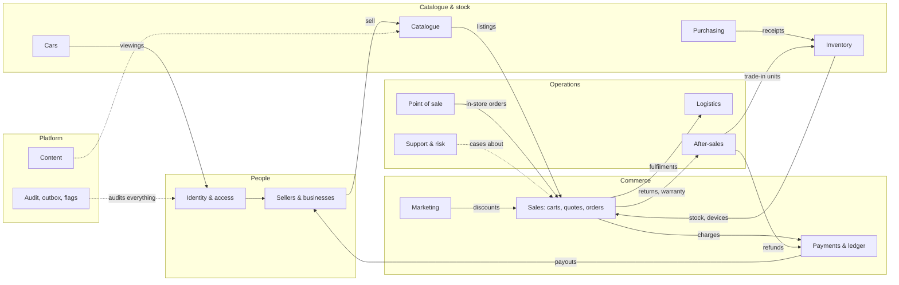

# TechShop database plan

The data model for TechShop: schema, relationships, lifecycles, flows and access.

**Status (2026-10-05):** built.
- **Source of truth:** the goose migrations in [`backend/db/migrations/`](../backend/db/migrations/). Change the database there, never in `schema.sql`.
- **Contents:** 195 tables in 22 Postgres schemas, one schema per domain (§9). This includes every proposal in [`schema-changes.md`](schema-changes.md).
- **Applied:** to the local Docker database.
- **Verified:** constraint tests, a full up → down → up cycle, and sqlc parsing.

| Document | What's in it |
|---|---|
| [`database/schema.sql`](database/schema.sql) | **Generated** `pg_dump --schema-only` of the migrated database: every table, key, constraint, index and trigger in one file. Each table carries a `[schema] purpose` comment |
| [`database/erd.md`](database/erd.md) | Entity-relationship diagrams for every domain, plus an overview of all tables. **Generated from the schema** |
| [`database/states.md`](database/states.md) | State machines for every status lifecycle |
| [`database/flows.md`](database/flows.md) | Sequence diagrams for the key processes, money flow, ledger journal templates |
| [`database/access.md`](database/access.md) | Staff roles and permissions (proposal), which app owns which data, personal-data classification |
| [`database/tools/`](database/tools/) | Scripts that load the migrations into a throwaway Postgres, run the constraint tests, regenerate `schema.sql`, `erd.md` and the table index, and render diagrams |
| [`database/diagrams/`](database/diagrams/) | Every diagram rendered as SVG |


**Related plans:**
- Schema changes from the backend, mobile, recommendation and system plans (all applied 2026-10-05): [`schema-changes.md`](schema-changes.md)
- System plans: [`messaging-marketing.md`](messaging-marketing.md), [`identity-access.md`](identity-access.md), [`payments-finance.md`](payments-finance.md), [`search-catalogue.md`](search-catalogue.md), [`orders-fulfilment.md`](orders-fulfilment.md), [`trust-safety.md`](trust-safety.md)
- How the API is built on this model: [`backend.md`](backend.md)
- Cross-plan decisions: [`architecture-decisions.md`](architecture-decisions.md)

---

## 1. Context

TechShop is a Nigeria-first tech commerce business. It:
- sells its **own stock** (retail and wholesale);
- runs a **multi-vendor marketplace** for local businesses and individuals;
- **supplies** businesses (B2B: quotes, VAT invoices, credit terms).

It takes payments through **Paystack, OPay and Moniepoint**, runs its own **dispatch and delivery**, offers **warranty, repairs and trade-ins**, lists **cars**, and operates a staff back-office with 19 modules.

**Surfaces:** five web apps (corporate, market, wholesale & retail, seller centre, staff portal) and two mobile apps (customer, logistics). All of them read and write data **only through the Go API**. The API is the sole owner of PostgreSQL (`CLAUDE.md`).

The frontend currently runs on sample data (`frontend/packages/fixtures`), with domain types in `shared/api-client/src/types.ts`. This plan is the model those will be replaced by.

## 2. Design principles

| Decision | Choice | Why |
|---|---|---|
| Database | PostgreSQL 17, owned exclusively by the Go API (goose migrations, sqlc queries) | Single source of truth; matches the existing backend setup |
| Primary keys | `uuid` with `gen_random_uuid()` | Safe to expose, mergeable across environments. Revisit UUIDv7 on Postgres 18 |
| Human references | Sequences: `TS-10482` orders, `QT-`, `INV-`, `PO-`, `RMA-`, `TKT-`, `WR-`, `TI-`, `CAR-` | Readable on phones, receipts and calls |
| Money | `bigint` **kobo** + `currency char(3) default 'NGN'`; never floats | Exact arithmetic; matches `Money` in the API client and Paystack's units |
| Statuses | `text` + `CHECK (… IN (…))`, not enum types | Adding a value is a one-line migration; clean with sqlc |
| Timestamps | `timestamptz`; `created_at`, plus `updated_at` maintained by one trigger | Consistent and automatic |
| One marketplace model | **TechShop is a row in `sellers`** (`type = 'first_party'`). Products are catalogue entries; **listings** are seller offers on a product variant | One code path for own stock and vendors (Amazon model) |
| Order split | One `orders` row per checkout, **one `fulfilments` row per seller**, `order_lines` snapshot names and prices | Multi-seller carts ship separately; history never changes when products do |
| Money movements | **Double-entry ledger** (`ledger_journals` / `ledger_entries`), each journal must balance (deferred trigger) | Payments, commission, seller payables, payouts and refunds always reconcile |
| Serialised devices | `device_units` (IMEI / serial) + `device_blocklist` | Warranty, trade-ins, theft checks and returns need the actual unit |
| Cars | Separate tables from the product catalogue | Viewing / inspection / financing flow, never add-to-cart |
| Search | Generated `tsvector` + GIN, `pg_trgm` on names | Good enough until a dedicated search engine is needed |
| Personal data | NIN, bank account numbers and similar encrypted in the application (`bytea`), with `*_last4` for display | Nigeria Data Protection Act 2023; leaked backups don't leak identities |
| Platform | `audit_log` (append-only), `outbox_events`, `idempotency_keys`, `feature_flags` | Accountability, reliable messaging, safe retries |
| Documentation | Every table has `COMMENT ON TABLE … IS '[domain] purpose'` | ER diagrams and the table index are generated, so they can't drift |

## 3. Domain map



## 4. Domains and tables

The complete, generated table index (with every table's purpose) is in [`database/erd.md`](database/erd.md#table-index).

| # | Domain | Tables |
|---|---|---|
| 1 | Identity & access | `users`, `user_sessions`, `verification_codes`, `nigerian_states`, `addresses`, `roles`, `permissions`, `role_permissions`, `staff_members`, `staff_roles` |
| 2 | Sellers & businesses | `files`, `sellers`, `seller_members`, `seller_kyc_submissions`, `kyc_documents`, `seller_bank_accounts`, `businesses`, `business_members`, `credit_accounts` |
| 3 | Catalogue | `categories`, `brands`, `attribute_definitions`, `products`, `product_attribute_values`, `product_variants`, `product_images`, `listings`, `price_tiers`, `listing_price_history`, `saved_items` |
| 4 | Inventory | `warehouses`, `inventory_levels`, `stock_movements`, `device_units`, `stock_transfers`, `stock_transfer_lines` |
| 5 | Purchasing | `suppliers`, `purchase_orders`, `purchase_order_lines`, `goods_receipts` |
| 6 | Point of sale | `pos_terminals`, `pos_shifts` |
| 7 | Sales | `carts`, `cart_items`, `quotes`, `quote_lines`, `orders`, `fulfilments`, `order_lines`, `order_status_history`, `invoices`, `product_reviews`, `seller_ratings` |
| 8 | Payments & money | `payments`, `payment_events`, `refunds`, `ledger_accounts`, `ledger_journals`, `ledger_entries`, `commission_rules`, `payouts`, `payout_items` |
| 9 | Logistics | `delivery_zones`, `delivery_rates`, `riders`, `delivery_jobs`, `delivery_events` |
| 10 | After-sales | `return_requests`, `return_items`, `warranty_claims`, `repair_jobs`, `trade_ins` |
| 11 | Cars | `car_listings`, `car_images`, `car_inspections`, `car_documents`, `viewing_bookings`, `financing_enquiries` |
| 12 | Marketing | `promotions`, `promotion_targets`, `promotion_listing_prices`, `coupons`, `coupon_redemptions` |
| 13 | Support & risk | `support_tickets`, `ticket_messages`, `message_attachments`, `risk_cases`, `device_blocklist` |
| 14 | Content | `cms_pages`, `banners`, `help_articles` |
| 15 | Platform | `audit_log`, `notifications`, `outbox_events`, `idempotency_keys`, `feature_flags` |

## 5. Key relationships (in words)

- **People:**
  - A **user** can be a customer, a member of one or more **sellers**, a member of one or more **businesses**, and/or a **staff member** (one person, one login).
  - Staff permissions come from **roles**.
- **Catalogue:**
  - A **category** tree holds **products**; each product has **variants** (e.g. 256GB · Black).
  - **Sellers** (including TechShop) publish **listings**: one per seller × variant × condition. A listing holds price, stock mode and warranty, and optional wholesale **price tiers**.
- **Checkout:**
  - Buying creates one **order**, split into one **fulfilment per seller**.
  - Each **order line** snapshots the listing (name, price, condition, commission rate) and can point to the exact **device unit** sold.
- **Payments and the ledger:**
  - **Payments** settle orders (or B2B **invoices**). Every money event posts a balanced **ledger journal**.
  - **Payouts** pay sellers for delivered fulfilments (via **payout items**).
- **Logistics:** each fulfilment shipped by TechShop gets a **delivery job** for a **rider**, with **delivery events** as the tracking trail.
- **After-sales:**
  - **Returns** reference order lines and lead to **refunds**.
  - **Warranty claims** and **repair jobs** reference device units.
  - **Trade-ins** become device units in inventory.
- **B2B:** **businesses** request **quotes**, which convert into orders. Approved businesses have a **credit account**, and their orders are **invoiced**.
- **Cars** are separate **car listings** with inspections, documents, viewing bookings and financing enquiries.

## 6. Diagrams

| Kind | Where | Count |
|---|---|---|
| Domain map | above (§3) | 1 |
| ER diagrams, one per domain, plus an all-tables overview | [`database/erd.md`](database/erd.md) | 16 |
| State machines | [`database/states.md`](database/states.md) | 15 |
| Sequence diagrams | [`database/flows.md`](database/flows.md) | 7 |
| Money flow (ledger accounts) | [`database/flows.md`](database/flows.md#money-flow) | 1 |
| Access ownership | [`database/access.md`](database/access.md) | 1 |

All diagrams are Mermaid (they render on GitHub). Rendered SVGs are in [`database/diagrams/`](database/diagrams/).

## 7. Indexing, search and scale

- **Every foreign key is indexed**, which the verification checks.
- **Hot query paths get composite and partial indexes:**
  - Listings by `(variant_id, status)`.
  - Orders by `(customer_user_id, placed_at desc)`.
  - Fulfilments by `(seller_id, status)`.
  - Delivery jobs by `(rider_id, status)`.
  - Unread notifications.
- **Product search:** `products.search_vector` (generated, GIN) plus a trigram index on `products.name`.
- **Append-only, high-volume tables** (`audit_log`, `stock_movements`, `delivery_events`, `payment_events`, `ledger_entries`) are the first candidates for monthly partitioning once they grow.
- **Uniqueness guards duplicates that cost money:**
  - `(provider, provider_reference)` on payments and `(provider, provider_event_id)` on webhooks, so webhooks are idempotent.
  - IMEIs, VINs, coupon codes and SKUs are unique.

## 8. Privacy and security

| Data | Treatment |
|---|---|
| Passwords | Hash only (argon2id/bcrypt in the API) |
| NIN, ID numbers, bank account numbers | Encrypted by the API (`bytea`), `*_last4` for display; access audited |
| Session / refresh tokens, OTP codes | Stored as hashes only |
| Phone, email, addresses | Personal data under NDPA 2023: retention and deletion handled per the privacy policy |
| Payment card data | **Never stored.** Providers tokenise it; we keep provider references only |

Details and the per-table classification are in [`database/access.md`](database/access.md).

## 9. Migrations and schemas (goose)

The migrations in `backend/db/migrations/` are the source of truth (the earlier phasing in this section is superseded; see [`plan.md`](plan.md), 2026-10-05).

**Conventions every migration follows:**
- Each file has a goose `Up` and a full `Down`.
- Tables use qualified names (`schema.table`), with a `[schema] purpose` comment on every table.
- **Explicit indexes:** every foreign-key column has an explicit index.
- **Explicit triggers:** every `updated_at` column has an explicit `platform.set_updated_at()` trigger. There are no generic loops.
- **Append-only tables** use `platform.forbid_change()`: the ledger, stock movements and delivery events.
- **Partitioned tables** are partitioned monthly with a default partition; the worker adds months ahead with `platform.ensure_monthly_partitions()`. These are the high-volume logs: `user_events`, `auth_events`, `message_events`, `risk_decisions`, `search_queries` and `rider_location_pings`.

| Migration | Creates |
|---|---|
| `00001_init` | Empty baseline |
| `00002_foundation` | Extensions (`citext`, `pg_trgm`), the 22 schemas, helper functions |
| `00003_identity` | Users, sessions, codes, MFA, roles and permissions, staff, consents, privacy requests, auth events and limits |
| `00004_platform` | Files, audit log, outbox (+ NOTIFY), idempotency keys, feature flags, holidays, encryption keys |
| `00005_partners` | Sellers, KYC, bank accounts; businesses, members, credit; addresses |
| `00006_catalog` | Categories, brands, attributes, products, variants, images, listings, prices, moderation, compatibility, search read model |
| `00007_search` | Synonyms, redirects, pins, query log, suggestions, catalogue gaps |
| `00008_inventory` | Warehouses, bins, stock levels, device units, movements, transfers, counts, costs; purchasing |
| `00009_pos` | Tills and shifts |
| `00010_sales` | Carts, quotes, orders, fulfilments, order lines, history, stock reservations, reviews and ratings |
| `00011_logistics` | Zones, rates, riders (devices, zones, shifts, locations), delivery and pickup jobs, events |
| `00012_fulfilment` | Parcels, pick lists, packing, manifests, carriers, shipments, seller SLA events |
| `00013_payments` | Payments, webhooks, refunds, transfer accounts, disputes, provider health, reconciliation |
| `00014_finance` | Invoices, ledger (posting keys, period close, balance check), commission, payout batches, payouts, holds |
| `00015_aftersales` | Returns, inspections, warranty, repairs, trade-ins |
| `00016_messaging` | Message log and inbox, provider events, suppressions, preferences, templates, push tokens |
| `00017_marketing` | Promotions, flash claims, coupons and codes, segments, campaigns, journeys, tracked links |
| `00018_content_support` | CMS pages, banners, help articles; support tickets |
| `00019_risk` | Risk rules and decisions, cases, KYC checks, link graph, lists, blocklist, seller metrics, enforcement, reports |
| `00020_cars` | Car listings, photos, inspections, documents, viewings, financing |
| `00021_personalisation` | Behaviour events, identity links, recommendation outputs and staging tables |
| `00022_reference_data` | States, TechShop as first-party seller, chart of accounts, provider health, open periods, admin role, default flag |

**Domain → Postgres schema:**

| Schema | Domain |
|---|---|
| `platform` | Files, audit log, outbox, idempotency, flags, encryption keys, helper functions |
| `identity` | Users, sessions, codes, MFA, roles, staff, addresses, consents |
| `sellers` | Marketplace shops, members, KYC, bank accounts |
| `b2b` | Business buyers, members, credit, quotes |
| `catalog` | Products, variants, listings, prices, reviews, the search read model |
| `search` | Search merchandising and analytics |
| `inventory` | Stock levels, device units, movements, reservations, counts, costs |
| `purchasing` | Suppliers, purchase orders, goods receipts |
| `pos` | Store tills and shifts |
| `sales` | Carts, orders, fulfilments, order lines |
| `fulfilment` | Warehouse work, parcels, carriers, seller SLAs |
| `logistics` | Delivery zones, riders, delivery jobs |
| `payments` | Payments, refunds, disputes, reconciliation |
| `finance` | Ledger, periods, invoices, commission, payouts |
| `aftersales` | Returns, warranty, repairs, trade-ins |
| `messaging` | Message log, preferences, templates, push tokens |
| `marketing` | Promotions, coupons, campaigns, journeys |
| `content` | CMS pages, banners, help |
| `support` | Tickets |
| `risk` | Trust and safety |
| `cars` | Car sales |
| `personalisation` | Events and recommendations |

**Run them:**
- `make migrate-up` (from `backend/`) runs them.
- Locally, Postgres runs in Docker (`infra/docker/compose.yml`). Connect over the Docker network ([`.claude/CLAUDE.md`](../.claude/CLAUDE.md) §2).

**Not created yet:**
- **River job tables.** River isn't a project dependency yet, so it needs owner approval.
- **Dev test accounts** (a dev-only seed, when backend work starts).
- **LGAs and public holidays** (reference data to load later).

## 10. Frontend → data traceability

| Frontend | Tables |
|---|---|
| Market home, category, search, product pages | `categories`, `products`, `product_variants`, `listings`, `price_tiers`, `promotions`, `promotion_listing_prices`, `product_reviews` |
| Cart, saved items | `carts`, `cart_items`, `saved_items` |
| Track an order, account | `orders`, `fulfilments`, `delivery_jobs`, `delivery_events`, `addresses` |
| Help → returns, warranty; trade-in | `return_requests`, `warranty_claims`, `trade_ins` |
| Cars | `car_listings`, `car_inspections`, `viewing_bookings`, `financing_enquiries` |
| Wholesale: trade prices, quote, business account, invoices, credit | `price_tiers`, `quotes`, `businesses`, `invoices`, `credit_accounts` |
| Seller centre: register, payouts | `sellers`, `seller_kyc_submissions`, `kyc_documents`, `seller_bank_accounts`, `payouts` |
| Staff: each module | See [`database/access.md`](database/access.md#module-ownership) |
| Logistics app | `riders`, `delivery_jobs`, `delivery_events` |

## 11. Open decisions for the owner

1. **Staff role model:** [`database/access.md`](database/access.md) proposes roles and permissions; nothing is final.
2. **Commission structure:** the `commission_rules` table supports rates by category or per seller, but the rates themselves aren't decided.
3. **Retail overlap:** whether TechShop's own stock appears on the market, the wholesale site, or both. The data model supports both (one listing, two storefronts).
4. **VAT handling:** the schema stores VAT per order and invoice; the tax treatment needs confirming with finance.

## 12. How to regenerate and verify

```bash
docs/database/tools/generate.sh
```

**What it does:**
1. Starts a throwaway `postgres:17-alpine` container (separate from the project's).
2. Loads every migration's Up section in order.
3. Runs the constraint tests (`tools/constraint-tests.sql`).
4. Runs the coverage checks: every table commented, every FK indexed, every `updated_at` trigger present.
5. Regenerates `schema.sql`, `erd.md` and the table index.
6. Renders every diagram to `diagrams/`.
7. Removes the container.

The full goose cycle (`up` → `down` to 0 → `up`) is run with the goose binary against a throwaway container; see [`log.md`](log.md).
