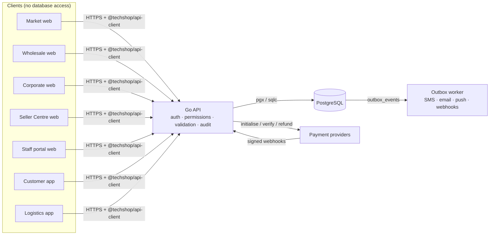

# TechShop data access

Who can read and write which data, and how personal data is protected. Overview: [`../database.md`](../database.md).

## 1. Only the API touches the database

Every request is authorised in the API from the caller's identity:
- **Customers** see only their own rows (`customer_user_id`, `user_id`).
- **Seller members** see only rows for their seller (`seller_id` via `seller_members`).
- **Business members** see only their business (`business_id` via `business_members`).
- **Staff** see what their roles' permissions allow.

Postgres row-level security can be added later as defence in depth; it is not the primary control.

## 2. What each app can do

| App | Who | Reads | Writes (through the API) |
|---|---|---|---|
| Market web, customer app | Public, customers | Active listings, products, categories, promotions, published reviews, cars, help content | Own account, addresses, carts, orders, payments, saved items, reviews, returns, warranty claims, trade-ins, viewing bookings, tickets |
| Wholesale web | Public, business members | As market (TechShop stock), price tiers | Businesses, quotes, orders, invoices view, credit applications |
| Corporate web | Public | Published CMS pages, banners | Contact/partner enquiries (support tickets) |
| Seller Centre | Seller members | Own seller, listings, fulfilments, payouts, ratings | Own listings, KYC submissions, bank accounts, fulfilment status |
| Logistics app | Riders, dispatch | Own delivery jobs | Delivery job status, delivery events, proof of delivery |
| Staff portal | Staff | Per role (§3) | Per role (§3), always written to `audit_log` |

## 3. Staff roles: proposal

> **Proposal only.** The owner hasn't decided the staff role model yet. Roles are data (`roles`, `permissions`, `role_permissions`), so changing this table needs no schema change.

Permissions follow the pattern `module.action` (`orders.read`, `orders.refund`, `finance.payouts`). R = read, W = create/update, A = approve (sensitive actions), — = no access.

| Module (tables) | Admin | Operations manager | Customer support | Catalogue | Inventory | Dispatch | Rider | Finance | Vendor manager | B2B sales | Marketing | HR |
|---|---|---|---|---|---|---|---|---|---|---|---|---|
| Orders (`orders`, `fulfilments`, `order_lines`) | RWA | RWA | RW | R | R | R | — | R | R | RW | — | — |
| Catalogue (`products`, `listings`, …) | RWA | R | R | RWA | R | — | — | R | RA | R | R | — |
| Inventory (`inventory_levels`, `stock_*`, `device_units`) | RWA | RW | R | R | RWA | R | — | R | — | R | — | — |
| Dispatch (`delivery_*`, `riders`) | RWA | RW | R | — | R | RWA | own jobs | — | — | — | — | — |
| Customer support (`support_tickets`, …) | RWA | RW | RWA | — | — | R | — | R | R | R | — | — |
| Vendors (`sellers`, `seller_kyc_*`) | RWA | R | R | R | — | — | — | R | RWA | — | — | — |
| B2B accounts (`businesses`, `quotes`, `credit_accounts`) | RWA | R | R | — | — | — | — | RA | — | RWA | — | — |
| Purchasing (`suppliers`, `purchase_*`) | RWA | RW | — | R | RW | — | — | RA | — | — | — | — |
| Finance (`payments`, `refunds`, `ledger_*`, `payouts`) | RWA | R | R | — | — | — | — | RWA | R | R | — | — |
| Risk & fraud (`risk_cases`, `device_blocklist`) | RWA | RW | R | — | — | — | — | RW | RW | — | — | — |
| Marketing (`promotions`, `coupons`) | RWA | R | R | R | — | — | — | R | — | — | RWA | — |
| Analytics (read models) | R | R | — | R | R | R | — | R | R | R | R | — |
| Content (`cms_pages`, `banners`, `help_articles`) | RWA | — | RW | R | — | — | — | — | — | — | RWA | — |
| Warranty & repairs (`warranty_claims`, `repair_jobs`) | RWA | RW | RW | — | R | — | — | R | — | — | — | — |
| Trade-ins (`trade_ins`) | RWA | RW | RW | — | RW | — | — | RA | — | — | — | — |
| Car sales (`car_*`, `viewing_bookings`, …) | RWA | RW | RW | RW | — | — | — | R | RW | — | — | — |
| Point of sale (`pos_*`) | RWA | RW | — | — | RW | — | — | R | — | — | — | — |
| HR & staff (`staff_members`) | RWA | R | — | — | — | — | — | — | — | — | — | RWA |
| Admin console (`roles`, `staff_roles`, `audit_log`) | RWA | — | — | — | — | — | — | — | — | — | — | R |
| IT tools (`feature_flags`) | RWA | — | — | — | — | — | — | — | — | — | — | — |

**Safeguards regardless of role:**
- **Separation of duties:** whoever approves a refund (`refunds.approved_by`) or a KYC decision can't also be the one who requested it. The API enforces this.
- **Sensitive reads are audited:** decrypted NIN or bank numbers and full customer exports are written to `audit_log`.
- **Leavers lose access immediately:** an `exited` staff member loses all `staff_roles` in the same transaction.

## 4. Module ownership

Which staff module owns each table, so every table has an accountable team.

| Module | Owns |
|---|---|
| Orders | `orders`, `fulfilments`, `order_lines`, `order_status_history`, `carts`, `cart_items`, `return_requests`, `return_items` |
| Catalogue | `categories`, `brands`, `attribute_definitions`, `products`, `product_attribute_values`, `product_variants`, `product_images`, `listings`, `price_tiers`, `listing_price_history`, `product_reviews` |
| Inventory | `warehouses`, `inventory_levels`, `stock_movements`, `device_units`, `stock_transfers`, `stock_transfer_lines` |
| Dispatch | `delivery_zones`, `delivery_rates`, `riders`, `delivery_jobs`, `delivery_events` |
| Customer support | `support_tickets`, `ticket_messages`, `message_attachments` |
| Vendors | `sellers`, `seller_members`, `seller_kyc_submissions`, `kyc_documents`, `seller_bank_accounts`, `seller_ratings` |
| B2B accounts | `businesses`, `business_members`, `credit_accounts`, `quotes`, `quote_lines`, `invoices` |
| Purchasing | `suppliers`, `purchase_orders`, `purchase_order_lines`, `goods_receipts` |
| Finance | `payments`, `payment_events`, `refunds`, `ledger_accounts`, `ledger_journals`, `ledger_entries`, `commission_rules`, `payouts`, `payout_items` |
| Risk & fraud | `risk_cases`, `device_blocklist` |
| Marketing | `promotions`, `promotion_targets`, `promotion_listing_prices`, `coupons`, `coupon_redemptions`, `banners` |
| Content | `cms_pages`, `help_articles` |
| Warranty & repairs | `warranty_claims`, `repair_jobs` |
| Trade-ins | `trade_ins` |
| Car sales | `car_listings`, `car_images`, `car_inspections`, `car_documents`, `viewing_bookings`, `financing_enquiries` |
| Point of sale | `pos_terminals`, `pos_shifts` |
| HR & staff | `staff_members` |
| Admin console | `users`, `user_sessions`, `verification_codes`, `roles`, `permissions`, `role_permissions`, `staff_roles`, `audit_log`, `addresses`, `saved_items`, `files`, `nigerian_states` |
| IT tools | `feature_flags`, `notifications`, `outbox_events`, `idempotency_keys` |

## 5. Personal data (NDPA 2023)

| Class | Columns | Protection | Retention (proposal, to confirm) |
|---|---|---|---|
| **Secret** (never stored in plain text) | `users.password_hash`, `user_sessions.refresh_token_hash`, `verification_codes.code_hash`, `delivery_jobs.otp_hash`, `idempotency_keys.request_hash` | One-way hashes only | Until expiry or revocation |
| **Sensitive personal** | `seller_kyc_submissions.id_number_encrypted`, `seller_bank_accounts.account_number_encrypted`, `kyc_documents` files | Encrypted by the API (envelope encryption); last 4 digits for display; decryption audited | While the seller is active + statutory period |
| **Personal** | `users` (name, email, phone), `addresses`, `orders.ship_to`, `viewing_bookings`, `financing_enquiries`, `support_tickets`/`ticket_messages`, `trade_ins` (IMEI), `delivery_events` (location) | Access by role; exports audited | Account life; orders kept for tax/accounting period, then anonymised |
| **Business** | `businesses`, `suppliers`, `invoices`, `quotes` | Access by role | Contract + tax period |
| **Payment** | `payments`, `refunds`, `payment_events.payload` | **No card data ever** (provider tokenises); payloads scrubbed of card fields | Tax/accounting period |
| **Public** | Published `products`, `listings`, `cms_pages`, `help_articles`, `product_reviews` (author shown as first name + initial) | — | — |

**Deleting an account** (`users.status = 'deleted'`):
- Names, email, phone and addresses are anonymised.
- Orders, invoices and ledger rows are kept, without personal identifiers, because accounting law requires them.
