# TechShop entity-relationship diagrams

> **Generated** by `docs/database/tools/generate.sh` from the goose migrations (`backend/db/migrations`) loaded into Postgres 17. Do not edit by hand. Change a migration and regenerate. Each section is one Postgres schema; tables are shown without the schema prefix.

Overview and design notes: [`../database.md`](../database.md).

## How to read these diagrams

| Notation | Meaning |
|---|---|
| `PK` / `FK` / `UK` | Primary key / foreign key / unique |
| `"nullable"` | Column may be empty |
| `\|\|--o{` | Each child row has exactly one parent; a parent has zero or many children |
| `\|o--o{` | The parent link is optional (nullable foreign key) |
| `\|\|--o\|` | One-to-one (the foreign key is unique) |
| Label on a line | The foreign-key column on the child table |

## Identity & access

- `identity.addresses`: Saved delivery and business addresses, owned by exactly one user or one business.
- `identity.auth_events`: Append-only security events (sign-ins, failures, MFA, token reuse, role changes). Partitioned monthly.
- `identity.auth_rate_limits`: Window counters for OTP sends and sign-in attempts (per number, IP, device, global). No Redis needed.
- `identity.consents`: Append-only record of consent given or withdrawn (NDPA). The latest row per subject and purpose wins.
- `identity.nigerian_lgas`: Lookup: local government areas per state, so delivery fees match consistent spellings.
- `identity.nigerian_states`: Lookup: the 36 states and the FCT, used by addresses, zones and listings.
- `identity.permissions`: Actions per staff module (module.action). Sensitive ones need a recent MFA step-up.
- `identity.privacy_requests`: Data export and account deletion requests (deletion has a 7-day cancel window, then anonymisation).
- `identity.role_permissions`: Which permissions each role grants.
- `identity.roles`: Staff roles. Proposed templates in docs/identity-access.md §7.2; the owner approves the final list.
- `identity.service_clients`: Machine clients (the Python recommender) using client credentials on the internal listener.
- `identity.staff_invites`: Single-use invite links for new staff (set password, enrol TOTP).
- `identity.staff_members`: TechShop employees. A staff member is a user with an employee record.
- `identity.staff_role_scopes`: Limits a staff role to specific stores, warehouses or delivery zones. No rows = unrestricted.
- `identity.staff_roles`: Roles held by each staff member. Nobody grants a role to themselves.
- `identity.user_mfa_factors`: Authenticator-app (TOTP) secrets, envelope-encrypted. last_used_step stops a code being used twice.
- `identity.user_recovery_codes`: Single-use MFA recovery codes, stored hashed.
- `identity.user_sessions`: Refresh-token sessions per device and app. Tokens stored only as SHA-256 hashes; rotation tracked by family.
- `identity.users`: Every person who signs in: customers, seller staff, business buyers, riders and TechShop staff. Phone in E.164 (+234…).
- `identity.verification_codes`: One-time codes sent by SMS or email. Stored as HMAC; at most 5 attempts. Delivery codes live on logistics.delivery_jobs.
- `identity.webauthn_credentials`: Passkeys (planned for v2; created now so there are no migration surprises later).

Links to other domains: `businesses`, `encryption_keys`, `files` (shown without columns).


```mermaid
erDiagram
  addresses {
    uuid id PK
    uuid user_id FK "nullable"
    uuid business_id FK "nullable"
    text label "nullable"
    text recipient_name
    text phone
    text line1
    text line2 "nullable"
    text landmark "nullable"
    text city
    text lga "nullable"
    text state_code FK
    numeric latitude "nullable"
    numeric longitude "nullable"
    boolean is_default
    timestamptz created_at
    timestamptz updated_at
  }
  auth_events {
    bigint id PK
    uuid user_id FK "nullable"
    text kind
    inet ip "nullable"
    text user_agent "nullable"
    text device_id "nullable"
    text state_code "nullable"
    jsonb meta
    timestamptz created_at PK
  }
  auth_rate_limits {
    text key PK
    timestamptz window_start PK
    integer count
  }
  consents {
    bigint id PK
    uuid user_id FK "nullable"
    uuid anonymous_id "nullable"
    text purpose
    boolean granted
    text policy_version
    text source
    timestamptz recorded_at
  }
  nigerian_lgas {
    uuid id PK
    text state_code FK
    text name
  }
  nigerian_states {
    text code PK
    text name UK
  }
  permissions {
    uuid id PK
    text key UK
    text module
    text description "nullable"
    boolean is_sensitive
  }
  privacy_requests {
    uuid id PK
    uuid user_id FK
    text kind
    text status
    timestamptz cancel_until "nullable"
    uuid file_id FK "nullable"
    timestamptz completed_at "nullable"
    timestamptz created_at
    timestamptz updated_at
  }
  role_permissions {
    uuid role_id PK, FK
    uuid permission_id PK, FK
  }
  roles {
    uuid id PK
    text key UK
    text name
    text description "nullable"
    boolean is_system
    timestamptz created_at
    timestamptz updated_at
  }
  service_clients {
    uuid id PK
    text name UK
    bytea secret_hash
    text_array scopes
    text status
    timestamptz rotated_at
    timestamptz created_at
  }
  staff_invites {
    uuid id PK
    uuid staff_user_id FK
    bytea token_hash UK
    uuid created_by FK
    timestamptz expires_at
    timestamptz used_at "nullable"
    timestamptz created_at
  }
  staff_members {
    uuid user_id PK, FK
    text employee_no UK
    text department
    text job_title
    text status
    date hired_on "nullable"
    date exited_on "nullable"
    timestamptz created_at
    timestamptz updated_at
  }
  staff_role_scopes {
    uuid user_id PK
    uuid role_id PK
    text scope_type PK
    uuid scope_id PK
  }
  staff_roles {
    uuid user_id PK, FK
    uuid role_id PK, FK
    uuid granted_by FK "nullable"
    timestamptz granted_at
  }
  user_mfa_factors {
    uuid id PK
    uuid user_id FK
    text kind
    bytea secret_encrypted
    uuid encryption_key_id FK "nullable"
    bigint last_used_step "nullable"
    timestamptz confirmed_at "nullable"
    timestamptz created_at
  }
  user_recovery_codes {
    uuid id PK
    uuid user_id FK
    bytea code_hash
    timestamptz used_at "nullable"
    timestamptz created_at
  }
  user_sessions {
    uuid id PK
    uuid user_id FK
    uuid family_id
    bytea refresh_token_hash UK
    uuid replaced_by FK "nullable"
    text aud
    text platform
    text_array amr
    text device_id "nullable"
    text device_name "nullable"
    text app_version "nullable"
    text user_agent "nullable"
    inet ip "nullable"
    timestamptz mfa_at "nullable"
    timestamptz last_used_at
    timestamptz idle_expires_at
    timestamptz expires_at
    timestamptz revoked_at "nullable"
    text revoked_reason "nullable"
    timestamptz created_at
  }
  users {
    uuid id PK
    citext email UK "nullable"
    text phone UK "nullable"
    text password_hash "nullable"
    text first_name
    text last_name
    text status
    timestamptz email_verified_at "nullable"
    timestamptz phone_verified_at "nullable"
    boolean marketing_opt_in
    timestamptz last_login_at "nullable"
    timestamptz created_at
    timestamptz updated_at
  }
  verification_codes {
    uuid id PK
    uuid user_id FK "nullable"
    text channel
    text destination
    text purpose
    bytea code_hash
    smallint attempts
    inet ip "nullable"
    text user_agent "nullable"
    timestamptz expires_at
    timestamptz consumed_at "nullable"
    timestamptz created_at
  }
  webauthn_credentials {
    uuid id PK
    uuid user_id FK
    bytea credential_id UK
    bytea public_key
    bigint sign_count
    text_array transports
    text name "nullable"
    timestamptz last_used_at "nullable"
    timestamptz created_at
  }
  businesses |o--o{ addresses : "business_id"
  nigerian_states ||--o{ addresses : "state_code"
  users |o--o{ addresses : "user_id"
  users |o--o{ auth_events : "user_id"
  users |o--o{ consents : "user_id"
  nigerian_states ||--o{ nigerian_lgas : "state_code"
  files |o--o{ privacy_requests : "file_id"
  users ||--o{ privacy_requests : "user_id"
  permissions ||--o{ role_permissions : "permission_id"
  roles ||--o{ role_permissions : "role_id"
  users ||--o{ staff_invites : "created_by"
  staff_members ||--o{ staff_invites : "staff_user_id"
  users ||--o| staff_members : "user_id"
  users |o--o{ staff_roles : "granted_by"
  roles ||--o{ staff_roles : "role_id"
  staff_members ||--o{ staff_roles : "user_id"
  encryption_keys |o--o{ user_mfa_factors : "encryption_key_id"
  users ||--o{ user_mfa_factors : "user_id"
  users ||--o{ user_recovery_codes : "user_id"
  user_sessions |o--o{ user_sessions : "replaced_by"
  users ||--o{ user_sessions : "user_id"
  users |o--o{ verification_codes : "user_id"
  users ||--o{ webauthn_credentials : "user_id"
```

## Sellers

- `sellers.kyc_documents`: Documents uploaded with a KYC submission (private files; every view audited).
- `sellers.seller_bank_accounts`: Payout bank accounts (NUBAN encrypted, last 4 shown). A new account triggers a 24-hour payout hold.
- `sellers.seller_kyc_submissions`: Identity and business verification. ID numbers encrypted (NDPA); the HMAC finds the same ID across sellers.
- `sellers.seller_members`: Users who act for a seller in Seller Centre. The finance role needs TOTP.
- `sellers.sellers`: Everyone who sells: TechShop itself (first_party), marketplace businesses and individuals.

Links to other domains: `encryption_keys`, `files`, `nigerian_states`, `users` (shown without columns).

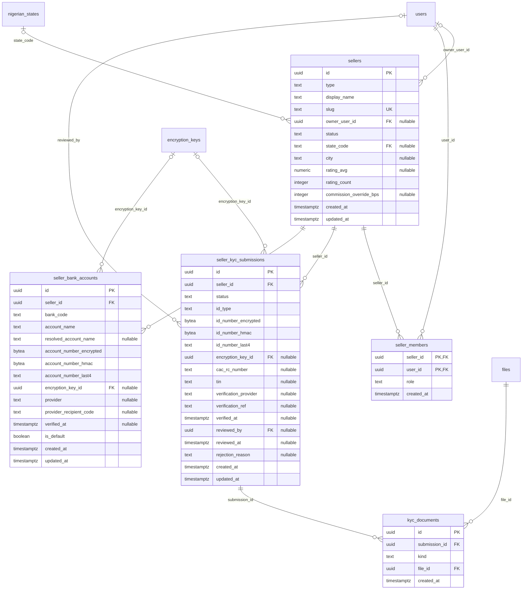
```mermaid
erDiagram
  kyc_documents {
    uuid id PK
    uuid submission_id FK
    text kind
    uuid file_id FK
    timestamptz created_at
  }
  seller_bank_accounts {
    uuid id PK
    uuid seller_id FK
    text bank_code
    text account_name
    text resolved_account_name "nullable"
    bytea account_number_encrypted
    bytea account_number_hmac
    text account_number_last4
    uuid encryption_key_id FK "nullable"
    text provider "nullable"
    text provider_recipient_code "nullable"
    timestamptz verified_at "nullable"
    boolean is_default
    timestamptz created_at
    timestamptz updated_at
  }
  seller_kyc_submissions {
    uuid id PK
    uuid seller_id FK
    text status
    text id_type
    bytea id_number_encrypted
    bytea id_number_hmac
    text id_number_last4
    uuid encryption_key_id FK "nullable"
    text cac_rc_number "nullable"
    text tin "nullable"
    text verification_provider "nullable"
    text verification_ref "nullable"
    timestamptz verified_at "nullable"
    uuid reviewed_by FK "nullable"
    timestamptz reviewed_at "nullable"
    text rejection_reason "nullable"
    timestamptz created_at
    timestamptz updated_at
  }
  seller_members {
    uuid seller_id PK, FK
    uuid user_id PK, FK
    text role
    timestamptz created_at
  }
  sellers {
    uuid id PK
    text type
    text display_name
    text slug UK
    uuid owner_user_id FK "nullable"
    text status
    text state_code FK "nullable"
    text city "nullable"
    numeric rating_avg "nullable"
    integer rating_count
    integer commission_override_bps "nullable"
    timestamptz created_at
    timestamptz updated_at
  }
  files ||--o{ kyc_documents : "file_id"
  seller_kyc_submissions ||--o{ kyc_documents : "submission_id"
  encryption_keys |o--o{ seller_bank_accounts : "encryption_key_id"
  sellers ||--o{ seller_bank_accounts : "seller_id"
  encryption_keys |o--o{ seller_kyc_submissions : "encryption_key_id"
  users |o--o{ seller_kyc_submissions : "reviewed_by"
  sellers ||--o{ seller_kyc_submissions : "seller_id"
  sellers ||--o{ seller_members : "seller_id"
  users ||--o{ seller_members : "user_id"
  users |o--o{ sellers : "owner_user_id"
  nigerian_states |o--o{ sellers : "state_code"
```

## Business buyers (B2B)

- `b2b.business_members`: Users who buy or approve for a business. Buyers above approval_limit_kobo need an approver.
- `b2b.businesses`: Business buyers (wholesale site): trade pricing, VAT invoices, credit.
- `b2b.credit_accounts`: Pay-on-invoice credit for approved businesses (limit and payment term).
- `b2b.quote_lines`: Requested items (listed or free text) and their quoted unit prices.
- `b2b.quotes`: B2B quote requests (from signed-in buyers or the public form) and the priced quotes sent back.

Links to other domains: `listings`, `nigerian_states`, `staff_members`, `users` (shown without columns).

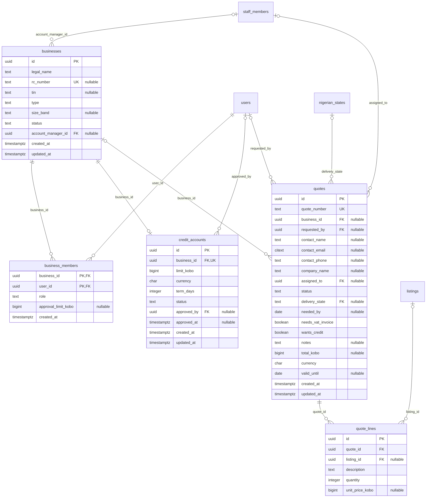
```mermaid
erDiagram
  business_members {
    uuid business_id PK, FK
    uuid user_id PK, FK
    text role
    bigint approval_limit_kobo "nullable"
    timestamptz created_at
  }
  businesses {
    uuid id PK
    text legal_name
    text rc_number UK "nullable"
    text tin "nullable"
    text type
    text size_band "nullable"
    text status
    uuid account_manager_id FK "nullable"
    timestamptz created_at
    timestamptz updated_at
  }
  credit_accounts {
    uuid id PK
    uuid business_id FK, UK
    bigint limit_kobo
    char currency
    integer term_days
    text status
    uuid approved_by FK "nullable"
    timestamptz approved_at "nullable"
    timestamptz created_at
    timestamptz updated_at
  }
  quote_lines {
    uuid id PK
    uuid quote_id FK
    uuid listing_id FK "nullable"
    text description
    integer quantity
    bigint unit_price_kobo "nullable"
  }
  quotes {
    uuid id PK
    text quote_number UK
    uuid business_id FK "nullable"
    uuid requested_by FK "nullable"
    text contact_name "nullable"
    citext contact_email "nullable"
    text contact_phone "nullable"
    text company_name "nullable"
    uuid assigned_to FK "nullable"
    text status
    text delivery_state FK "nullable"
    date needed_by "nullable"
    boolean needs_vat_invoice
    boolean wants_credit
    text notes "nullable"
    bigint total_kobo "nullable"
    char currency
    date valid_until "nullable"
    timestamptz created_at
    timestamptz updated_at
  }
  businesses ||--o{ business_members : "business_id"
  users ||--o{ business_members : "user_id"
  staff_members |o--o{ businesses : "account_manager_id"
  users |o--o{ credit_accounts : "approved_by"
  businesses ||--o| credit_accounts : "business_id"
  listings |o--o{ quote_lines : "listing_id"
  quotes ||--o{ quote_lines : "quote_id"
  staff_members |o--o{ quotes : "assigned_to"
  businesses |o--o{ quotes : "business_id"
  nigerian_states |o--o{ quotes : "delivery_state"
  users |o--o{ quotes : "requested_by"
```

## Catalogue & reviews

- `catalog.attribute_definitions`: Spec fields per category (RAM, storage, GPU…): drive spec tables, filters and variant axes.
- `catalog.brands`: Manufacturers and brands.
- `catalog.categories`: Category tree (Phones → Android…). kind = vehicle routes to cars; repurchase_days stops re-recommending phones.
- `catalog.image_hashes`: Perceptual hashes of product photos, to catch photos stolen from other sellers.
- `catalog.listing_price_history`: Every price change. Proves discounts are genuine (FCCPA 30-day maximum) and feeds price-drop alerts.
- `catalog.listing_reviews`: Moderation decisions on listings (automatic checks and human reviewers), visible to the seller.
- `catalog.listings`: A seller's offer on a variant: condition, price, stock, warranty. TechShop stock is a first_party listing.
- `catalog.price_tiers`: Wholesale quantity breaks: unit price from min_quantity upward (business accounts only).
- `catalog.product_attribute_values`: Spec values for a product (exactly one typed value per attribute).
- `catalog.product_compatibility`: Which accessories fit which devices (explicit pair or attribute rule), for "fits your phone" shelves.
- `catalog.product_images`: Product photos (optionally per variant); alt text required.
- `catalog.product_offer_summary`: Search read model: offers, buy box winner, facets and search vector per product and channel. Never used for pricing at checkout.
- `catalog.product_reviews`: Product reviews. Verified purchase when tied to the order line bought; unverified ones are shown separately and weigh less.
- `catalog.product_suggestions`: Seller-proposed new products or edits, waiting for the catalogue team.
- `catalog.product_variants`: Purchasable configurations (256GB · Titanium). Serialised variants are tracked per unit (IMEI/serial).
- `catalog.products`: Catalogue entries at model level. TechShop owns titles, images and specs; sellers sell through listings on variants.
- `catalog.review_images`: Photos attached to a review.
- `catalog.saved_items`: Customers' saved products (the heart button).
- `catalog.seller_ratings`: Customer rating of a seller per delivered fulfilment; aggregated onto sellers.rating_avg.
- `catalog.stock_alerts`: "Notify me when back in stock" requests.

Links to other domains: `files`, `fulfilments`, `order_lines`, `sellers`, `users` (shown without columns).


```mermaid
erDiagram
  attribute_definitions {
    uuid id PK
    uuid category_id FK
    text key
    text label
    text data_type
    text unit "nullable"
    jsonb options "nullable"
    boolean is_required
    boolean is_filterable
    boolean is_variant_axis
    integer position
  }
  brands {
    uuid id PK
    text slug UK
    text name
    uuid logo_file_id FK "nullable"
    timestamptz created_at
  }
  categories {
    uuid id PK
    uuid parent_id FK "nullable"
    text slug UK
    text name
    text description "nullable"
    text kind
    integer repurchase_days "nullable"
    integer position
    boolean is_active
    timestamptz created_at
    timestamptz updated_at
  }
  image_hashes {
    uuid product_image_id PK, FK
    bigint phash
  }
  listing_price_history {
    uuid id PK
    uuid listing_id FK
    bigint price_kobo
    bigint compare_at_kobo "nullable"
    uuid changed_by FK "nullable"
    timestamptz changed_at
  }
  listing_reviews {
    uuid id PK
    uuid listing_id FK
    uuid reviewer_id FK "nullable"
    text decision
    text_array reasons
    text note "nullable"
    timestamptz created_at
  }
  listings {
    uuid id PK
    uuid seller_id FK
    uuid variant_id FK
    text condition
    text grade "nullable"
    bigint price_kobo
    bigint compare_at_kobo "nullable"
    char currency
    text fulfilled_by
    integer seller_stock "nullable"
    integer min_order_quantity "nullable"
    smallint handling_days
    text warranty_provider
    smallint warranty_months
    text condition_notes "nullable"
    smallint battery_health_pct "nullable"
    text status
    smallint risk_score "nullable"
    timestamptz published_at "nullable"
    timestamptz created_at
    timestamptz updated_at
  }
  price_tiers {
    uuid id PK
    uuid listing_id FK
    integer min_quantity
    bigint unit_price_kobo
  }
  product_attribute_values {
    uuid product_id PK, FK
    uuid attribute_id PK, FK
    text value_text "nullable"
    numeric value_number "nullable"
    boolean value_bool "nullable"
  }
  product_compatibility {
    uuid id PK
    uuid accessory_product_id FK
    uuid device_product_id FK "nullable"
    jsonb rule "nullable"
    text source
    boolean verified
    timestamptz created_at
  }
  product_images {
    uuid id PK
    uuid product_id FK
    uuid variant_id FK "nullable"
    uuid file_id FK
    text alt
    integer position
  }
  product_offer_summary {
    uuid product_id PK, FK
    text channel PK
    text slug
    text title
    uuid_array category_ids
    uuid brand_id FK "nullable"
    uuid best_listing_id FK "nullable"
    bigint min_price_kobo "nullable"
    bigint max_price_kobo "nullable"
    bigint compare_at_kobo "nullable"
    bigint promo_price_kobo "nullable"
    smallint discount_pct "nullable"
    integer offer_count
    text_array conditions
    text_array seller_types
    boolean in_stock
    text stock_band "nullable"
    numeric rating_avg "nullable"
    integer rating_count
    integer sales_30d
    numeric return_rate_90d "nullable"
    jsonb attrs
    text_array facet_keys
    tsvector search_vector
    timestamptz refreshed_at
  }
  product_reviews {
    uuid id PK
    uuid product_id FK
    uuid order_line_id FK, UK "nullable"
    uuid user_id FK
    smallint rating
    text title "nullable"
    text body "nullable"
    boolean is_verified "nullable"
    text status
    timestamptz created_at
    timestamptz updated_at
  }
  product_suggestions {
    uuid id PK
    uuid seller_id FK
    uuid product_id FK "nullable"
    text kind
    jsonb payload
    text status
    uuid reviewed_by FK "nullable"
    timestamptz reviewed_at "nullable"
    timestamptz created_at
  }
  product_variants {
    uuid id PK
    uuid product_id FK
    text sku UK
    text name
    jsonb axis_values
    text gtin "nullable"
    text mpn "nullable"
    integer weight_grams "nullable"
    integer length_mm "nullable"
    integer width_mm "nullable"
    integer height_mm "nullable"
    boolean is_serialised
    boolean is_active
    timestamptz created_at
    timestamptz updated_at
  }
  products {
    uuid id PK
    uuid category_id FK
    uuid brand_id FK "nullable"
    text slug UK
    text name
    text model "nullable"
    text description "nullable"
    text status
    tsvector search_vector "nullable"
    uuid created_by FK "nullable"
    timestamptz created_at
    timestamptz updated_at
  }
  review_images {
    uuid review_id PK, FK
    uuid file_id PK, FK
    smallint position
  }
  saved_items {
    uuid user_id PK, FK
    uuid product_id PK, FK
    timestamptz created_at
  }
  seller_ratings {
    uuid id PK
    uuid seller_id FK
    uuid fulfilment_id FK, UK
    uuid user_id FK
    smallint rating
    text comment "nullable"
    timestamptz created_at
  }
  stock_alerts {
    uuid user_id PK, FK
    uuid product_id PK, FK
    timestamptz created_at
    timestamptz notified_at "nullable"
  }
  categories ||--o{ attribute_definitions : "category_id"
  files |o--o{ brands : "logo_file_id"
  categories |o--o{ categories : "parent_id"
  product_images ||--o| image_hashes : "product_image_id"
  users |o--o{ listing_price_history : "changed_by"
  listings ||--o{ listing_price_history : "listing_id"
  listings ||--o{ listing_reviews : "listing_id"
  users |o--o{ listing_reviews : "reviewer_id"
  sellers ||--o{ listings : "seller_id"
  product_variants ||--o{ listings : "variant_id"
  listings ||--o{ price_tiers : "listing_id"
  attribute_definitions ||--o{ product_attribute_values : "attribute_id"
  products ||--o{ product_attribute_values : "product_id"
  products ||--o{ product_compatibility : "accessory_product_id"
  products |o--o{ product_compatibility : "device_product_id"
  files ||--o{ product_images : "file_id"
  products ||--o{ product_images : "product_id"
  product_variants |o--o{ product_images : "variant_id"
  listings |o--o{ product_offer_summary : "best_listing_id"
  brands |o--o{ product_offer_summary : "brand_id"
  products ||--o{ product_offer_summary : "product_id"
  order_lines |o--o| product_reviews : "order_line_id"
  products ||--o{ product_reviews : "product_id"
  users ||--o{ product_reviews : "user_id"
  products |o--o{ product_suggestions : "product_id"
  users |o--o{ product_suggestions : "reviewed_by"
  sellers ||--o{ product_suggestions : "seller_id"
  products ||--o{ product_variants : "product_id"
  brands |o--o{ products : "brand_id"
  categories ||--o{ products : "category_id"
  users |o--o{ products : "created_by"
  files ||--o{ review_images : "file_id"
  product_reviews ||--o{ review_images : "review_id"
  products ||--o{ saved_items : "product_id"
  users ||--o{ saved_items : "user_id"
  fulfilments ||--o| seller_ratings : "fulfilment_id"
  sellers ||--o{ seller_ratings : "seller_id"
  users ||--o{ seller_ratings : "user_id"
  products ||--o{ stock_alerts : "product_id"
  users ||--o{ stock_alerts : "user_id"
```

## Search

- `search.catalogue_gaps`: Things customers search for that TechShop doesn't sell yet; demand data for purchasing.
- `search.search_pins`: Time-boxed, audited pins or burials of a product for a query.
- `search.search_queries`: Every search with result count and latency (zero-result queue, insights). Partitioned monthly; 13-month retention.
- `search.search_redirects`: Queries that go straight to a page (e.g. "cars" → /c/cars). Internal paths only.
- `search.search_suggestions`: Autocomplete entries built nightly from popular queries.
- `search.search_synonyms`: Query rewrites, e.g. tokunbo → UK-used, ps5 → Play 5. Reloaded instantly via NOTIFY.

Links to other domains: `products`, `users` (shown without columns).

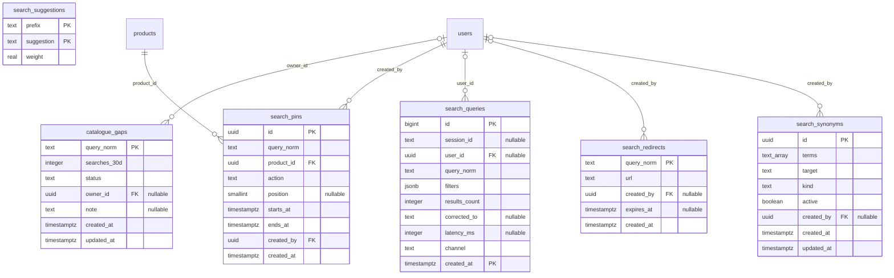
```mermaid
erDiagram
  catalogue_gaps {
    text query_norm PK
    integer searches_30d
    text status
    uuid owner_id FK "nullable"
    text note "nullable"
    timestamptz created_at
    timestamptz updated_at
  }
  search_pins {
    uuid id PK
    text query_norm
    uuid product_id FK
    text action
    smallint position "nullable"
    timestamptz starts_at
    timestamptz ends_at
    uuid created_by FK
    timestamptz created_at
  }
  search_queries {
    bigint id PK
    text session_id "nullable"
    uuid user_id FK "nullable"
    text query_norm
    jsonb filters
    integer results_count
    text corrected_to "nullable"
    integer latency_ms "nullable"
    text channel
    timestamptz created_at PK
  }
  search_redirects {
    text query_norm PK
    text url
    uuid created_by FK "nullable"
    timestamptz expires_at "nullable"
    timestamptz created_at
  }
  search_suggestions {
    text prefix PK
    text suggestion PK
    real weight
  }
  search_synonyms {
    uuid id PK
    text_array terms
    text target
    text kind
    boolean active
    uuid created_by FK "nullable"
    timestamptz created_at
    timestamptz updated_at
  }
  users |o--o{ catalogue_gaps : "owner_id"
  users ||--o{ search_pins : "created_by"
  products ||--o{ search_pins : "product_id"
  users |o--o{ search_queries : "user_id"
  users |o--o{ search_redirects : "created_by"
  users |o--o{ search_synonyms : "created_by"
```

## Inventory

- `inventory.bin_locations`: Shelf/bin codes inside a warehouse (optional), used on pick lists.
- `inventory.device_units`: Individually tracked devices (IMEI/serial): picking, warranty, returns, theft checks, trade-ins.
- `inventory.inventory_costs`: Weighted average cost for non-serialised stock (COGS once finance confirms the method).
- `inventory.inventory_count_lines`: Expected vs counted per item in a cycle count.
- `inventory.inventory_counts`: Cycle counts (blind). Variances above a threshold need a different person to approve.
- `inventory.inventory_levels`: Current stock per location × variant × condition × owner. Changed only together with a stock movement.
- `inventory.stock_movements`: Append-only stock ledger; every change to inventory_levels has a movement (nightly check: sum = on hand).
- `inventory.stock_reservations`: Stock held for an unpaid order (warehouse level or seller-held listing stock); committed on payment, released on expiry.
- `inventory.stock_transfer_lines`: Items in a stock transfer.
- `inventory.stock_transfers`: Moving stock between locations.
- `inventory.warehouses`: Physical locations: warehouses, retail stores (POS) and dispatch hubs.

Links to other domains: `listings`, `nigerian_states`, `order_lines`, `orders`, `product_variants`, `sellers`, `users` (shown without columns).

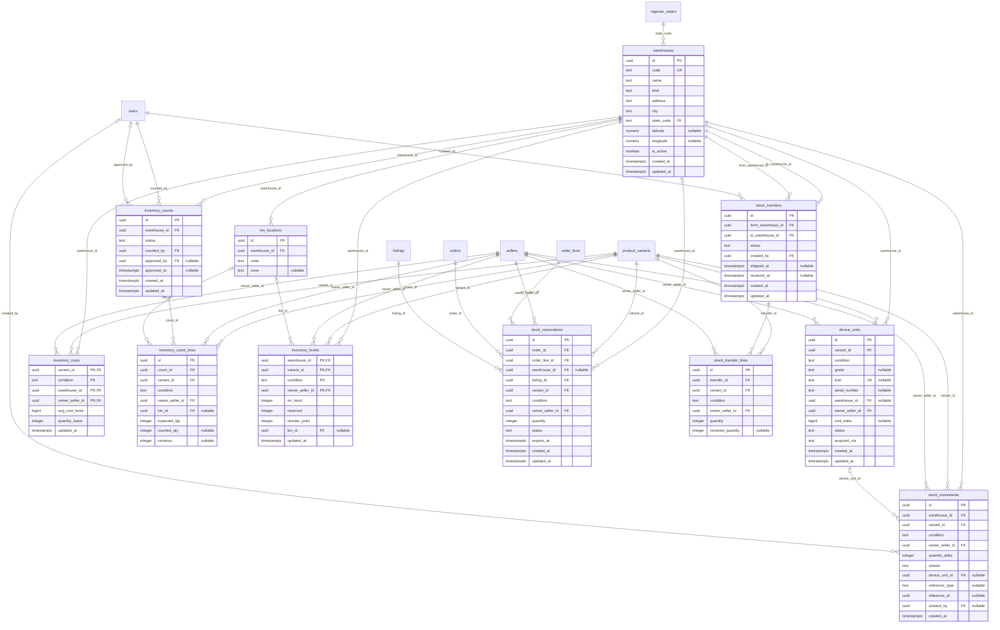
```mermaid
erDiagram
  bin_locations {
    uuid id PK
    uuid warehouse_id FK
    text code
    text zone "nullable"
  }
  device_units {
    uuid id PK
    uuid variant_id FK
    text condition
    text grade "nullable"
    text imei UK "nullable"
    text serial_number "nullable"
    uuid warehouse_id FK "nullable"
    uuid owner_seller_id FK
    bigint cost_kobo "nullable"
    text status
    text acquired_via
    timestamptz created_at
    timestamptz updated_at
  }
  inventory_costs {
    uuid variant_id PK, FK
    text condition PK
    uuid warehouse_id PK, FK
    uuid owner_seller_id PK, FK
    bigint avg_cost_kobo
    integer quantity_basis
    timestamptz updated_at
  }
  inventory_count_lines {
    uuid id PK
    uuid count_id FK
    uuid variant_id FK
    text condition
    uuid owner_seller_id FK
    uuid bin_id FK "nullable"
    integer expected_qty
    integer counted_qty "nullable"
    integer variance "nullable"
  }
  inventory_counts {
    uuid id PK
    uuid warehouse_id FK
    text status
    uuid counted_by FK
    uuid approved_by FK "nullable"
    timestamptz approved_at "nullable"
    timestamptz created_at
    timestamptz updated_at
  }
  inventory_levels {
    uuid warehouse_id PK, FK
    uuid variant_id PK, FK
    text condition PK
    uuid owner_seller_id PK, FK
    integer on_hand
    integer reserved
    integer reorder_point
    uuid bin_id FK "nullable"
    timestamptz updated_at
  }
  stock_movements {
    uuid id PK
    uuid warehouse_id FK
    uuid variant_id FK
    text condition
    uuid owner_seller_id FK
    integer quantity_delta
    text reason
    uuid device_unit_id FK "nullable"
    text reference_type "nullable"
    uuid reference_id "nullable"
    uuid created_by FK "nullable"
    timestamptz created_at
  }
  stock_reservations {
    uuid id PK
    uuid order_id FK
    uuid order_line_id FK
    uuid warehouse_id FK "nullable"
    uuid listing_id FK
    uuid variant_id FK
    text condition
    uuid owner_seller_id FK
    integer quantity
    text status
    timestamptz expires_at
    timestamptz created_at
    timestamptz updated_at
  }
  stock_transfer_lines {
    uuid id PK
    uuid transfer_id FK
    uuid variant_id FK
    text condition
    uuid owner_seller_id FK
    integer quantity
    integer received_quantity "nullable"
  }
  stock_transfers {
    uuid id PK
    uuid from_warehouse_id FK
    uuid to_warehouse_id FK
    text status
    uuid created_by FK
    timestamptz shipped_at "nullable"
    timestamptz received_at "nullable"
    timestamptz created_at
    timestamptz updated_at
  }
  warehouses {
    uuid id PK
    text code UK
    text name
    text kind
    text address
    text city
    text state_code FK
    numeric latitude "nullable"
    numeric longitude "nullable"
    boolean is_active
    timestamptz created_at
    timestamptz updated_at
  }
  warehouses ||--o{ bin_locations : "warehouse_id"
  sellers ||--o{ device_units : "owner_seller_id"
  product_variants ||--o{ device_units : "variant_id"
  warehouses |o--o{ device_units : "warehouse_id"
  sellers ||--o{ inventory_costs : "owner_seller_id"
  product_variants ||--o{ inventory_costs : "variant_id"
  warehouses ||--o{ inventory_costs : "warehouse_id"
  bin_locations |o--o{ inventory_count_lines : "bin_id"
  inventory_counts ||--o{ inventory_count_lines : "count_id"
  sellers ||--o{ inventory_count_lines : "owner_seller_id"
  product_variants ||--o{ inventory_count_lines : "variant_id"
  users |o--o{ inventory_counts : "approved_by"
  users ||--o{ inventory_counts : "counted_by"
  warehouses ||--o{ inventory_counts : "warehouse_id"
  bin_locations |o--o{ inventory_levels : "bin_id"
  sellers ||--o{ inventory_levels : "owner_seller_id"
  product_variants ||--o{ inventory_levels : "variant_id"
  warehouses ||--o{ inventory_levels : "warehouse_id"
  users |o--o{ stock_movements : "created_by"
  device_units |o--o{ stock_movements : "device_unit_id"
  sellers ||--o{ stock_movements : "owner_seller_id"
  product_variants ||--o{ stock_movements : "variant_id"
  warehouses ||--o{ stock_movements : "warehouse_id"
  listings ||--o{ stock_reservations : "listing_id"
  orders ||--o{ stock_reservations : "order_id"
  order_lines ||--o{ stock_reservations : "order_line_id"
  sellers ||--o{ stock_reservations : "owner_seller_id"
  product_variants ||--o{ stock_reservations : "variant_id"
  warehouses |o--o{ stock_reservations : "warehouse_id"
  sellers ||--o{ stock_transfer_lines : "owner_seller_id"
  stock_transfers ||--o{ stock_transfer_lines : "transfer_id"
  product_variants ||--o{ stock_transfer_lines : "variant_id"
  users ||--o{ stock_transfers : "created_by"
  warehouses ||--o{ stock_transfers : "from_warehouse_id"
  warehouses ||--o{ stock_transfers : "to_warehouse_id"
  nigerian_states ||--o{ warehouses : "state_code"
```

## Purchasing

- `purchasing.goods_receipts`: A delivery received against a PO; posts stock movements (purchase_receipt) and device units.
- `purchasing.purchase_order_lines`: Items, quantities and costs on a purchase order (over-receipt above 5% needs approval).
- `purchasing.purchase_orders`: Orders placed with suppliers, delivered to a warehouse. Large POs need finance approval.
- `purchasing.suppliers`: Companies TechShop buys stock from.

Links to other domains: `product_variants`, `users`, `warehouses` (shown without columns).

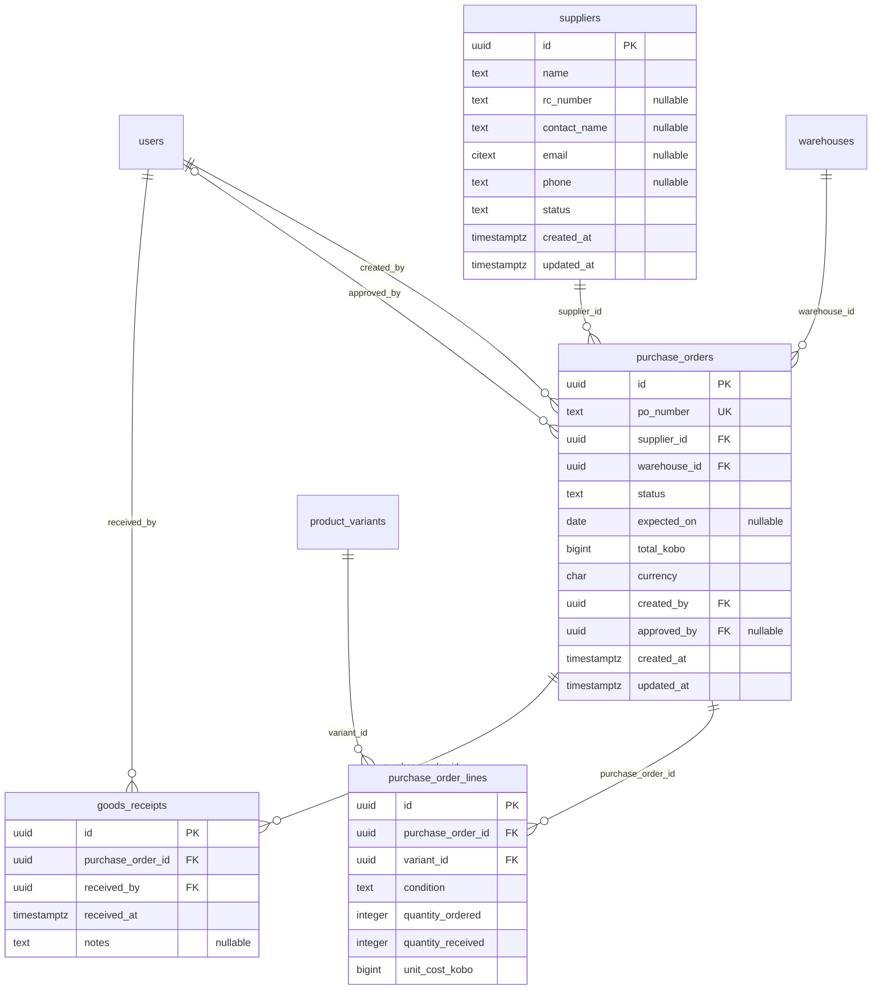
```mermaid
erDiagram
  goods_receipts {
    uuid id PK
    uuid purchase_order_id FK
    uuid received_by FK
    timestamptz received_at
    text notes "nullable"
  }
  purchase_order_lines {
    uuid id PK
    uuid purchase_order_id FK
    uuid variant_id FK
    text condition
    integer quantity_ordered
    integer quantity_received
    bigint unit_cost_kobo
  }
  purchase_orders {
    uuid id PK
    text po_number UK
    uuid supplier_id FK
    uuid warehouse_id FK
    text status
    date expected_on "nullable"
    bigint total_kobo
    char currency
    uuid created_by FK
    uuid approved_by FK "nullable"
    timestamptz created_at
    timestamptz updated_at
  }
  suppliers {
    uuid id PK
    text name
    text rc_number "nullable"
    text contact_name "nullable"
    citext email "nullable"
    text phone "nullable"
    text status
    timestamptz created_at
    timestamptz updated_at
  }
  purchase_orders ||--o{ goods_receipts : "purchase_order_id"
  users ||--o{ goods_receipts : "received_by"
  purchase_orders ||--o{ purchase_order_lines : "purchase_order_id"
  product_variants ||--o{ purchase_order_lines : "variant_id"
  users |o--o{ purchase_orders : "approved_by"
  users ||--o{ purchase_orders : "created_by"
  suppliers ||--o{ purchase_orders : "supplier_id"
  warehouses ||--o{ purchase_orders : "warehouse_id"
```

## Point of sale

- `pos.pos_shifts`: A cashier's shift on a till, with cash reconciliation (variance flagged).
- `pos.pos_terminals`: Tills in physical stores (warehouses of kind store).

Links to other domains: `staff_members`, `warehouses` (shown without columns).

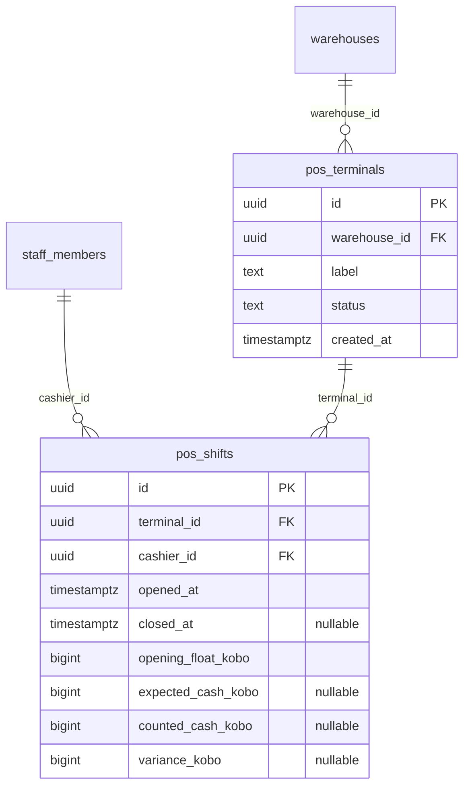
```mermaid
erDiagram
  pos_shifts {
    uuid id PK
    uuid terminal_id FK
    uuid cashier_id FK
    timestamptz opened_at
    timestamptz closed_at "nullable"
    bigint opening_float_kobo
    bigint expected_cash_kobo "nullable"
    bigint counted_cash_kobo "nullable"
    bigint variance_kobo "nullable"
  }
  pos_terminals {
    uuid id PK
    uuid warehouse_id FK
    text label
    text status
    timestamptz created_at
  }
  staff_members ||--o{ pos_shifts : "cashier_id"
  pos_terminals ||--o{ pos_shifts : "terminal_id"
  warehouses ||--o{ pos_terminals : "warehouse_id"
```

## Sales

- `sales.cart_items`: Listings in a cart. Prices are read live; they are snapshotted only on order lines.
- `sales.carts`: Shopping carts for signed-in users or guests (by session token hash).
- `sales.fulfilments`: The part of an order handled by one seller. Moves on its own; drives delivery, earnings and payouts.
- `sales.order_lines`: Snapshot of what was bought (name, price, VAT, condition, commission), optionally the exact device unit.
- `sales.order_status_history`: Every order and fulfilment status change and who made it (shown on tracking).
- `sales.orders`: One checkout. Totals must add up; ship_to snapshots the address; status is derived from fulfilments.

Links to other domains: `businesses`, `device_units`, `listings`, `notifications`, `pos_shifts`, `product_variants`, `quotes`, `sellers`, `users`, `warehouses` (shown without columns).

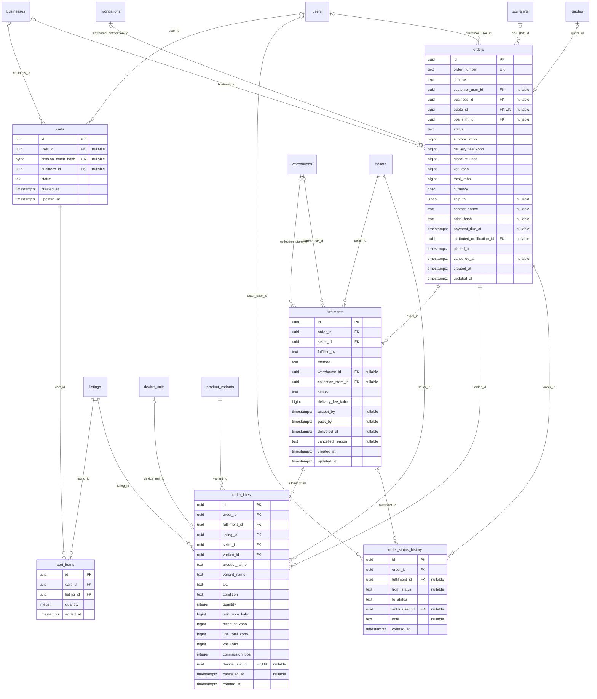
```mermaid
erDiagram
  cart_items {
    uuid id PK
    uuid cart_id FK
    uuid listing_id FK
    integer quantity
    timestamptz added_at
  }
  carts {
    uuid id PK
    uuid user_id FK "nullable"
    bytea session_token_hash UK "nullable"
    uuid business_id FK "nullable"
    text status
    timestamptz created_at
    timestamptz updated_at
  }
  fulfilments {
    uuid id PK
    uuid order_id FK
    uuid seller_id FK
    text fulfilled_by
    text method
    uuid warehouse_id FK "nullable"
    uuid collection_store_id FK "nullable"
    text status
    bigint delivery_fee_kobo
    timestamptz accept_by "nullable"
    timestamptz pack_by "nullable"
    timestamptz delivered_at "nullable"
    text cancelled_reason "nullable"
    timestamptz created_at
    timestamptz updated_at
  }
  order_lines {
    uuid id PK
    uuid order_id FK
    uuid fulfilment_id FK
    uuid listing_id FK
    uuid seller_id FK
    uuid variant_id FK
    text product_name
    text variant_name
    text sku
    text condition
    integer quantity
    bigint unit_price_kobo
    bigint discount_kobo
    bigint line_total_kobo
    bigint vat_kobo
    integer commission_bps
    uuid device_unit_id FK, UK "nullable"
    timestamptz cancelled_at "nullable"
    timestamptz created_at
  }
  order_status_history {
    uuid id PK
    uuid order_id FK
    uuid fulfilment_id FK "nullable"
    text from_status "nullable"
    text to_status
    uuid actor_user_id FK "nullable"
    text note "nullable"
    timestamptz created_at
  }
  orders {
    uuid id PK
    text order_number UK
    text channel
    uuid customer_user_id FK "nullable"
    uuid business_id FK "nullable"
    uuid quote_id FK, UK "nullable"
    uuid pos_shift_id FK "nullable"
    text status
    bigint subtotal_kobo
    bigint delivery_fee_kobo
    bigint discount_kobo
    bigint vat_kobo
    bigint total_kobo
    char currency
    jsonb ship_to "nullable"
    text contact_phone "nullable"
    text price_hash "nullable"
    timestamptz payment_due_at "nullable"
    uuid attributed_notification_id FK "nullable"
    timestamptz placed_at
    timestamptz cancelled_at "nullable"
    timestamptz created_at
    timestamptz updated_at
  }
  carts ||--o{ cart_items : "cart_id"
  listings ||--o{ cart_items : "listing_id"
  businesses |o--o{ carts : "business_id"
  users |o--o{ carts : "user_id"
  warehouses |o--o{ fulfilments : "collection_store_id"
  orders ||--o{ fulfilments : "order_id"
  sellers ||--o{ fulfilments : "seller_id"
  warehouses |o--o{ fulfilments : "warehouse_id"
  device_units |o--o| order_lines : "device_unit_id"
  fulfilments ||--o{ order_lines : "fulfilment_id"
  listings ||--o{ order_lines : "listing_id"
  orders ||--o{ order_lines : "order_id"
  sellers ||--o{ order_lines : "seller_id"
  product_variants ||--o{ order_lines : "variant_id"
  users |o--o{ order_status_history : "actor_user_id"
  fulfilments |o--o{ order_status_history : "fulfilment_id"
  orders ||--o{ order_status_history : "order_id"
  notifications |o--o{ orders : "attributed_notification_id"
  businesses |o--o{ orders : "business_id"
  users |o--o{ orders : "customer_user_id"
  pos_shifts |o--o{ orders : "pos_shift_id"
  quotes |o--o| orders : "quote_id"
```

## Fulfilment & shipping

- `fulfilment.carriers`: Third-party carriers for interstate delivery (behind carrier.Port).
- `fulfilment.manifest_parcels`: Parcels on a manifest and when each was scanned.
- `fulfilment.manifests`: Handover batches to a rider or carrier; counts must match before signing.
- `fulfilment.pack_records`: Packing: weighed parcel; more than 10% off the expected weight is flagged.
- `fulfilment.parcels`: Physical parcels with a printed label code, scanned at handover and pickup.
- `fulfilment.pick_list_items`: Lines to pick; scanning the serial binds the exact device unit to the order line.
- `fulfilment.pick_lists`: Wave pick lists (every 30 minutes) per warehouse and zone.
- `fulfilment.seller_sla_events`: Seller SLA breaches (feed seller performance and enforcement).
- `fulfilment.shipment_events`: Tracking events from carrier webhooks or polling (deduplicated).
- `fulfilment.shipments`: Carrier shipments (TechShop-booked or seller's own carrier with tracking).

Links to other domains: `bin_locations`, `device_units`, `files`, `fulfilments`, `order_lines`, `riders`, `sellers`, `staff_members`, `users`, `warehouses` (shown without columns).


```mermaid
erDiagram
  carriers {
    uuid id PK
    text code UK
    text name
    boolean is_active
    timestamptz created_at
  }
  manifest_parcels {
    uuid manifest_id PK, FK
    uuid parcel_id PK, FK
    timestamptz scanned_at "nullable"
  }
  manifests {
    uuid id PK
    uuid warehouse_id FK
    uuid rider_id FK "nullable"
    uuid carrier_id FK "nullable"
    text signed_by_name "nullable"
    timestamptz signed_at "nullable"
    uuid created_by FK
    timestamptz created_at
  }
  pack_records {
    uuid id PK
    uuid fulfilment_id FK
    uuid parcel_id FK, UK
    integer weight_grams
    integer expected_weight_grams "nullable"
    boolean flagged "nullable"
    uuid packed_by FK
    timestamptz packed_at
  }
  parcels {
    uuid id PK
    uuid fulfilment_id FK
    text label_code UK
    text box_code "nullable"
    integer weight_grams "nullable"
    timestamptz scanned_at "nullable"
    timestamptz created_at
  }
  pick_list_items {
    uuid id PK
    uuid pick_list_id FK
    uuid fulfilment_id FK
    uuid order_line_id FK
    uuid bin_id FK "nullable"
    integer quantity
    integer picked_qty
    uuid device_unit_id FK "nullable"
    timestamptz scanned_at "nullable"
  }
  pick_lists {
    uuid id PK
    uuid warehouse_id FK
    timestamptz wave_at
    text zone "nullable"
    text status
    uuid picker_id FK "nullable"
    timestamptz created_at
    timestamptz updated_at
  }
  seller_sla_events {
    uuid id PK
    uuid seller_id FK
    uuid fulfilment_id FK
    text kind
    timestamptz created_at
  }
  shipment_events {
    uuid id PK
    uuid shipment_id FK
    text carrier_event_id "nullable"
    text status
    text location "nullable"
    timestamptz occurred_at
    timestamptz received_at
  }
  shipments {
    uuid id PK
    uuid fulfilment_id FK
    uuid carrier_id FK "nullable"
    text carrier_name "nullable"
    text tracking_number
    uuid label_file_id FK "nullable"
    text status
    timestamptz created_at
    timestamptz updated_at
  }
  manifests ||--o{ manifest_parcels : "manifest_id"
  parcels ||--o| manifest_parcels : "parcel_id"
  carriers |o--o{ manifests : "carrier_id"
  users ||--o{ manifests : "created_by"
  riders |o--o{ manifests : "rider_id"
  warehouses ||--o{ manifests : "warehouse_id"
  fulfilments ||--o{ pack_records : "fulfilment_id"
  users ||--o{ pack_records : "packed_by"
  parcels ||--o| pack_records : "parcel_id"
  fulfilments ||--o{ parcels : "fulfilment_id"
  bin_locations |o--o{ pick_list_items : "bin_id"
  device_units |o--o{ pick_list_items : "device_unit_id"
  fulfilments ||--o{ pick_list_items : "fulfilment_id"
  order_lines ||--o{ pick_list_items : "order_line_id"
  pick_lists ||--o{ pick_list_items : "pick_list_id"
  staff_members |o--o{ pick_lists : "picker_id"
  warehouses ||--o{ pick_lists : "warehouse_id"
  fulfilments ||--o{ seller_sla_events : "fulfilment_id"
  sellers ||--o{ seller_sla_events : "seller_id"
  shipments ||--o{ shipment_events : "shipment_id"
  carriers |o--o{ shipments : "carrier_id"
  fulfilments ||--o{ shipments : "fulfilment_id"
  files |o--o{ shipments : "label_file_id"
```

## Logistics

- `logistics.delivery_events`: Append-only trail for a job. client_event_id makes offline syncs from the app idempotent.
- `logistics.delivery_jobs`: A delivery or pickup run. Delivered requires a verified delivery code or photo proof. The delivery code lives only here.
- `logistics.delivery_rates`: Delivery fee and ETA per zone and weight band.
- `logistics.delivery_zones`: Delivery areas (state + LGAs) used for fees, ETAs and rider assignment.
- `logistics.rider_devices`: Phones bound to a rider; a dispatcher approves each one and can revoke a lost phone.
- `logistics.rider_location_pings`: Full location trail while on shift (optional). Partitioned monthly; about 90 days retention.
- `logistics.rider_locations`: Latest known position per rider (live tracking and the dispatch map).
- `logistics.rider_shifts`: Shift history; location is only shared while a shift is open and with consent.
- `logistics.rider_zones`: Zones each rider works in (assignment by zone).
- `logistics.riders`: Dispatch riders (staff using the logistics app).

Links to other domains: `files`, `fulfilments`, `nigerian_states`, `return_requests`, `staff_members`, `user_sessions`, `users`, `warehouses` (shown without columns).

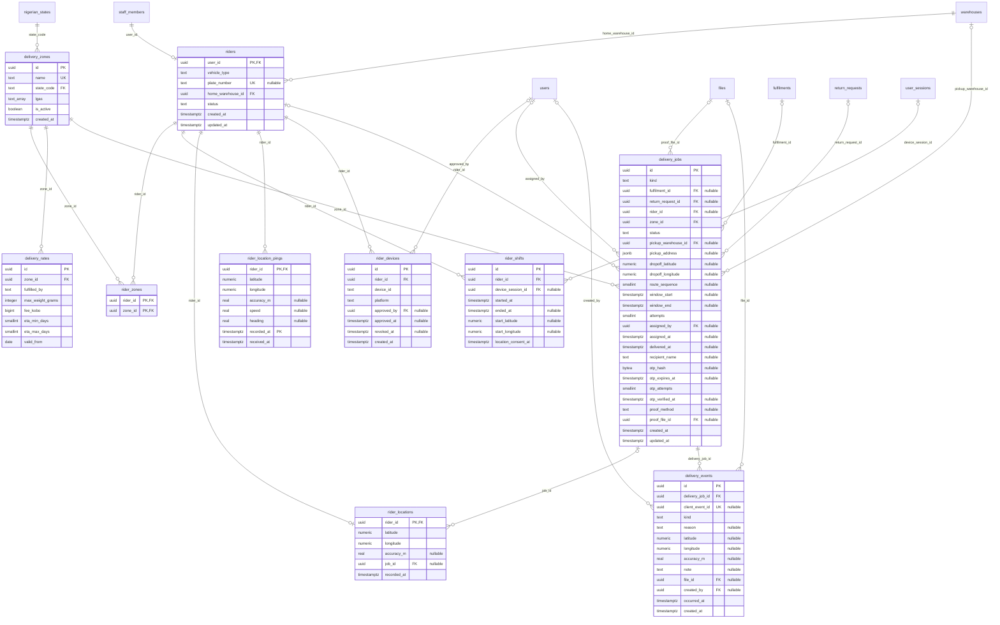
```mermaid
erDiagram
  delivery_events {
    uuid id PK
    uuid delivery_job_id FK
    uuid client_event_id UK "nullable"
    text kind
    text reason "nullable"
    numeric latitude "nullable"
    numeric longitude "nullable"
    real accuracy_m "nullable"
    text note "nullable"
    uuid file_id FK "nullable"
    uuid created_by FK "nullable"
    timestamptz occurred_at
    timestamptz created_at
  }
  delivery_jobs {
    uuid id PK
    text kind
    uuid fulfilment_id FK "nullable"
    uuid return_request_id FK "nullable"
    uuid rider_id FK "nullable"
    uuid zone_id FK
    text status
    uuid pickup_warehouse_id FK "nullable"
    jsonb pickup_address "nullable"
    numeric dropoff_latitude "nullable"
    numeric dropoff_longitude "nullable"
    smallint route_sequence "nullable"
    timestamptz window_start "nullable"
    timestamptz window_end "nullable"
    smallint attempts
    uuid assigned_by FK "nullable"
    timestamptz assigned_at "nullable"
    timestamptz delivered_at "nullable"
    text recipient_name "nullable"
    bytea otp_hash "nullable"
    timestamptz otp_expires_at "nullable"
    smallint otp_attempts
    timestamptz otp_verified_at "nullable"
    text proof_method "nullable"
    uuid proof_file_id FK "nullable"
    timestamptz created_at
    timestamptz updated_at
  }
  delivery_rates {
    uuid id PK
    uuid zone_id FK
    text fulfilled_by
    integer max_weight_grams
    bigint fee_kobo
    smallint eta_min_days
    smallint eta_max_days
    date valid_from
  }
  delivery_zones {
    uuid id PK
    text name UK
    text state_code FK
    text_array lgas
    boolean is_active
    timestamptz created_at
  }
  rider_devices {
    uuid id PK
    uuid rider_id FK
    text device_id
    text platform
    uuid approved_by FK "nullable"
    timestamptz approved_at "nullable"
    timestamptz revoked_at "nullable"
    timestamptz created_at
  }
  rider_location_pings {
    uuid rider_id PK, FK
    numeric latitude
    numeric longitude
    real accuracy_m "nullable"
    real speed "nullable"
    real heading "nullable"
    timestamptz recorded_at PK
    timestamptz received_at
  }
  rider_locations {
    uuid rider_id PK, FK
    numeric latitude
    numeric longitude
    real accuracy_m "nullable"
    uuid job_id FK "nullable"
    timestamptz recorded_at
  }
  rider_shifts {
    uuid id PK
    uuid rider_id FK
    uuid device_session_id FK "nullable"
    timestamptz started_at
    timestamptz ended_at "nullable"
    numeric start_latitude "nullable"
    numeric start_longitude "nullable"
    timestamptz location_consent_at
  }
  rider_zones {
    uuid rider_id PK, FK
    uuid zone_id PK, FK
  }
  riders {
    uuid user_id PK, FK
    text vehicle_type
    text plate_number UK "nullable"
    uuid home_warehouse_id FK
    text status
    timestamptz created_at
    timestamptz updated_at
  }
  users |o--o{ delivery_events : "created_by"
  delivery_jobs ||--o{ delivery_events : "delivery_job_id"
  files |o--o{ delivery_events : "file_id"
  users |o--o{ delivery_jobs : "assigned_by"
  fulfilments |o--o{ delivery_jobs : "fulfilment_id"
  warehouses |o--o{ delivery_jobs : "pickup_warehouse_id"
  files |o--o{ delivery_jobs : "proof_file_id"
  return_requests |o--o{ delivery_jobs : "return_request_id"
  riders |o--o{ delivery_jobs : "rider_id"
  delivery_zones ||--o{ delivery_jobs : "zone_id"
  delivery_zones ||--o{ delivery_rates : "zone_id"
  nigerian_states ||--o{ delivery_zones : "state_code"
  users |o--o{ rider_devices : "approved_by"
  riders ||--o{ rider_devices : "rider_id"
  riders ||--o{ rider_location_pings : "rider_id"
  delivery_jobs |o--o{ rider_locations : "job_id"
  riders ||--o| rider_locations : "rider_id"
  user_sessions |o--o{ rider_shifts : "device_session_id"
  riders ||--o{ rider_shifts : "rider_id"
  riders ||--o{ rider_zones : "rider_id"
  delivery_zones ||--o{ rider_zones : "zone_id"
  warehouses ||--o{ riders : "home_warehouse_id"
  staff_members ||--o| riders : "user_id"
```

## Payments

- `payments.bank_statement_lines`: Imported bank statement lines, matched to settlements and payouts.
- `payments.dispute_evidence`: Evidence gathered automatically for a dispute.
- `payments.disputes`: Chargebacks from card schemes, with an evidence deadline.
- `payments.payment_events`: Raw provider webhooks, stored once per provider event so retries are ignored.
- `payments.payments`: A charge for an order or invoice. Always re-verified with the provider; card data is never stored.
- `payments.provider_health`: Shared circuit-breaker state, so checkout hides a provider that is failing right now.
- `payments.reconciliation_exceptions`: Anything that did not reconcile, with an owner and a 48-hour target.
- `payments.refunds`: Money returned to a customer. Requester and approver must be different people; requested_by is null for automatic refunds.
- `payments.settlement_lines`: One line per settled transaction; matched to our payments by reference and amount.
- `payments.settlement_reports`: Provider settlement batches imported for daily reconciliation.
- `payments.virtual_accounts`: Pay-by-transfer accounts: one-time per order (exact amount, expires) or permanent per business.

Links to other domains: `businesses`, `files`, `invoices`, `orders`, `payouts`, `return_requests`, `users` (shown without columns).

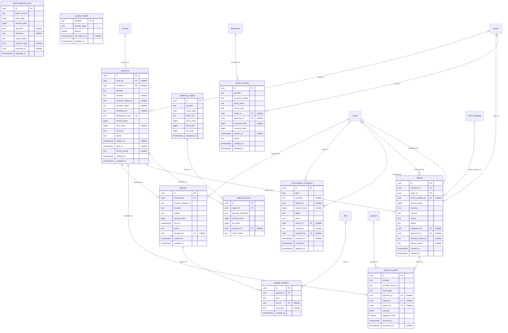
```mermaid
erDiagram
  bank_statement_lines {
    uuid id PK
    text bank_account
    date value_date
    bigint amount_kobo
    text narration "nullable"
    text reference "nullable"
    text match_status
    text matched_type "nullable"
    uuid matched_id "nullable"
    timestamptz imported_at
  }
  dispute_evidence {
    uuid id PK
    uuid dispute_id FK
    text kind
    uuid file_id FK "nullable"
    text summary "nullable"
    timestamptz created_at
  }
  disputes {
    uuid id PK
    uuid payment_id FK
    text provider_dispute_id
    text provider
    text reason
    bigint amount_kobo
    timestamptz due_by
    text status
    uuid decided_by FK "nullable"
    timestamptz created_at
    timestamptz updated_at
  }
  payment_events {
    uuid id PK
    text provider
    text provider_event_id
    text event_type
    uuid payment_id FK "nullable"
    uuid refund_id FK "nullable"
    uuid payout_id FK "nullable"
    jsonb payload
    boolean signature_valid
    timestamptz received_at
    timestamptz processed_at "nullable"
  }
  payments {
    uuid id PK
    uuid order_id FK "nullable"
    uuid invoice_id FK "nullable"
    text provider
    text channel "nullable"
    text provider_reference "nullable"
    text provider_status "nullable"
    text checkout_url "nullable"
    text idempotency_key UK
    bigint amount_kobo
    bigint fees_kobo "nullable"
    char currency
    text status
    timestamptz expires_at "nullable"
    timestamptz paid_at "nullable"
    text failure_reason "nullable"
    timestamptz created_at
    timestamptz updated_at
  }
  provider_health {
    text provider PK
    text breaker_state
    integer failures
    timestamptz last_failure_at "nullable"
    timestamptz updated_at
  }
  reconciliation_exceptions {
    uuid id PK
    text kind
    text provider "nullable"
    text reference "nullable"
    bigint amount_kobo "nullable"
    text detail
    text status
    uuid owner_id FK "nullable"
    text resolution "nullable"
    uuid resolved_by FK "nullable"
    timestamptz resolved_at "nullable"
    timestamptz created_at
    timestamptz updated_at
  }
  refunds {
    uuid id PK
    uuid payment_id FK
    uuid order_id FK
    uuid return_request_id FK "nullable"
    bigint amount_kobo
    char currency
    text method
    text reason
    text status
    uuid requested_by FK "nullable"
    uuid approved_by FK "nullable"
    text provider_reference "nullable"
    text failure_reason "nullable"
    timestamptz created_at
    timestamptz updated_at
  }
  settlement_lines {
    uuid id PK
    uuid report_id FK
    text provider_reference
    bigint amount_kobo
    bigint fee_kobo
    uuid payment_id FK "nullable"
    text match_status
  }
  settlement_reports {
    uuid id PK
    text provider
    date report_date
    text batch_ref
    bigint gross_kobo
    bigint fees_kobo
    bigint net_kobo
    timestamptz imported_at
  }
  virtual_accounts {
    uuid id PK
    text provider
    text account_number
    text bank_name
    text owner_type
    uuid order_id FK "nullable"
    uuid business_id FK "nullable"
    bigint expected_kobo "nullable"
    bigint received_kobo
    timestamptz expires_at "nullable"
    text status
    timestamptz created_at
    timestamptz updated_at
  }
  disputes ||--o{ dispute_evidence : "dispute_id"
  files |o--o{ dispute_evidence : "file_id"
  users |o--o{ disputes : "decided_by"
  payments ||--o{ disputes : "payment_id"
  payments |o--o{ payment_events : "payment_id"
  payouts |o--o{ payment_events : "payout_id"
  refunds |o--o{ payment_events : "refund_id"
  invoices |o--o{ payments : "invoice_id"
  orders |o--o{ payments : "order_id"
  users |o--o{ reconciliation_exceptions : "owner_id"
  users |o--o{ reconciliation_exceptions : "resolved_by"
  users |o--o{ refunds : "approved_by"
  orders ||--o{ refunds : "order_id"
  payments ||--o{ refunds : "payment_id"
  users |o--o{ refunds : "requested_by"
  return_requests |o--o{ refunds : "return_request_id"
  payments |o--o{ settlement_lines : "payment_id"
  settlement_reports ||--o{ settlement_lines : "report_id"
  businesses |o--o{ virtual_accounts : "business_id"
  orders |o--o{ virtual_accounts : "order_id"
```

## Finance & ledger

- `finance.accounting_periods`: Month-end close. Journals cannot be posted into a closed month.
- `finance.commission_rules`: Marketplace commission (basis points) by category and/or seller; the rate is snapshotted on order lines.
- `finance.invoices`: B2B invoices (proforma or tax); on credit terms they are paid later against due_at.
- `finance.ledger_accounts`: Chart of accounts: provider clearing, bank, revenue, VAT, refunds, one payable per seller, store credit per customer.
- `finance.ledger_entries`: Double-entry lines: positive = debit, negative = credit. Each journal sums to zero (deferred check).
- `finance.ledger_journals`: One accounting event. posting_key makes posting idempotent; journals are never edited, only reversed.
- `finance.payout_batches`: A payout run: prepared by one finance person, approved by a different one (with MFA step-up).
- `finance.payout_holds`: Reasons a seller is not paid out right now (e.g. 24 hours after a bank or credential change).
- `finance.payout_items`: Which delivered fulfilments a payout covers; each fulfilment is paid out once.
- `finance.payouts`: Transfers of earnings to a seller's bank account (journal posted only on success).

Links to other domains: `businesses`, `categories`, `files`, `fulfilments`, `orders`, `seller_bank_accounts`, `sellers`, `users` (shown without columns).

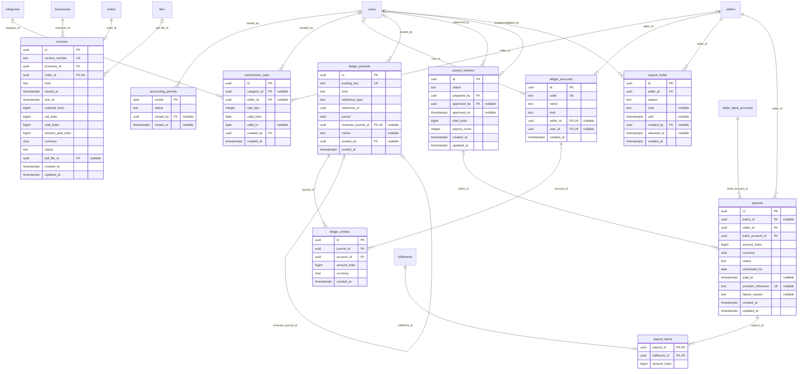
```mermaid
erDiagram
  accounting_periods {
    date month PK
    text status
    uuid closed_by FK "nullable"
    timestamptz closed_at "nullable"
  }
  commission_rules {
    uuid id PK
    uuid category_id FK "nullable"
    uuid seller_id FK "nullable"
    integer rate_bps
    date valid_from
    date valid_to "nullable"
    uuid created_by FK
    timestamptz created_at
  }
  invoices {
    uuid id PK
    text invoice_number UK
    uuid business_id FK
    uuid order_id FK, UK
    text kind
    timestamptz issued_at
    timestamptz due_at
    bigint subtotal_kobo
    bigint vat_kobo
    bigint total_kobo
    bigint amount_paid_kobo
    char currency
    text status
    uuid pdf_file_id FK "nullable"
    timestamptz created_at
    timestamptz updated_at
  }
  ledger_accounts {
    uuid id PK
    text code UK
    text name
    text kind
    uuid seller_id FK, UK "nullable"
    uuid user_id FK, UK "nullable"
    timestamptz created_at
  }
  ledger_entries {
    uuid id PK
    uuid journal_id FK
    uuid account_id FK
    bigint amount_kobo
    char currency
    timestamptz created_at
  }
  ledger_journals {
    uuid id PK
    text posting_key UK
    text kind
    text reference_type
    uuid reference_id
    date period
    uuid reverses_journal_id FK, UK "nullable"
    text memo "nullable"
    uuid posted_by FK "nullable"
    timestamptz posted_at
  }
  payout_batches {
    uuid id PK
    text status
    uuid prepared_by FK
    uuid approved_by FK "nullable"
    timestamptz approved_at "nullable"
    bigint total_kobo
    integer payout_count
    timestamptz created_at
    timestamptz updated_at
  }
  payout_holds {
    uuid id PK
    uuid seller_id FK
    text reason
    text note "nullable"
    timestamptz until "nullable"
    uuid created_by FK "nullable"
    timestamptz released_at "nullable"
    timestamptz created_at
  }
  payout_items {
    uuid payout_id PK, FK
    uuid fulfilment_id PK, FK
    bigint amount_kobo
  }
  payouts {
    uuid id PK
    uuid batch_id FK "nullable"
    uuid seller_id FK
    uuid bank_account_id FK
    bigint amount_kobo
    char currency
    text status
    date scheduled_for
    timestamptz paid_at "nullable"
    text provider_reference UK "nullable"
    text failure_reason "nullable"
    timestamptz created_at
    timestamptz updated_at
  }
  users |o--o{ accounting_periods : "closed_by"
  categories |o--o{ commission_rules : "category_id"
  users ||--o{ commission_rules : "created_by"
  sellers |o--o{ commission_rules : "seller_id"
  businesses ||--o{ invoices : "business_id"
  orders ||--o| invoices : "order_id"
  files |o--o{ invoices : "pdf_file_id"
  sellers |o--o| ledger_accounts : "seller_id"
  users |o--o| ledger_accounts : "user_id"
  ledger_accounts ||--o{ ledger_entries : "account_id"
  ledger_journals ||--o{ ledger_entries : "journal_id"
  users |o--o{ ledger_journals : "posted_by"
  ledger_journals |o--o| ledger_journals : "reverses_journal_id"
  users |o--o{ payout_batches : "approved_by"
  users ||--o{ payout_batches : "prepared_by"
  users |o--o{ payout_holds : "created_by"
  sellers ||--o{ payout_holds : "seller_id"
  fulfilments ||--o| payout_items : "fulfilment_id"
  payouts ||--o{ payout_items : "payout_id"
  seller_bank_accounts ||--o{ payouts : "bank_account_id"
  payout_batches |o--o{ payouts : "batch_id"
  sellers ||--o{ payouts : "seller_id"
```

## After-sales

- `aftersales.repair_jobs`: Workshop jobs for warranty claims, paid repairs and refurbishment of returns.
- `aftersales.return_inspections`: Inspection of returned items: serial must match the unit sold (swap fraud), grade and disposition.
- `aftersales.return_items`: Which order lines (and how many) are being returned.
- `aftersales.return_requests`: Customer return requests (RMA) and their outcome. Faulty items within 7 days may be auto-approved.
- `aftersales.trade_ins`: Trade-ins from estimate to inspection, offer and payout (bank or store credit); accepted devices become device units.
- `aftersales.warranty_claims`: Warranty claims, identified by IMEI/serial.

Links to other domains: `device_units`, `encryption_keys`, `order_lines`, `orders`, `staff_members`, `users` (shown without columns).

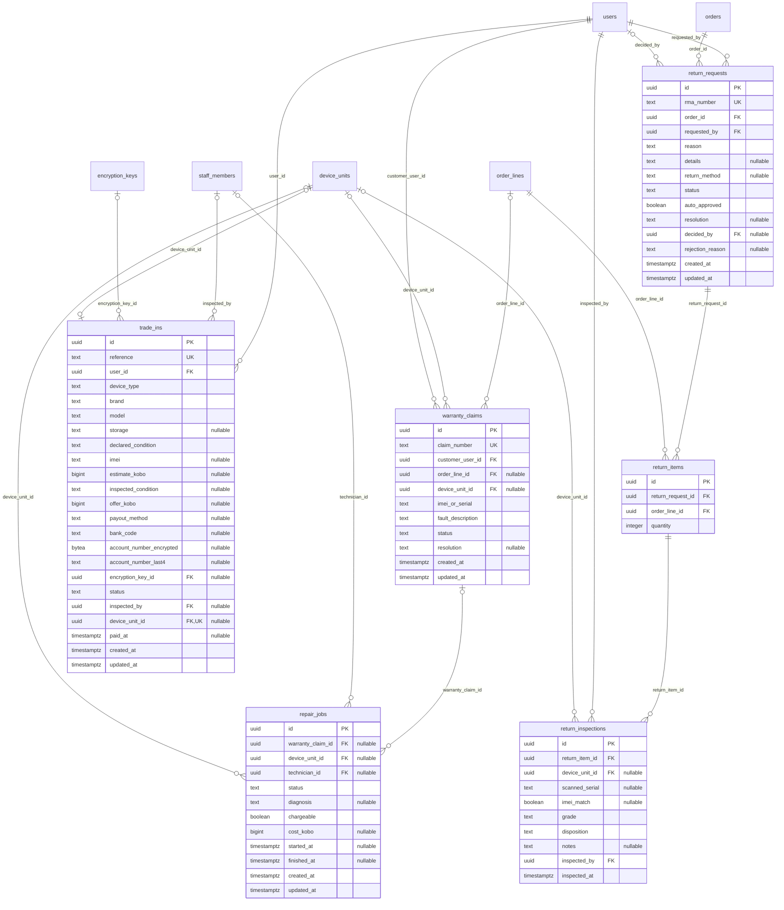
```mermaid
erDiagram
  repair_jobs {
    uuid id PK
    uuid warranty_claim_id FK "nullable"
    uuid device_unit_id FK "nullable"
    uuid technician_id FK "nullable"
    text status
    text diagnosis "nullable"
    boolean chargeable
    bigint cost_kobo "nullable"
    timestamptz started_at "nullable"
    timestamptz finished_at "nullable"
    timestamptz created_at
    timestamptz updated_at
  }
  return_inspections {
    uuid id PK
    uuid return_item_id FK
    uuid device_unit_id FK "nullable"
    text scanned_serial "nullable"
    boolean imei_match "nullable"
    text grade
    text disposition
    text notes "nullable"
    uuid inspected_by FK
    timestamptz inspected_at
  }
  return_items {
    uuid id PK
    uuid return_request_id FK
    uuid order_line_id FK
    integer quantity
  }
  return_requests {
    uuid id PK
    text rma_number UK
    uuid order_id FK
    uuid requested_by FK
    text reason
    text details "nullable"
    text return_method "nullable"
    text status
    boolean auto_approved
    text resolution "nullable"
    uuid decided_by FK "nullable"
    text rejection_reason "nullable"
    timestamptz created_at
    timestamptz updated_at
  }
  trade_ins {
    uuid id PK
    text reference UK
    uuid user_id FK
    text device_type
    text brand
    text model
    text storage "nullable"
    text declared_condition
    text imei "nullable"
    bigint estimate_kobo "nullable"
    text inspected_condition "nullable"
    bigint offer_kobo "nullable"
    text payout_method "nullable"
    text bank_code "nullable"
    bytea account_number_encrypted "nullable"
    text account_number_last4 "nullable"
    uuid encryption_key_id FK "nullable"
    text status
    uuid inspected_by FK "nullable"
    uuid device_unit_id FK, UK "nullable"
    timestamptz paid_at "nullable"
    timestamptz created_at
    timestamptz updated_at
  }
  warranty_claims {
    uuid id PK
    text claim_number UK
    uuid customer_user_id FK
    uuid order_line_id FK "nullable"
    uuid device_unit_id FK "nullable"
    text imei_or_serial
    text fault_description
    text status
    text resolution "nullable"
    timestamptz created_at
    timestamptz updated_at
  }
  device_units |o--o{ repair_jobs : "device_unit_id"
  staff_members |o--o{ repair_jobs : "technician_id"
  warranty_claims |o--o{ repair_jobs : "warranty_claim_id"
  device_units |o--o{ return_inspections : "device_unit_id"
  users ||--o{ return_inspections : "inspected_by"
  return_items ||--o{ return_inspections : "return_item_id"
  order_lines ||--o{ return_items : "order_line_id"
  return_requests ||--o{ return_items : "return_request_id"
  users |o--o{ return_requests : "decided_by"
  orders ||--o{ return_requests : "order_id"
  users ||--o{ return_requests : "requested_by"
  device_units |o--o| trade_ins : "device_unit_id"
  encryption_keys |o--o{ trade_ins : "encryption_key_id"
  staff_members |o--o{ trade_ins : "inspected_by"
  users ||--o{ trade_ins : "user_id"
  users ||--o{ warranty_claims : "customer_user_id"
  device_units |o--o{ warranty_claims : "device_unit_id"
  order_lines |o--o{ warranty_claims : "order_line_id"
```

## Messaging

- `messaging.message_events`: Append-only provider callbacks and clicks per message. Partitioned monthly; 13-month retention.
- `messaging.message_suppressions`: Addresses never to send to on a channel (bounces, complaints, unsubscribes).
- `messaging.message_templates`: Marketing-authored templates (transactional ones live in code).
- `messaging.notification_preferences`: Per category and channel choices. Security and delivery messages cannot be turned off, so they are not listed.
- `messaging.notification_settings`: Quiet hours per user (marketing only).
- `messaging.notifications`: Every message to a recipient, any channel. Doubles as the in-app inbox. Bodies trimmed after 90 days.
- `messaging.push_tokens`: Device push tokens per app; dead tokens are revoked by the receipts job.
- `messaging.template_versions`: Immutable versions of a template; each message records the version it was rendered from.

Links to other domains: `campaigns`, `journey_enrollments`, `users` (shown without columns).

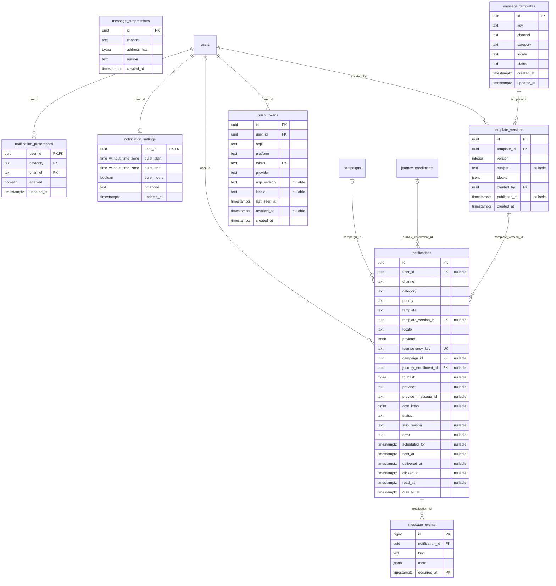
```mermaid
erDiagram
  message_events {
    bigint id PK
    uuid notification_id FK
    text kind
    jsonb meta
    timestamptz occurred_at PK
  }
  message_suppressions {
    uuid id PK
    text channel
    bytea address_hash
    text reason
    timestamptz created_at
  }
  message_templates {
    uuid id PK
    text key
    text channel
    text category
    text locale
    text status
    timestamptz created_at
    timestamptz updated_at
  }
  notification_preferences {
    uuid user_id PK, FK
    text category PK
    text channel PK
    boolean enabled
    timestamptz updated_at
  }
  notification_settings {
    uuid user_id PK, FK
    time_without_time_zone quiet_start
    time_without_time_zone quiet_end
    boolean quiet_hours
    text timezone
    timestamptz updated_at
  }
  notifications {
    uuid id PK
    uuid user_id FK "nullable"
    text channel
    text category
    text priority
    text template
    uuid template_version_id FK "nullable"
    text locale
    jsonb payload
    text idempotency_key UK
    uuid campaign_id FK "nullable"
    uuid journey_enrollment_id FK "nullable"
    bytea to_hash "nullable"
    text provider "nullable"
    text provider_message_id "nullable"
    bigint cost_kobo "nullable"
    text status
    text skip_reason "nullable"
    text error "nullable"
    timestamptz scheduled_for "nullable"
    timestamptz sent_at "nullable"
    timestamptz delivered_at "nullable"
    timestamptz clicked_at "nullable"
    timestamptz read_at "nullable"
    timestamptz created_at
  }
  push_tokens {
    uuid id PK
    uuid user_id FK
    text app
    text platform
    text token UK
    text provider
    text app_version "nullable"
    text locale "nullable"
    timestamptz last_seen_at
    timestamptz revoked_at "nullable"
    timestamptz created_at
  }
  template_versions {
    uuid id PK
    uuid template_id FK
    integer version
    text subject "nullable"
    jsonb blocks
    uuid created_by FK
    timestamptz published_at "nullable"
    timestamptz created_at
  }
  notifications ||--o{ message_events : "notification_id"
  users ||--o{ notification_preferences : "user_id"
  users ||--o| notification_settings : "user_id"
  campaigns |o--o{ notifications : "campaign_id"
  journey_enrollments |o--o{ notifications : "journey_enrollment_id"
  template_versions |o--o{ notifications : "template_version_id"
  users |o--o{ notifications : "user_id"
  users ||--o{ push_tokens : "user_id"
  users ||--o{ template_versions : "created_by"
  message_templates ||--o{ template_versions : "template_id"
```

## Marketing

- `marketing.campaign_recipients`: Recipient snapshot taken when sending starts (stable and auditable); holdout rows get nothing.
- `marketing.campaign_variants`: Content variants for A/B tests (winner by clicks).
- `marketing.campaigns`: One-off sends. Large or costly campaigns need approval by someone other than the creator.
- `marketing.coupon_codes`: Unique single-use codes issued to one person (e.g. CART-7KQ2M9); a leaked code works once.
- `marketing.coupon_redemptions`: Each coupon use (one per order); released when the order is cancelled.
- `marketing.coupons`: Coupons: one shared code, or many single-use codes (coupon_codes). Counters are concurrency-safe.
- `marketing.flash_claims`: Who claimed flash-deal units, for per-user limits and release on cancellation.
- `marketing.journey_enrollments`: People inside a journey; a worker runs due steps every minute; goal events exit immediately.
- `marketing.journey_steps`: Ordered steps of a journey.
- `marketing.journeys`: Automations (abandoned cart, back in stock, welcome…): a trigger plus steps.
- `marketing.promotion_listing_prices`: Flash-deal prices per listing; claimed can never exceed stock_limit (conditional update).
- `marketing.promotion_targets`: What a promotion applies to (a category or a listing); none = sitewide.
- `marketing.promotions`: Deals with real start and end times (countdowns read ends_at; no fake timers).
- `marketing.segments`: Saved audiences: JSON rules compiled to SQL over an allowlist of fields.
- `marketing.tracked_links`: Signed click-redirect targets (only techshop.ng URLs, so it can never be an open redirect).

Links to other domains: `categories`, `listings`, `notifications`, `orders`, `template_versions`, `users` (shown without columns).

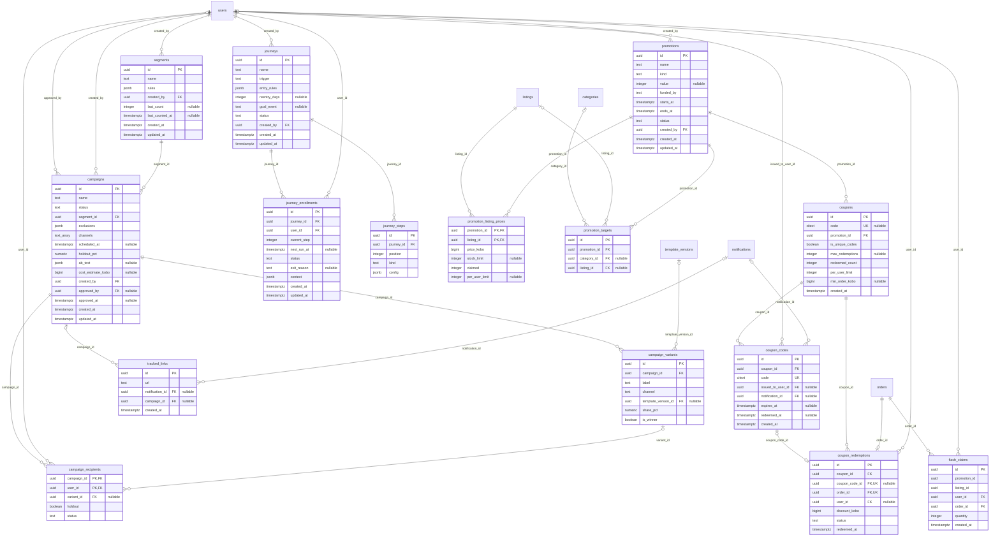
```mermaid
erDiagram
  campaign_recipients {
    uuid campaign_id PK, FK
    uuid user_id PK, FK
    uuid variant_id FK "nullable"
    boolean holdout
    text status
  }
  campaign_variants {
    uuid id PK
    uuid campaign_id FK
    text label
    text channel
    uuid template_version_id FK "nullable"
    numeric share_pct
    boolean is_winner
  }
  campaigns {
    uuid id PK
    text name
    text status
    uuid segment_id FK
    jsonb exclusions
    text_array channels
    timestamptz scheduled_at "nullable"
    numeric holdout_pct
    jsonb ab_test "nullable"
    bigint cost_estimate_kobo "nullable"
    uuid created_by FK
    uuid approved_by FK "nullable"
    timestamptz approved_at "nullable"
    timestamptz created_at
    timestamptz updated_at
  }
  coupon_codes {
    uuid id PK
    uuid coupon_id FK
    citext code UK
    uuid issued_to_user_id FK "nullable"
    uuid notification_id FK "nullable"
    timestamptz expires_at "nullable"
    timestamptz redeemed_at "nullable"
    timestamptz created_at
  }
  coupon_redemptions {
    uuid id PK
    uuid coupon_id FK
    uuid coupon_code_id FK, UK "nullable"
    uuid order_id FK, UK
    uuid user_id FK "nullable"
    bigint discount_kobo
    text status
    timestamptz redeemed_at
  }
  coupons {
    uuid id PK
    citext code UK "nullable"
    uuid promotion_id FK
    boolean is_unique_codes
    integer max_redemptions "nullable"
    integer redeemed_count
    integer per_user_limit
    bigint min_order_kobo "nullable"
    timestamptz created_at
  }
  flash_claims {
    uuid id PK
    uuid promotion_id
    uuid listing_id
    uuid user_id FK
    uuid order_id FK
    integer quantity
    timestamptz created_at
  }
  journey_enrollments {
    uuid id PK
    uuid journey_id FK
    uuid user_id FK
    integer current_step
    timestamptz next_run_at "nullable"
    text status
    text exit_reason "nullable"
    jsonb context
    timestamptz created_at
    timestamptz updated_at
  }
  journey_steps {
    uuid id PK
    uuid journey_id FK
    integer position
    text kind
    jsonb config
  }
  journeys {
    uuid id PK
    text name
    text trigger
    jsonb entry_rules
    integer reentry_days "nullable"
    text goal_event "nullable"
    text status
    uuid created_by FK
    timestamptz created_at
    timestamptz updated_at
  }
  promotion_listing_prices {
    uuid promotion_id PK, FK
    uuid listing_id PK, FK
    bigint price_kobo
    integer stock_limit "nullable"
    integer claimed
    integer per_user_limit "nullable"
  }
  promotion_targets {
    uuid id PK
    uuid promotion_id FK
    uuid category_id FK "nullable"
    uuid listing_id FK "nullable"
  }
  promotions {
    uuid id PK
    text name
    text kind
    integer value "nullable"
    text funded_by
    timestamptz starts_at
    timestamptz ends_at
    text status
    uuid created_by FK
    timestamptz created_at
    timestamptz updated_at
  }
  segments {
    uuid id PK
    text name
    jsonb rules
    uuid created_by FK
    integer last_count "nullable"
    timestamptz last_counted_at "nullable"
    timestamptz created_at
    timestamptz updated_at
  }
  tracked_links {
    uuid id PK
    text url
    uuid notification_id FK "nullable"
    uuid campaign_id FK "nullable"
    timestamptz created_at
  }
  campaigns ||--o{ campaign_recipients : "campaign_id"
  users ||--o{ campaign_recipients : "user_id"
  campaign_variants |o--o{ campaign_recipients : "variant_id"
  campaigns ||--o{ campaign_variants : "campaign_id"
  template_versions |o--o{ campaign_variants : "template_version_id"
  users |o--o{ campaigns : "approved_by"
  users ||--o{ campaigns : "created_by"
  segments ||--o{ campaigns : "segment_id"
  coupons ||--o{ coupon_codes : "coupon_id"
  users |o--o{ coupon_codes : "issued_to_user_id"
  notifications |o--o{ coupon_codes : "notification_id"
  coupon_codes |o--o| coupon_redemptions : "coupon_code_id"
  coupons ||--o{ coupon_redemptions : "coupon_id"
  orders ||--o| coupon_redemptions : "order_id"
  users |o--o{ coupon_redemptions : "user_id"
  promotions ||--o{ coupons : "promotion_id"
  orders ||--o{ flash_claims : "order_id"
  users ||--o{ flash_claims : "user_id"
  journeys ||--o{ journey_enrollments : "journey_id"
  users ||--o{ journey_enrollments : "user_id"
  journeys ||--o{ journey_steps : "journey_id"
  users ||--o{ journeys : "created_by"
  listings ||--o{ promotion_listing_prices : "listing_id"
  promotions ||--o{ promotion_listing_prices : "promotion_id"
  categories |o--o{ promotion_targets : "category_id"
  listings |o--o{ promotion_targets : "listing_id"
  promotions ||--o{ promotion_targets : "promotion_id"
  users ||--o{ promotions : "created_by"
  users ||--o{ segments : "created_by"
  campaigns |o--o{ tracked_links : "campaign_id"
  notifications |o--o{ tracked_links : "notification_id"
```

## Content

- `content.banners`: Hero and promo banners per site and placement (links: internal paths or https only).
- `content.cms_pages`: Editable pages per site (about, legal, credit terms…) as content blocks; publishing needs approval.
- `content.help_articles`: Help centre articles and FAQs per site.

Links to other domains: `files`, `users` (shown without columns).

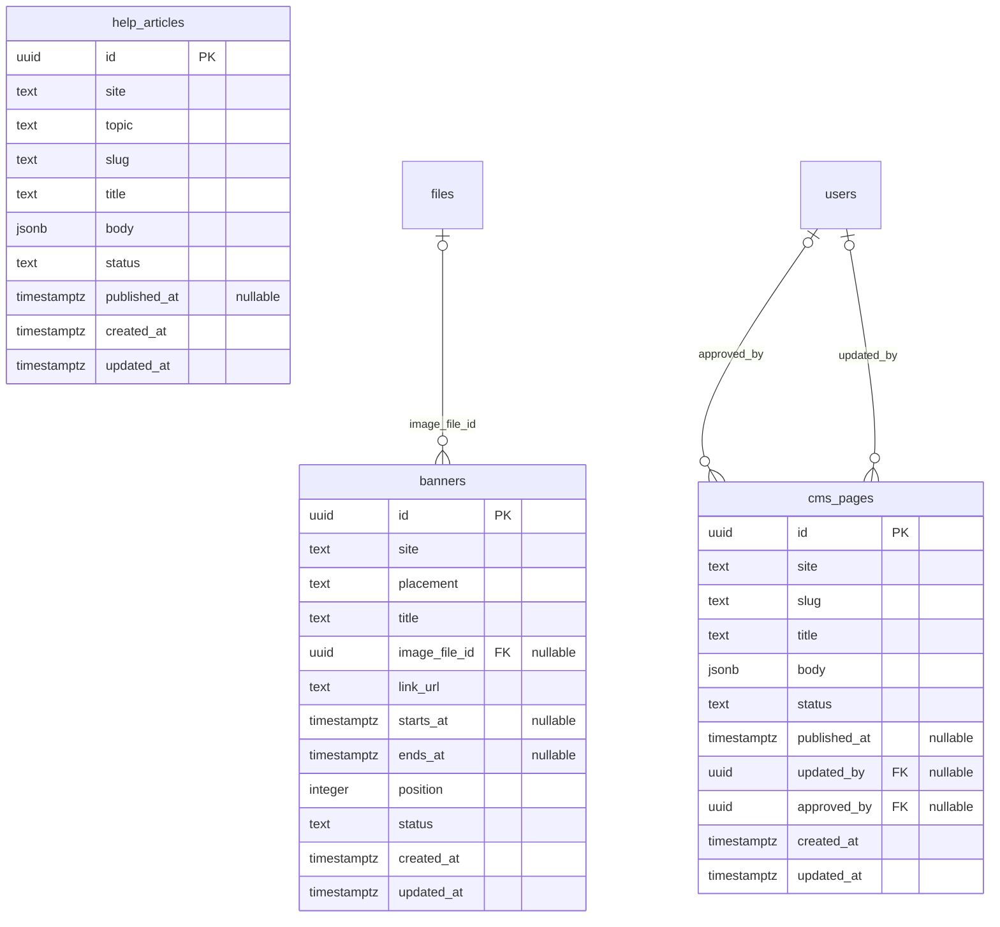
```mermaid
erDiagram
  banners {
    uuid id PK
    text site
    text placement
    text title
    uuid image_file_id FK "nullable"
    text link_url
    timestamptz starts_at "nullable"
    timestamptz ends_at "nullable"
    integer position
    text status
    timestamptz created_at
    timestamptz updated_at
  }
  cms_pages {
    uuid id PK
    text site
    text slug
    text title
    jsonb body
    text status
    timestamptz published_at "nullable"
    uuid updated_by FK "nullable"
    uuid approved_by FK "nullable"
    timestamptz created_at
    timestamptz updated_at
  }
  help_articles {
    uuid id PK
    text site
    text topic
    text slug
    text title
    jsonb body
    text status
    timestamptz published_at "nullable"
    timestamptz created_at
    timestamptz updated_at
  }
  files |o--o{ banners : "image_file_id"
  users |o--o{ cms_pages : "approved_by"
  users |o--o{ cms_pages : "updated_by"
```

## Support

- `support.message_attachments`: Files attached to ticket messages.
- `support.support_tickets`: Support conversations with customers, sellers or public contact-form visitors.
- `support.ticket_messages`: Messages in a ticket; internal notes are never returned to customers.

Links to other domains: `files`, `orders`, `sellers`, `staff_members`, `users` (shown without columns).

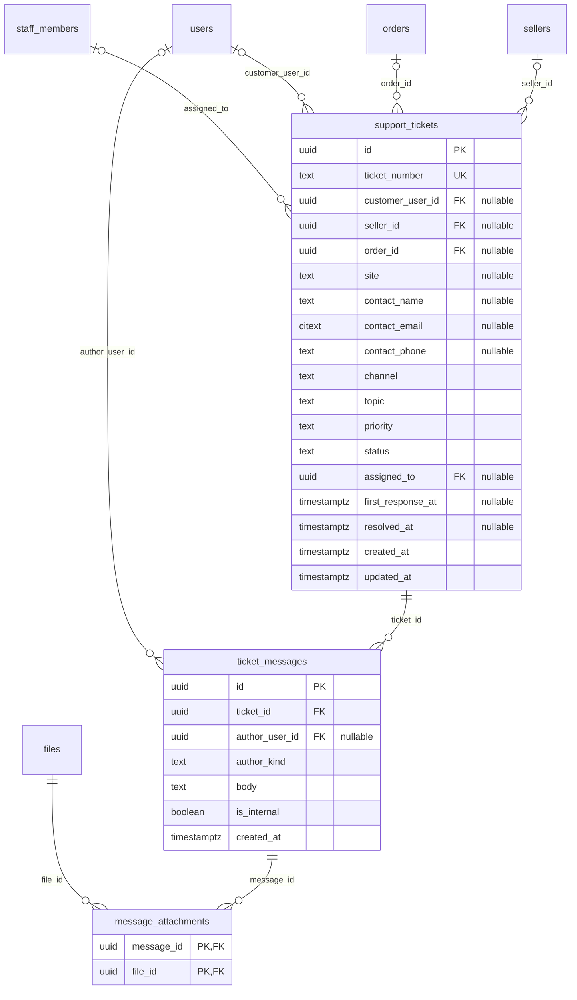
```mermaid
erDiagram
  message_attachments {
    uuid message_id PK, FK
    uuid file_id PK, FK
  }
  support_tickets {
    uuid id PK
    text ticket_number UK
    uuid customer_user_id FK "nullable"
    uuid seller_id FK "nullable"
    uuid order_id FK "nullable"
    text site "nullable"
    text contact_name "nullable"
    citext contact_email "nullable"
    text contact_phone "nullable"
    text channel
    text topic
    text priority
    text status
    uuid assigned_to FK "nullable"
    timestamptz first_response_at "nullable"
    timestamptz resolved_at "nullable"
    timestamptz created_at
    timestamptz updated_at
  }
  ticket_messages {
    uuid id PK
    uuid ticket_id FK
    uuid author_user_id FK "nullable"
    text author_kind
    text body
    boolean is_internal
    timestamptz created_at
  }
  files ||--o{ message_attachments : "file_id"
  ticket_messages ||--o{ message_attachments : "message_id"
  staff_members |o--o{ support_tickets : "assigned_to"
  users |o--o{ support_tickets : "customer_user_id"
  orders |o--o{ support_tickets : "order_id"
  sellers |o--o{ support_tickets : "seller_id"
  users |o--o{ ticket_messages : "author_user_id"
  support_tickets ||--o{ ticket_messages : "ticket_id"
```

## Trust & safety

- `risk.device_blocklist`: IMEIs that may not be sold, traded in, returned or repaired (stolen, fraud, counterfeit).
- `risk.enforcement_actions`: Seller enforcement ladder steps, each with reasons and an appeal decided by a different person.
- `risk.kyc_checks`: Results of each automated KYC check (provider or manual), shown to the reviewer.
- `risk.listing_reports`: Reports of counterfeit or misleading listings; upheld reports are seller strikes.
- `risk.review_reports`: Reports of reviews that break policy (sellers can report, never delete).
- `risk.risk_cases`: Fraud and risk reviews. Analysts' clear/block decisions become labels for rule tuning.
- `risk.risk_decisions`: Every risk decision with score, reasons and rule-set version. Partitioned monthly; 24-month retention.
- `risk.risk_entities`: Nodes of the link graph (accounts, devices, phones, cards…), stored as hashes.
- `risk.risk_links`: Edges of the link graph: two entities seen together (stored once, a < b).
- `risk.risk_lists`: Ban lists (phones, emails, bank accounts, addresses, disposable email domains), hashed.
- `risk.risk_rule_sets`: Versioned rule sets per checkpoint; only one active per checkpoint. Publishing needs a step-up.
- `risk.risk_rules`: Rules in a rule set: a condition over features, a weight, or a deterministic hold/block.
- `risk.seller_metrics_daily`: Per-seller daily counts used for the rolling 60-day performance rates.
- `risk.velocity_counters`: Window counters for velocity features (orders per device, cards per account…). Same design as identity.auth_rate_limits.

Links to other domains: `listings`, `product_reviews`, `sellers`, `staff_members`, `users` (shown without columns).


```mermaid
erDiagram
  device_blocklist {
    uuid id PK
    text imei UK
    text reason
    text source
    text reference "nullable"
    uuid created_by FK "nullable"
    timestamptz created_at
  }
  enforcement_actions {
    uuid id PK
    uuid seller_id FK
    text step
    text reason
    uuid created_by FK
    text appeal_status "nullable"
    timestamptz appealed_at "nullable"
    uuid decided_by FK "nullable"
    timestamptz decided_at "nullable"
    timestamptz created_at
  }
  kyc_checks {
    uuid id PK
    text subject_type
    uuid subject_id
    text kind
    text provider
    text result
    numeric score "nullable"
    text raw_ref "nullable"
    timestamptz checked_at
  }
  listing_reports {
    uuid id PK
    uuid listing_id FK
    uuid reporter_id FK "nullable"
    text source
    text reason
    text details "nullable"
    text status
    uuid decided_by FK "nullable"
    timestamptz created_at
    timestamptz updated_at
  }
  review_reports {
    uuid id PK
    uuid review_id FK
    uuid reporter_id FK "nullable"
    text reason
    text status
    uuid decided_by FK "nullable"
    timestamptz created_at
    timestamptz updated_at
  }
  risk_cases {
    uuid id PK
    text kind
    text subject_type
    uuid subject_id
    text reason
    smallint score "nullable"
    bigint money_at_risk_kobo "nullable"
    bigint decision_id "nullable"
    text status
    text label "nullable"
    timestamptz sla_due_at "nullable"
    uuid assigned_to FK "nullable"
    uuid resolved_by FK "nullable"
    timestamptz resolved_at "nullable"
    timestamptz created_at
    timestamptz updated_at
  }
  risk_decisions {
    bigint id PK
    text checkpoint
    text subject_type
    uuid subject_id
    uuid user_id FK "nullable"
    smallint score
    text outcome
    jsonb reasons
    integer rule_set_version "nullable"
    integer latency_ms "nullable"
    timestamptz created_at PK
  }
  risk_entities {
    uuid id PK
    text kind
    bytea value_hash
    timestamptz first_seen
    timestamptz last_seen
  }
  risk_links {
    uuid entity_a PK, FK
    uuid entity_b PK, FK
    timestamptz first_seen
    timestamptz last_seen
  }
  risk_lists {
    uuid id PK
    text kind
    bytea value_hash
    text reason
    timestamptz expires_at "nullable"
    uuid created_by FK "nullable"
    timestamptz created_at
  }
  risk_rule_sets {
    uuid id PK
    text checkpoint
    integer version
    text status
    jsonb thresholds
    uuid published_by FK "nullable"
    timestamptz published_at "nullable"
    uuid created_by FK
    timestamptz created_at
  }
  risk_rules {
    uuid id PK
    uuid rule_set_id FK
    text key
    text label
    jsonb condition
    integer weight
    text action
    boolean enabled
  }
  seller_metrics_daily {
    uuid seller_id PK, FK
    date day PK
    integer orders
    integer defects
    integer late_shipments
    integer seller_cancels
    integer returns
    integer counterfeit_strikes
  }
  velocity_counters {
    text key PK
    timestamptz window_start PK
    integer count
  }
  users |o--o{ device_blocklist : "created_by"
  users ||--o{ enforcement_actions : "created_by"
  users |o--o{ enforcement_actions : "decided_by"
  sellers ||--o{ enforcement_actions : "seller_id"
  users |o--o{ listing_reports : "decided_by"
  listings ||--o{ listing_reports : "listing_id"
  users |o--o{ listing_reports : "reporter_id"
  users |o--o{ review_reports : "decided_by"
  users |o--o{ review_reports : "reporter_id"
  product_reviews ||--o{ review_reports : "review_id"
  staff_members |o--o{ risk_cases : "assigned_to"
  users |o--o{ risk_cases : "resolved_by"
  users |o--o{ risk_decisions : "user_id"
  risk_entities ||--o{ risk_links : "entity_a"
  risk_entities ||--o{ risk_links : "entity_b"
  users |o--o{ risk_lists : "created_by"
  users ||--o{ risk_rule_sets : "created_by"
  users |o--o{ risk_rule_sets : "published_by"
  risk_rule_sets ||--o{ risk_rules : "rule_set_id"
  sellers ||--o{ seller_metrics_daily : "seller_id"
```

## Cars

- `cars.car_documents`: Ownership and import documents, verified by staff. A listing goes active only with verified documents.
- `cars.car_images`: Photos of a car listing.
- `cars.car_inspections`: Inspection reports (engine, brakes, body, electricals, documents/VIN).
- `cars.car_listings`: Cars for sale (separate from products): book a viewing, inspect, then pay. Never add-to-cart.
- `cars.financing_enquiries`: Car financing enquiries, referred to finance partners.
- `cars.viewing_bookings`: Requests to see a car (the Book a viewing form).

Links to other domains: `files`, `nigerian_states`, `sellers`, `staff_members`, `users` (shown without columns).

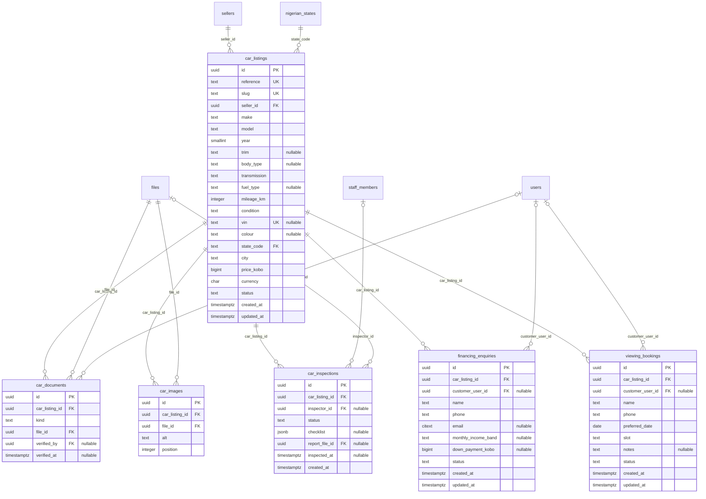
```mermaid
erDiagram
  car_documents {
    uuid id PK
    uuid car_listing_id FK
    text kind
    uuid file_id FK
    uuid verified_by FK "nullable"
    timestamptz verified_at "nullable"
  }
  car_images {
    uuid id PK
    uuid car_listing_id FK
    uuid file_id FK
    text alt
    integer position
  }
  car_inspections {
    uuid id PK
    uuid car_listing_id FK
    uuid inspector_id FK "nullable"
    text status
    jsonb checklist "nullable"
    uuid report_file_id FK "nullable"
    timestamptz inspected_at "nullable"
    timestamptz created_at
  }
  car_listings {
    uuid id PK
    text reference UK
    text slug UK
    uuid seller_id FK
    text make
    text model
    smallint year
    text trim "nullable"
    text body_type "nullable"
    text transmission
    text fuel_type "nullable"
    integer mileage_km
    text condition
    text vin UK "nullable"
    text colour "nullable"
    text state_code FK
    text city
    bigint price_kobo
    char currency
    text status
    timestamptz created_at
    timestamptz updated_at
  }
  financing_enquiries {
    uuid id PK
    uuid car_listing_id FK
    uuid customer_user_id FK "nullable"
    text name
    text phone
    citext email "nullable"
    text monthly_income_band "nullable"
    bigint down_payment_kobo "nullable"
    text status
    timestamptz created_at
    timestamptz updated_at
  }
  viewing_bookings {
    uuid id PK
    uuid car_listing_id FK
    uuid customer_user_id FK "nullable"
    text name
    text phone
    date preferred_date
    text slot
    text notes "nullable"
    text status
    timestamptz created_at
    timestamptz updated_at
  }
  car_listings ||--o{ car_documents : "car_listing_id"
  files ||--o{ car_documents : "file_id"
  users |o--o{ car_documents : "verified_by"
  car_listings ||--o{ car_images : "car_listing_id"
  files ||--o{ car_images : "file_id"
  car_listings ||--o{ car_inspections : "car_listing_id"
  staff_members |o--o{ car_inspections : "inspector_id"
  files |o--o{ car_inspections : "report_file_id"
  sellers ||--o{ car_listings : "seller_id"
  nigerian_states ||--o{ car_listings : "state_code"
  car_listings ||--o{ financing_enquiries : "car_listing_id"
  users |o--o{ financing_enquiries : "customer_user_id"
  car_listings ||--o{ viewing_bookings : "car_listing_id"
  users |o--o{ viewing_bookings : "customer_user_id"
```

## Personalisation & recommendations

- `personalisation.identity_links`: Joins a guest's anonymous history to their account at sign-in.
- `personalisation.rec_item_neighbours`: Similar, bought-together and also-viewed products per product.
- `personalisation.rec_item_vectors`: Item embeddings used by Go for live session re-ranking.
- `personalisation.rec_model_versions`: Imported model versions; one active at a time, the previous kept for one-click rollback.
- `personalisation.rec_overrides`: Staff merchandising pins and blocks per shelf (audited, time-boxed).
- `personalisation.rec_popularity`: Trending products by window, category and state (the last-resort fallback for every shelf).
- `personalisation.rec_staging_item_neighbours`: Staging copy of rec_item_neighbours for validating imports.
- `personalisation.rec_staging_item_vectors`: Staging copy of rec_item_vectors for validating imports.
- `personalisation.rec_staging_popularity`: Staging copy of rec_popularity for validating imports.
- `personalisation.rec_staging_subject_candidates`: Staging copy of rec_subject_candidates for validating imports.
- `personalisation.rec_subject_candidates`: "For you" candidates per consented user.
- `personalisation.user_events`: Behaviour events from consented visitors (views, clicks, carts, searches). Partitioned monthly.

Links to other domains: `car_listings`, `categories`, `listings`, `nigerian_states`, `products`, `users` (shown without columns).

```mermaid
erDiagram
  identity_links {
    uuid anonymous_id PK
    uuid user_id FK
    timestamptz linked_at
  }
  rec_item_neighbours {
    uuid model_version_id PK, FK
    text kind PK
    uuid product_id PK, FK
    uuid neighbour_product_id FK
    real score
    smallint rank PK
  }
  rec_item_vectors {
    uuid model_version_id PK, FK
    uuid product_id PK, FK
    real_array vector
  }
  rec_model_versions {
    uuid id PK
    text model_kind
    text status
    timestamptz trained_at
    timestamptz data_cutoff
    text code_version
    jsonb metrics
    jsonb row_counts
    timestamptz activated_at "nullable"
    timestamptz created_at
  }
  rec_overrides {
    uuid id PK
    text surface
    uuid anchor_product_id FK "nullable"
    uuid product_id FK
    text action
    timestamptz starts_at
    timestamptz ends_at "nullable"
    uuid created_by FK
    timestamptz created_at
  }
  rec_popularity {
    uuid id PK
    timestamptz computed_at
    text window
    uuid category_id FK "nullable"
    text state_code FK "nullable"
    uuid product_id FK
    real score
    smallint rank
  }
  rec_staging_item_neighbours {
    uuid model_version_id PK
    text kind PK
    uuid product_id PK
    uuid neighbour_product_id
    real score
    smallint rank PK
  }
  rec_staging_item_vectors {
    uuid model_version_id PK
    uuid product_id PK
    real_array vector
  }
  rec_staging_popularity {
    uuid id PK
    timestamptz computed_at
    text window
    uuid category_id "nullable"
    text state_code "nullable"
    uuid product_id
    real score
    smallint rank
  }
  rec_staging_subject_candidates {
    uuid model_version_id PK
    uuid user_id PK
    uuid product_id
    real score
    smallint rank PK
  }
  rec_subject_candidates {
    uuid model_version_id PK, FK
    uuid user_id PK, FK
    uuid product_id FK
    real score
    smallint rank PK
  }
  user_events {
    bigint id PK
    timestamptz occurred_at
    timestamptz received_at PK
    uuid anonymous_id
    uuid user_id FK "nullable"
    text session_id "nullable"
    text event_type
    text app
    text surface "nullable"
    uuid product_id FK "nullable"
    uuid listing_id FK "nullable"
    uuid car_listing_id FK "nullable"
    uuid category_id FK "nullable"
    text query_norm "nullable"
    integer results_count "nullable"
    smallint position "nullable"
    text rec_request_id "nullable"
    text strategy "nullable"
    text state_code "nullable"
    text device_class "nullable"
    jsonb properties
  }
  users ||--o{ identity_links : "user_id"
  rec_model_versions ||--o{ rec_item_neighbours : "model_version_id"
  products ||--o{ rec_item_neighbours : "neighbour_product_id"
  products ||--o{ rec_item_neighbours : "product_id"
  rec_model_versions ||--o{ rec_item_vectors : "model_version_id"
  products ||--o{ rec_item_vectors : "product_id"
  products |o--o{ rec_overrides : "anchor_product_id"
  users ||--o{ rec_overrides : "created_by"
  products ||--o{ rec_overrides : "product_id"
  categories |o--o{ rec_popularity : "category_id"
  products ||--o{ rec_popularity : "product_id"
  nigerian_states |o--o{ rec_popularity : "state_code"
  rec_model_versions ||--o{ rec_subject_candidates : "model_version_id"
  products ||--o{ rec_subject_candidates : "product_id"
  users ||--o{ rec_subject_candidates : "user_id"
  car_listings |o--o{ user_events : "car_listing_id"
  categories |o--o{ user_events : "category_id"
  listings |o--o{ user_events : "listing_id"
  products |o--o{ user_events : "product_id"
  users |o--o{ user_events : "user_id"
```

## Platform

- `platform.audit_log`: Append-only record of who changed what (staff and seller actions, sensitive reads such as ID reveals).
- `platform.encryption_keys`: Envelope encryption: data keys wrapped by the KMS key. Only one active key per purpose.
- `platform.feature_flags`: Runtime feature switches (IT tools module), e.g. the live recommender service.
- `platform.files`: Uploaded files (photos, KYC documents, delivery proofs, PDFs). Bytes live in object storage via presigned uploads.
- `platform.idempotency_keys`: Remembers responses to retried requests (checkout, payments, refunds) so they run once; locked_at detects in-flight duplicates.
- `platform.outbox_events`: Transactional outbox: events written in the same transaction as the change, then relayed to jobs.
- `platform.public_holidays`: Nigerian public holidays, so payout runs skip non-business days.

Links to other domains: `users` (shown without columns).

```mermaid
erDiagram
  audit_log {
    bigint id PK
    uuid actor_user_id FK "nullable"
    text actor_kind
    text action
    text entity_type
    text entity_id
    jsonb changes "nullable"
    text request_id "nullable"
    inet ip "nullable"
    text user_agent "nullable"
    timestamptz created_at
  }
  encryption_keys {
    uuid id PK
    text purpose
    bytea wrapped_dek
    text kms_key_id
    timestamptz created_at
    timestamptz retired_at "nullable"
  }
  feature_flags {
    text key PK
    text description
    boolean enabled
    jsonb rules "nullable"
    uuid updated_by FK "nullable"
    timestamptz updated_at
  }
  files {
    uuid id PK
    text storage_key UK
    text purpose
    text status
    text original_name "nullable"
    text content_type
    bigint size_bytes
    text checksum "nullable"
    integer width "nullable"
    integer height "nullable"
    text blurhash "nullable"
    text visibility
    uuid uploaded_by FK "nullable"
    timestamptz deleted_at "nullable"
    timestamptz created_at
  }
  idempotency_keys {
    text scope PK
    text key PK
    uuid user_id FK "nullable"
    text method
    text path
    bytea request_hash
    smallint response_code "nullable"
    jsonb response_body "nullable"
    timestamptz locked_at "nullable"
    timestamptz completed_at "nullable"
    timestamptz expires_at
    timestamptz created_at
  }
  outbox_events {
    bigint id PK
    text aggregate_type
    uuid aggregate_id
    text event_type
    jsonb payload
    jsonb trace_context "nullable"
    timestamptz created_at
    timestamptz published_at "nullable"
  }
  public_holidays {
    date date PK
    text name
  }
  users |o--o{ audit_log : "actor_user_id"
  users |o--o{ feature_flags : "updated_by"
  users |o--o{ files : "uploaded_by"
  users |o--o{ idempotency_keys : "user_id"
```

## Overview: all tables

Every table and relationship, without columns. `users` and `files` are referenced by most tables (who created/approved something, attachments); those links are left out here and shown in the domain diagrams.

```mermaid
erDiagram
  accounting_periods {
    date month PK
  }
  addresses {
    uuid id PK
  }
  attribute_definitions {
    uuid id PK
  }
  audit_log {
    bigint id PK
  }
  auth_events {
    bigint id PK
    timestamptz created_at PK
  }
  auth_rate_limits {
    text key PK
    timestamptz window_start PK
  }
  bank_statement_lines {
    uuid id PK
  }
  banners {
    uuid id PK
  }
  bin_locations {
    uuid id PK
  }
  brands {
    uuid id PK
  }
  business_members {
    uuid business_id PK
    uuid user_id PK
  }
  businesses {
    uuid id PK
  }
  campaign_recipients {
    uuid campaign_id PK
    uuid user_id PK
  }
  campaign_variants {
    uuid id PK
  }
  campaigns {
    uuid id PK
  }
  car_documents {
    uuid id PK
  }
  car_images {
    uuid id PK
  }
  car_inspections {
    uuid id PK
  }
  car_listings {
    uuid id PK
  }
  carriers {
    uuid id PK
  }
  cart_items {
    uuid id PK
  }
  carts {
    uuid id PK
  }
  catalogue_gaps {
    text query_norm PK
  }
  categories {
    uuid id PK
  }
  cms_pages {
    uuid id PK
  }
  commission_rules {
    uuid id PK
  }
  consents {
    bigint id PK
  }
  coupon_codes {
    uuid id PK
  }
  coupon_redemptions {
    uuid id PK
  }
  coupons {
    uuid id PK
  }
  credit_accounts {
    uuid id PK
  }
  delivery_events {
    uuid id PK
  }
  delivery_jobs {
    uuid id PK
  }
  delivery_rates {
    uuid id PK
  }
  delivery_zones {
    uuid id PK
  }
  device_blocklist {
    uuid id PK
  }
  device_units {
    uuid id PK
  }
  dispute_evidence {
    uuid id PK
  }
  disputes {
    uuid id PK
  }
  encryption_keys {
    uuid id PK
  }
  enforcement_actions {
    uuid id PK
  }
  feature_flags {
    text key PK
  }
  files {
    uuid id PK
  }
  financing_enquiries {
    uuid id PK
  }
  flash_claims {
    uuid id PK
  }
  fulfilments {
    uuid id PK
  }
  goods_receipts {
    uuid id PK
  }
  help_articles {
    uuid id PK
  }
  idempotency_keys {
    text scope PK
    text key PK
  }
  identity_links {
    uuid anonymous_id PK
  }
  image_hashes {
    uuid product_image_id PK
  }
  inventory_costs {
    uuid variant_id PK
    text condition PK
    uuid warehouse_id PK
    uuid owner_seller_id PK
  }
  inventory_count_lines {
    uuid id PK
  }
  inventory_counts {
    uuid id PK
  }
  inventory_levels {
    uuid warehouse_id PK
    uuid variant_id PK
    text condition PK
    uuid owner_seller_id PK
  }
  invoices {
    uuid id PK
  }
  journey_enrollments {
    uuid id PK
  }
  journey_steps {
    uuid id PK
  }
  journeys {
    uuid id PK
  }
  kyc_checks {
    uuid id PK
  }
  kyc_documents {
    uuid id PK
  }
  ledger_accounts {
    uuid id PK
  }
  ledger_entries {
    uuid id PK
  }
  ledger_journals {
    uuid id PK
  }
  listing_price_history {
    uuid id PK
  }
  listing_reports {
    uuid id PK
  }
  listing_reviews {
    uuid id PK
  }
  listings {
    uuid id PK
  }
  manifest_parcels {
    uuid manifest_id PK
    uuid parcel_id PK
  }
  manifests {
    uuid id PK
  }
  message_attachments {
    uuid message_id PK
    uuid file_id PK
  }
  message_events {
    bigint id PK
    timestamptz occurred_at PK
  }
  message_suppressions {
    uuid id PK
  }
  message_templates {
    uuid id PK
  }
  nigerian_lgas {
    uuid id PK
  }
  nigerian_states {
    text code PK
  }
  notification_preferences {
    uuid user_id PK
    text category PK
    text channel PK
  }
  notification_settings {
    uuid user_id PK
  }
  notifications {
    uuid id PK
  }
  order_lines {
    uuid id PK
  }
  order_status_history {
    uuid id PK
  }
  orders {
    uuid id PK
  }
  outbox_events {
    bigint id PK
  }
  pack_records {
    uuid id PK
  }
  parcels {
    uuid id PK
  }
  payment_events {
    uuid id PK
  }
  payments {
    uuid id PK
  }
  payout_batches {
    uuid id PK
  }
  payout_holds {
    uuid id PK
  }
  payout_items {
    uuid payout_id PK
    uuid fulfilment_id PK
  }
  payouts {
    uuid id PK
  }
  permissions {
    uuid id PK
  }
  pick_list_items {
    uuid id PK
  }
  pick_lists {
    uuid id PK
  }
  pos_shifts {
    uuid id PK
  }
  pos_terminals {
    uuid id PK
  }
  price_tiers {
    uuid id PK
  }
  privacy_requests {
    uuid id PK
  }
  product_attribute_values {
    uuid product_id PK
    uuid attribute_id PK
  }
  product_compatibility {
    uuid id PK
  }
  product_images {
    uuid id PK
  }
  product_offer_summary {
    uuid product_id PK
    text channel PK
  }
  product_reviews {
    uuid id PK
  }
  product_suggestions {
    uuid id PK
  }
  product_variants {
    uuid id PK
  }
  products {
    uuid id PK
  }
  promotion_listing_prices {
    uuid promotion_id PK
    uuid listing_id PK
  }
  promotion_targets {
    uuid id PK
  }
  promotions {
    uuid id PK
  }
  provider_health {
    text provider PK
  }
  public_holidays {
    date date PK
  }
  purchase_order_lines {
    uuid id PK
  }
  purchase_orders {
    uuid id PK
  }
  push_tokens {
    uuid id PK
  }
  quote_lines {
    uuid id PK
  }
  quotes {
    uuid id PK
  }
  rec_item_neighbours {
    uuid model_version_id PK
    text kind PK
    uuid product_id PK
    smallint rank PK
  }
  rec_item_vectors {
    uuid model_version_id PK
    uuid product_id PK
  }
  rec_model_versions {
    uuid id PK
  }
  rec_overrides {
    uuid id PK
  }
  rec_popularity {
    uuid id PK
  }
  rec_staging_item_neighbours {
    uuid model_version_id PK
    text kind PK
    uuid product_id PK
    smallint rank PK
  }
  rec_staging_item_vectors {
    uuid model_version_id PK
    uuid product_id PK
  }
  rec_staging_popularity {
    uuid id PK
  }
  rec_staging_subject_candidates {
    uuid model_version_id PK
    uuid user_id PK
    smallint rank PK
  }
  rec_subject_candidates {
    uuid model_version_id PK
    uuid user_id PK
    smallint rank PK
  }
  reconciliation_exceptions {
    uuid id PK
  }
  refunds {
    uuid id PK
  }
  repair_jobs {
    uuid id PK
  }
  return_inspections {
    uuid id PK
  }
  return_items {
    uuid id PK
  }
  return_requests {
    uuid id PK
  }
  review_images {
    uuid review_id PK
    uuid file_id PK
  }
  review_reports {
    uuid id PK
  }
  rider_devices {
    uuid id PK
  }
  rider_location_pings {
    uuid rider_id PK
    timestamptz recorded_at PK
  }
  rider_locations {
    uuid rider_id PK
  }
  rider_shifts {
    uuid id PK
  }
  rider_zones {
    uuid rider_id PK
    uuid zone_id PK
  }
  riders {
    uuid user_id PK
  }
  risk_cases {
    uuid id PK
  }
  risk_decisions {
    bigint id PK
    timestamptz created_at PK
  }
  risk_entities {
    uuid id PK
  }
  risk_links {
    uuid entity_a PK
    uuid entity_b PK
  }
  risk_lists {
    uuid id PK
  }
  risk_rule_sets {
    uuid id PK
  }
  risk_rules {
    uuid id PK
  }
  role_permissions {
    uuid role_id PK
    uuid permission_id PK
  }
  roles {
    uuid id PK
  }
  saved_items {
    uuid user_id PK
    uuid product_id PK
  }
  search_pins {
    uuid id PK
  }
  search_queries {
    bigint id PK
    timestamptz created_at PK
  }
  search_redirects {
    text query_norm PK
  }
  search_suggestions {
    text prefix PK
    text suggestion PK
  }
  search_synonyms {
    uuid id PK
  }
  segments {
    uuid id PK
  }
  seller_bank_accounts {
    uuid id PK
  }
  seller_kyc_submissions {
    uuid id PK
  }
  seller_members {
    uuid seller_id PK
    uuid user_id PK
  }
  seller_metrics_daily {
    uuid seller_id PK
    date day PK
  }
  seller_ratings {
    uuid id PK
  }
  seller_sla_events {
    uuid id PK
  }
  sellers {
    uuid id PK
  }
  service_clients {
    uuid id PK
  }
  settlement_lines {
    uuid id PK
  }
  settlement_reports {
    uuid id PK
  }
  shipment_events {
    uuid id PK
  }
  shipments {
    uuid id PK
  }
  staff_invites {
    uuid id PK
  }
  staff_members {
    uuid user_id PK
  }
  staff_role_scopes {
    uuid user_id PK
    uuid role_id PK
    text scope_type PK
    uuid scope_id PK
  }
  staff_roles {
    uuid user_id PK
    uuid role_id PK
  }
  stock_alerts {
    uuid user_id PK
    uuid product_id PK
  }
  stock_movements {
    uuid id PK
  }
  stock_reservations {
    uuid id PK
  }
  stock_transfer_lines {
    uuid id PK
  }
  stock_transfers {
    uuid id PK
  }
  suppliers {
    uuid id PK
  }
  support_tickets {
    uuid id PK
  }
  template_versions {
    uuid id PK
  }
  ticket_messages {
    uuid id PK
  }
  tracked_links {
    uuid id PK
  }
  trade_ins {
    uuid id PK
  }
  user_events {
    bigint id PK
    timestamptz received_at PK
  }
  user_mfa_factors {
    uuid id PK
  }
  user_recovery_codes {
    uuid id PK
  }
  user_sessions {
    uuid id PK
  }
  users {
    uuid id PK
  }
  velocity_counters {
    text key PK
    timestamptz window_start PK
  }
  verification_codes {
    uuid id PK
  }
  viewing_bookings {
    uuid id PK
  }
  virtual_accounts {
    uuid id PK
  }
  warehouses {
    uuid id PK
  }
  warranty_claims {
    uuid id PK
  }
  webauthn_credentials {
    uuid id PK
  }
  businesses |o--o{ addresses : "business_id"
  nigerian_states ||--o{ addresses : "state_code"
  categories ||--o{ attribute_definitions : "category_id"
  warehouses ||--o{ bin_locations : "warehouse_id"
  businesses ||--o{ business_members : "business_id"
  staff_members |o--o{ businesses : "account_manager_id"
  campaigns ||--o{ campaign_recipients : "campaign_id"
  campaign_variants |o--o{ campaign_recipients : "variant_id"
  campaigns ||--o{ campaign_variants : "campaign_id"
  template_versions |o--o{ campaign_variants : "template_version_id"
  segments ||--o{ campaigns : "segment_id"
  car_listings ||--o{ car_documents : "car_listing_id"
  car_listings ||--o{ car_images : "car_listing_id"
  car_listings ||--o{ car_inspections : "car_listing_id"
  staff_members |o--o{ car_inspections : "inspector_id"
  sellers ||--o{ car_listings : "seller_id"
  nigerian_states ||--o{ car_listings : "state_code"
  carts ||--o{ cart_items : "cart_id"
  listings ||--o{ cart_items : "listing_id"
  businesses |o--o{ carts : "business_id"
  categories |o--o{ categories : "parent_id"
  categories |o--o{ commission_rules : "category_id"
  sellers |o--o{ commission_rules : "seller_id"
  coupons ||--o{ coupon_codes : "coupon_id"
  notifications |o--o{ coupon_codes : "notification_id"
  coupon_codes |o--o| coupon_redemptions : "coupon_code_id"
  coupons ||--o{ coupon_redemptions : "coupon_id"
  orders ||--o| coupon_redemptions : "order_id"
  promotions ||--o{ coupons : "promotion_id"
  businesses ||--o| credit_accounts : "business_id"
  delivery_jobs ||--o{ delivery_events : "delivery_job_id"
  fulfilments |o--o{ delivery_jobs : "fulfilment_id"
  warehouses |o--o{ delivery_jobs : "pickup_warehouse_id"
  return_requests |o--o{ delivery_jobs : "return_request_id"
  riders |o--o{ delivery_jobs : "rider_id"
  delivery_zones ||--o{ delivery_jobs : "zone_id"
  delivery_zones ||--o{ delivery_rates : "zone_id"
  nigerian_states ||--o{ delivery_zones : "state_code"
  sellers ||--o{ device_units : "owner_seller_id"
  product_variants ||--o{ device_units : "variant_id"
  warehouses |o--o{ device_units : "warehouse_id"
  disputes ||--o{ dispute_evidence : "dispute_id"
  payments ||--o{ disputes : "payment_id"
  sellers ||--o{ enforcement_actions : "seller_id"
  car_listings ||--o{ financing_enquiries : "car_listing_id"
  orders ||--o{ flash_claims : "order_id"
  warehouses |o--o{ fulfilments : "collection_store_id"
  orders ||--o{ fulfilments : "order_id"
  sellers ||--o{ fulfilments : "seller_id"
  warehouses |o--o{ fulfilments : "warehouse_id"
  purchase_orders ||--o{ goods_receipts : "purchase_order_id"
  product_images ||--o| image_hashes : "product_image_id"
  sellers ||--o{ inventory_costs : "owner_seller_id"
  product_variants ||--o{ inventory_costs : "variant_id"
  warehouses ||--o{ inventory_costs : "warehouse_id"
  bin_locations |o--o{ inventory_count_lines : "bin_id"
  inventory_counts ||--o{ inventory_count_lines : "count_id"
  sellers ||--o{ inventory_count_lines : "owner_seller_id"
  product_variants ||--o{ inventory_count_lines : "variant_id"
  warehouses ||--o{ inventory_counts : "warehouse_id"
  bin_locations |o--o{ inventory_levels : "bin_id"
  sellers ||--o{ inventory_levels : "owner_seller_id"
  product_variants ||--o{ inventory_levels : "variant_id"
  warehouses ||--o{ inventory_levels : "warehouse_id"
  businesses ||--o{ invoices : "business_id"
  orders ||--o| invoices : "order_id"
  journeys ||--o{ journey_enrollments : "journey_id"
  journeys ||--o{ journey_steps : "journey_id"
  seller_kyc_submissions ||--o{ kyc_documents : "submission_id"
  sellers |o--o| ledger_accounts : "seller_id"
  ledger_accounts ||--o{ ledger_entries : "account_id"
  ledger_journals ||--o{ ledger_entries : "journal_id"
  ledger_journals |o--o| ledger_journals : "reverses_journal_id"
  listings ||--o{ listing_price_history : "listing_id"
  listings ||--o{ listing_reports : "listing_id"
  listings ||--o{ listing_reviews : "listing_id"
  sellers ||--o{ listings : "seller_id"
  product_variants ||--o{ listings : "variant_id"
  manifests ||--o{ manifest_parcels : "manifest_id"
  parcels ||--o| manifest_parcels : "parcel_id"
  carriers |o--o{ manifests : "carrier_id"
  riders |o--o{ manifests : "rider_id"
  warehouses ||--o{ manifests : "warehouse_id"
  ticket_messages ||--o{ message_attachments : "message_id"
  notifications ||--o{ message_events : "notification_id"
  nigerian_states ||--o{ nigerian_lgas : "state_code"
  campaigns |o--o{ notifications : "campaign_id"
  journey_enrollments |o--o{ notifications : "journey_enrollment_id"
  template_versions |o--o{ notifications : "template_version_id"
  device_units |o--o| order_lines : "device_unit_id"
  fulfilments ||--o{ order_lines : "fulfilment_id"
  listings ||--o{ order_lines : "listing_id"
  orders ||--o{ order_lines : "order_id"
  sellers ||--o{ order_lines : "seller_id"
  product_variants ||--o{ order_lines : "variant_id"
  fulfilments |o--o{ order_status_history : "fulfilment_id"
  orders ||--o{ order_status_history : "order_id"
  notifications |o--o{ orders : "attributed_notification_id"
  businesses |o--o{ orders : "business_id"
  pos_shifts |o--o{ orders : "pos_shift_id"
  quotes |o--o| orders : "quote_id"
  fulfilments ||--o{ pack_records : "fulfilment_id"
  parcels ||--o| pack_records : "parcel_id"
  fulfilments ||--o{ parcels : "fulfilment_id"
  payments |o--o{ payment_events : "payment_id"
  payouts |o--o{ payment_events : "payout_id"
  refunds |o--o{ payment_events : "refund_id"
  invoices |o--o{ payments : "invoice_id"
  orders |o--o{ payments : "order_id"
  sellers ||--o{ payout_holds : "seller_id"
  fulfilments ||--o| payout_items : "fulfilment_id"
  payouts ||--o{ payout_items : "payout_id"
  seller_bank_accounts ||--o{ payouts : "bank_account_id"
  payout_batches |o--o{ payouts : "batch_id"
  sellers ||--o{ payouts : "seller_id"
  bin_locations |o--o{ pick_list_items : "bin_id"
  device_units |o--o{ pick_list_items : "device_unit_id"
  fulfilments ||--o{ pick_list_items : "fulfilment_id"
  order_lines ||--o{ pick_list_items : "order_line_id"
  pick_lists ||--o{ pick_list_items : "pick_list_id"
  staff_members |o--o{ pick_lists : "picker_id"
  warehouses ||--o{ pick_lists : "warehouse_id"
  staff_members ||--o{ pos_shifts : "cashier_id"
  pos_terminals ||--o{ pos_shifts : "terminal_id"
  warehouses ||--o{ pos_terminals : "warehouse_id"
  listings ||--o{ price_tiers : "listing_id"
  attribute_definitions ||--o{ product_attribute_values : "attribute_id"
  products ||--o{ product_attribute_values : "product_id"
  products ||--o{ product_compatibility : "accessory_product_id"
  products |o--o{ product_compatibility : "device_product_id"
  products ||--o{ product_images : "product_id"
  product_variants |o--o{ product_images : "variant_id"
  listings |o--o{ product_offer_summary : "best_listing_id"
  brands |o--o{ product_offer_summary : "brand_id"
  products ||--o{ product_offer_summary : "product_id"
  order_lines |o--o| product_reviews : "order_line_id"
  products ||--o{ product_reviews : "product_id"
  products |o--o{ product_suggestions : "product_id"
  sellers ||--o{ product_suggestions : "seller_id"
  products ||--o{ product_variants : "product_id"
  brands |o--o{ products : "brand_id"
  categories ||--o{ products : "category_id"
  listings ||--o{ promotion_listing_prices : "listing_id"
  promotions ||--o{ promotion_listing_prices : "promotion_id"
  categories |o--o{ promotion_targets : "category_id"
  listings |o--o{ promotion_targets : "listing_id"
  promotions ||--o{ promotion_targets : "promotion_id"
  purchase_orders ||--o{ purchase_order_lines : "purchase_order_id"
  product_variants ||--o{ purchase_order_lines : "variant_id"
  suppliers ||--o{ purchase_orders : "supplier_id"
  warehouses ||--o{ purchase_orders : "warehouse_id"
  listings |o--o{ quote_lines : "listing_id"
  quotes ||--o{ quote_lines : "quote_id"
  staff_members |o--o{ quotes : "assigned_to"
  businesses |o--o{ quotes : "business_id"
  nigerian_states |o--o{ quotes : "delivery_state"
  rec_model_versions ||--o{ rec_item_neighbours : "model_version_id"
  products ||--o{ rec_item_neighbours : "neighbour_product_id"
  products ||--o{ rec_item_neighbours : "product_id"
  rec_model_versions ||--o{ rec_item_vectors : "model_version_id"
  products ||--o{ rec_item_vectors : "product_id"
  products |o--o{ rec_overrides : "anchor_product_id"
  products ||--o{ rec_overrides : "product_id"
  categories |o--o{ rec_popularity : "category_id"
  products ||--o{ rec_popularity : "product_id"
  nigerian_states |o--o{ rec_popularity : "state_code"
  rec_model_versions ||--o{ rec_subject_candidates : "model_version_id"
  products ||--o{ rec_subject_candidates : "product_id"
  orders ||--o{ refunds : "order_id"
  payments ||--o{ refunds : "payment_id"
  return_requests |o--o{ refunds : "return_request_id"
  device_units |o--o{ repair_jobs : "device_unit_id"
  staff_members |o--o{ repair_jobs : "technician_id"
  warranty_claims |o--o{ repair_jobs : "warranty_claim_id"
  device_units |o--o{ return_inspections : "device_unit_id"
  return_items ||--o{ return_inspections : "return_item_id"
  order_lines ||--o{ return_items : "order_line_id"
  return_requests ||--o{ return_items : "return_request_id"
  orders ||--o{ return_requests : "order_id"
  product_reviews ||--o{ review_images : "review_id"
  product_reviews ||--o{ review_reports : "review_id"
  riders ||--o{ rider_devices : "rider_id"
  riders ||--o{ rider_location_pings : "rider_id"
  delivery_jobs |o--o{ rider_locations : "job_id"
  riders ||--o| rider_locations : "rider_id"
  user_sessions |o--o{ rider_shifts : "device_session_id"
  riders ||--o{ rider_shifts : "rider_id"
  riders ||--o{ rider_zones : "rider_id"
  delivery_zones ||--o{ rider_zones : "zone_id"
  warehouses ||--o{ riders : "home_warehouse_id"
  staff_members ||--o| riders : "user_id"
  staff_members |o--o{ risk_cases : "assigned_to"
  risk_entities ||--o{ risk_links : "entity_a"
  risk_entities ||--o{ risk_links : "entity_b"
  risk_rule_sets ||--o{ risk_rules : "rule_set_id"
  permissions ||--o{ role_permissions : "permission_id"
  roles ||--o{ role_permissions : "role_id"
  products ||--o{ saved_items : "product_id"
  products ||--o{ search_pins : "product_id"
  encryption_keys |o--o{ seller_bank_accounts : "encryption_key_id"
  sellers ||--o{ seller_bank_accounts : "seller_id"
  encryption_keys |o--o{ seller_kyc_submissions : "encryption_key_id"
  sellers ||--o{ seller_kyc_submissions : "seller_id"
  sellers ||--o{ seller_members : "seller_id"
  sellers ||--o{ seller_metrics_daily : "seller_id"
  fulfilments ||--o| seller_ratings : "fulfilment_id"
  sellers ||--o{ seller_ratings : "seller_id"
  fulfilments ||--o{ seller_sla_events : "fulfilment_id"
  sellers ||--o{ seller_sla_events : "seller_id"
  nigerian_states |o--o{ sellers : "state_code"
  payments |o--o{ settlement_lines : "payment_id"
  settlement_reports ||--o{ settlement_lines : "report_id"
  shipments ||--o{ shipment_events : "shipment_id"
  carriers |o--o{ shipments : "carrier_id"
  fulfilments ||--o{ shipments : "fulfilment_id"
  staff_members ||--o{ staff_invites : "staff_user_id"
  roles ||--o{ staff_roles : "role_id"
  staff_members ||--o{ staff_roles : "user_id"
  products ||--o{ stock_alerts : "product_id"
  device_units |o--o{ stock_movements : "device_unit_id"
  sellers ||--o{ stock_movements : "owner_seller_id"
  product_variants ||--o{ stock_movements : "variant_id"
  warehouses ||--o{ stock_movements : "warehouse_id"
  listings ||--o{ stock_reservations : "listing_id"
  orders ||--o{ stock_reservations : "order_id"
  order_lines ||--o{ stock_reservations : "order_line_id"
  sellers ||--o{ stock_reservations : "owner_seller_id"
  product_variants ||--o{ stock_reservations : "variant_id"
  warehouses |o--o{ stock_reservations : "warehouse_id"
  sellers ||--o{ stock_transfer_lines : "owner_seller_id"
  stock_transfers ||--o{ stock_transfer_lines : "transfer_id"
  product_variants ||--o{ stock_transfer_lines : "variant_id"
  warehouses ||--o{ stock_transfers : "from_warehouse_id"
  warehouses ||--o{ stock_transfers : "to_warehouse_id"
  staff_members |o--o{ support_tickets : "assigned_to"
  orders |o--o{ support_tickets : "order_id"
  sellers |o--o{ support_tickets : "seller_id"
  message_templates ||--o{ template_versions : "template_id"
  support_tickets ||--o{ ticket_messages : "ticket_id"
  campaigns |o--o{ tracked_links : "campaign_id"
  notifications |o--o{ tracked_links : "notification_id"
  device_units |o--o| trade_ins : "device_unit_id"
  encryption_keys |o--o{ trade_ins : "encryption_key_id"
  staff_members |o--o{ trade_ins : "inspected_by"
  car_listings |o--o{ user_events : "car_listing_id"
  categories |o--o{ user_events : "category_id"
  listings |o--o{ user_events : "listing_id"
  products |o--o{ user_events : "product_id"
  encryption_keys |o--o{ user_mfa_factors : "encryption_key_id"
  user_sessions |o--o{ user_sessions : "replaced_by"
  car_listings ||--o{ viewing_bookings : "car_listing_id"
  businesses |o--o{ virtual_accounts : "business_id"
  orders |o--o{ virtual_accounts : "order_id"
  nigerian_states ||--o{ warehouses : "state_code"
  device_units |o--o{ warranty_claims : "device_unit_id"
  order_lines |o--o{ warranty_claims : "order_line_id"
```

## Table index

195 tables, 376 foreign keys. Generated from the live schema.

| Table | Domain | Columns | Purpose |
|---|---|---|---|
| `identity.addresses` | Identity & access | 17 | Saved delivery and business addresses, owned by exactly one user or one business. |
| `identity.auth_events` | Identity & access | 9 | Append-only security events (sign-ins, failures, MFA, token reuse, role changes). Partitioned monthly. |
| `identity.auth_rate_limits` | Identity & access | 3 | Window counters for OTP sends and sign-in attempts (per number, IP, device, global). No Redis needed. |
| `identity.consents` | Identity & access | 8 | Append-only record of consent given or withdrawn (NDPA). The latest row per subject and purpose wins. |
| `identity.nigerian_lgas` | Identity & access | 3 | Lookup: local government areas per state, so delivery fees match consistent spellings. |
| `identity.nigerian_states` | Identity & access | 2 | Lookup: the 36 states and the FCT, used by addresses, zones and listings. |
| `identity.permissions` | Identity & access | 5 | Actions per staff module (module.action). Sensitive ones need a recent MFA step-up. |
| `identity.privacy_requests` | Identity & access | 9 | Data export and account deletion requests (deletion has a 7-day cancel window, then anonymisation). |
| `identity.role_permissions` | Identity & access | 2 | Which permissions each role grants. |
| `identity.roles` | Identity & access | 7 | Staff roles. Proposed templates in docs/identity-access.md §7.2; the owner approves the final list. |
| `identity.service_clients` | Identity & access | 7 | Machine clients (the Python recommender) using client credentials on the internal listener. |
| `identity.staff_invites` | Identity & access | 7 | Single-use invite links for new staff (set password, enrol TOTP). |
| `identity.staff_members` | Identity & access | 9 | TechShop employees. A staff member is a user with an employee record. |
| `identity.staff_role_scopes` | Identity & access | 4 | Limits a staff role to specific stores, warehouses or delivery zones. No rows = unrestricted. |
| `identity.staff_roles` | Identity & access | 4 | Roles held by each staff member. Nobody grants a role to themselves. |
| `identity.user_mfa_factors` | Identity & access | 8 | Authenticator-app (TOTP) secrets, envelope-encrypted. last_used_step stops a code being used twice. |
| `identity.user_recovery_codes` | Identity & access | 5 | Single-use MFA recovery codes, stored hashed. |
| `identity.user_sessions` | Identity & access | 20 | Refresh-token sessions per device and app. Tokens stored only as SHA-256 hashes; rotation tracked by family. |
| `identity.users` | Identity & access | 13 | Every person who signs in: customers, seller staff, business buyers, riders and TechShop staff. Phone in E.164 (+234…). |
| `identity.verification_codes` | Identity & access | 12 | One-time codes sent by SMS or email. Stored as HMAC; at most 5 attempts. Delivery codes live on logistics.delivery_jobs. |
| `identity.webauthn_credentials` | Identity & access | 9 | Passkeys (planned for v2; created now so there are no migration surprises later). |
| `sellers.kyc_documents` | Sellers | 5 | Documents uploaded with a KYC submission (private files; every view audited). |
| `sellers.seller_bank_accounts` | Sellers | 15 | Payout bank accounts (NUBAN encrypted, last 4 shown). A new account triggers a 24-hour payout hold. |
| `sellers.seller_kyc_submissions` | Sellers | 18 | Identity and business verification. ID numbers encrypted (NDPA); the HMAC finds the same ID across sellers. |
| `sellers.seller_members` | Sellers | 4 | Users who act for a seller in Seller Centre. The finance role needs TOTP. |
| `sellers.sellers` | Sellers | 13 | Everyone who sells: TechShop itself (first_party), marketplace businesses and individuals. |
| `b2b.business_members` | Business buyers (B2B) | 5 | Users who buy or approve for a business. Buyers above approval_limit_kobo need an approver. |
| `b2b.businesses` | Business buyers (B2B) | 10 | Business buyers (wholesale site): trade pricing, VAT invoices, credit. |
| `b2b.credit_accounts` | Business buyers (B2B) | 10 | Pay-on-invoice credit for approved businesses (limit and payment term). |
| `b2b.quote_lines` | Business buyers (B2B) | 6 | Requested items (listed or free text) and their quoted unit prices. |
| `b2b.quotes` | Business buyers (B2B) | 20 | B2B quote requests (from signed-in buyers or the public form) and the priced quotes sent back. |
| `catalog.attribute_definitions` | Catalogue & reviews | 11 | Spec fields per category (RAM, storage, GPU…): drive spec tables, filters and variant axes. |
| `catalog.brands` | Catalogue & reviews | 5 | Manufacturers and brands. |
| `catalog.categories` | Catalogue & reviews | 11 | Category tree (Phones → Android…). kind = vehicle routes to cars; repurchase_days stops re-recommending phones. |
| `catalog.image_hashes` | Catalogue & reviews | 2 | Perceptual hashes of product photos, to catch photos stolen from other sellers. |
| `catalog.listing_price_history` | Catalogue & reviews | 6 | Every price change. Proves discounts are genuine (FCCPA 30-day maximum) and feeds price-drop alerts. |
| `catalog.listing_reviews` | Catalogue & reviews | 7 | Moderation decisions on listings (automatic checks and human reviewers), visible to the seller. |
| `catalog.listings` | Catalogue & reviews | 21 | A seller's offer on a variant: condition, price, stock, warranty. TechShop stock is a first_party listing. |
| `catalog.price_tiers` | Catalogue & reviews | 4 | Wholesale quantity breaks: unit price from min_quantity upward (business accounts only). |
| `catalog.product_attribute_values` | Catalogue & reviews | 5 | Spec values for a product (exactly one typed value per attribute). |
| `catalog.product_compatibility` | Catalogue & reviews | 7 | Which accessories fit which devices (explicit pair or attribute rule), for "fits your phone" shelves. |
| `catalog.product_images` | Catalogue & reviews | 6 | Product photos (optionally per variant); alt text required. |
| `catalog.product_offer_summary` | Catalogue & reviews | 25 | Search read model: offers, buy box winner, facets and search vector per product and channel. Never used for pricing at checkout. |
| `catalog.product_reviews` | Catalogue & reviews | 11 | Product reviews. Verified purchase when tied to the order line bought; unverified ones are shown separately and weigh less. |
| `catalog.product_suggestions` | Catalogue & reviews | 9 | Seller-proposed new products or edits, waiting for the catalogue team. |
| `catalog.product_variants` | Catalogue & reviews | 15 | Purchasable configurations (256GB · Titanium). Serialised variants are tracked per unit (IMEI/serial). |
| `catalog.products` | Catalogue & reviews | 12 | Catalogue entries at model level. TechShop owns titles, images and specs; sellers sell through listings on variants. |
| `catalog.review_images` | Catalogue & reviews | 3 | Photos attached to a review. |
| `catalog.saved_items` | Catalogue & reviews | 3 | Customers' saved products (the heart button). |
| `catalog.seller_ratings` | Catalogue & reviews | 7 | Customer rating of a seller per delivered fulfilment; aggregated onto sellers.rating_avg. |
| `catalog.stock_alerts` | Catalogue & reviews | 4 | "Notify me when back in stock" requests. |
| `search.catalogue_gaps` | Search | 7 | Things customers search for that TechShop doesn't sell yet; demand data for purchasing. |
| `search.search_pins` | Search | 9 | Time-boxed, audited pins or burials of a product for a query. |
| `search.search_queries` | Search | 10 | Every search with result count and latency (zero-result queue, insights). Partitioned monthly; 13-month retention. |
| `search.search_redirects` | Search | 5 | Queries that go straight to a page (e.g. "cars" → /c/cars). Internal paths only. |
| `search.search_suggestions` | Search | 3 | Autocomplete entries built nightly from popular queries. |
| `search.search_synonyms` | Search | 8 | Query rewrites, e.g. tokunbo → UK-used, ps5 → Play 5. Reloaded instantly via NOTIFY. |
| `inventory.bin_locations` | Inventory | 4 | Shelf/bin codes inside a warehouse (optional), used on pick lists. |
| `inventory.device_units` | Inventory | 13 | Individually tracked devices (IMEI/serial): picking, warranty, returns, theft checks, trade-ins. |
| `inventory.inventory_costs` | Inventory | 7 | Weighted average cost for non-serialised stock (COGS once finance confirms the method). |
| `inventory.inventory_count_lines` | Inventory | 9 | Expected vs counted per item in a cycle count. |
| `inventory.inventory_counts` | Inventory | 8 | Cycle counts (blind). Variances above a threshold need a different person to approve. |
| `inventory.inventory_levels` | Inventory | 9 | Current stock per location × variant × condition × owner. Changed only together with a stock movement. |
| `inventory.stock_movements` | Inventory | 12 | Append-only stock ledger; every change to inventory_levels has a movement (nightly check: sum = on hand). |
| `inventory.stock_reservations` | Inventory | 13 | Stock held for an unpaid order (warehouse level or seller-held listing stock); committed on payment, released on expiry. |
| `inventory.stock_transfer_lines` | Inventory | 7 | Items in a stock transfer. |
| `inventory.stock_transfers` | Inventory | 9 | Moving stock between locations. |
| `inventory.warehouses` | Inventory | 12 | Physical locations: warehouses, retail stores (POS) and dispatch hubs. |
| `purchasing.goods_receipts` | Purchasing | 5 | A delivery received against a PO; posts stock movements (purchase_receipt) and device units. |
| `purchasing.purchase_order_lines` | Purchasing | 7 | Items, quantities and costs on a purchase order (over-receipt above 5% needs approval). |
| `purchasing.purchase_orders` | Purchasing | 12 | Orders placed with suppliers, delivered to a warehouse. Large POs need finance approval. |
| `purchasing.suppliers` | Purchasing | 9 | Companies TechShop buys stock from. |
| `pos.pos_shifts` | Point of sale | 9 | A cashier's shift on a till, with cash reconciliation (variance flagged). |
| `pos.pos_terminals` | Point of sale | 5 | Tills in physical stores (warehouses of kind store). |
| `sales.cart_items` | Sales | 5 | Listings in a cart. Prices are read live; they are snapshotted only on order lines. |
| `sales.carts` | Sales | 7 | Shopping carts for signed-in users or guests (by session token hash). |
| `sales.fulfilments` | Sales | 15 | The part of an order handled by one seller. Moves on its own; drives delivery, earnings and payouts. |
| `sales.order_lines` | Sales | 19 | Snapshot of what was bought (name, price, VAT, condition, commission), optionally the exact device unit. |
| `sales.order_status_history` | Sales | 8 | Every order and fulfilment status change and who made it (shown on tracking). |
| `sales.orders` | Sales | 23 | One checkout. Totals must add up; ship_to snapshots the address; status is derived from fulfilments. |
| `fulfilment.carriers` | Fulfilment & shipping | 5 | Third-party carriers for interstate delivery (behind carrier.Port). |
| `fulfilment.manifest_parcels` | Fulfilment & shipping | 3 | Parcels on a manifest and when each was scanned. |
| `fulfilment.manifests` | Fulfilment & shipping | 8 | Handover batches to a rider or carrier; counts must match before signing. |
| `fulfilment.pack_records` | Fulfilment & shipping | 8 | Packing: weighed parcel; more than 10% off the expected weight is flagged. |
| `fulfilment.parcels` | Fulfilment & shipping | 7 | Physical parcels with a printed label code, scanned at handover and pickup. |
| `fulfilment.pick_list_items` | Fulfilment & shipping | 9 | Lines to pick; scanning the serial binds the exact device unit to the order line. |
| `fulfilment.pick_lists` | Fulfilment & shipping | 8 | Wave pick lists (every 30 minutes) per warehouse and zone. |
| `fulfilment.seller_sla_events` | Fulfilment & shipping | 5 | Seller SLA breaches (feed seller performance and enforcement). |
| `fulfilment.shipment_events` | Fulfilment & shipping | 7 | Tracking events from carrier webhooks or polling (deduplicated). |
| `fulfilment.shipments` | Fulfilment & shipping | 9 | Carrier shipments (TechShop-booked or seller's own carrier with tracking). |
| `logistics.delivery_events` | Logistics | 13 | Append-only trail for a job. client_event_id makes offline syncs from the app idempotent. |
| `logistics.delivery_jobs` | Logistics | 27 | A delivery or pickup run. Delivered requires a verified delivery code or photo proof. The delivery code lives only here. |
| `logistics.delivery_rates` | Logistics | 8 | Delivery fee and ETA per zone and weight band. |
| `logistics.delivery_zones` | Logistics | 6 | Delivery areas (state + LGAs) used for fees, ETAs and rider assignment. |
| `logistics.rider_devices` | Logistics | 8 | Phones bound to a rider; a dispatcher approves each one and can revoke a lost phone. |
| `logistics.rider_location_pings` | Logistics | 8 | Full location trail while on shift (optional). Partitioned monthly; about 90 days retention. |
| `logistics.rider_locations` | Logistics | 6 | Latest known position per rider (live tracking and the dispatch map). |
| `logistics.rider_shifts` | Logistics | 8 | Shift history; location is only shared while a shift is open and with consent. |
| `logistics.rider_zones` | Logistics | 2 | Zones each rider works in (assignment by zone). |
| `logistics.riders` | Logistics | 7 | Dispatch riders (staff using the logistics app). |
| `payments.bank_statement_lines` | Payments | 10 | Imported bank statement lines, matched to settlements and payouts. |
| `payments.dispute_evidence` | Payments | 6 | Evidence gathered automatically for a dispute. |
| `payments.disputes` | Payments | 11 | Chargebacks from card schemes, with an evidence deadline. |
| `payments.payment_events` | Payments | 11 | Raw provider webhooks, stored once per provider event so retries are ignored. |
| `payments.payments` | Payments | 18 | A charge for an order or invoice. Always re-verified with the provider; card data is never stored. |
| `payments.provider_health` | Payments | 5 | Shared circuit-breaker state, so checkout hides a provider that is failing right now. |
| `payments.reconciliation_exceptions` | Payments | 13 | Anything that did not reconcile, with an owner and a 48-hour target. |
| `payments.refunds` | Payments | 15 | Money returned to a customer. Requester and approver must be different people; requested_by is null for automatic refunds. |
| `payments.settlement_lines` | Payments | 7 | One line per settled transaction; matched to our payments by reference and amount. |
| `payments.settlement_reports` | Payments | 8 | Provider settlement batches imported for daily reconciliation. |
| `payments.virtual_accounts` | Payments | 13 | Pay-by-transfer accounts: one-time per order (exact amount, expires) or permanent per business. |
| `finance.accounting_periods` | Finance & ledger | 4 | Month-end close. Journals cannot be posted into a closed month. |
| `finance.commission_rules` | Finance & ledger | 8 | Marketplace commission (basis points) by category and/or seller; the rate is snapshotted on order lines. |
| `finance.invoices` | Finance & ledger | 16 | B2B invoices (proforma or tax); on credit terms they are paid later against due_at. |
| `finance.ledger_accounts` | Finance & ledger | 7 | Chart of accounts: provider clearing, bank, revenue, VAT, refunds, one payable per seller, store credit per customer. |
| `finance.ledger_entries` | Finance & ledger | 6 | Double-entry lines: positive = debit, negative = credit. Each journal sums to zero (deferred check). |
| `finance.ledger_journals` | Finance & ledger | 10 | One accounting event. posting_key makes posting idempotent; journals are never edited, only reversed. |
| `finance.payout_batches` | Finance & ledger | 9 | A payout run: prepared by one finance person, approved by a different one (with MFA step-up). |
| `finance.payout_holds` | Finance & ledger | 8 | Reasons a seller is not paid out right now (e.g. 24 hours after a bank or credential change). |
| `finance.payout_items` | Finance & ledger | 3 | Which delivered fulfilments a payout covers; each fulfilment is paid out once. |
| `finance.payouts` | Finance & ledger | 13 | Transfers of earnings to a seller's bank account (journal posted only on success). |
| `aftersales.repair_jobs` | After-sales | 12 | Workshop jobs for warranty claims, paid repairs and refurbishment of returns. |
| `aftersales.return_inspections` | After-sales | 10 | Inspection of returned items: serial must match the unit sold (swap fraud), grade and disposition. |
| `aftersales.return_items` | After-sales | 4 | Which order lines (and how many) are being returned. |
| `aftersales.return_requests` | After-sales | 14 | Customer return requests (RMA) and their outcome. Faulty items within 7 days may be auto-approved. |
| `aftersales.trade_ins` | After-sales | 23 | Trade-ins from estimate to inspection, offer and payout (bank or store credit); accepted devices become device units. |
| `aftersales.warranty_claims` | After-sales | 11 | Warranty claims, identified by IMEI/serial. |
| `messaging.message_events` | Messaging | 5 | Append-only provider callbacks and clicks per message. Partitioned monthly; 13-month retention. |
| `messaging.message_suppressions` | Messaging | 5 | Addresses never to send to on a channel (bounces, complaints, unsubscribes). |
| `messaging.message_templates` | Messaging | 8 | Marketing-authored templates (transactional ones live in code). |
| `messaging.notification_preferences` | Messaging | 5 | Per category and channel choices. Security and delivery messages cannot be turned off, so they are not listed. |
| `messaging.notification_settings` | Messaging | 6 | Quiet hours per user (marketing only). |
| `messaging.notifications` | Messaging | 25 | Every message to a recipient, any channel. Doubles as the in-app inbox. Bodies trimmed after 90 days. |
| `messaging.push_tokens` | Messaging | 11 | Device push tokens per app; dead tokens are revoked by the receipts job. |
| `messaging.template_versions` | Messaging | 8 | Immutable versions of a template; each message records the version it was rendered from. |
| `marketing.campaign_recipients` | Marketing | 5 | Recipient snapshot taken when sending starts (stable and auditable); holdout rows get nothing. |
| `marketing.campaign_variants` | Marketing | 7 | Content variants for A/B tests (winner by clicks). |
| `marketing.campaigns` | Marketing | 15 | One-off sends. Large or costly campaigns need approval by someone other than the creator. |
| `marketing.coupon_codes` | Marketing | 8 | Unique single-use codes issued to one person (e.g. CART-7KQ2M9); a leaked code works once. |
| `marketing.coupon_redemptions` | Marketing | 8 | Each coupon use (one per order); released when the order is cancelled. |
| `marketing.coupons` | Marketing | 9 | Coupons: one shared code, or many single-use codes (coupon_codes). Counters are concurrency-safe. |
| `marketing.flash_claims` | Marketing | 7 | Who claimed flash-deal units, for per-user limits and release on cancellation. |
| `marketing.journey_enrollments` | Marketing | 10 | People inside a journey; a worker runs due steps every minute; goal events exit immediately. |
| `marketing.journey_steps` | Marketing | 5 | Ordered steps of a journey. |
| `marketing.journeys` | Marketing | 10 | Automations (abandoned cart, back in stock, welcome…): a trigger plus steps. |
| `marketing.promotion_listing_prices` | Marketing | 6 | Flash-deal prices per listing; claimed can never exceed stock_limit (conditional update). |
| `marketing.promotion_targets` | Marketing | 4 | What a promotion applies to (a category or a listing); none = sitewide. |
| `marketing.promotions` | Marketing | 11 | Deals with real start and end times (countdowns read ends_at; no fake timers). |
| `marketing.segments` | Marketing | 8 | Saved audiences: JSON rules compiled to SQL over an allowlist of fields. |
| `marketing.tracked_links` | Marketing | 5 | Signed click-redirect targets (only techshop.ng URLs, so it can never be an open redirect). |
| `content.banners` | Content | 12 | Hero and promo banners per site and placement (links: internal paths or https only). |
| `content.cms_pages` | Content | 11 | Editable pages per site (about, legal, credit terms…) as content blocks; publishing needs approval. |
| `content.help_articles` | Content | 10 | Help centre articles and FAQs per site. |
| `support.message_attachments` | Support | 2 | Files attached to ticket messages. |
| `support.support_tickets` | Support | 18 | Support conversations with customers, sellers or public contact-form visitors. |
| `support.ticket_messages` | Support | 7 | Messages in a ticket; internal notes are never returned to customers. |
| `risk.device_blocklist` | Trust & safety | 7 | IMEIs that may not be sold, traded in, returned or repaired (stolen, fraud, counterfeit). |
| `risk.enforcement_actions` | Trust & safety | 10 | Seller enforcement ladder steps, each with reasons and an appeal decided by a different person. |
| `risk.kyc_checks` | Trust & safety | 9 | Results of each automated KYC check (provider or manual), shown to the reviewer. |
| `risk.listing_reports` | Trust & safety | 10 | Reports of counterfeit or misleading listings; upheld reports are seller strikes. |
| `risk.review_reports` | Trust & safety | 8 | Reports of reviews that break policy (sellers can report, never delete). |
| `risk.risk_cases` | Trust & safety | 16 | Fraud and risk reviews. Analysts' clear/block decisions become labels for rule tuning. |
| `risk.risk_decisions` | Trust & safety | 11 | Every risk decision with score, reasons and rule-set version. Partitioned monthly; 24-month retention. |
| `risk.risk_entities` | Trust & safety | 5 | Nodes of the link graph (accounts, devices, phones, cards…), stored as hashes. |
| `risk.risk_links` | Trust & safety | 4 | Edges of the link graph: two entities seen together (stored once, a < b). |
| `risk.risk_lists` | Trust & safety | 7 | Ban lists (phones, emails, bank accounts, addresses, disposable email domains), hashed. |
| `risk.risk_rule_sets` | Trust & safety | 9 | Versioned rule sets per checkpoint; only one active per checkpoint. Publishing needs a step-up. |
| `risk.risk_rules` | Trust & safety | 8 | Rules in a rule set: a condition over features, a weight, or a deterministic hold/block. |
| `risk.seller_metrics_daily` | Trust & safety | 8 | Per-seller daily counts used for the rolling 60-day performance rates. |
| `risk.velocity_counters` | Trust & safety | 3 | Window counters for velocity features (orders per device, cards per account…). Same design as identity.auth_rate_limits. |
| `cars.car_documents` | Cars | 6 | Ownership and import documents, verified by staff. A listing goes active only with verified documents. |
| `cars.car_images` | Cars | 5 | Photos of a car listing. |
| `cars.car_inspections` | Cars | 8 | Inspection reports (engine, brakes, body, electricals, documents/VIN). |
| `cars.car_listings` | Cars | 22 | Cars for sale (separate from products): book a viewing, inspect, then pay. Never add-to-cart. |
| `cars.financing_enquiries` | Cars | 11 | Car financing enquiries, referred to finance partners. |
| `cars.viewing_bookings` | Cars | 11 | Requests to see a car (the Book a viewing form). |
| `personalisation.identity_links` | Personalisation & recommendations | 3 | Joins a guest's anonymous history to their account at sign-in. |
| `personalisation.rec_item_neighbours` | Personalisation & recommendations | 6 | Similar, bought-together and also-viewed products per product. |
| `personalisation.rec_item_vectors` | Personalisation & recommendations | 3 | Item embeddings used by Go for live session re-ranking. |
| `personalisation.rec_model_versions` | Personalisation & recommendations | 10 | Imported model versions; one active at a time, the previous kept for one-click rollback. |
| `personalisation.rec_overrides` | Personalisation & recommendations | 9 | Staff merchandising pins and blocks per shelf (audited, time-boxed). |
| `personalisation.rec_popularity` | Personalisation & recommendations | 8 | Trending products by window, category and state (the last-resort fallback for every shelf). |
| `personalisation.rec_staging_item_neighbours` | Personalisation & recommendations | 6 | Staging copy of rec_item_neighbours for validating imports. |
| `personalisation.rec_staging_item_vectors` | Personalisation & recommendations | 3 | Staging copy of rec_item_vectors for validating imports. |
| `personalisation.rec_staging_popularity` | Personalisation & recommendations | 8 | Staging copy of rec_popularity for validating imports. |
| `personalisation.rec_staging_subject_candidates` | Personalisation & recommendations | 5 | Staging copy of rec_subject_candidates for validating imports. |
| `personalisation.rec_subject_candidates` | Personalisation & recommendations | 5 | "For you" candidates per consented user. |
| `personalisation.user_events` | Personalisation & recommendations | 21 | Behaviour events from consented visitors (views, clicks, carts, searches). Partitioned monthly. |
| `platform.audit_log` | Platform | 11 | Append-only record of who changed what (staff and seller actions, sensitive reads such as ID reveals). |
| `platform.encryption_keys` | Platform | 6 | Envelope encryption: data keys wrapped by the KMS key. Only one active key per purpose. |
| `platform.feature_flags` | Platform | 6 | Runtime feature switches (IT tools module), e.g. the live recommender service. |
| `platform.files` | Platform | 15 | Uploaded files (photos, KYC documents, delivery proofs, PDFs). Bytes live in object storage via presigned uploads. |
| `platform.idempotency_keys` | Platform | 12 | Remembers responses to retried requests (checkout, payments, refunds) so they run once; locked_at detects in-flight duplicates. |
| `platform.outbox_events` | Platform | 8 | Transactional outbox: events written in the same transaction as the change, then relayed to jobs. |
| `platform.public_holidays` | Platform | 2 | Nigerian public holidays, so payout runs skip non-business days. |
