# TechShop entity-relationship diagrams

> **Generated** by `docs/database/tools/generate.sh` from `schema.sql` loaded into Postgres 17. Do not edit by hand. Change the schema and regenerate.

Overview and design notes: [`../database.md`](../database.md).

## How to read these diagrams

| Notation | Meaning |
|---|---|
| `PK` / `FK` / `UK` | Primary key / foreign key / unique |
| `"nullable"` | Column may be empty |
| `\|\|--o{` | Each child row has exactly one parent; a parent has zero or many children |
| `\|o--o{` | The parent link is optional (nullable foreign key) |
| `\|\|--o\|` | One-to-one (the foreign key is unique) |
| Label on a line | The foreign-key column on the child table |

## Identity & access

- `addresses`: Saved delivery / business addresses. Owned by exactly one user or one business.
- `nigerian_states`: Lookup: the 36 states and the FCT, used by addresses, zones and listings.
- `permissions`: Fine-grained actions per staff module, e.g. orders.refund, finance.payouts.
- `role_permissions`: Which permissions each role grants.
- `roles`: Staff roles (e.g. finance, dispatch). Proposed defaults in docs/database/access.md; owner to decide.
- `staff_members`: TechShop employees (HR & staff module). A staff member is a user with an employee record.
- `staff_roles`: Roles assigned to each staff member.
- `user_sessions`: Refresh-token sessions per device; tokens stored only as hashes.
- `users`: Every person who signs in: customers, seller staff, business buyers and TechShop staff. Phone stored in E.164 (+234…).
- `verification_codes`: One-time codes sent by SMS or email (sign-up, login, password reset); hashed, rate-limited by attempts.

Links to other domains: `businesses` (shown without columns).

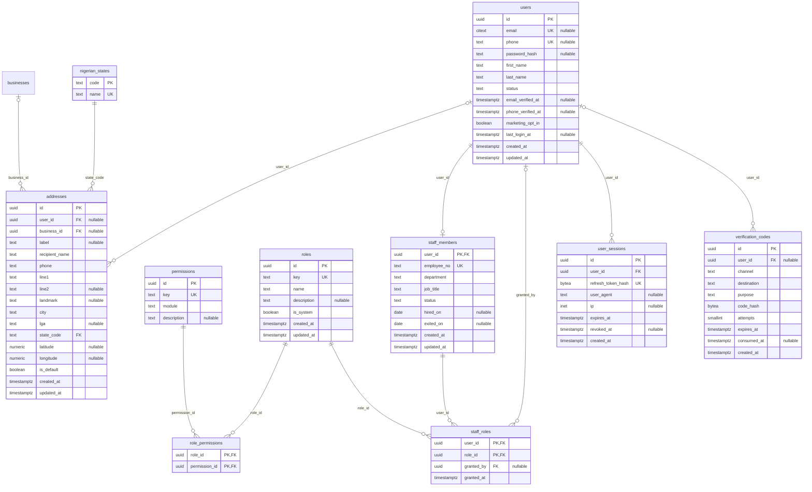
```mermaid
erDiagram
  addresses {
    uuid id PK
    uuid user_id FK "nullable"
    uuid business_id FK "nullable"
    text label "nullable"
    text recipient_name
    text phone
    text line1
    text line2 "nullable"
    text landmark "nullable"
    text city
    text lga "nullable"
    text state_code FK
    numeric latitude "nullable"
    numeric longitude "nullable"
    boolean is_default
    timestamptz created_at
    timestamptz updated_at
  }
  nigerian_states {
    text code PK
    text name UK
  }
  permissions {
    uuid id PK
    text key UK
    text module
    text description "nullable"
  }
  role_permissions {
    uuid role_id PK, FK
    uuid permission_id PK, FK
  }
  roles {
    uuid id PK
    text key UK
    text name
    text description "nullable"
    boolean is_system
    timestamptz created_at
    timestamptz updated_at
  }
  staff_members {
    uuid user_id PK, FK
    text employee_no UK
    text department
    text job_title
    text status
    date hired_on "nullable"
    date exited_on "nullable"
    timestamptz created_at
    timestamptz updated_at
  }
  staff_roles {
    uuid user_id PK, FK
    uuid role_id PK, FK
    uuid granted_by FK "nullable"
    timestamptz granted_at
  }
  user_sessions {
    uuid id PK
    uuid user_id FK
    bytea refresh_token_hash UK
    text user_agent "nullable"
    inet ip "nullable"
    timestamptz expires_at
    timestamptz revoked_at "nullable"
    timestamptz created_at
  }
  users {
    uuid id PK
    citext email UK "nullable"
    text phone UK "nullable"
    text password_hash "nullable"
    text first_name
    text last_name
    text status
    timestamptz email_verified_at "nullable"
    timestamptz phone_verified_at "nullable"
    boolean marketing_opt_in
    timestamptz last_login_at "nullable"
    timestamptz created_at
    timestamptz updated_at
  }
  verification_codes {
    uuid id PK
    uuid user_id FK "nullable"
    text channel
    text destination
    text purpose
    bytea code_hash
    smallint attempts
    timestamptz expires_at
    timestamptz consumed_at "nullable"
    timestamptz created_at
  }
  businesses |o--o{ addresses : "business_id"
  nigerian_states ||--o{ addresses : "state_code"
  users |o--o{ addresses : "user_id"
  permissions ||--o{ role_permissions : "permission_id"
  roles ||--o{ role_permissions : "role_id"
  users ||--o| staff_members : "user_id"
  users |o--o{ staff_roles : "granted_by"
  roles ||--o{ staff_roles : "role_id"
  staff_members ||--o{ staff_roles : "user_id"
  users ||--o{ user_sessions : "user_id"
  users |o--o{ verification_codes : "user_id"
```

## Sellers & businesses

- `business_members`: Users who buy or pay on behalf of a business.
- `businesses`: B2B buyer organisations (wholesale site): trade pricing, VAT invoices, credit.
- `credit_accounts`: Pay-on-invoice credit for approved businesses (limit and payment term).
- `files`: Uploaded files (product photos, KYC documents, proofs of delivery, invoices). Bytes live in object storage.
- `kyc_documents`: Documents uploaded with a KYC submission.
- `seller_bank_accounts`: Payout bank accounts (NUBAN encrypted, last 4 shown).
- `seller_kyc_submissions`: Identity / business verification applications. ID numbers encrypted by the API (NDPA).
- `seller_members`: Users who can act for a seller in the Seller Centre.
- `sellers`: Everyone who sells: TechShop itself (first_party), marketplace businesses and individuals.

Links to other domains: `nigerian_states`, `staff_members`, `users` (shown without columns).

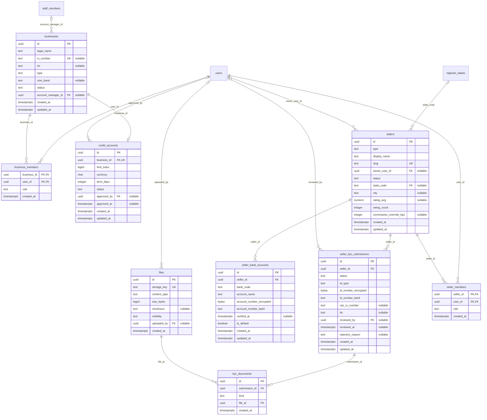
```mermaid
erDiagram
  business_members {
    uuid business_id PK, FK
    uuid user_id PK, FK
    text role
    timestamptz created_at
  }
  businesses {
    uuid id PK
    text legal_name
    text rc_number UK "nullable"
    text tin "nullable"
    text type
    text size_band "nullable"
    text status
    uuid account_manager_id FK "nullable"
    timestamptz created_at
    timestamptz updated_at
  }
  credit_accounts {
    uuid id PK
    uuid business_id FK, UK
    bigint limit_kobo
    char currency
    integer term_days
    text status
    uuid approved_by FK "nullable"
    timestamptz approved_at "nullable"
    timestamptz created_at
    timestamptz updated_at
  }
  files {
    uuid id PK
    text storage_key UK
    text content_type
    bigint size_bytes
    text checksum "nullable"
    text visibility
    uuid uploaded_by FK "nullable"
    timestamptz created_at
  }
  kyc_documents {
    uuid id PK
    uuid submission_id FK
    text kind
    uuid file_id FK
    timestamptz created_at
  }
  seller_bank_accounts {
    uuid id PK
    uuid seller_id FK
    text bank_code
    text account_name
    bytea account_number_encrypted
    text account_number_last4
    timestamptz verified_at "nullable"
    boolean is_default
    timestamptz created_at
    timestamptz updated_at
  }
  seller_kyc_submissions {
    uuid id PK
    uuid seller_id FK
    text status
    text id_type
    bytea id_number_encrypted
    text id_number_last4
    text cac_rc_number "nullable"
    text tin "nullable"
    uuid reviewed_by FK "nullable"
    timestamptz reviewed_at "nullable"
    text rejection_reason "nullable"
    timestamptz created_at
    timestamptz updated_at
  }
  seller_members {
    uuid seller_id PK, FK
    uuid user_id PK, FK
    text role
    timestamptz created_at
  }
  sellers {
    uuid id PK
    text type
    text display_name
    text slug UK
    uuid owner_user_id FK "nullable"
    text status
    text state_code FK "nullable"
    text city "nullable"
    numeric rating_avg "nullable"
    integer rating_count
    integer commission_override_bps "nullable"
    timestamptz created_at
    timestamptz updated_at
  }
  businesses ||--o{ business_members : "business_id"
  users ||--o{ business_members : "user_id"
  staff_members |o--o{ businesses : "account_manager_id"
  users |o--o{ credit_accounts : "approved_by"
  businesses ||--o| credit_accounts : "business_id"
  users |o--o{ files : "uploaded_by"
  files ||--o{ kyc_documents : "file_id"
  seller_kyc_submissions ||--o{ kyc_documents : "submission_id"
  sellers ||--o{ seller_bank_accounts : "seller_id"
  users |o--o{ seller_kyc_submissions : "reviewed_by"
  sellers ||--o{ seller_kyc_submissions : "seller_id"
  sellers ||--o{ seller_members : "seller_id"
  users ||--o{ seller_members : "user_id"
  users |o--o{ sellers : "owner_user_id"
  nigerian_states |o--o{ sellers : "state_code"
```

## Catalogue

- `attribute_definitions`: Spec fields per category (RAM, storage, GPU…): drive spec tables, filters and variant axes.
- `brands`: Manufacturers / brands.
- `categories`: Category tree (Phones → Android…). kind = vehicle routes cars to the car tables.
- `listing_price_history`: Every price change. Proves discounts are genuine (FCCPA) and feeds analytics.
- `listings`: A seller's offer on a variant: condition, price, stock, warranty. TechShop stock is a first_party listing.
- `price_tiers`: Wholesale quantity breaks: unit price from min_quantity upward.
- `product_attribute_values`: Spec values for a product (one typed value per attribute).
- `product_images`: Product photos (optionally per variant); alt text required.
- `product_variants`: Purchasable configurations of a product, e.g. 256GB · Titanium.
- `products`: Catalogue entries (model level). Sold through listings on its variants.
- `saved_items`: Customers' saved products (the heart button).

Links to other domains: `files`, `sellers`, `users` (shown without columns).

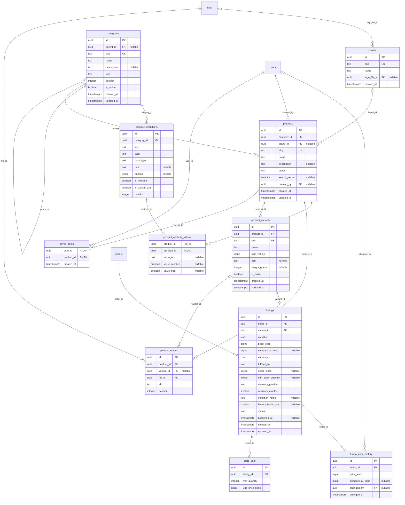
```mermaid
erDiagram
  attribute_definitions {
    uuid id PK
    uuid category_id FK
    text key
    text label
    text data_type
    text unit "nullable"
    jsonb options "nullable"
    boolean is_filterable
    boolean is_variant_axis
    integer position
  }
  brands {
    uuid id PK
    text slug UK
    text name
    uuid logo_file_id FK "nullable"
    timestamptz created_at
  }
  categories {
    uuid id PK
    uuid parent_id FK "nullable"
    text slug UK
    text name
    text description "nullable"
    text kind
    integer position
    boolean is_active
    timestamptz created_at
    timestamptz updated_at
  }
  listing_price_history {
    uuid id PK
    uuid listing_id FK
    bigint price_kobo
    bigint compare_at_kobo "nullable"
    uuid changed_by FK "nullable"
    timestamptz changed_at
  }
  listings {
    uuid id PK
    uuid seller_id FK
    uuid variant_id FK
    text condition
    bigint price_kobo
    bigint compare_at_kobo "nullable"
    char currency
    text fulfilled_by
    integer seller_stock "nullable"
    integer min_order_quantity "nullable"
    text warranty_provider
    smallint warranty_months
    text condition_notes "nullable"
    smallint battery_health_pct "nullable"
    text status
    timestamptz published_at "nullable"
    timestamptz created_at
    timestamptz updated_at
  }
  price_tiers {
    uuid id PK
    uuid listing_id FK
    integer min_quantity
    bigint unit_price_kobo
  }
  product_attribute_values {
    uuid product_id PK, FK
    uuid attribute_id PK, FK
    text value_text "nullable"
    numeric value_number "nullable"
    boolean value_bool "nullable"
  }
  product_images {
    uuid id PK
    uuid product_id FK
    uuid variant_id FK "nullable"
    uuid file_id FK
    text alt
    integer position
  }
  product_variants {
    uuid id PK
    uuid product_id FK
    text sku UK
    text name
    jsonb axis_values
    text gtin "nullable"
    integer weight_grams "nullable"
    boolean is_active
    timestamptz created_at
    timestamptz updated_at
  }
  products {
    uuid id PK
    uuid category_id FK
    uuid brand_id FK "nullable"
    text slug UK
    text name
    text description "nullable"
    text status
    tsvector search_vector "nullable"
    uuid created_by FK "nullable"
    timestamptz created_at
    timestamptz updated_at
  }
  saved_items {
    uuid user_id PK, FK
    uuid product_id PK, FK
    timestamptz created_at
  }
  categories ||--o{ attribute_definitions : "category_id"
  files |o--o{ brands : "logo_file_id"
  categories |o--o{ categories : "parent_id"
  users |o--o{ listing_price_history : "changed_by"
  listings ||--o{ listing_price_history : "listing_id"
  sellers ||--o{ listings : "seller_id"
  product_variants ||--o{ listings : "variant_id"
  listings ||--o{ price_tiers : "listing_id"
  attribute_definitions ||--o{ product_attribute_values : "attribute_id"
  products ||--o{ product_attribute_values : "product_id"
  files ||--o{ product_images : "file_id"
  products ||--o{ product_images : "product_id"
  product_variants |o--o{ product_images : "variant_id"
  products ||--o{ product_variants : "product_id"
  brands |o--o{ products : "brand_id"
  categories ||--o{ products : "category_id"
  users |o--o{ products : "created_by"
  products ||--o{ saved_items : "product_id"
  users ||--o{ saved_items : "user_id"
```

## Inventory

- `device_units`: Individually tracked devices (IMEI/serial): warranty, returns, theft checks, trade-ins.
- `inventory_levels`: Current stock per location × variant × condition (derived from stock_movements).
- `stock_movements`: Append-only stock ledger; every change to inventory_levels has a movement.
- `stock_transfer_lines`: Items in a stock transfer.
- `stock_transfers`: Moving stock between locations.
- `warehouses`: Physical locations: warehouses, retail stores (POS) and dispatch hubs.

Links to other domains: `nigerian_states`, `product_variants`, `users` (shown without columns).

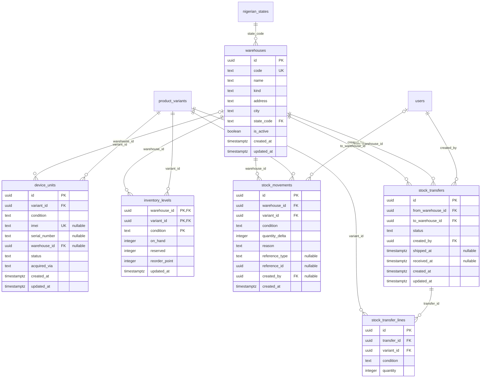
```mermaid
erDiagram
  device_units {
    uuid id PK
    uuid variant_id FK
    text condition
    text imei UK "nullable"
    text serial_number "nullable"
    uuid warehouse_id FK "nullable"
    text status
    text acquired_via
    timestamptz created_at
    timestamptz updated_at
  }
  inventory_levels {
    uuid warehouse_id PK, FK
    uuid variant_id PK, FK
    text condition PK
    integer on_hand
    integer reserved
    integer reorder_point
    timestamptz updated_at
  }
  stock_movements {
    uuid id PK
    uuid warehouse_id FK
    uuid variant_id FK
    text condition
    integer quantity_delta
    text reason
    text reference_type "nullable"
    uuid reference_id "nullable"
    uuid created_by FK "nullable"
    timestamptz created_at
  }
  stock_transfer_lines {
    uuid id PK
    uuid transfer_id FK
    uuid variant_id FK
    text condition
    integer quantity
  }
  stock_transfers {
    uuid id PK
    uuid from_warehouse_id FK
    uuid to_warehouse_id FK
    text status
    uuid created_by FK
    timestamptz shipped_at "nullable"
    timestamptz received_at "nullable"
    timestamptz created_at
    timestamptz updated_at
  }
  warehouses {
    uuid id PK
    text code UK
    text name
    text kind
    text address
    text city
    text state_code FK
    boolean is_active
    timestamptz created_at
    timestamptz updated_at
  }
  product_variants ||--o{ device_units : "variant_id"
  warehouses |o--o{ device_units : "warehouse_id"
  product_variants ||--o{ inventory_levels : "variant_id"
  warehouses ||--o{ inventory_levels : "warehouse_id"
  users |o--o{ stock_movements : "created_by"
  product_variants ||--o{ stock_movements : "variant_id"
  warehouses ||--o{ stock_movements : "warehouse_id"
  stock_transfers ||--o{ stock_transfer_lines : "transfer_id"
  product_variants ||--o{ stock_transfer_lines : "variant_id"
  users ||--o{ stock_transfers : "created_by"
  warehouses ||--o{ stock_transfers : "from_warehouse_id"
  warehouses ||--o{ stock_transfers : "to_warehouse_id"
  nigerian_states ||--o{ warehouses : "state_code"
```

## Purchasing

- `goods_receipts`: A delivery received against a PO; posts stock_movements (reason purchase_receipt).
- `purchase_order_lines`: Items, quantities and costs on a purchase order.
- `purchase_orders`: Orders placed with suppliers, delivered to a warehouse.
- `suppliers`: Companies TechShop buys stock from.

Links to other domains: `product_variants`, `users`, `warehouses` (shown without columns).

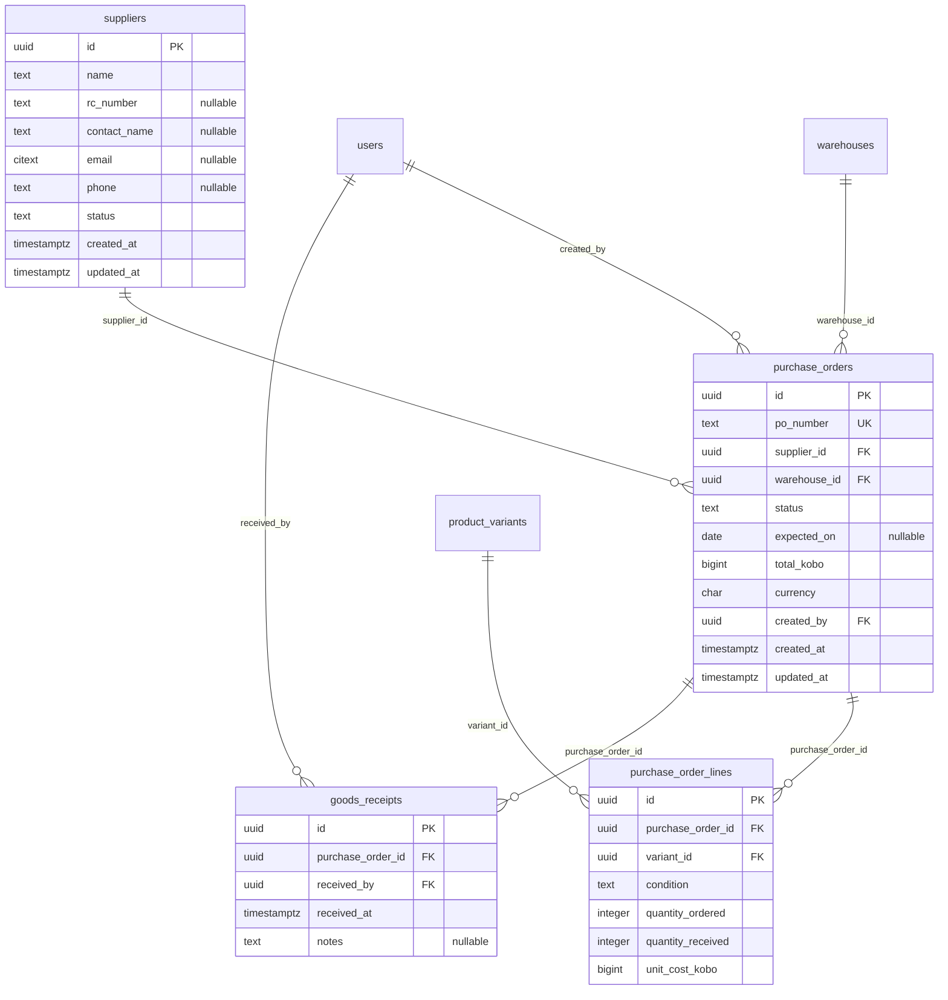
```mermaid
erDiagram
  goods_receipts {
    uuid id PK
    uuid purchase_order_id FK
    uuid received_by FK
    timestamptz received_at
    text notes "nullable"
  }
  purchase_order_lines {
    uuid id PK
    uuid purchase_order_id FK
    uuid variant_id FK
    text condition
    integer quantity_ordered
    integer quantity_received
    bigint unit_cost_kobo
  }
  purchase_orders {
    uuid id PK
    text po_number UK
    uuid supplier_id FK
    uuid warehouse_id FK
    text status
    date expected_on "nullable"
    bigint total_kobo
    char currency
    uuid created_by FK
    timestamptz created_at
    timestamptz updated_at
  }
  suppliers {
    uuid id PK
    text name
    text rc_number "nullable"
    text contact_name "nullable"
    citext email "nullable"
    text phone "nullable"
    text status
    timestamptz created_at
    timestamptz updated_at
  }
  purchase_orders ||--o{ goods_receipts : "purchase_order_id"
  users ||--o{ goods_receipts : "received_by"
  purchase_orders ||--o{ purchase_order_lines : "purchase_order_id"
  product_variants ||--o{ purchase_order_lines : "variant_id"
  users ||--o{ purchase_orders : "created_by"
  suppliers ||--o{ purchase_orders : "supplier_id"
  warehouses ||--o{ purchase_orders : "warehouse_id"
```

## Point of sale

- `pos_shifts`: A cashier's shift on a till, with cash reconciliation. POS sales are orders with channel pos.
- `pos_terminals`: Tills in physical stores (warehouses of kind store).

Links to other domains: `staff_members`, `warehouses` (shown without columns).

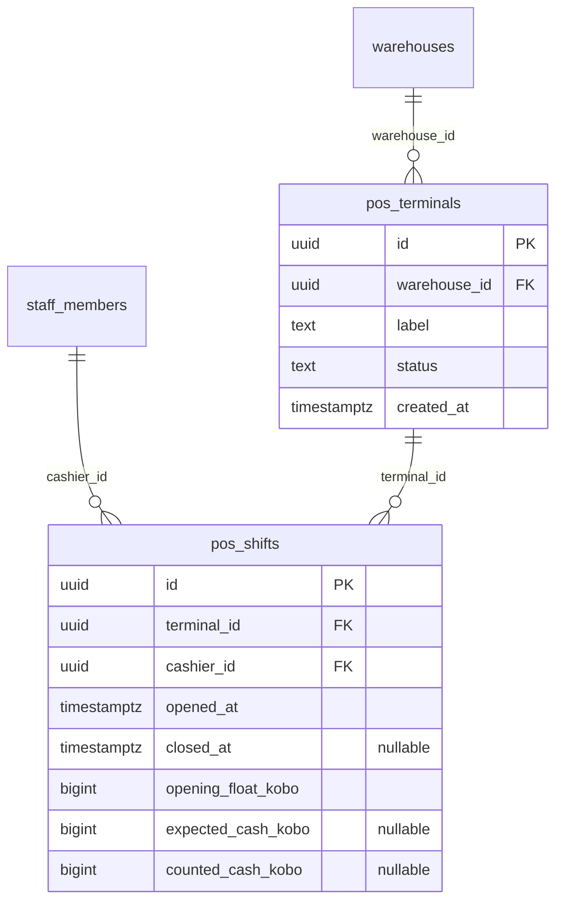
```mermaid
erDiagram
  pos_shifts {
    uuid id PK
    uuid terminal_id FK
    uuid cashier_id FK
    timestamptz opened_at
    timestamptz closed_at "nullable"
    bigint opening_float_kobo
    bigint expected_cash_kobo "nullable"
    bigint counted_cash_kobo "nullable"
  }
  pos_terminals {
    uuid id PK
    uuid warehouse_id FK
    text label
    text status
    timestamptz created_at
  }
  staff_members ||--o{ pos_shifts : "cashier_id"
  pos_terminals ||--o{ pos_shifts : "terminal_id"
  warehouses ||--o{ pos_terminals : "warehouse_id"
```

## Sales

- `cart_items`: Listings in a cart. Prices are read live; they are snapshotted only on order lines.
- `carts`: Shopping carts for signed-in users or guests (by session).
- `fulfilments`: The part of an order shipped by one seller. Drives delivery, seller earnings and payouts.
- `invoices`: B2B VAT invoices; on credit terms they are paid later against due_at.
- `order_lines`: Snapshot of what was bought (name, price, condition, commission), optionally the exact device unit.
- `order_status_history`: Every order status change and who made it (shown on order tracking).
- `orders`: One checkout. Totals must add up; ship_to is a snapshot of the address used.
- `product_reviews`: Verified-purchase reviews only: each review is tied to the order line that was bought.
- `quote_lines`: Requested items (listed or free text) and their quoted unit prices.
- `quotes`: B2B quote requests and the priced quotes sent back.
- `seller_ratings`: Customer rating of a seller per delivered fulfilment; aggregated onto sellers.rating_avg.

Links to other domains: `businesses`, `device_units`, `files`, `listings`, `nigerian_states`, `pos_shifts`, `product_variants`, `products`, `sellers`, `staff_members`, `users`, `warehouses` (shown without columns).

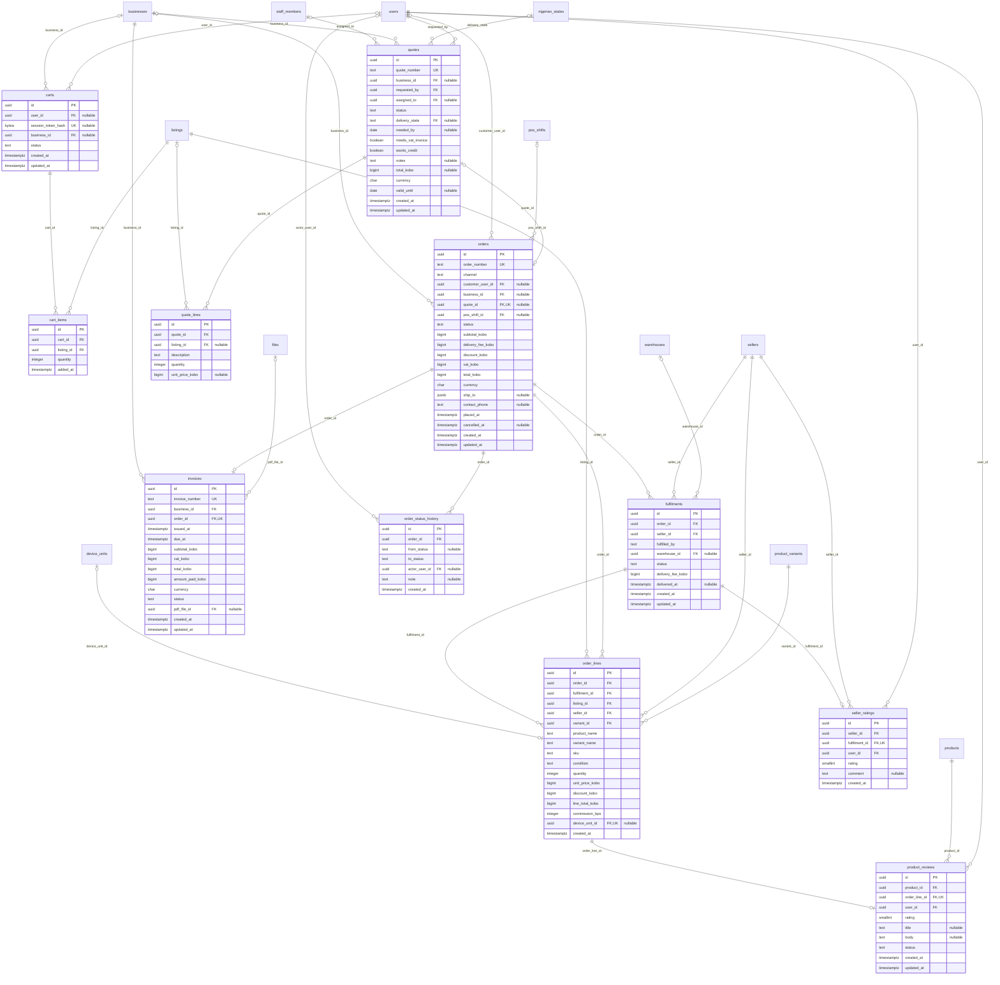
```mermaid
erDiagram
  cart_items {
    uuid id PK
    uuid cart_id FK
    uuid listing_id FK
    integer quantity
    timestamptz added_at
  }
  carts {
    uuid id PK
    uuid user_id FK "nullable"
    bytea session_token_hash UK "nullable"
    uuid business_id FK "nullable"
    text status
    timestamptz created_at
    timestamptz updated_at
  }
  fulfilments {
    uuid id PK
    uuid order_id FK
    uuid seller_id FK
    text fulfilled_by
    uuid warehouse_id FK "nullable"
    text status
    bigint delivery_fee_kobo
    timestamptz delivered_at "nullable"
    timestamptz created_at
    timestamptz updated_at
  }
  invoices {
    uuid id PK
    text invoice_number UK
    uuid business_id FK
    uuid order_id FK, UK
    timestamptz issued_at
    timestamptz due_at
    bigint subtotal_kobo
    bigint vat_kobo
    bigint total_kobo
    bigint amount_paid_kobo
    char currency
    text status
    uuid pdf_file_id FK "nullable"
    timestamptz created_at
    timestamptz updated_at
  }
  order_lines {
    uuid id PK
    uuid order_id FK
    uuid fulfilment_id FK
    uuid listing_id FK
    uuid seller_id FK
    uuid variant_id FK
    text product_name
    text variant_name
    text sku
    text condition
    integer quantity
    bigint unit_price_kobo
    bigint discount_kobo
    bigint line_total_kobo
    integer commission_bps
    uuid device_unit_id FK, UK "nullable"
    timestamptz created_at
  }
  order_status_history {
    uuid id PK
    uuid order_id FK
    text from_status "nullable"
    text to_status
    uuid actor_user_id FK "nullable"
    text note "nullable"
    timestamptz created_at
  }
  orders {
    uuid id PK
    text order_number UK
    text channel
    uuid customer_user_id FK "nullable"
    uuid business_id FK "nullable"
    uuid quote_id FK, UK "nullable"
    uuid pos_shift_id FK "nullable"
    text status
    bigint subtotal_kobo
    bigint delivery_fee_kobo
    bigint discount_kobo
    bigint vat_kobo
    bigint total_kobo
    char currency
    jsonb ship_to "nullable"
    text contact_phone "nullable"
    timestamptz placed_at
    timestamptz cancelled_at "nullable"
    timestamptz created_at
    timestamptz updated_at
  }
  product_reviews {
    uuid id PK
    uuid product_id FK
    uuid order_line_id FK, UK
    uuid user_id FK
    smallint rating
    text title "nullable"
    text body "nullable"
    text status
    timestamptz created_at
    timestamptz updated_at
  }
  quote_lines {
    uuid id PK
    uuid quote_id FK
    uuid listing_id FK "nullable"
    text description
    integer quantity
    bigint unit_price_kobo "nullable"
  }
  quotes {
    uuid id PK
    text quote_number UK
    uuid business_id FK "nullable"
    uuid requested_by FK
    uuid assigned_to FK "nullable"
    text status
    text delivery_state FK "nullable"
    date needed_by "nullable"
    boolean needs_vat_invoice
    boolean wants_credit
    text notes "nullable"
    bigint total_kobo "nullable"
    char currency
    date valid_until "nullable"
    timestamptz created_at
    timestamptz updated_at
  }
  seller_ratings {
    uuid id PK
    uuid seller_id FK
    uuid fulfilment_id FK, UK
    uuid user_id FK
    smallint rating
    text comment "nullable"
    timestamptz created_at
  }
  carts ||--o{ cart_items : "cart_id"
  listings ||--o{ cart_items : "listing_id"
  businesses |o--o{ carts : "business_id"
  users |o--o{ carts : "user_id"
  orders ||--o{ fulfilments : "order_id"
  sellers ||--o{ fulfilments : "seller_id"
  warehouses |o--o{ fulfilments : "warehouse_id"
  businesses ||--o{ invoices : "business_id"
  orders ||--o| invoices : "order_id"
  files |o--o{ invoices : "pdf_file_id"
  device_units |o--o| order_lines : "device_unit_id"
  fulfilments ||--o{ order_lines : "fulfilment_id"
  listings ||--o{ order_lines : "listing_id"
  orders ||--o{ order_lines : "order_id"
  sellers ||--o{ order_lines : "seller_id"
  product_variants ||--o{ order_lines : "variant_id"
  users |o--o{ order_status_history : "actor_user_id"
  orders ||--o{ order_status_history : "order_id"
  businesses |o--o{ orders : "business_id"
  users |o--o{ orders : "customer_user_id"
  pos_shifts |o--o{ orders : "pos_shift_id"
  quotes |o--o| orders : "quote_id"
  order_lines ||--o| product_reviews : "order_line_id"
  products ||--o{ product_reviews : "product_id"
  users ||--o{ product_reviews : "user_id"
  listings |o--o{ quote_lines : "listing_id"
  quotes ||--o{ quote_lines : "quote_id"
  staff_members |o--o{ quotes : "assigned_to"
  businesses |o--o{ quotes : "business_id"
  nigerian_states |o--o{ quotes : "delivery_state"
  users ||--o{ quotes : "requested_by"
  fulfilments ||--o| seller_ratings : "fulfilment_id"
  sellers ||--o{ seller_ratings : "seller_id"
  users ||--o{ seller_ratings : "user_id"
```

## Payments & money

- `commission_rules`: Marketplace commission (basis points) by category and/or seller; the rate is snapshotted on order lines.
- `ledger_accounts`: Chart of accounts: provider clearing, seller payables (one per seller), commission, delivery, VAT, refunds.
- `ledger_entries`: Double-entry lines: positive = debit, negative = credit. Balanced per journal (deferred trigger).
- `ledger_journals`: One accounting event (e.g. a sale). Its entries must sum to zero.
- `payment_events`: Raw provider webhooks; unique per provider event so retries are processed once.
- `payments`: A charge for an order or an invoice through a provider. Card data is never stored.
- `payout_items`: Which delivered fulfilments a payout covers; each fulfilment is paid out once.
- `payouts`: Transfers of earnings to a seller's bank account.
- `refunds`: Money returned to a customer against a payment (full or partial).

Links to other domains: `categories`, `fulfilments`, `invoices`, `orders`, `return_requests`, `seller_bank_accounts`, `sellers`, `users` (shown without columns).

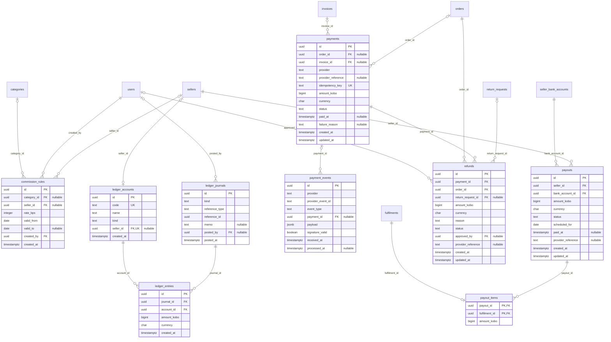
```mermaid
erDiagram
  commission_rules {
    uuid id PK
    uuid category_id FK "nullable"
    uuid seller_id FK "nullable"
    integer rate_bps
    date valid_from
    date valid_to "nullable"
    uuid created_by FK
    timestamptz created_at
  }
  ledger_accounts {
    uuid id PK
    text code UK
    text name
    text kind
    uuid seller_id FK, UK "nullable"
    timestamptz created_at
  }
  ledger_entries {
    uuid id PK
    uuid journal_id FK
    uuid account_id FK
    bigint amount_kobo
    char currency
    timestamptz created_at
  }
  ledger_journals {
    uuid id PK
    text kind
    text reference_type
    uuid reference_id
    text memo "nullable"
    uuid posted_by FK "nullable"
    timestamptz posted_at
  }
  payment_events {
    uuid id PK
    text provider
    text provider_event_id
    text event_type
    uuid payment_id FK "nullable"
    jsonb payload
    boolean signature_valid
    timestamptz received_at
    timestamptz processed_at "nullable"
  }
  payments {
    uuid id PK
    uuid order_id FK "nullable"
    uuid invoice_id FK "nullable"
    text provider
    text provider_reference "nullable"
    text idempotency_key UK
    bigint amount_kobo
    char currency
    text status
    timestamptz paid_at "nullable"
    text failure_reason "nullable"
    timestamptz created_at
    timestamptz updated_at
  }
  payout_items {
    uuid payout_id PK, FK
    uuid fulfilment_id PK, FK
    bigint amount_kobo
  }
  payouts {
    uuid id PK
    uuid seller_id FK
    uuid bank_account_id FK
    bigint amount_kobo
    char currency
    text status
    date scheduled_for
    timestamptz paid_at "nullable"
    text provider_reference "nullable"
    timestamptz created_at
    timestamptz updated_at
  }
  refunds {
    uuid id PK
    uuid payment_id FK
    uuid order_id FK
    uuid return_request_id FK "nullable"
    bigint amount_kobo
    char currency
    text reason
    text status
    uuid approved_by FK "nullable"
    text provider_reference "nullable"
    timestamptz created_at
    timestamptz updated_at
  }
  categories |o--o{ commission_rules : "category_id"
  users ||--o{ commission_rules : "created_by"
  sellers |o--o{ commission_rules : "seller_id"
  sellers |o--o| ledger_accounts : "seller_id"
  ledger_accounts ||--o{ ledger_entries : "account_id"
  ledger_journals ||--o{ ledger_entries : "journal_id"
  users |o--o{ ledger_journals : "posted_by"
  payments |o--o{ payment_events : "payment_id"
  invoices |o--o{ payments : "invoice_id"
  orders |o--o{ payments : "order_id"
  fulfilments ||--o| payout_items : "fulfilment_id"
  payouts ||--o{ payout_items : "payout_id"
  seller_bank_accounts ||--o{ payouts : "bank_account_id"
  sellers ||--o{ payouts : "seller_id"
  users |o--o{ refunds : "approved_by"
  orders ||--o{ refunds : "order_id"
  payments ||--o{ refunds : "payment_id"
  return_requests |o--o{ refunds : "return_request_id"
```

## Logistics

- `delivery_events`: Append-only tracking trail for a delivery job (shown to customers and dispatch).
- `delivery_jobs`: A delivery run for a fulfilment. Delivered requires OTP or photo proof.
- `delivery_rates`: Delivery fee and ETA per zone and weight band.
- `delivery_zones`: Delivery areas (state + LGAs) used for fees, ETAs and rider assignment.
- `riders`: Dispatch riders (staff using the logistics app).

Links to other domains: `files`, `fulfilments`, `nigerian_states`, `staff_members`, `users`, `warehouses` (shown without columns).

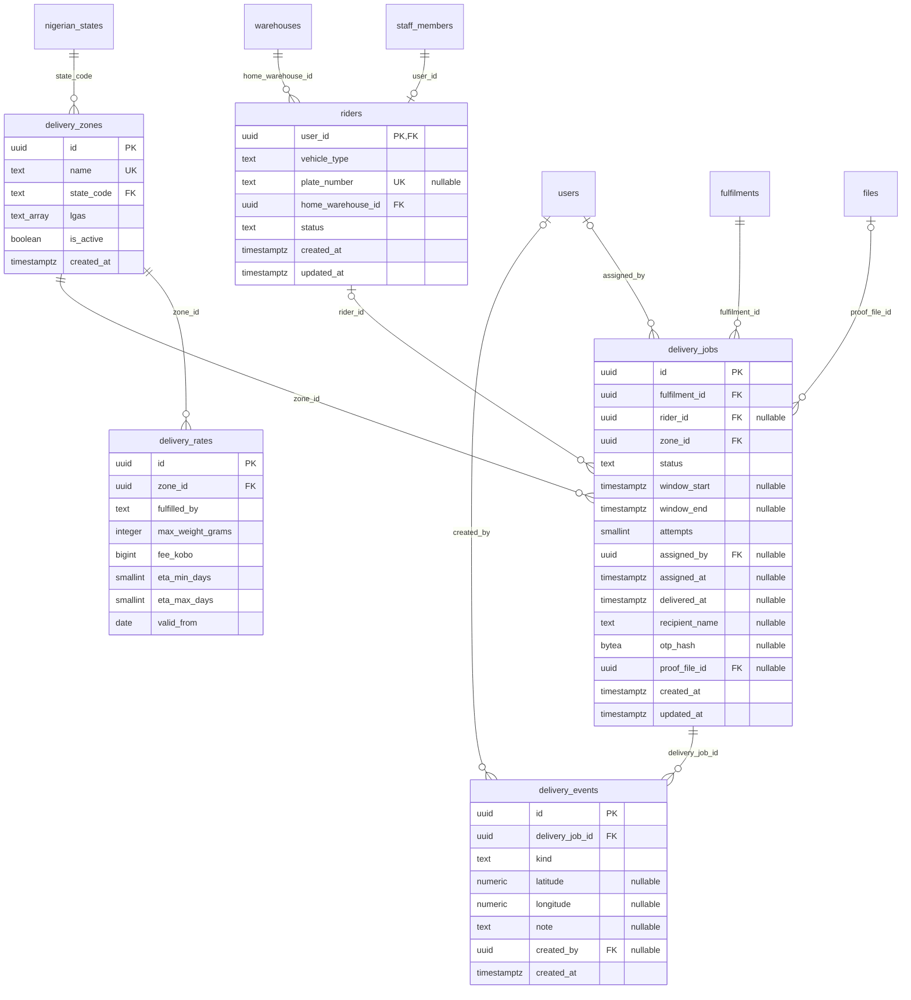
```mermaid
erDiagram
  delivery_events {
    uuid id PK
    uuid delivery_job_id FK
    text kind
    numeric latitude "nullable"
    numeric longitude "nullable"
    text note "nullable"
    uuid created_by FK "nullable"
    timestamptz created_at
  }
  delivery_jobs {
    uuid id PK
    uuid fulfilment_id FK
    uuid rider_id FK "nullable"
    uuid zone_id FK
    text status
    timestamptz window_start "nullable"
    timestamptz window_end "nullable"
    smallint attempts
    uuid assigned_by FK "nullable"
    timestamptz assigned_at "nullable"
    timestamptz delivered_at "nullable"
    text recipient_name "nullable"
    bytea otp_hash "nullable"
    uuid proof_file_id FK "nullable"
    timestamptz created_at
    timestamptz updated_at
  }
  delivery_rates {
    uuid id PK
    uuid zone_id FK
    text fulfilled_by
    integer max_weight_grams
    bigint fee_kobo
    smallint eta_min_days
    smallint eta_max_days
    date valid_from
  }
  delivery_zones {
    uuid id PK
    text name UK
    text state_code FK
    text_array lgas
    boolean is_active
    timestamptz created_at
  }
  riders {
    uuid user_id PK, FK
    text vehicle_type
    text plate_number UK "nullable"
    uuid home_warehouse_id FK
    text status
    timestamptz created_at
    timestamptz updated_at
  }
  users |o--o{ delivery_events : "created_by"
  delivery_jobs ||--o{ delivery_events : "delivery_job_id"
  users |o--o{ delivery_jobs : "assigned_by"
  fulfilments ||--o{ delivery_jobs : "fulfilment_id"
  files |o--o{ delivery_jobs : "proof_file_id"
  riders |o--o{ delivery_jobs : "rider_id"
  delivery_zones ||--o{ delivery_jobs : "zone_id"
  delivery_zones ||--o{ delivery_rates : "zone_id"
  nigerian_states ||--o{ delivery_zones : "state_code"
  warehouses ||--o{ riders : "home_warehouse_id"
  staff_members ||--o| riders : "user_id"
```

## After-sales

- `repair_jobs`: Workshop jobs for warranty claims, paid repairs and refurbishment.
- `return_items`: Which order lines (and how many) are being returned.
- `return_requests`: Customer return requests (RMA) and their outcome.
- `trade_ins`: Trade-in requests from estimate to inspection, offer and payout; accepted devices become device_units.
- `warranty_claims`: Warranty claims, identified by IMEI/serial.

Links to other domains: `device_units`, `order_lines`, `orders`, `staff_members`, `users` (shown without columns).

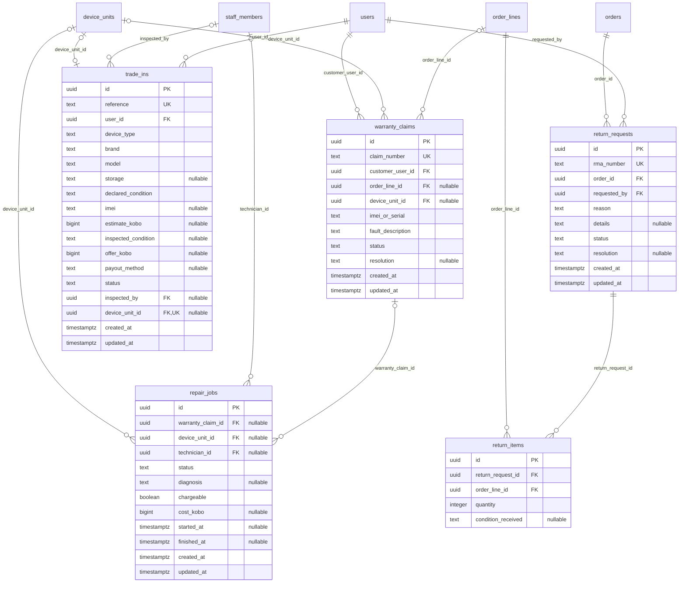
```mermaid
erDiagram
  repair_jobs {
    uuid id PK
    uuid warranty_claim_id FK "nullable"
    uuid device_unit_id FK "nullable"
    uuid technician_id FK "nullable"
    text status
    text diagnosis "nullable"
    boolean chargeable
    bigint cost_kobo "nullable"
    timestamptz started_at "nullable"
    timestamptz finished_at "nullable"
    timestamptz created_at
    timestamptz updated_at
  }
  return_items {
    uuid id PK
    uuid return_request_id FK
    uuid order_line_id FK
    integer quantity
    text condition_received "nullable"
  }
  return_requests {
    uuid id PK
    text rma_number UK
    uuid order_id FK
    uuid requested_by FK
    text reason
    text details "nullable"
    text status
    text resolution "nullable"
    timestamptz created_at
    timestamptz updated_at
  }
  trade_ins {
    uuid id PK
    text reference UK
    uuid user_id FK
    text device_type
    text brand
    text model
    text storage "nullable"
    text declared_condition
    text imei "nullable"
    bigint estimate_kobo "nullable"
    text inspected_condition "nullable"
    bigint offer_kobo "nullable"
    text payout_method "nullable"
    text status
    uuid inspected_by FK "nullable"
    uuid device_unit_id FK, UK "nullable"
    timestamptz created_at
    timestamptz updated_at
  }
  warranty_claims {
    uuid id PK
    text claim_number UK
    uuid customer_user_id FK
    uuid order_line_id FK "nullable"
    uuid device_unit_id FK "nullable"
    text imei_or_serial
    text fault_description
    text status
    text resolution "nullable"
    timestamptz created_at
    timestamptz updated_at
  }
  device_units |o--o{ repair_jobs : "device_unit_id"
  staff_members |o--o{ repair_jobs : "technician_id"
  warranty_claims |o--o{ repair_jobs : "warranty_claim_id"
  order_lines ||--o{ return_items : "order_line_id"
  return_requests ||--o{ return_items : "return_request_id"
  orders ||--o{ return_requests : "order_id"
  users ||--o{ return_requests : "requested_by"
  device_units |o--o| trade_ins : "device_unit_id"
  staff_members |o--o{ trade_ins : "inspected_by"
  users ||--o{ trade_ins : "user_id"
  users ||--o{ warranty_claims : "customer_user_id"
  device_units |o--o{ warranty_claims : "device_unit_id"
  order_lines |o--o{ warranty_claims : "order_line_id"
```

## Cars

- `car_documents`: Ownership and import documents, verified by staff.
- `car_images`: Photos of a car listing.
- `car_inspections`: Inspection reports (engine, brakes, body, electricals, documents/VIN).
- `car_listings`: Cars for sale (separate from products): viewing and inspection flow, never add-to-cart.
- `financing_enquiries`: Car financing enquiries, referred to finance partners.
- `viewing_bookings`: Requests to see a car (the Book a viewing form).

Links to other domains: `files`, `nigerian_states`, `sellers`, `staff_members`, `users` (shown without columns).

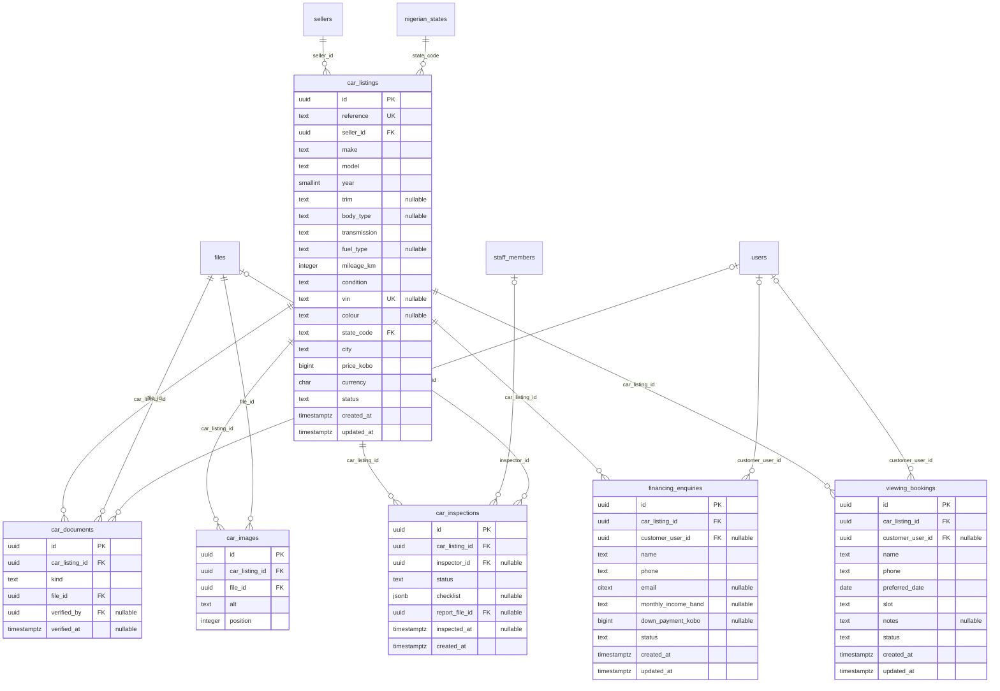
```mermaid
erDiagram
  car_documents {
    uuid id PK
    uuid car_listing_id FK
    text kind
    uuid file_id FK
    uuid verified_by FK "nullable"
    timestamptz verified_at "nullable"
  }
  car_images {
    uuid id PK
    uuid car_listing_id FK
    uuid file_id FK
    text alt
    integer position
  }
  car_inspections {
    uuid id PK
    uuid car_listing_id FK
    uuid inspector_id FK "nullable"
    text status
    jsonb checklist "nullable"
    uuid report_file_id FK "nullable"
    timestamptz inspected_at "nullable"
    timestamptz created_at
  }
  car_listings {
    uuid id PK
    text reference UK
    uuid seller_id FK
    text make
    text model
    smallint year
    text trim "nullable"
    text body_type "nullable"
    text transmission
    text fuel_type "nullable"
    integer mileage_km
    text condition
    text vin UK "nullable"
    text colour "nullable"
    text state_code FK
    text city
    bigint price_kobo
    char currency
    text status
    timestamptz created_at
    timestamptz updated_at
  }
  financing_enquiries {
    uuid id PK
    uuid car_listing_id FK
    uuid customer_user_id FK "nullable"
    text name
    text phone
    citext email "nullable"
    text monthly_income_band "nullable"
    bigint down_payment_kobo "nullable"
    text status
    timestamptz created_at
    timestamptz updated_at
  }
  viewing_bookings {
    uuid id PK
    uuid car_listing_id FK
    uuid customer_user_id FK "nullable"
    text name
    text phone
    date preferred_date
    text slot
    text notes "nullable"
    text status
    timestamptz created_at
    timestamptz updated_at
  }
  car_listings ||--o{ car_documents : "car_listing_id"
  files ||--o{ car_documents : "file_id"
  users |o--o{ car_documents : "verified_by"
  car_listings ||--o{ car_images : "car_listing_id"
  files ||--o{ car_images : "file_id"
  car_listings ||--o{ car_inspections : "car_listing_id"
  staff_members |o--o{ car_inspections : "inspector_id"
  files |o--o{ car_inspections : "report_file_id"
  sellers ||--o{ car_listings : "seller_id"
  nigerian_states ||--o{ car_listings : "state_code"
  car_listings ||--o{ financing_enquiries : "car_listing_id"
  users |o--o{ financing_enquiries : "customer_user_id"
  car_listings ||--o{ viewing_bookings : "car_listing_id"
  users |o--o{ viewing_bookings : "customer_user_id"
```

## Marketing

- `coupon_redemptions`: Each coupon use (one per order) for limits and reporting.
- `coupons`: Codes customers enter at checkout to apply a promotion.
- `promotion_listing_prices`: Flash-deal prices per listing, optionally limited to a quantity.
- `promotion_targets`: What a promotion applies to (a category or a listing); none = sitewide.
- `promotions`: Campaigns and deals with real start/end times (the countdown reads ends_at; no fake timers).

Links to other domains: `categories`, `listings`, `orders`, `users` (shown without columns).

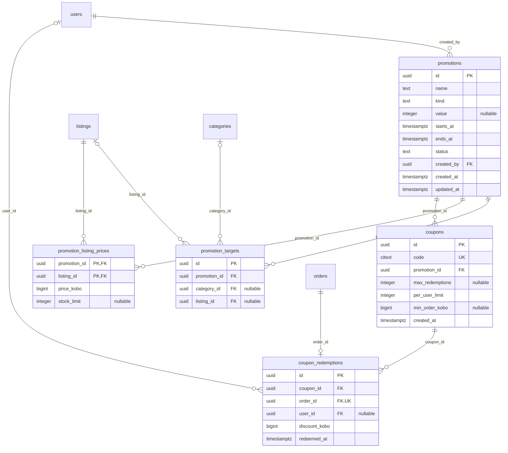
```mermaid
erDiagram
  coupon_redemptions {
    uuid id PK
    uuid coupon_id FK
    uuid order_id FK, UK
    uuid user_id FK "nullable"
    bigint discount_kobo
    timestamptz redeemed_at
  }
  coupons {
    uuid id PK
    citext code UK
    uuid promotion_id FK
    integer max_redemptions "nullable"
    integer per_user_limit
    bigint min_order_kobo "nullable"
    timestamptz created_at
  }
  promotion_listing_prices {
    uuid promotion_id PK, FK
    uuid listing_id PK, FK
    bigint price_kobo
    integer stock_limit "nullable"
  }
  promotion_targets {
    uuid id PK
    uuid promotion_id FK
    uuid category_id FK "nullable"
    uuid listing_id FK "nullable"
  }
  promotions {
    uuid id PK
    text name
    text kind
    integer value "nullable"
    timestamptz starts_at
    timestamptz ends_at
    text status
    uuid created_by FK
    timestamptz created_at
    timestamptz updated_at
  }
  coupons ||--o{ coupon_redemptions : "coupon_id"
  orders ||--o| coupon_redemptions : "order_id"
  users |o--o{ coupon_redemptions : "user_id"
  promotions ||--o{ coupons : "promotion_id"
  listings ||--o{ promotion_listing_prices : "listing_id"
  promotions ||--o{ promotion_listing_prices : "promotion_id"
  categories |o--o{ promotion_targets : "category_id"
  listings |o--o{ promotion_targets : "listing_id"
  promotions ||--o{ promotion_targets : "promotion_id"
  users ||--o{ promotions : "created_by"
```

## Support & risk

- `device_blocklist`: IMEIs that may not be sold, traded in or repaired (stolen, fraud, counterfeit).
- `message_attachments`: Files attached to ticket messages.
- `risk_cases`: Fraud and risk reviews of orders, payments, devices, sellers and accounts.
- `support_tickets`: Support conversations with customers or sellers, across channels.
- `ticket_messages`: Messages in a ticket; internal notes are hidden from customers.

Links to other domains: `files`, `orders`, `sellers`, `staff_members`, `users` (shown without columns).

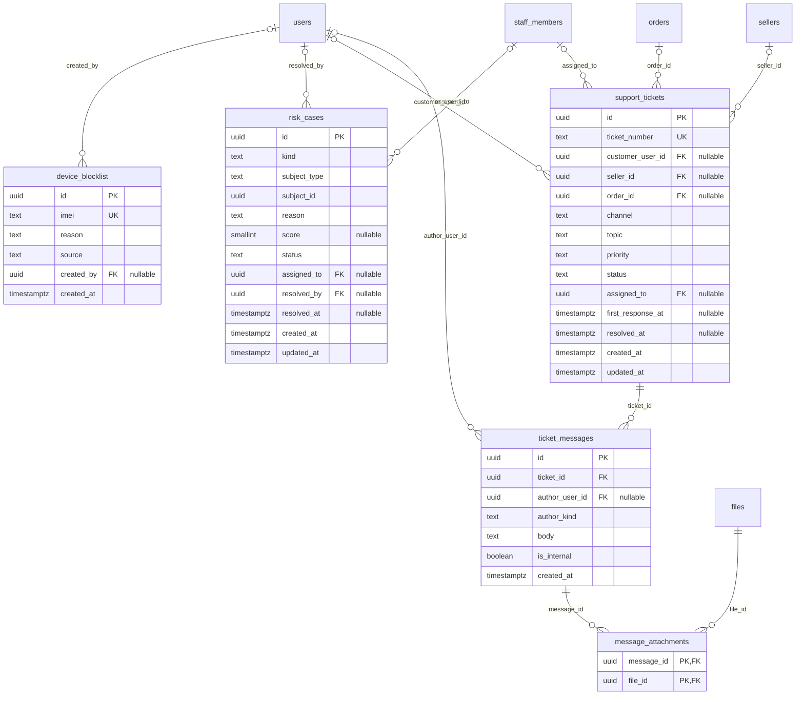
```mermaid
erDiagram
  device_blocklist {
    uuid id PK
    text imei UK
    text reason
    text source
    uuid created_by FK "nullable"
    timestamptz created_at
  }
  message_attachments {
    uuid message_id PK, FK
    uuid file_id PK, FK
  }
  risk_cases {
    uuid id PK
    text kind
    text subject_type
    uuid subject_id
    text reason
    smallint score "nullable"
    text status
    uuid assigned_to FK "nullable"
    uuid resolved_by FK "nullable"
    timestamptz resolved_at "nullable"
    timestamptz created_at
    timestamptz updated_at
  }
  support_tickets {
    uuid id PK
    text ticket_number UK
    uuid customer_user_id FK "nullable"
    uuid seller_id FK "nullable"
    uuid order_id FK "nullable"
    text channel
    text topic
    text priority
    text status
    uuid assigned_to FK "nullable"
    timestamptz first_response_at "nullable"
    timestamptz resolved_at "nullable"
    timestamptz created_at
    timestamptz updated_at
  }
  ticket_messages {
    uuid id PK
    uuid ticket_id FK
    uuid author_user_id FK "nullable"
    text author_kind
    text body
    boolean is_internal
    timestamptz created_at
  }
  users |o--o{ device_blocklist : "created_by"
  files ||--o{ message_attachments : "file_id"
  ticket_messages ||--o{ message_attachments : "message_id"
  staff_members |o--o{ risk_cases : "assigned_to"
  users |o--o{ risk_cases : "resolved_by"
  staff_members |o--o{ support_tickets : "assigned_to"
  users |o--o{ support_tickets : "customer_user_id"
  orders |o--o{ support_tickets : "order_id"
  sellers |o--o{ support_tickets : "seller_id"
  users |o--o{ ticket_messages : "author_user_id"
  support_tickets ||--o{ ticket_messages : "ticket_id"
```

## Content

- `banners`: Hero and promo banners per site and placement.
- `cms_pages`: Editable pages on each site (about, legal, credit terms…), as content blocks.
- `help_articles`: Help centre articles and FAQs per site.

Links to other domains: `files`, `users` (shown without columns).

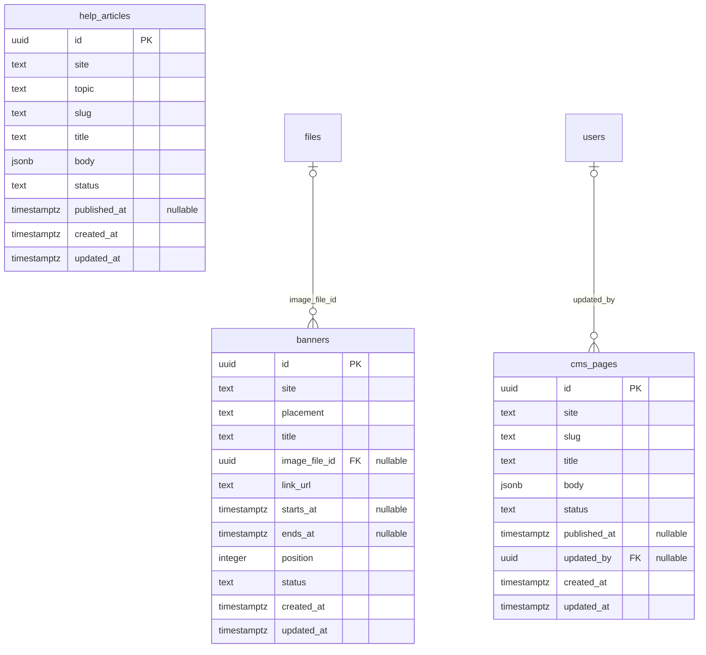
```mermaid
erDiagram
  banners {
    uuid id PK
    text site
    text placement
    text title
    uuid image_file_id FK "nullable"
    text link_url
    timestamptz starts_at "nullable"
    timestamptz ends_at "nullable"
    integer position
    text status
    timestamptz created_at
    timestamptz updated_at
  }
  cms_pages {
    uuid id PK
    text site
    text slug
    text title
    jsonb body
    text status
    timestamptz published_at "nullable"
    uuid updated_by FK "nullable"
    timestamptz created_at
    timestamptz updated_at
  }
  help_articles {
    uuid id PK
    text site
    text topic
    text slug
    text title
    jsonb body
    text status
    timestamptz published_at "nullable"
    timestamptz created_at
    timestamptz updated_at
  }
  files |o--o{ banners : "image_file_id"
  users |o--o{ cms_pages : "updated_by"
```

## Platform

- `audit_log`: Append-only record of who changed what (staff and seller actions, sensitive reads).
- `feature_flags`: Runtime feature switches (IT tools module).
- `idempotency_keys`: Remembers responses to retried POSTs (checkout, payments) so they run once.
- `notifications`: SMS, email, push and in-app notifications per user (staff bell, order updates).
- `outbox_events`: Transactional outbox: events written with the data change, then delivered (SMS, email, webhooks).

Links to other domains: `users` (shown without columns).

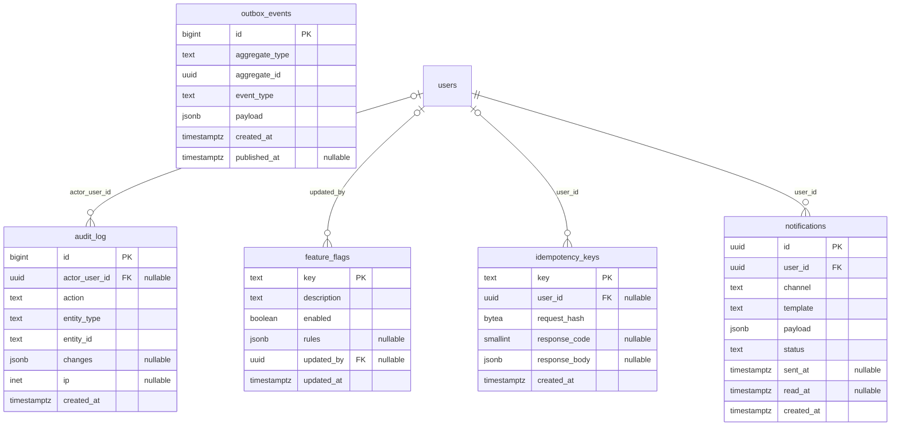
```mermaid
erDiagram
  audit_log {
    bigint id PK
    uuid actor_user_id FK "nullable"
    text action
    text entity_type
    text entity_id
    jsonb changes "nullable"
    inet ip "nullable"
    timestamptz created_at
  }
  feature_flags {
    text key PK
    text description
    boolean enabled
    jsonb rules "nullable"
    uuid updated_by FK "nullable"
    timestamptz updated_at
  }
  idempotency_keys {
    text key PK
    uuid user_id FK "nullable"
    bytea request_hash
    smallint response_code "nullable"
    jsonb response_body "nullable"
    timestamptz created_at
  }
  notifications {
    uuid id PK
    uuid user_id FK
    text channel
    text template
    jsonb payload
    text status
    timestamptz sent_at "nullable"
    timestamptz read_at "nullable"
    timestamptz created_at
  }
  outbox_events {
    bigint id PK
    text aggregate_type
    uuid aggregate_id
    text event_type
    jsonb payload
    timestamptz created_at
    timestamptz published_at "nullable"
  }
  users |o--o{ audit_log : "actor_user_id"
  users |o--o{ feature_flags : "updated_by"
  users |o--o{ idempotency_keys : "user_id"
  users ||--o{ notifications : "user_id"
```

## Overview: all tables

Every table and relationship, without columns. `users` and `files` are referenced by most tables (who created/approved something, attachments); those links are left out here and shown in the domain diagrams.

```mermaid
erDiagram
  addresses {
    uuid id PK
  }
  attribute_definitions {
    uuid id PK
  }
  audit_log {
    bigint id PK
  }
  banners {
    uuid id PK
  }
  brands {
    uuid id PK
  }
  business_members {
    uuid business_id PK
    uuid user_id PK
  }
  businesses {
    uuid id PK
  }
  car_documents {
    uuid id PK
  }
  car_images {
    uuid id PK
  }
  car_inspections {
    uuid id PK
  }
  car_listings {
    uuid id PK
  }
  cart_items {
    uuid id PK
  }
  carts {
    uuid id PK
  }
  categories {
    uuid id PK
  }
  cms_pages {
    uuid id PK
  }
  commission_rules {
    uuid id PK
  }
  coupon_redemptions {
    uuid id PK
  }
  coupons {
    uuid id PK
  }
  credit_accounts {
    uuid id PK
  }
  delivery_events {
    uuid id PK
  }
  delivery_jobs {
    uuid id PK
  }
  delivery_rates {
    uuid id PK
  }
  delivery_zones {
    uuid id PK
  }
  device_blocklist {
    uuid id PK
  }
  device_units {
    uuid id PK
  }
  feature_flags {
    text key PK
  }
  files {
    uuid id PK
  }
  financing_enquiries {
    uuid id PK
  }
  fulfilments {
    uuid id PK
  }
  goods_receipts {
    uuid id PK
  }
  help_articles {
    uuid id PK
  }
  idempotency_keys {
    text key PK
  }
  inventory_levels {
    uuid warehouse_id PK
    uuid variant_id PK
    text condition PK
  }
  invoices {
    uuid id PK
  }
  kyc_documents {
    uuid id PK
  }
  ledger_accounts {
    uuid id PK
  }
  ledger_entries {
    uuid id PK
  }
  ledger_journals {
    uuid id PK
  }
  listing_price_history {
    uuid id PK
  }
  listings {
    uuid id PK
  }
  message_attachments {
    uuid message_id PK
    uuid file_id PK
  }
  nigerian_states {
    text code PK
  }
  notifications {
    uuid id PK
  }
  order_lines {
    uuid id PK
  }
  order_status_history {
    uuid id PK
  }
  orders {
    uuid id PK
  }
  outbox_events {
    bigint id PK
  }
  payment_events {
    uuid id PK
  }
  payments {
    uuid id PK
  }
  payout_items {
    uuid payout_id PK
    uuid fulfilment_id PK
  }
  payouts {
    uuid id PK
  }
  permissions {
    uuid id PK
  }
  pos_shifts {
    uuid id PK
  }
  pos_terminals {
    uuid id PK
  }
  price_tiers {
    uuid id PK
  }
  product_attribute_values {
    uuid product_id PK
    uuid attribute_id PK
  }
  product_images {
    uuid id PK
  }
  product_reviews {
    uuid id PK
  }
  product_variants {
    uuid id PK
  }
  products {
    uuid id PK
  }
  promotion_listing_prices {
    uuid promotion_id PK
    uuid listing_id PK
  }
  promotion_targets {
    uuid id PK
  }
  promotions {
    uuid id PK
  }
  purchase_order_lines {
    uuid id PK
  }
  purchase_orders {
    uuid id PK
  }
  quote_lines {
    uuid id PK
  }
  quotes {
    uuid id PK
  }
  refunds {
    uuid id PK
  }
  repair_jobs {
    uuid id PK
  }
  return_items {
    uuid id PK
  }
  return_requests {
    uuid id PK
  }
  riders {
    uuid user_id PK
  }
  risk_cases {
    uuid id PK
  }
  role_permissions {
    uuid role_id PK
    uuid permission_id PK
  }
  roles {
    uuid id PK
  }
  saved_items {
    uuid user_id PK
    uuid product_id PK
  }
  seller_bank_accounts {
    uuid id PK
  }
  seller_kyc_submissions {
    uuid id PK
  }
  seller_members {
    uuid seller_id PK
    uuid user_id PK
  }
  seller_ratings {
    uuid id PK
  }
  sellers {
    uuid id PK
  }
  staff_members {
    uuid user_id PK
  }
  staff_roles {
    uuid user_id PK
    uuid role_id PK
  }
  stock_movements {
    uuid id PK
  }
  stock_transfer_lines {
    uuid id PK
  }
  stock_transfers {
    uuid id PK
  }
  suppliers {
    uuid id PK
  }
  support_tickets {
    uuid id PK
  }
  ticket_messages {
    uuid id PK
  }
  trade_ins {
    uuid id PK
  }
  user_sessions {
    uuid id PK
  }
  users {
    uuid id PK
  }
  verification_codes {
    uuid id PK
  }
  viewing_bookings {
    uuid id PK
  }
  warehouses {
    uuid id PK
  }
  warranty_claims {
    uuid id PK
  }
  businesses |o--o{ addresses : "business_id"
  nigerian_states ||--o{ addresses : "state_code"
  categories ||--o{ attribute_definitions : "category_id"
  businesses ||--o{ business_members : "business_id"
  staff_members |o--o{ businesses : "account_manager_id"
  car_listings ||--o{ car_documents : "car_listing_id"
  car_listings ||--o{ car_images : "car_listing_id"
  car_listings ||--o{ car_inspections : "car_listing_id"
  staff_members |o--o{ car_inspections : "inspector_id"
  sellers ||--o{ car_listings : "seller_id"
  nigerian_states ||--o{ car_listings : "state_code"
  carts ||--o{ cart_items : "cart_id"
  listings ||--o{ cart_items : "listing_id"
  businesses |o--o{ carts : "business_id"
  categories |o--o{ categories : "parent_id"
  categories |o--o{ commission_rules : "category_id"
  sellers |o--o{ commission_rules : "seller_id"
  coupons ||--o{ coupon_redemptions : "coupon_id"
  orders ||--o| coupon_redemptions : "order_id"
  promotions ||--o{ coupons : "promotion_id"
  businesses ||--o| credit_accounts : "business_id"
  delivery_jobs ||--o{ delivery_events : "delivery_job_id"
  fulfilments ||--o{ delivery_jobs : "fulfilment_id"
  riders |o--o{ delivery_jobs : "rider_id"
  delivery_zones ||--o{ delivery_jobs : "zone_id"
  delivery_zones ||--o{ delivery_rates : "zone_id"
  nigerian_states ||--o{ delivery_zones : "state_code"
  product_variants ||--o{ device_units : "variant_id"
  warehouses |o--o{ device_units : "warehouse_id"
  car_listings ||--o{ financing_enquiries : "car_listing_id"
  orders ||--o{ fulfilments : "order_id"
  sellers ||--o{ fulfilments : "seller_id"
  warehouses |o--o{ fulfilments : "warehouse_id"
  purchase_orders ||--o{ goods_receipts : "purchase_order_id"
  product_variants ||--o{ inventory_levels : "variant_id"
  warehouses ||--o{ inventory_levels : "warehouse_id"
  businesses ||--o{ invoices : "business_id"
  orders ||--o| invoices : "order_id"
  seller_kyc_submissions ||--o{ kyc_documents : "submission_id"
  sellers |o--o| ledger_accounts : "seller_id"
  ledger_accounts ||--o{ ledger_entries : "account_id"
  ledger_journals ||--o{ ledger_entries : "journal_id"
  listings ||--o{ listing_price_history : "listing_id"
  sellers ||--o{ listings : "seller_id"
  product_variants ||--o{ listings : "variant_id"
  ticket_messages ||--o{ message_attachments : "message_id"
  device_units |o--o| order_lines : "device_unit_id"
  fulfilments ||--o{ order_lines : "fulfilment_id"
  listings ||--o{ order_lines : "listing_id"
  orders ||--o{ order_lines : "order_id"
  sellers ||--o{ order_lines : "seller_id"
  product_variants ||--o{ order_lines : "variant_id"
  orders ||--o{ order_status_history : "order_id"
  businesses |o--o{ orders : "business_id"
  pos_shifts |o--o{ orders : "pos_shift_id"
  quotes |o--o| orders : "quote_id"
  payments |o--o{ payment_events : "payment_id"
  invoices |o--o{ payments : "invoice_id"
  orders |o--o{ payments : "order_id"
  fulfilments ||--o| payout_items : "fulfilment_id"
  payouts ||--o{ payout_items : "payout_id"
  seller_bank_accounts ||--o{ payouts : "bank_account_id"
  sellers ||--o{ payouts : "seller_id"
  staff_members ||--o{ pos_shifts : "cashier_id"
  pos_terminals ||--o{ pos_shifts : "terminal_id"
  warehouses ||--o{ pos_terminals : "warehouse_id"
  listings ||--o{ price_tiers : "listing_id"
  attribute_definitions ||--o{ product_attribute_values : "attribute_id"
  products ||--o{ product_attribute_values : "product_id"
  products ||--o{ product_images : "product_id"
  product_variants |o--o{ product_images : "variant_id"
  order_lines ||--o| product_reviews : "order_line_id"
  products ||--o{ product_reviews : "product_id"
  products ||--o{ product_variants : "product_id"
  brands |o--o{ products : "brand_id"
  categories ||--o{ products : "category_id"
  listings ||--o{ promotion_listing_prices : "listing_id"
  promotions ||--o{ promotion_listing_prices : "promotion_id"
  categories |o--o{ promotion_targets : "category_id"
  listings |o--o{ promotion_targets : "listing_id"
  promotions ||--o{ promotion_targets : "promotion_id"
  purchase_orders ||--o{ purchase_order_lines : "purchase_order_id"
  product_variants ||--o{ purchase_order_lines : "variant_id"
  suppliers ||--o{ purchase_orders : "supplier_id"
  warehouses ||--o{ purchase_orders : "warehouse_id"
  listings |o--o{ quote_lines : "listing_id"
  quotes ||--o{ quote_lines : "quote_id"
  staff_members |o--o{ quotes : "assigned_to"
  businesses |o--o{ quotes : "business_id"
  nigerian_states |o--o{ quotes : "delivery_state"
  orders ||--o{ refunds : "order_id"
  payments ||--o{ refunds : "payment_id"
  return_requests |o--o{ refunds : "return_request_id"
  device_units |o--o{ repair_jobs : "device_unit_id"
  staff_members |o--o{ repair_jobs : "technician_id"
  warranty_claims |o--o{ repair_jobs : "warranty_claim_id"
  order_lines ||--o{ return_items : "order_line_id"
  return_requests ||--o{ return_items : "return_request_id"
  orders ||--o{ return_requests : "order_id"
  warehouses ||--o{ riders : "home_warehouse_id"
  staff_members ||--o| riders : "user_id"
  staff_members |o--o{ risk_cases : "assigned_to"
  permissions ||--o{ role_permissions : "permission_id"
  roles ||--o{ role_permissions : "role_id"
  products ||--o{ saved_items : "product_id"
  sellers ||--o{ seller_bank_accounts : "seller_id"
  sellers ||--o{ seller_kyc_submissions : "seller_id"
  sellers ||--o{ seller_members : "seller_id"
  fulfilments ||--o| seller_ratings : "fulfilment_id"
  sellers ||--o{ seller_ratings : "seller_id"
  nigerian_states |o--o{ sellers : "state_code"
  roles ||--o{ staff_roles : "role_id"
  staff_members ||--o{ staff_roles : "user_id"
  product_variants ||--o{ stock_movements : "variant_id"
  warehouses ||--o{ stock_movements : "warehouse_id"
  stock_transfers ||--o{ stock_transfer_lines : "transfer_id"
  product_variants ||--o{ stock_transfer_lines : "variant_id"
  warehouses ||--o{ stock_transfers : "from_warehouse_id"
  warehouses ||--o{ stock_transfers : "to_warehouse_id"
  staff_members |o--o{ support_tickets : "assigned_to"
  orders |o--o{ support_tickets : "order_id"
  sellers |o--o{ support_tickets : "seller_id"
  support_tickets ||--o{ ticket_messages : "ticket_id"
  device_units |o--o| trade_ins : "device_unit_id"
  staff_members |o--o{ trade_ins : "inspected_by"
  car_listings ||--o{ viewing_bookings : "car_listing_id"
  nigerian_states ||--o{ warehouses : "state_code"
  device_units |o--o{ warranty_claims : "device_unit_id"
  order_lines |o--o{ warranty_claims : "order_line_id"
```

## Table index

96 tables, 185 foreign keys. Generated from the live schema.

| Table | Domain | Columns | Purpose |
|---|---|---|---|
| `addresses` | Identity & access | 17 | Saved delivery / business addresses. Owned by exactly one user or one business. |
| `nigerian_states` | Identity & access | 2 | Lookup: the 36 states and the FCT, used by addresses, zones and listings. |
| `permissions` | Identity & access | 4 | Fine-grained actions per staff module, e.g. orders.refund, finance.payouts. |
| `role_permissions` | Identity & access | 2 | Which permissions each role grants. |
| `roles` | Identity & access | 7 | Staff roles (e.g. finance, dispatch). Proposed defaults in docs/database/access.md; owner to decide. |
| `staff_members` | Identity & access | 9 | TechShop employees (HR & staff module). A staff member is a user with an employee record. |
| `staff_roles` | Identity & access | 4 | Roles assigned to each staff member. |
| `user_sessions` | Identity & access | 8 | Refresh-token sessions per device; tokens stored only as hashes. |
| `users` | Identity & access | 13 | Every person who signs in: customers, seller staff, business buyers and TechShop staff. Phone stored in E.164 (+234…). |
| `verification_codes` | Identity & access | 10 | One-time codes sent by SMS or email (sign-up, login, password reset); hashed, rate-limited by attempts. |
| `business_members` | Sellers & businesses | 4 | Users who buy or pay on behalf of a business. |
| `businesses` | Sellers & businesses | 10 | B2B buyer organisations (wholesale site): trade pricing, VAT invoices, credit. |
| `credit_accounts` | Sellers & businesses | 10 | Pay-on-invoice credit for approved businesses (limit and payment term). |
| `files` | Sellers & businesses | 8 | Uploaded files (product photos, KYC documents, proofs of delivery, invoices). Bytes live in object storage. |
| `kyc_documents` | Sellers & businesses | 5 | Documents uploaded with a KYC submission. |
| `seller_bank_accounts` | Sellers & businesses | 10 | Payout bank accounts (NUBAN encrypted, last 4 shown). |
| `seller_kyc_submissions` | Sellers & businesses | 13 | Identity / business verification applications. ID numbers encrypted by the API (NDPA). |
| `seller_members` | Sellers & businesses | 4 | Users who can act for a seller in the Seller Centre. |
| `sellers` | Sellers & businesses | 13 | Everyone who sells: TechShop itself (first_party), marketplace businesses and individuals. |
| `attribute_definitions` | Catalogue | 10 | Spec fields per category (RAM, storage, GPU…): drive spec tables, filters and variant axes. |
| `brands` | Catalogue | 5 | Manufacturers / brands. |
| `categories` | Catalogue | 10 | Category tree (Phones → Android…). kind = vehicle routes cars to the car tables. |
| `listing_price_history` | Catalogue | 6 | Every price change. Proves discounts are genuine (FCCPA) and feeds analytics. |
| `listings` | Catalogue | 18 | A seller's offer on a variant: condition, price, stock, warranty. TechShop stock is a first_party listing. |
| `price_tiers` | Catalogue | 4 | Wholesale quantity breaks: unit price from min_quantity upward. |
| `product_attribute_values` | Catalogue | 5 | Spec values for a product (one typed value per attribute). |
| `product_images` | Catalogue | 6 | Product photos (optionally per variant); alt text required. |
| `product_variants` | Catalogue | 10 | Purchasable configurations of a product, e.g. 256GB · Titanium. |
| `products` | Catalogue | 11 | Catalogue entries (model level). Sold through listings on its variants. |
| `saved_items` | Catalogue | 3 | Customers' saved products (the heart button). |
| `device_units` | Inventory | 10 | Individually tracked devices (IMEI/serial): warranty, returns, theft checks, trade-ins. |
| `inventory_levels` | Inventory | 7 | Current stock per location × variant × condition (derived from stock_movements). |
| `stock_movements` | Inventory | 10 | Append-only stock ledger; every change to inventory_levels has a movement. |
| `stock_transfer_lines` | Inventory | 5 | Items in a stock transfer. |
| `stock_transfers` | Inventory | 9 | Moving stock between locations. |
| `warehouses` | Inventory | 10 | Physical locations: warehouses, retail stores (POS) and dispatch hubs. |
| `goods_receipts` | Purchasing | 5 | A delivery received against a PO; posts stock_movements (reason purchase_receipt). |
| `purchase_order_lines` | Purchasing | 7 | Items, quantities and costs on a purchase order. |
| `purchase_orders` | Purchasing | 11 | Orders placed with suppliers, delivered to a warehouse. |
| `suppliers` | Purchasing | 9 | Companies TechShop buys stock from. |
| `pos_shifts` | Point of sale | 8 | A cashier's shift on a till, with cash reconciliation. POS sales are orders with channel pos. |
| `pos_terminals` | Point of sale | 5 | Tills in physical stores (warehouses of kind store). |
| `cart_items` | Sales | 5 | Listings in a cart. Prices are read live; they are snapshotted only on order lines. |
| `carts` | Sales | 7 | Shopping carts for signed-in users or guests (by session). |
| `fulfilments` | Sales | 10 | The part of an order shipped by one seller. Drives delivery, seller earnings and payouts. |
| `invoices` | Sales | 15 | B2B VAT invoices; on credit terms they are paid later against due_at. |
| `order_lines` | Sales | 17 | Snapshot of what was bought (name, price, condition, commission), optionally the exact device unit. |
| `order_status_history` | Sales | 7 | Every order status change and who made it (shown on order tracking). |
| `orders` | Sales | 20 | One checkout. Totals must add up; ship_to is a snapshot of the address used. |
| `product_reviews` | Sales | 10 | Verified-purchase reviews only: each review is tied to the order line that was bought. |
| `quote_lines` | Sales | 6 | Requested items (listed or free text) and their quoted unit prices. |
| `quotes` | Sales | 16 | B2B quote requests and the priced quotes sent back. |
| `seller_ratings` | Sales | 7 | Customer rating of a seller per delivered fulfilment; aggregated onto sellers.rating_avg. |
| `commission_rules` | Payments & money | 8 | Marketplace commission (basis points) by category and/or seller; the rate is snapshotted on order lines. |
| `ledger_accounts` | Payments & money | 6 | Chart of accounts: provider clearing, seller payables (one per seller), commission, delivery, VAT, refunds. |
| `ledger_entries` | Payments & money | 6 | Double-entry lines: positive = debit, negative = credit. Balanced per journal (deferred trigger). |
| `ledger_journals` | Payments & money | 7 | One accounting event (e.g. a sale). Its entries must sum to zero. |
| `payment_events` | Payments & money | 9 | Raw provider webhooks; unique per provider event so retries are processed once. |
| `payments` | Payments & money | 13 | A charge for an order or an invoice through a provider. Card data is never stored. |
| `payout_items` | Payments & money | 3 | Which delivered fulfilments a payout covers; each fulfilment is paid out once. |
| `payouts` | Payments & money | 11 | Transfers of earnings to a seller's bank account. |
| `refunds` | Payments & money | 12 | Money returned to a customer against a payment (full or partial). |
| `delivery_events` | Logistics | 8 | Append-only tracking trail for a delivery job (shown to customers and dispatch). |
| `delivery_jobs` | Logistics | 16 | A delivery run for a fulfilment. Delivered requires OTP or photo proof. |
| `delivery_rates` | Logistics | 8 | Delivery fee and ETA per zone and weight band. |
| `delivery_zones` | Logistics | 6 | Delivery areas (state + LGAs) used for fees, ETAs and rider assignment. |
| `riders` | Logistics | 7 | Dispatch riders (staff using the logistics app). |
| `repair_jobs` | After-sales | 12 | Workshop jobs for warranty claims, paid repairs and refurbishment. |
| `return_items` | After-sales | 5 | Which order lines (and how many) are being returned. |
| `return_requests` | After-sales | 10 | Customer return requests (RMA) and their outcome. |
| `trade_ins` | After-sales | 18 | Trade-in requests from estimate to inspection, offer and payout; accepted devices become device_units. |
| `warranty_claims` | After-sales | 11 | Warranty claims, identified by IMEI/serial. |
| `car_documents` | Cars | 6 | Ownership and import documents, verified by staff. |
| `car_images` | Cars | 5 | Photos of a car listing. |
| `car_inspections` | Cars | 8 | Inspection reports (engine, brakes, body, electricals, documents/VIN). |
| `car_listings` | Cars | 21 | Cars for sale (separate from products): viewing and inspection flow, never add-to-cart. |
| `financing_enquiries` | Cars | 11 | Car financing enquiries, referred to finance partners. |
| `viewing_bookings` | Cars | 11 | Requests to see a car (the Book a viewing form). |
| `coupon_redemptions` | Marketing | 6 | Each coupon use (one per order) for limits and reporting. |
| `coupons` | Marketing | 7 | Codes customers enter at checkout to apply a promotion. |
| `promotion_listing_prices` | Marketing | 4 | Flash-deal prices per listing, optionally limited to a quantity. |
| `promotion_targets` | Marketing | 4 | What a promotion applies to (a category or a listing); none = sitewide. |
| `promotions` | Marketing | 10 | Campaigns and deals with real start/end times (the countdown reads ends_at; no fake timers). |
| `device_blocklist` | Support & risk | 6 | IMEIs that may not be sold, traded in or repaired (stolen, fraud, counterfeit). |
| `message_attachments` | Support & risk | 2 | Files attached to ticket messages. |
| `risk_cases` | Support & risk | 12 | Fraud and risk reviews of orders, payments, devices, sellers and accounts. |
| `support_tickets` | Support & risk | 14 | Support conversations with customers or sellers, across channels. |
| `ticket_messages` | Support & risk | 7 | Messages in a ticket; internal notes are hidden from customers. |
| `banners` | Content | 12 | Hero and promo banners per site and placement. |
| `cms_pages` | Content | 10 | Editable pages on each site (about, legal, credit terms…), as content blocks. |
| `help_articles` | Content | 10 | Help centre articles and FAQs per site. |
| `audit_log` | Platform | 8 | Append-only record of who changed what (staff and seller actions, sensitive reads). |
| `feature_flags` | Platform | 6 | Runtime feature switches (IT tools module). |
| `idempotency_keys` | Platform | 6 | Remembers responses to retried POSTs (checkout, payments) so they run once. |
| `notifications` | Platform | 9 | SMS, email, push and in-app notifications per user (staff bell, order updates). |
| `outbox_events` | Platform | 7 | Transactional outbox: events written with the data change, then delivered (SMS, email, webhooks). |
