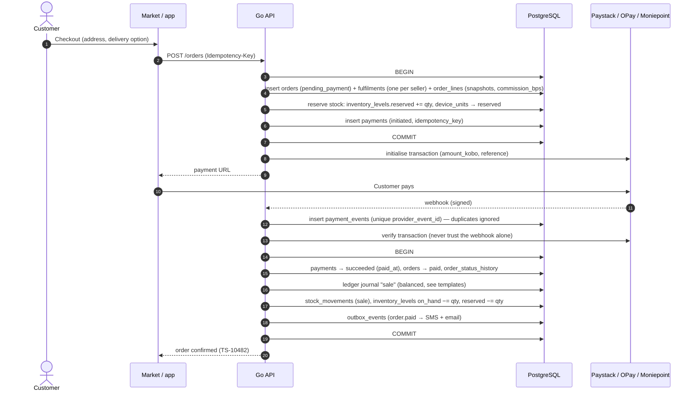
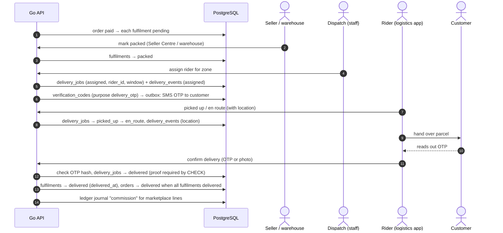
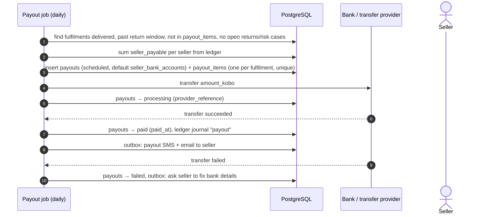
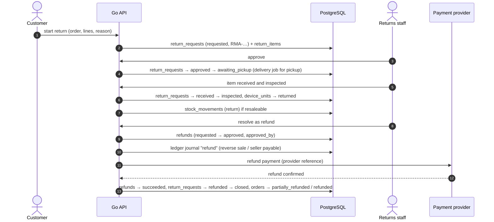
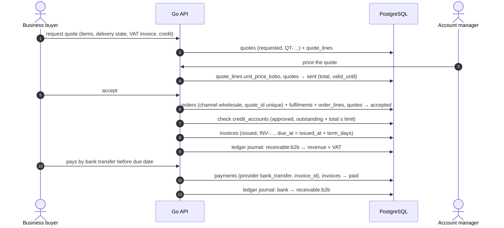
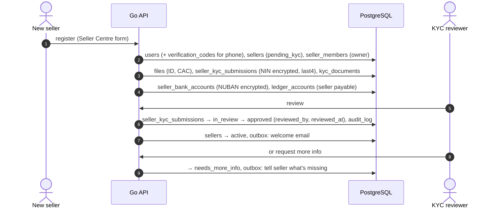
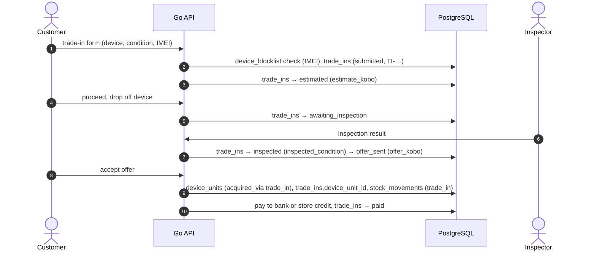
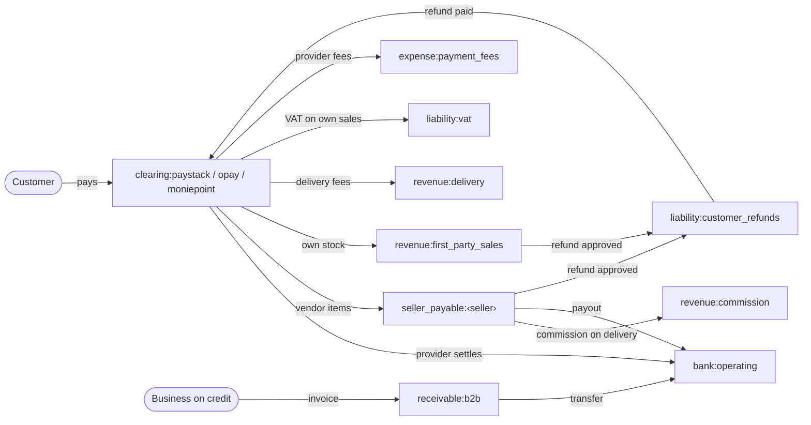

# TechShop data flows

How the key processes move through the tables in [`schema.sql`](schema.sql). Every flow runs inside the Go API, the only service that touches the database. Status lifecycles are in [`states.md`](states.md).

Rules that apply to every flow:
- **One transaction per step.** The data change and its `outbox_events` row are written together, so SMS, email and webhooks are sent if and only if the change committed.
- **Retries are safe.** Client POSTs carry an idempotency key (`idempotency_keys`), and provider webhooks are unique per `(provider, provider_event_id)` (`payment_events`).
- **Money is posted to the ledger** as balanced journals ([money flow](#money-flow)).
- **Staff and seller actions are written to `audit_log`.**

## 1. Checkout, payment and webhook

If payment fails or expires: `payments → failed/cancelled`, `orders → cancelled`, reservations released. No ledger entries are written, because no money moved.

## 2. Multi-seller order: fulfilment and delivery

## 3. Seller earnings and payout

## 4. Return and refund

## 5. B2B: quote, order, invoice on credit, payment

## 6. Seller onboarding and KYC

## 7. Trade-in

## Money flow

Accounts are rows in `ledger_accounts`. Every journal's entries sum to zero; positive amounts are debits, negative amounts are credits.

### Journal templates

Worked examples in naira. Amounts are stored in kobo. **The VAT treatment is a placeholder until finance confirms it.**

| Journal (`kind`) | When | Debit (+) | Credit (−) |
|---|---|---|---|
| `sale` (marketplace item) | Payment succeeds: ₦100,000 vendor item + ₦2,500 delivery | clearing:paystack ₦102,500 | seller_payable:vendor ₦100,000 · revenue:delivery ₦2,500 |
| `sale` (TechShop stock, VAT-inclusive) | Payment succeeds: ₦107,500 incl. 7.5% VAT | clearing:paystack ₦107,500 | revenue:first_party_sales ₦100,000 · liability:vat ₦7,500 |
| `commission` | Fulfilment delivered: 10% on ₦100,000 | seller_payable:vendor ₦10,000 | revenue:commission ₦10,000 |
| `adjustment` (provider fee) | Provider settlement report | expense:payment_fees ₦1,537 | clearing:paystack ₦1,537 |
| `adjustment` (settlement) | Provider pays out to the bank | bank:operating ₦100,963 | clearing:paystack ₦100,963 |
| `payout` | Seller transfer succeeds | seller_payable:vendor ₦90,000 | bank:operating ₦90,000 |
| `refund` (approve) | Return approved, vendor item | seller_payable:vendor ₦100,000 | liability:customer_refunds ₦100,000 |
| `refund` (pay) | Provider refund confirmed | liability:customer_refunds ₦100,000 | clearing:paystack ₦100,000 |
| `sale` (B2B on credit) | Invoice issued: ₦8,480,000 + 7.5% VAT | receivable:b2b ₦9,116,000 | revenue:first_party_sales ₦8,480,000 · liability:vat ₦636,000 |
| `adjustment` (B2B paid) | Business pays invoice | bank:operating ₦9,116,000 | receivable:b2b ₦9,116,000 |
| `chargeback` | Customer disputes a card payment | revenue:first_party_sales or seller_payable ₦X | clearing:paystack ₦X |

**Balances are derived from the entries:**
- A seller's balance is the sum of their `seller_payable` entries.
- Provider clearing balances must match the providers' settlement reports. That's the Finance module's reconciliation tab.
