# TechShop state machines

Every status column in [`schema.sql`](schema.sql) is a `text` field limited by a `CHECK` constraint. These diagrams show **which transitions are allowed**. The database enforces the *set* of values; the Go API enforces the *transitions* and records each change (`order_status_history`, `delivery_events`, `audit_log`).

Overview: [`../database.md`](../database.md) · Tables: [`erd.md`](erd.md) · Processes: [`flows.md`](flows.md)

## Order (`orders.status`)

An order is the customer's view of a checkout. It's derived from its payments and fulfilments: when every fulfilment is delivered, the order is delivered.

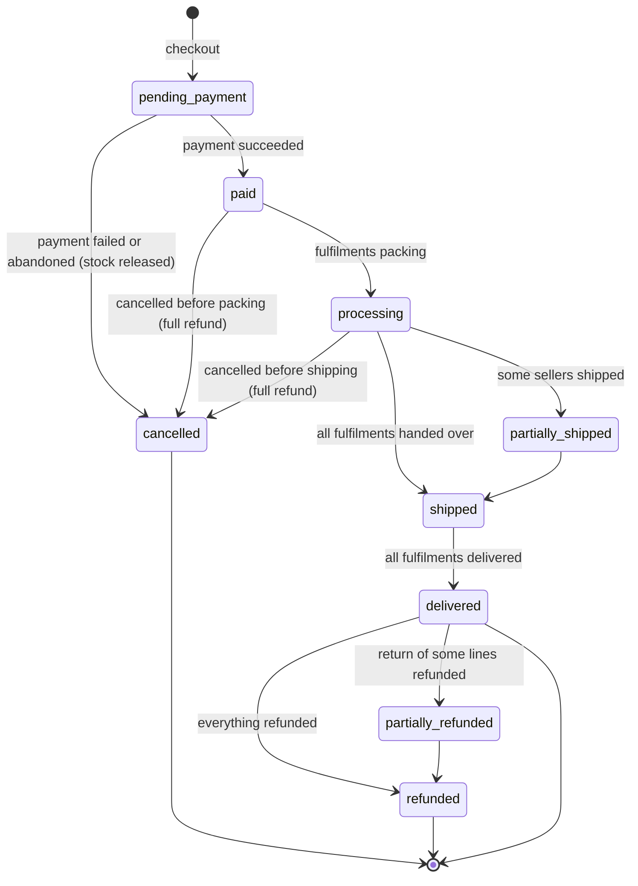
```mermaid
stateDiagram-v2
  [*] --> pending_payment: checkout
  pending_payment --> paid: payment succeeded
  pending_payment --> cancelled: payment failed or abandoned (stock released)
  paid --> processing: fulfilments packing
  processing --> partially_shipped: some sellers shipped
  processing --> shipped: all fulfilments handed over
  partially_shipped --> shipped
  shipped --> delivered: all fulfilments delivered
  paid --> cancelled: cancelled before packing (full refund)
  processing --> cancelled: cancelled before shipping (full refund)
  delivered --> partially_refunded: return of some lines refunded
  delivered --> refunded: everything refunded
  partially_refunded --> refunded
  cancelled --> [*]
  refunded --> [*]
  delivered --> [*]
```

## Fulfilment (`fulfilments.status`)

The part of an order shipped by one seller. Seller earnings become payable only after `delivered` and the return window.

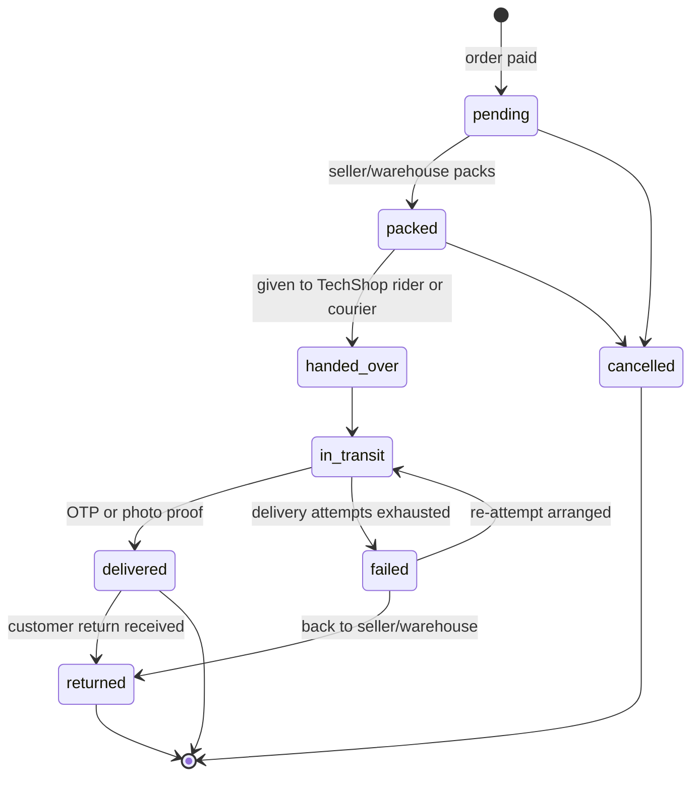
```mermaid
stateDiagram-v2
  [*] --> pending: order paid
  pending --> packed: seller/warehouse packs
  packed --> handed_over: given to TechShop rider or courier
  handed_over --> in_transit
  in_transit --> delivered: OTP or photo proof
  in_transit --> failed: delivery attempts exhausted
  failed --> in_transit: re-attempt arranged
  failed --> returned: back to seller/warehouse
  delivered --> returned: customer return received
  pending --> cancelled
  packed --> cancelled
  delivered --> [*]
  returned --> [*]
  cancelled --> [*]
```

## Delivery job (`delivery_jobs.status`)

A rider's run for one fulfilment (the logistics app).

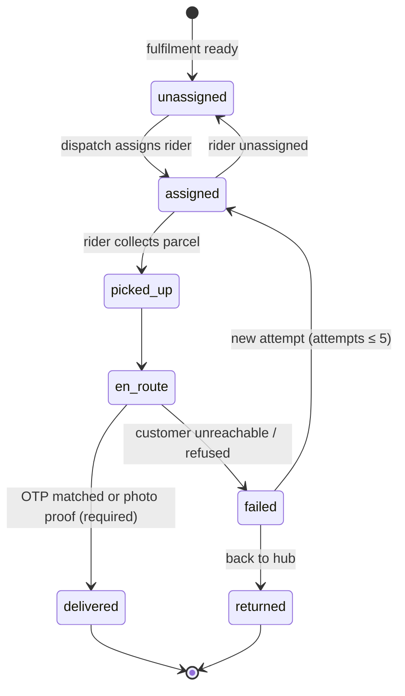
```mermaid
stateDiagram-v2
  [*] --> unassigned: fulfilment ready
  unassigned --> assigned: dispatch assigns rider
  assigned --> unassigned: rider unassigned
  assigned --> picked_up: rider collects parcel
  picked_up --> en_route
  en_route --> delivered: OTP matched or photo proof (required)
  en_route --> failed: customer unreachable / refused
  failed --> assigned: new attempt (attempts ≤ 5)
  failed --> returned: back to hub
  delivered --> [*]
  returned --> [*]
```

## Payment (`payments.status`)

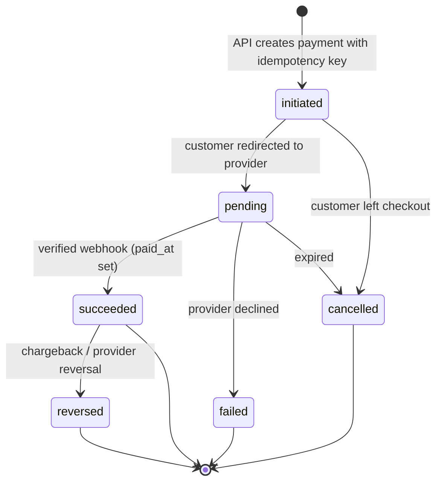
```mermaid
stateDiagram-v2
  [*] --> initiated: API creates payment with idempotency key
  initiated --> pending: customer redirected to provider
  pending --> succeeded: verified webhook (paid_at set)
  pending --> failed: provider declined
  initiated --> cancelled: customer left checkout
  pending --> cancelled: expired
  succeeded --> reversed: chargeback / provider reversal
  succeeded --> [*]
  failed --> [*]
  cancelled --> [*]
  reversed --> [*]
```

## Refund (`refunds.status`)

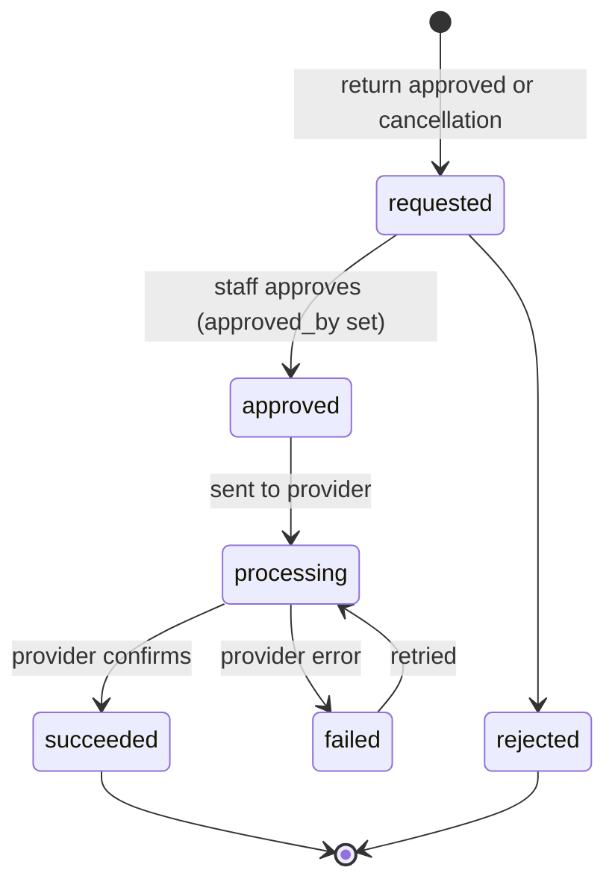
```mermaid
stateDiagram-v2
  [*] --> requested: return approved or cancellation
  requested --> approved: staff approves (approved_by set)
  requested --> rejected
  approved --> processing: sent to provider
  processing --> succeeded: provider confirms
  processing --> failed: provider error
  failed --> processing: retried
  succeeded --> [*]
  rejected --> [*]
```

## Return request (`return_requests.status`)

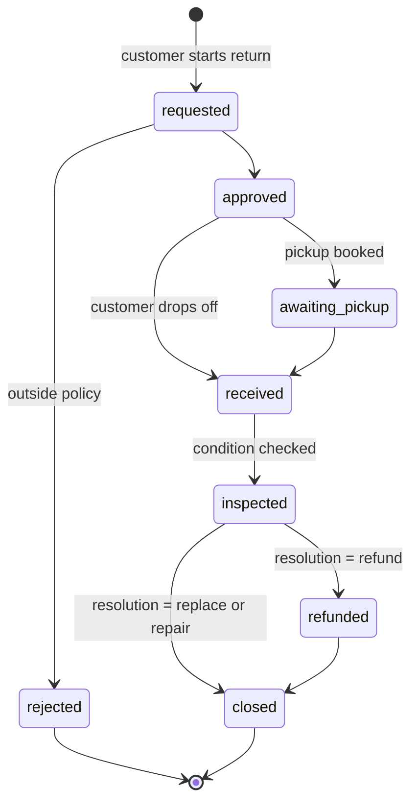
```mermaid
stateDiagram-v2
  [*] --> requested: customer starts return
  requested --> approved
  requested --> rejected: outside policy
  approved --> awaiting_pickup: pickup booked
  approved --> received: customer drops off
  awaiting_pickup --> received
  received --> inspected: condition checked
  inspected --> refunded: resolution = refund
  inspected --> closed: resolution = replace or repair
  refunded --> closed
  rejected --> [*]
  closed --> [*]
```

## Seller account (`sellers.status`) and KYC (`seller_kyc_submissions.status`)

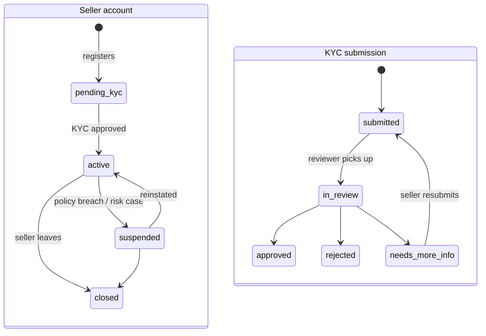
```mermaid
stateDiagram-v2
  state "Seller account" as account {
    [*] --> pending_kyc: registers
    pending_kyc --> active: KYC approved
    active --> suspended: policy breach / risk case
    suspended --> active: reinstated
    active --> closed: seller leaves
    suspended --> closed
  }
  state "KYC submission" as kyc {
    [*] --> submitted
    submitted --> in_review: reviewer picks up
    in_review --> approved
    in_review --> rejected
    in_review --> needs_more_info
    needs_more_info --> submitted: seller resubmits
  }
```

## Listing moderation (`listings.status`)

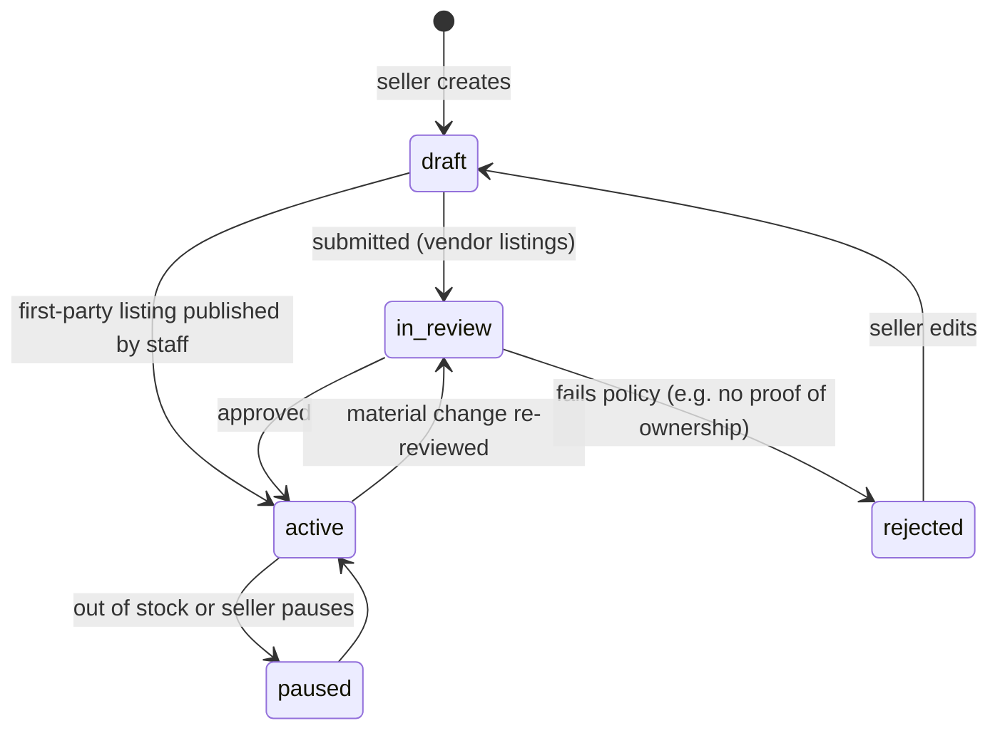
```mermaid
stateDiagram-v2
  [*] --> draft: seller creates
  draft --> in_review: submitted (vendor listings)
  draft --> active: first-party listing published by staff
  in_review --> active: approved
  in_review --> rejected: fails policy (e.g. no proof of ownership)
  rejected --> draft: seller edits
  active --> paused: out of stock or seller pauses
  paused --> active
  active --> in_review: material change re-reviewed
```

## B2B quote (`quotes.status`)

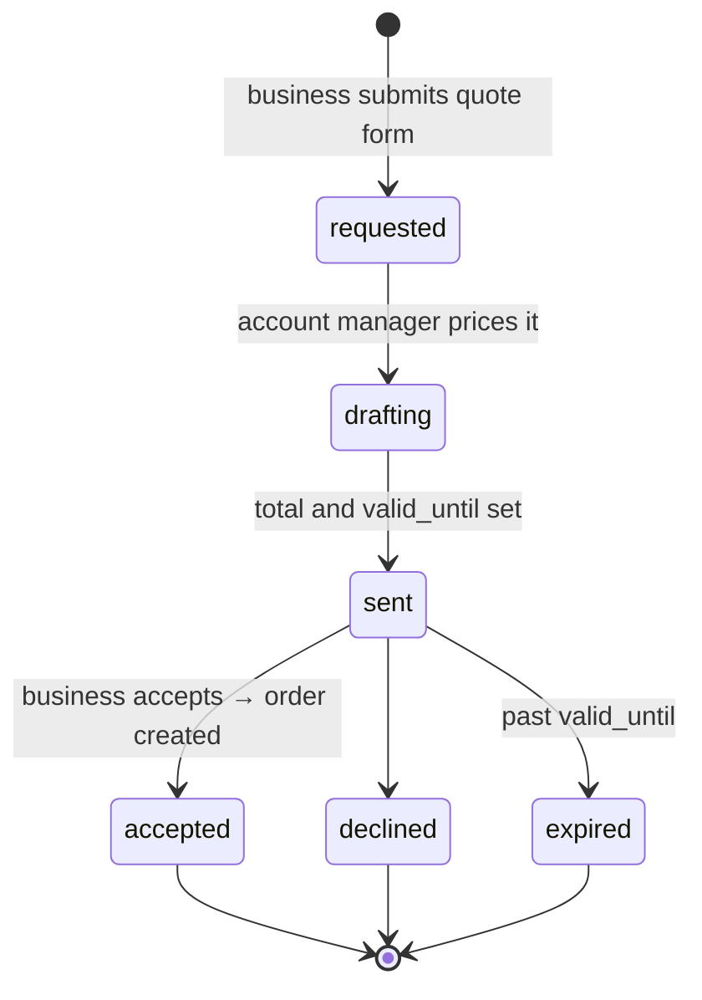
```mermaid
stateDiagram-v2
  [*] --> requested: business submits quote form
  requested --> drafting: account manager prices it
  drafting --> sent: total and valid_until set
  sent --> accepted: business accepts → order created
  sent --> declined
  sent --> expired: past valid_until
  accepted --> [*]
  declined --> [*]
  expired --> [*]
```

## B2B invoice (`invoices.status`)

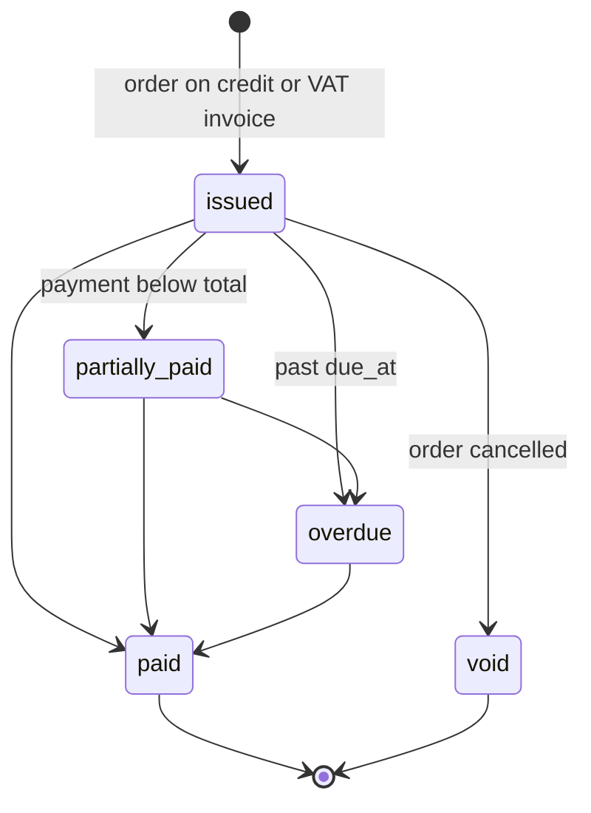
```mermaid
stateDiagram-v2
  [*] --> issued: order on credit or VAT invoice
  issued --> partially_paid: payment below total
  issued --> paid
  partially_paid --> paid
  issued --> overdue: past due_at
  partially_paid --> overdue
  overdue --> paid
  issued --> void: order cancelled
  paid --> [*]
  void --> [*]
```

## Seller payout (`payouts.status`)

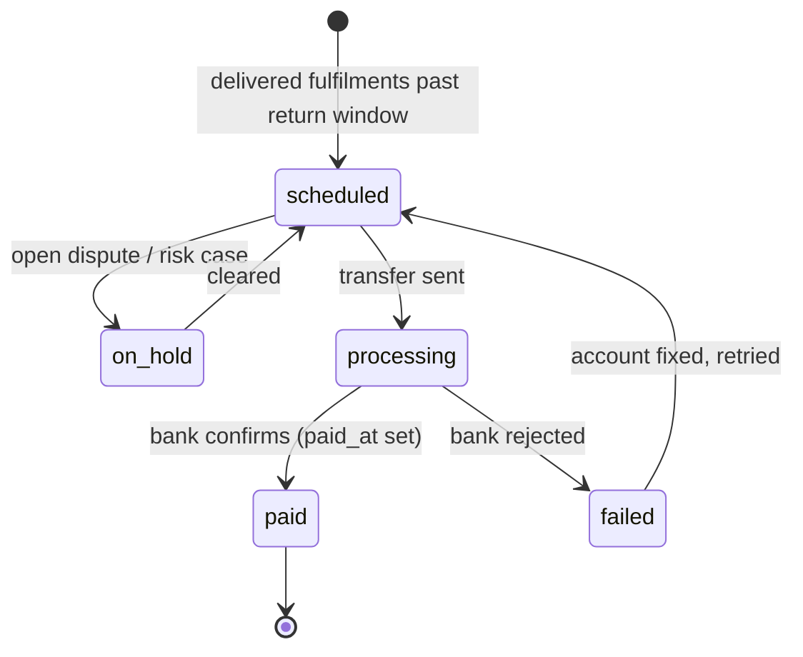
```mermaid
stateDiagram-v2
  [*] --> scheduled: delivered fulfilments past return window
  scheduled --> on_hold: open dispute / risk case
  on_hold --> scheduled: cleared
  scheduled --> processing: transfer sent
  processing --> paid: bank confirms (paid_at set)
  processing --> failed: bank rejected
  failed --> scheduled: account fixed, retried
  paid --> [*]
```

## Trade-in (`trade_ins.status`)

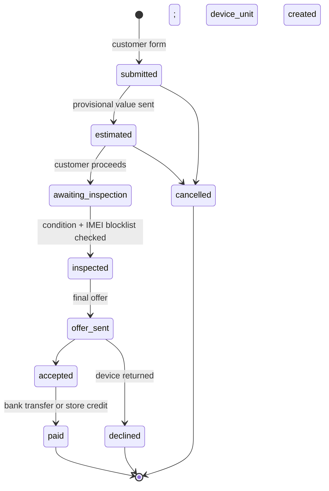
```mermaid
stateDiagram-v2
  [*] --> submitted: customer form
  submitted --> estimated: provisional value sent
  estimated --> awaiting_inspection: customer proceeds
  awaiting_inspection --> inspected: condition + IMEI blocklist checked
  inspected --> offer_sent: final offer
  offer_sent --> accepted
  offer_sent --> declined: device returned
  accepted --> paid: bank transfer or store credit; device_unit created
  submitted --> cancelled
  estimated --> cancelled
  paid --> [*]
  declined --> [*]
  cancelled --> [*]
```

## Warranty claim (`warranty_claims.status`)

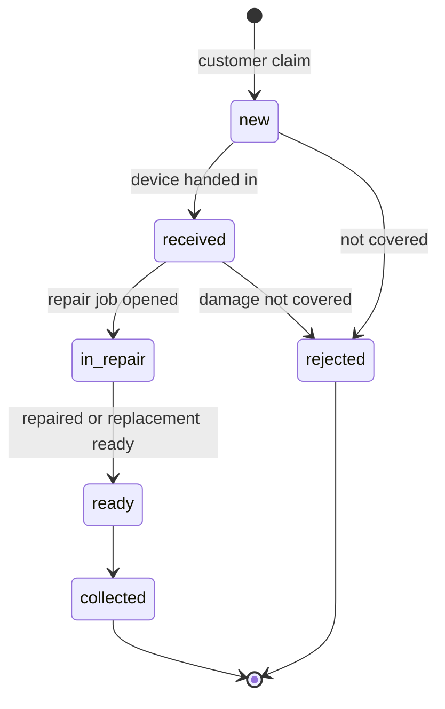
```mermaid
stateDiagram-v2
  [*] --> new: customer claim
  new --> received: device handed in
  new --> rejected: not covered
  received --> in_repair: repair job opened
  received --> rejected: damage not covered
  in_repair --> ready: repaired or replacement ready
  ready --> collected
  collected --> [*]
  rejected --> [*]
```

## Car listing (`car_listings.status`) and viewing (`viewing_bookings.status`)

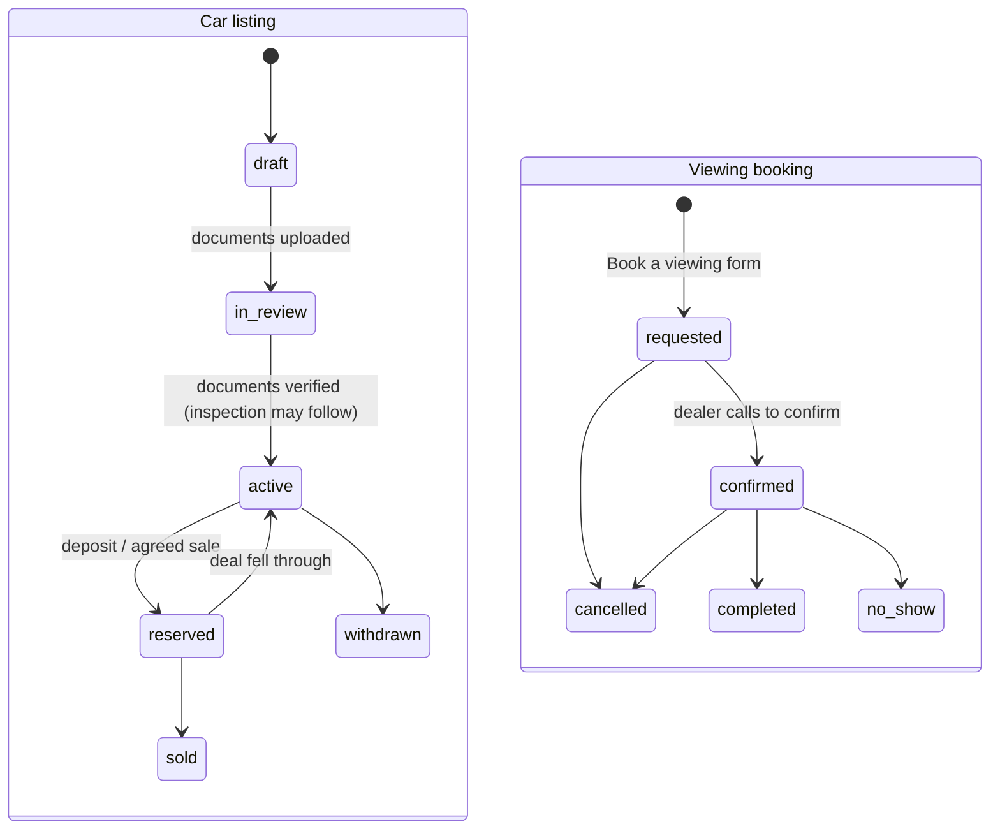
```mermaid
stateDiagram-v2
  state "Car listing" as car {
    [*] --> draft
    draft --> in_review: documents uploaded
    in_review --> active: documents verified (inspection may follow)
    active --> reserved: deposit / agreed sale
    reserved --> active: deal fell through
    reserved --> sold
    active --> withdrawn
  }
  state "Viewing booking" as viewing {
    [*] --> requested: Book a viewing form
    requested --> confirmed: dealer calls to confirm
    requested --> cancelled
    confirmed --> completed
    confirmed --> no_show
    confirmed --> cancelled
  }
```

## Support ticket (`support_tickets.status`)

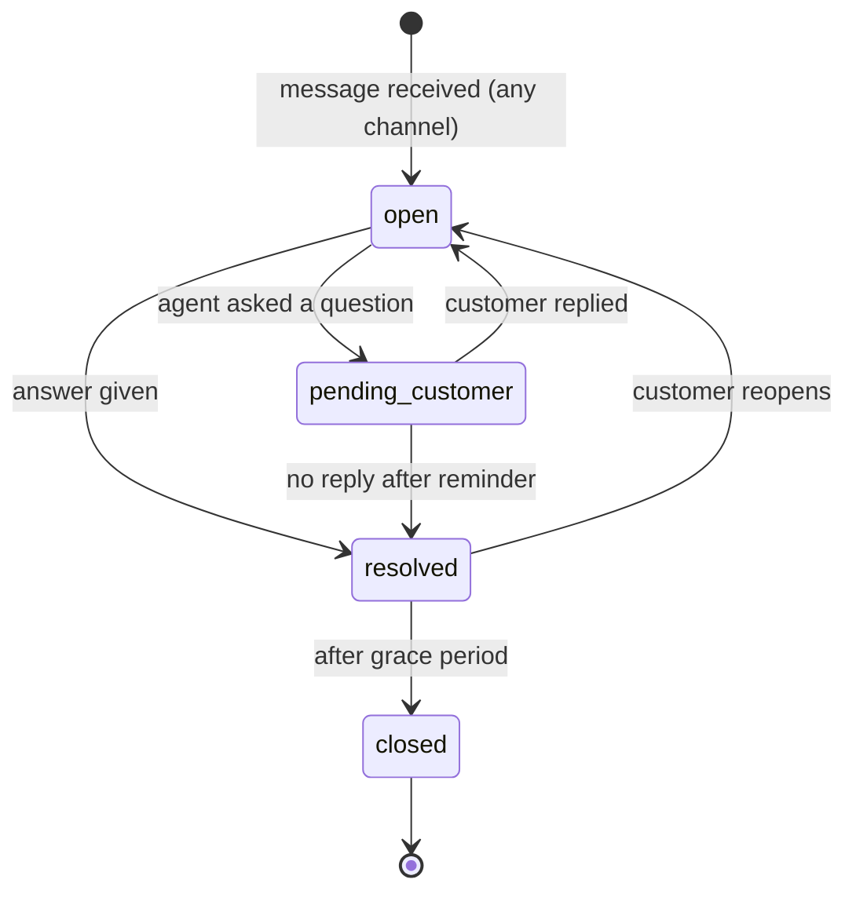
```mermaid
stateDiagram-v2
  [*] --> open: message received (any channel)
  open --> pending_customer: agent asked a question
  pending_customer --> open: customer replied
  open --> resolved: answer given
  pending_customer --> resolved: no reply after reminder
  resolved --> open: customer reopens
  resolved --> closed: after grace period
  closed --> [*]
```

## Other status fields

These have simple lifecycles that don't need a diagram:

| Column | Values | Rule |
|---|---|---|
| `users.status` | active → suspended → active; any → deleted | `deleted` anonymises personal data (NDPA) |
| `staff_members.status` | active ⇄ on_leave → exited | `exited` revokes all `staff_roles` |
| `businesses.status` | pending_verification → active ⇄ suspended | CAC verified before trade pricing |
| `credit_accounts.status` | applied → approved ⇄ suspended → closed | `limit_kobo` only usable when approved |
| `carts.status` | active → converted / abandoned | converted when an order is created |
| `device_units.status` | in_stock → reserved → sold; sold → returned → in_stock; any → in_repair / written_off | blocked IMEIs never reach `in_stock` |
| `stock_transfers.status` | draft → in_transit → received; draft → cancelled | movements posted on ship and receive |
| `purchase_orders.status` | draft → sent → partially_received → received; draft/sent → cancelled | `quantity_received ≤ quantity_ordered` |
| `riders.status` | off_shift ⇄ available ⇄ on_delivery | only available riders are assignable |
| `repair_jobs.status` | queued → diagnosing → awaiting_parts ⇄ repairing → done / unrepairable | |
| `promotions.status` | draft → scheduled → live → ended; any → cancelled | live only between `starts_at` and `ends_at` |
| `risk_cases.status` | open → cleared / blocked | resolver and time required |
| `cms_pages`, `help_articles` | draft → in_review → published | `published_at` required when published |
| `notifications.status` | queued → sent / failed; sent → read | |
| `financing_enquiries.status` | new → contacted → referred → closed | |
| `car_inspections.status` | scheduled → passed / passed_with_notes / failed | `inspected_at` required once done |
