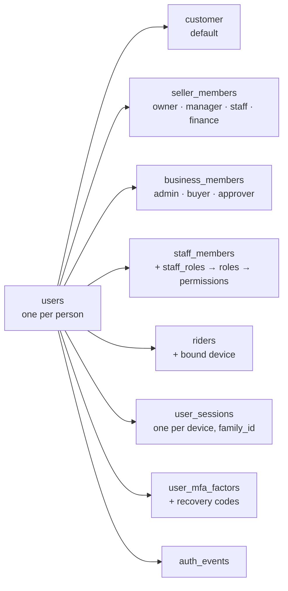
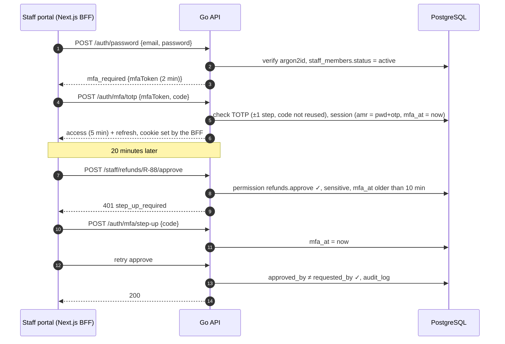
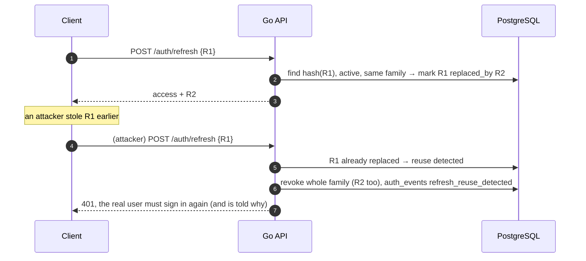
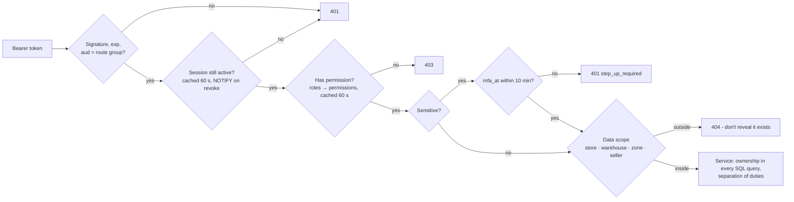

# TechShop identity and access (auth) system

The plan for who can sign in, how, and what they may do once signed in, across all five web apps, both mobile apps, the Python recommender and provider webhooks.

It expands [`backend.md`](backend.md) §2.2 and follows its decisions:
- Ed25519 JWT access tokens;
- rotating opaque refresh tokens;
- backend-for-frontend (BFF) cookies on the web;
- staff TOTP;
- RBAC enforced in Go.

**Status:** plan. Nothing is built. The `users`, `user_sessions`, `verification_codes`, `roles`, `permissions`, `role_permissions`, `staff_members`, `staff_roles` and `audit_log` tables exist in [`database/schema.sql`](database/schema.sql). Proposed changes are in [`schema-changes.md`](schema-changes.md) §1, §2 and §5.

**Interactive mockup and simulation:** [`mockups/identity-access.html`](mockups/identity-access.html).

**Related docs:** [`backend.md`](backend.md), [`database/access.md`](database/access.md) (who may touch which tables), [`messaging-marketing.md`](messaging-marketing.md) (OTP delivery lane), [`trust-safety.md`](trust-safety.md) (account takeover and risk), [`mobile.md`](mobile.md).

---

## 1. Summary

- **One person, one account.** A single `users` row signs in to every app. What the account may do comes from **memberships**: customer by default, plus seller member, business member, staff member and rider.
- **Sign-in matches the audience:**
  - phone OTP for customers and riders;
  - password + **TOTP** for staff (SMS is never a staff second factor, because of SIM-swap risk);
  - password with new-device OTP for sellers.
- **Short access, rotating refresh:**
  - **Access tokens:** 10-minute JWTs (5 minutes for staff). They carry **no permissions**, so a revoked role takes effect immediately.
  - **Refresh tokens:** opaque, rotate on every use, and a replayed old one revokes the whole session family (stolen-token detection).
- **The web never holds tokens in JavaScript.** Each Next.js app keeps them in its own encrypted `httpOnly` cookie and calls the API server-side (BFF). The API is cookie-free, which removes CSRF from the API entirely.
- **Staff access is role-based, least-privilege and audited.**
  - Sensitive actions (approve a refund or payout, reveal a NIN, change roles, export data) need a **recent MFA step-up** and are blocked when the approver is the requester.
  - Leaving staff lose every role and session in one transaction.
- **OTP abuse is a money problem** (SMS pumping), so OTP sends have database-backed limits per number, IP, device and globally. There is an invisible bot check, and only Nigerian numbers are accepted.
- **Everything security-relevant is an event** in `auth_events`, visible to the user ("Recent activity") and to admins.

---

## 2. Who signs in where

| App | Who | Sign-in | Second factor | Session (idle / absolute) | Access token |
|---|---|---|---|---|---|
| Market web, customer app | Customers | Phone OTP; optional password | — (new-device alert) | 30 d / 90 d | 10 min |
| Wholesale | Business buyers | Email + password, or phone OTP | Optional TOTP; **required for business admins** | 30 d / 90 d | 10 min |
| Seller Centre | Seller members | Email or phone + password | OTP on a new device; TOTP recommended (required for the `finance` seller role) | 14 d / 30 d | 10 min |
| Staff portal | Staff | Work email + password | **TOTP required**; step-up for sensitive actions | 12 h / 12 h | 5 min |
| Logistics app | Riders, dispatchers | Phone OTP + **device binding** | Biometric or PIN unlock on the device | 7 d / 30 d | 10 min |
| Corporate site | Public | — (contact forms only) | — | — | — |
| Python recommender | Service | Client credentials | — | — | 5 min, `aud=internal` |

**One account across apps:**
- The same phone number on Market and in the customer app is the same user.
- A seller who also shops uses one login and switches context in Seller Centre.
- Each web app has **its own session** (cookies are per hostname). A shared sign-in at `accounts.techshop.ng` is an open decision (§13); the token design already allows it.

---

## 3. Account model

**Identifiers:**
- **Phone** (`+234…`, unique, normalised by the same function on the web and in Go, with shared test vectors).
- **Email** (`citext`, unique).
- At least one of the two is required (existing check).

**Credentials:**
- `password_hash`: argon2id with m = 64 MiB, t = 3, p = 1, and per-hash parameters stored so they can be raised later.
- OTPs: in `verification_codes` (HMAC with a server pepper).
- TOTP secrets: in `user_mfa_factors`, envelope-encrypted.
- Passkeys (v2): in `webauthn_credentials`.

**Status:** `active`, `suspended` (signs in to a "your account is suspended" screen with support contact) or `deleted` (anonymised; see §11).

---

## 4. Sign-in flows

### 4.1 Phone OTP (customers, riders, guest checkout)

1. `POST /auth/otp/request {phone, purpose}`:
   - the phone is normalised and only `+234` mobile ranges are accepted;
   - **limits are checked (§6)**;
   - a 6-digit code is generated, stored as HMAC (`purpose`, `expires_at` = 10 min, `attempts` = 0), and `notify.Send` is called on the **critical** lane ([`messaging-marketing.md`](messaging-marketing.md) §3);
   - the response is always the same shape (`challengeId`, `resendAfter` = 60 s), whether or not the number has an account. This prevents account enumeration.
2. `POST /auth/otp/verify {challengeId, code}`:
   - constant-time compare;
   - each failure increments `attempts`, and the challenge **is burned after 5**;
   - on success, the code is consumed, the user is found or created (sign-up asks for a name next), and a session is created.
3. **New device or new state:** an `auth_events` row is written, plus a "new sign-in" push or email to the account's other channels.

### 4.2 Password (staff, sellers, business buyers, optional for customers)

- **Login:** `POST /auth/password {identifier, password}`.
  - **Progressive delay** per account and per IP: 0, 0, 0, 1, 2, 4… seconds, capped at 30 s. After 10 failures in 15 minutes, require the bot check. There is no hard lockout, which would let attackers lock real users out.
  - The same error message for "no such user" and "wrong password".
- **New passwords:** at least 10 characters, no composition rules. Rejected if found in a breached-password list. The planned check is the k-anonymity range API: only the first 5 characters of the SHA-1 hash leave the server. It is an open decision (§13), and a local top-100k list is the fallback.
- **Reset:** an OTP to the verified phone or a link to the verified email (single use, 30 min). On success **all sessions are revoked** and a notification is sent.

### 4.3 Staff sign-in with TOTP and step-up

**First sign-in (joiner):**
1. HR creates the staff member.
2. An invite link (single use, 72 h) goes to the work email.
3. The joiner sets a password and **enrols TOTP**: a QR code, then confirming one code.
4. They save 10 recovery codes (shown once, stored hashed).
5. They cannot use the portal until TOTP is confirmed.

**Lost authenticator:**
- use a recovery code;
- or an admin with `admin.mfa_reset` resets it after an identity check. It can't be your own; it is audited, and all sessions are revoked.

### 4.4 Passkeys (v2)

WebAuthn passkeys as the staff second factor, and later as passwordless sign-in for everyone. They are phishing-resistant, which TOTP is not. Planned once the browser and device mix is known. The table is proposed now, so no migration surprises later.

---

## 5. Tokens and sessions

| Token | Format | Lifetime | Stored where | Revocation |
|---|---|---|---|---|
| Access | JWT, EdDSA (Ed25519), header `kid` | 10 min (staff 5) | BFF memory per request; app memory | Expires; roles checked live, so no permission is baked in |
| Refresh | 256-bit random, base64url | Rotates every use; idle and absolute limits per app (§2) | BFF encrypted cookie; mobile SecureStore. **Database stores only SHA-256** | `user_sessions.revoked_at`; family revocation |
| MFA pending | JWT `typ=mfa`, 2 min | Single use | Client | Expires |
| Service | JWT `aud=internal`, 5 min | Client credentials | Python job memory | Rotate the client secret |

**Access token claims:**

| Claim | Meaning |
|---|---|
| `iss` | `https://api.techshop.ng` |
| `aud` | `market`, `wholesale`, `seller`, `staff`, `customer-app`, `logistics` |
| `sub` | User ID |
| `sid` | Session ID |
| `amr` | `["otp"]`, `["pwd","otp"]` or `["pwd","totp"]` |
| `auth_time`, `mfa_at` | When the person signed in, and when they last passed MFA |
| `exp` | Expiry |

The API rejects a token whose `aud` doesn't match the route group. A customer token can't call `/staff/**`.

**Rotation and reuse detection:**

**Grace window:** two refreshes racing from the same device within 10 seconds both succeed. This handles flaky mobile networks and parallel tabs without a false alarm.

**Signing keys:**
- The private key is in the secrets manager or KMS, never in the repo.
- Rotation every 90 days: a new `kid` signs, and old public keys stay valid for 1 hour after the last token they could have signed.

**Sessions page** ("Signed-in devices" for customers, sellers and staff):
- device name, app, approximate location (state from IP) and last used;
- "Sign out" per device, and "Sign out everywhere else".

### 5.1 Web: backend-for-frontend cookies

- **One cookie per app:** `__Host-ts_session`. It is `Secure`, `HttpOnly`, `SameSite=Lax`, `Path=/`, with no `Domain`, so it is never shared across subdomains.
- **Contents:** the session ID and refresh token, encrypted with AES-GCM using the app's own key.
- **Server-side calls:** Next.js server code (server components, server actions, route handlers) reads the cookie, refreshes when needed and calls the API with `Authorization: Bearer`. The browser never sees a token.
- **CSRF on the BFF:**
  - server actions already check `Origin`;
  - custom route handlers check `Origin`/`Sec-Fetch-Site`, and state-changing calls require `POST`;
  - `SameSite=Lax` blocks cross-site form posts carrying the cookie.
- **Sign-out:** clear the cookie and `POST /auth/logout` (revokes the session).

### 5.2 Mobile

- **Refresh token:** in `expo-secure-store` (Keychain / Keystore). The access token stays in memory only.
- **Optional biometric unlock:** the refresh token is read only after a local biometric or PIN check (the server is not involved).
- **Logistics device binding:**
  - the first sign-in on a phone registers a device ID;
  - a dispatcher approves it once;
  - unapproved devices can't receive jobs;
  - a lost phone is signed out remotely from Staff › HR or by the dispatcher.

---

## 6. Abuse protection

| Threat | Control |
|---|---|
| **SMS pumping** (bots trigger OTPs to premium or foreign numbers) | Only `+234` mobile ranges. Per-number limits: 1 every 60 s, 5 an hour, 10 a day. Per IP: 20 an hour. Per device: 5 numbers a day. A **global budget breaker**: if OTP sends in the last 15 minutes exceed 3× the normal level, every OTP request requires the bot check and an alert goes out. Termii spend alerts |
| Credential stuffing | Progressive delays, bot check after failures, breached-password check, same error for every failure, alerts on spikes in failed logins |
| Bots on sign-up and OTP | **Cloudflare Turnstile** (invisible) on web OTP, sign-up and password forms; device attestation (Play Integrity, App Attest) in the apps in v2 |
| Account enumeration | Identical responses and timing for existing and missing accounts |
| SIM swap / account takeover | New-device alerts. Phone or email change needs the current factor **and** notifies the old contact. A **24-hour hold on seller payout bank-account changes** after a phone, email or password change ([`payments-finance.md`](payments-finance.md)). Staff never use SMS as MFA |
| Session theft | Short access tokens, refresh rotation with reuse detection, revoke on password change, "sign out everywhere" |
| OTP brute force | 6 digits, 5 attempts per challenge, 10-minute expiry, single use, HMAC at rest |
| Privilege misuse by staff | Least privilege, step-up, separation of duties, audit log, quarterly access review |

**Limits are stored in Postgres** (`auth_rate_limits`: key, window start, count; upsert with a conditional increment). They work across API instances without Redis, consistent with [`architecture-decisions.md`](architecture-decisions.md) #12.

---

## 7. Authorisation

### 7.1 How a request is authorised

**How the checks run:**
- **Revocation is immediate:** role changes, session revokes and staff exits fire `pg_notify('authz')`, and every API instance drops its cache entries for that user.
- **Ownership lives in SQL:** `WHERE customer_user_id = $2` and `WHERE seller_id = ANY($memberships)`, so a missed check in a handler still can't leak data (broken object-level authorisation).

### 7.2 Staff roles (proposed templates)

**Permissions** follow `module.action` (the existing check: `^[a-z_-]+\.[a-z_]+$`). They are defined as Go constants and seeded into `permissions`. Sensitive ones are marked ★ (step-up required).

| Role | Main permissions |
|---|---|
| **Super admin** (break-glass, 2 people) | All. Sign-in alerts every admin; used only for emergencies |
| Admin (IT) | `admin.roles` ★, `admin.users`, `admin.mfa_reset` ★, `admin.audit_view`, `it.flags` |
| Operations manager | `orders.view`, `orders.edit`, `orders.cancel`, `dispatch.view`, `inventory.view`, `support.view`, `analytics.view` |
| Customer support agent | `support.view`, `support.reply`, `orders.view`, `returns.create`, `customers.view` (masked contact) |
| Support lead | Agent + `support.assign`, `refunds.request`, `customers.reveal_contact` ★ |
| Catalogue editor | `catalogue.view`, `catalogue.edit`, `catalogue.moderate`, `content.edit` |
| Inventory clerk / warehouse lead | `inventory.view`, `inventory.adjust` (lead: ★ above a threshold), `fulfilment.pick`, `fulfilment.pack` (scoped to their warehouse) |
| Dispatcher | `dispatch.view`, `dispatch.assign`, `riders.manage_devices` (scoped to zones) |
| Finance officer | `finance.view`, `refunds.request`, `payouts.prepare`, `reconciliation.resolve` |
| Finance manager | Officer + `refunds.approve` ★, `payouts.approve` ★, `ledger.adjust` ★, `finance.period_close` ★ |
| Risk analyst | `risk.view`, `risk.resolve`, `devices.block` |
| KYC reviewer | `vendors.view`, `vendors.kyc_review`, `vendors.reveal_id` ★ |
| Marketing executive / manager | `marketing.view`, `marketing.edit`, `marketing.segments` / + `marketing.approve` ★, `marketing.journeys` |
| Content editor | `content.edit`, `content.publish` |
| B2B account manager | `b2b.view`, `b2b.quotes`, `b2b.credit_request` |
| Store cashier / store manager | `pos.sell` / + `pos.refund` ★, `pos.close_shift` (scoped to their store) |
| HR officer | `hr.view`, `hr.manage` (joiners and leavers; can't grant roles) |
| Auditor | Read-only `*.view` + `admin.audit_view`; no reveal permissions |

**Rules:**
- **No one grants roles to themselves.** `admin.roles` can't add `admin.roles` to its own account. Super admin grants need two admins (proposal plus approval).
- **Separation of duties (in Go and the database):**
  - refund approver ≠ requester;
  - payout approver ≠ preparer;
  - campaign approver ≠ creator;
  - KYC approver ≠ submitter's account manager;
  - MFA reset ≠ self.
- **Data scopes:** `staff_role_scopes` limits a role to specific stores, warehouses or delivery zones.
- **Quarterly access review:** Admin › Access review lists every staff member's roles and last use, and unused sensitive roles are flagged for removal.

The final role list is an **owner decision** ([`database/access.md`](database/access.md) §3). These templates are the recommendation.

### 7.3 Seller and business roles

| Context | Roles | Notes |
|---|---|---|
| Seller (per shop) | `owner` (everything, one or more), `manager` (listings, orders, members except owner), `staff` (listings and orders), `finance` (payouts, statements; **TOTP required**) | Invites by email or phone; the owner can't be removed by a manager |
| Business (B2B) | `admin` (members, addresses, credit), `buyer` (create orders and quote requests up to a limit), `approver` (approves orders above the buyer's limit) | Approval limits per member |
| Rider | `rider`, `dispatcher` | Dispatchers are staff with the dispatcher role, scoped to zones |

---

## 8. Staff lifecycle

| Event | What happens (one transaction) |
|---|---|
| **Joiner** | HR creates `staff_members` → invite → password + TOTP enrolment → an admin grants roles (audited) |
| **Mover** | Role changes are proposed by a line manager and applied by an admin; old roles are removed the same day |
| **Leaver** | `status = exited`, all `staff_roles` deleted, all sessions revoked, push tokens revoked, SSE connections closed (`pg_notify`), audit entry. Their customer account (if any) keeps working without staff powers |
| **Suspended** | Like leaver, but reversible |

---

## 9. Service and machine access

- **Python recommender:** client credentials (`POST /internal/auth/token`) issue a 5-minute JWT, `aud=internal`, with scopes `recs.export`/`recs.import`. It is only accepted on the internal listener, which is not routed by nginx.
- **Provider webhooks:** no tokens. Each request is verified by the provider's signature, then deduplicated and verified with the provider ([`payments-finance.md`](payments-finance.md)).
- **CI/CD:** no production database credentials. Migrations run from the deploy job with a migration-only role.

---

## 10. Audit and security events

- **`audit_log`** (existing) records *what changed*: entity, before and after.
- **`auth_events`** (new, append-only, partitioned monthly) records *security events*:
  - `otp_requested`, `otp_failed`, `login_succeeded`, `login_failed`;
  - `mfa_enrolled`, `mfa_failed`, `step_up_succeeded`;
  - `refresh_reuse_detected`, `session_revoked`;
  - `password_changed`, `phone_changed`;
  - `role_granted`, `role_revoked`, `reveal_id`;
  - `rate_limited`.

  Each row stores the user ID (nullable), IP, user agent, device ID and approximate location (state).
- **Users see their own** recent activity. Admins see everyone's, with filters.
- **Alerts:** reuse detection, super-admin sign-in, mass OTP failures and a sudden rise in step-up failures go to the security channel.

---

## 11. Privacy (NDPA)

- **Data export:** `POST /me/privacy/export` creates a job that produces a ZIP of profile, orders, addresses, consents and messages. Delivered as a short-lived link.
- **Deletion:** `POST /me/privacy/delete` asks for re-authentication, then a 7-day cancel window, then anonymisation:
  - names → "Deleted user";
  - phone and email → null;
  - sessions, push tokens and MFA → deleted;
  - orders and ledger kept with no personal data (tax law).
- **IP addresses** in `auth_events` are kept for 12 months, then truncated.

---

## 12. Data model

| Table | Status | Purpose and key columns |
|---|---|---|
| `users`, `roles`, `permissions`, `role_permissions`, `staff_members`, `staff_roles`, `audit_log` | Existing | — |
| `user_sessions` | Change (#29) | `family_id, replaced_by, client, aud, device_id, device_name, app_version, last_used_at, mfa_at, idle_expires_at` |
| `verification_codes` | Change (#30) | `ip, user_agent, challenge_id`; purposes add `staff_mfa`, `new_device`; drop `delivery_otp` |
| `user_mfa_factors`, `user_recovery_codes` | Proposed (#6, #7) | TOTP secret (encrypted), confirmed; recovery code hashes |
| `auth_events` | **New** | `id bigint, user_id null, kind, ip, user_agent, device_id, state_code, meta jsonb, created_at`; partitioned monthly |
| `auth_rate_limits` | **New** | `key (e.g. otp:phone:+234…), window_start, count`; PK `(key, window_start)` |
| `staff_role_scopes` | **New** | `user_id, role_id, scope_type (store, warehouse, zone), scope_id` |
| `staff_invites` | **New** | `staff_user_id, token_hash, expires_at, used_at` |
| `rider_devices` | **New** | `rider_id, device_id, platform, approved_by, approved_at, revoked_at` |
| `service_clients` | **New** | `id, name, secret_hash, scopes text[], rotated_at` |
| `webauthn_credentials` | **New (v2)** | `user_id, credential_id unique, public_key, sign_count, transports, created_at, last_used_at` |
| `seller_members`, `business_members` | Change | Add `role` check values as in §7.3 and `approval_limit_kobo` (business) |

---

## 13. API

| Group | Endpoints |
|---|---|
| Sign-in | `POST /auth/otp/request`, `/auth/otp/verify`, `/auth/password`, `/auth/mfa/totp`, `/auth/mfa/recovery`, `/auth/mfa/step-up`, `/auth/refresh`, `/auth/logout`, `/auth/password/reset/request`, `/auth/password/reset/confirm`, `/auth/invite/accept` |
| Account | `GET /me`, `PATCH /me`, `POST /me/phone/change` (current factor + new OTP), `POST /me/email/change`, `POST /me/password`, `GET /me/sessions`, `DELETE /me/sessions/{id}`, `POST /me/sessions:revoke-others`, `POST /me/mfa/totp/setup`, `/confirm`, `DELETE /me/mfa/totp`, `POST /me/mfa/recovery-codes`, `GET /me/security-events` |
| Staff admin | `/staff/admin/roles` (CRUD, permissions), `/staff/admin/members/{id}/roles` (grant, revoke), `/staff/admin/members/{id}:reset-mfa`, `/staff/admin/members/{id}:revoke-sessions`, `/staff/admin/auth-events`, `/staff/admin/access-review`, `/staff/hr/members` (joiners, leavers), `/staff/dispatch/devices` (approve, revoke) |
| Seller / business | `/seller/{id}/members` (invite, role, remove), `/business/{id}/members` |
| Internal | `POST /internal/auth/token` (client credentials) |

---

## 14. Screens

Shown in the mockup:
- **Market:** phone sign-in with a live SMS on the phone, wrong-code and lockout behaviour, resend timer, and a "new device" alert.
- **Account › Security:** signed-in devices, sign out others, TOTP setup with a live authenticator, recovery codes, recent activity.
- **Staff:** password and TOTP sign-in; a refund approval that triggers **step-up**; separation-of-duties block.
- **Admin console:** roles × permissions matrix (sensitive marked), staff members (grant/revoke roles, exit a staff member), auth events.

---

## 15. Delivery plan

| Milestone | Scope |
|---|---|
| **A1** (backend M1) | Phone OTP (customers), sessions with rotation and reuse detection, JWT signing with `kid`, BFF cookie helper shared by the Next apps, rate limits, `auth_events` |
| **A2** | Staff password + TOTP + recovery codes, invites, RBAC with the permission catalogue and role templates, step-up, audit views, leaver flow |
| **A3** | Seller and business members and roles, seller new-device OTP, logistics device binding |
| **A4** | Account security pages (devices, activity), phone and email change, privacy export and delete, Turnstile |
| **A5** | Passkeys for staff, optional shared sign-in (`accounts.techshop.ng`), app attestation |

---

## 16. Risks and open decisions

**Risks:**
- **OTP cost and deliverability** are a single point of failure for customer sign-in. Mitigations: backup SMS provider on the critical lane, email OTP fallback, voice OTP (v2).
- **Staff phishing:** TOTP can be phished. Mitigations: passkeys in A5, short staff sessions, sign-in alerts.
- **Over-broad roles over time:** quarterly access review and unused-permission reports.

**Open decisions for the owner:**
1. Approve the staff role list (§7.2), and who holds super admin.
2. Customers: phone OTP only, or also allow passwords? (Recommendation: OTP by default, password optional.)
3. Shared sign-in across Market and Wholesale (`accounts.techshop.ng`) at launch or later?
4. Breached-password check through the external range API (sends 5 hash characters) or a local list only?
5. Cloudflare Turnstile as the bot check (requires Cloudflare in front of the site, or its standalone widget).
6. Session lengths in §2.
