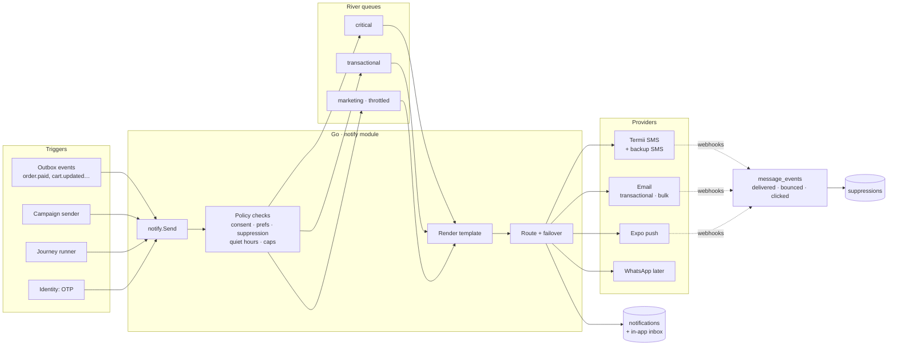
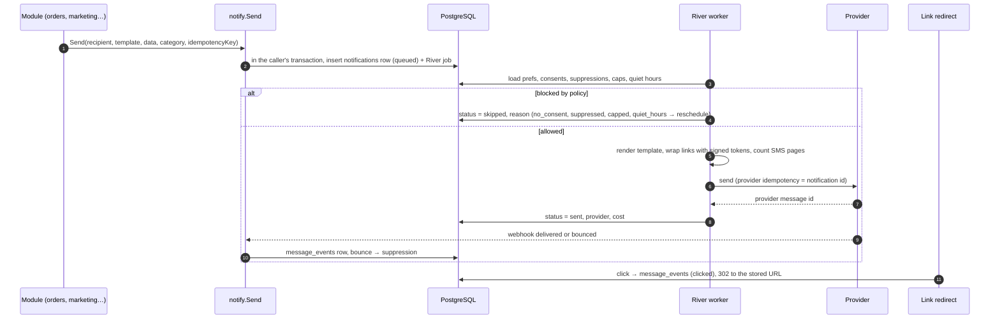
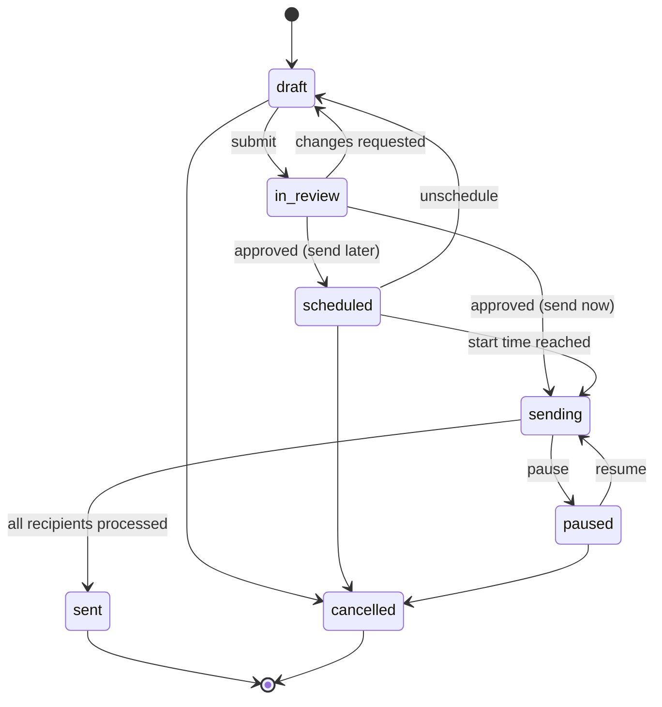
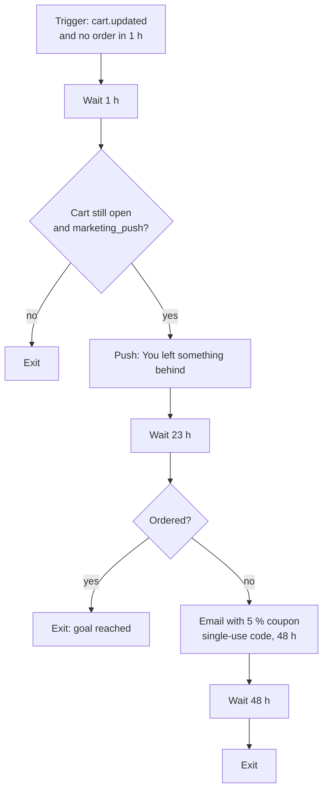

# TechShop messaging and marketing service

The plan for everything TechShop sends to people, and the marketing tools that decide what to send:
- **Messaging** (the `notify` module): SMS, email, push, in-app inbox and, later, WhatsApp. Sign-in codes, delivery codes, order updates, receipts and every marketing message go through one pipeline.
- **Marketing** (the `marketing` module): audiences (segments), one-off campaigns, automated journeys (abandoned cart, back in stock…), A/B tests, coupons, banners and attribution.

**Status:** plan. Nothing is built. The `notifications`, `promotions`, `coupons` and `banners` tables exist in [`database/schema.sql`](database/schema.sql); everything else here is proposed in [`schema-changes.md`](schema-changes.md) §4.

**Interactive mockup and simulation:** [`mockups/messaging-marketing.html`](mockups/messaging-marketing.html) (published privately as a claude.ai artifact, link in [`log.md`](log.md)).

**Related docs:** [`backend.md`](backend.md) (modules, outbox, River), [`identity-access.md`](identity-access.md) (OTP), [`recommendations.md`](recommendations.md) (personalised content), [`architecture-decisions.md`](architecture-decisions.md) (consents table), [`mobile.md`](mobile.md) (push).

---

## 1. Summary

- **One send pipeline for every message.** Anything that sends goes through `notify.Send`. It checks consent, preferences, the suppression list, quiet hours and frequency caps, renders the template, picks a provider and records the result. No module calls an SMS or email provider directly.
- **Three priority lanes** on separate River queues with their own workers:
  - `critical`: sign-in codes, delivery codes, security alerts;
  - `transactional`: order updates and receipts;
  - `marketing`: campaigns and journeys, throttled.

  A 100,000-person campaign can never delay someone's sign-in code.
- **Transactional and marketing mail are separated** at every layer:
  - different sending subdomains (`mail.techshop.ng` and `news.techshop.ng`);
  - different providers or IP pools;
  - different SMS routes (Termii's DND-capable transactional route vs the promotional route).

  A spam complaint about a promotion can't hurt receipt delivery.
- **Marketing only with recorded consent**, per channel (`marketing_sms`, `marketing_email`, `marketing_push` in `consents`). One-click unsubscribe in every marketing email; "STOP" handling for SMS; a preference centre on web and in the app.
- **Marketers work in the Staff portal › Marketing:**
  - segments are built with a rule builder and show live counts;
  - campaigns go draft → review → approved → sending, with a cost estimate, test send and approval rules;
  - journeys are automations with waits, conditions and goals.
- **Measured honestly.** Every link is tracked through a signed redirect. Orders within 7 days of a click are attributed to the message. A 5 % holdout per campaign measures real lift, not just clicks.
- **Only Go touches the database.** Providers are reached through ports (adapters) in Go; provider webhooks come back to Go.

---

## 2. What gets sent (the message catalogue)

| Category | Examples | Channels (in order) | Can the person turn it off? | Lane |
|---|---|---|---|---|
| `security` | Sign-in code, new device sign-in, password changed, staff MFA reset | SMS → email (code); push + email (alerts) | No | critical |
| `delivery` | Delivery code, rider on the way, delivery attempt failed | SMS + push | No | critical |
| `orders` | Order confirmed, payment received, shipped, delivered, refund processed, receipt | Push → SMS fallback; email receipt | Choose push or SMS; email receipt always | transactional |
| `account` | Welcome, email verification, privacy export ready | Email | No | transactional |
| `seller` | New order, payout sent, KYC result, listing rejected | Email + push + in-app | Per channel | transactional |
| `b2b` | Quote ready, invoice due, credit approved | Email | No (contractual) | transactional |
| `deals` | Campaigns, flash sales, coupons | Email, SMS, push, WhatsApp (later) | **Yes, per channel; off by default** | marketing |
| `recommendations` | "Back in stock", "price dropped", "picked for you" | Push, email | Yes; off by default | marketing |
| `reminders` | Abandoned cart, review request, warranty ending | Push, email | Yes | marketing |

Transactional messages never contain promotional content (a receipt does not advertise a sale). This keeps them legal to send without marketing consent and keeps the transactional route clean.

---

## 3. Architecture

### 3.1 The send pipeline

**Rules:**
- **Idempotent.** Each send has a caller-supplied key (for example `order:TS-10482:paid:sms`); a duplicate is a no-op. The notification ID is passed to the provider, where supported, so a worker retry never sends twice.
- **Inside the caller's transaction.** `notify.Send` writes the row and the River job in the same transaction as the business change. A rollback means nothing is sent.
- **Policy is checked at send time, not at enqueue time**, so a withdrawal of consent between scheduling and sending is respected.
- **Quiet hours (21:00–08:00 WAT)** reschedule marketing to 08:00. Critical and transactional messages ignore quiet hours.
- **Frequency caps (marketing only, configurable):** SMS 1 per day and 3 per week; email 1 per day; push 2 per day. A capped message is skipped with reason `capped`; journeys may retry it the next day.
- **Fallback:** for `orders`, push first; if there is no active push token or the push is not delivered within 10 minutes, send SMS. Critical codes go by SMS, then email if the SMS provider fails.
- **Provider failover:** each provider has a circuit breaker (5 failures in 60 s → open for 2 minutes). **Critical** messages fail over to the backup provider; marketing waits and retries instead (cheaper, and not urgent).

### 3.2 Channels and providers

| Channel | Provider (launch) | Backup | Notes |
|---|---|---|---|
| SMS | **Termii**, transactional (DND) route for critical and transactional; promotional route for marketing | A second Nigerian SMS aggregator, for critical only | Registered sender ID "TechShop". GSM-7: 160 characters per page (153 when split); a single non-GSM character (for example, an emoji) switches to UCS-2, with 70 (67) per page. The composer warns about it |
| Email, transactional | ZeptoMail or Postmark from `mail.techshop.ng` | Amazon SES | SPF, DKIM and DMARC (`p=quarantine`, then `reject`) |
| Email, marketing | Amazon SES from `news.techshop.ng` (separate configuration set) | — | IP and domain warm-up over 4–6 weeks; `List-Unsubscribe` + `List-Unsubscribe-Post` (one-click); keep complaints < 0.1 % |
| Push | Expo push (FCM/APNs) | — | Tokens in `push_tokens`; receipts job every 15 minutes removes dead tokens |
| In-app | `notifications` + SSE | — | The bell in the web header, the inbox in the app and the Staff portal bell |
| WhatsApp (v2) | Meta WhatsApp Cloud API or Termii WhatsApp | — | Message templates must be pre-approved by Meta; a per-conversation cost; separate `marketing_whatsapp` consent |

Exact prices, rate limits and webhook signature schemes are confirmed against each provider's current documentation during implementation and recorded in [`log.md`](log.md). The mockup uses ₦5 per SMS page as a placeholder.

### 3.3 Templates

- **Transactional templates live in code**: `internal/notify/templates/<key>/<channel>.<locale>.tmpl`. They use Go `html/template` and `text/template`, with a typed data struct per template, and are reviewed like code. Email layouts share one responsive HTML layout tested in the major clients.
- **Marketing content is authored in the Staff portal** with a block editor: heading, text, image, button, product grid from a list or from recommendations, and coupon. It is stored as JSON blocks and rendered by Go into the same layout. HTML is never pasted in, so there is no injected markup.
- **Merge tags:** `{{first_name}}`, `{{coupon}}`, `{{product_grid}}`, … Each has a required fallback ("there"), so a missing first name never produces "Hi ,".
- **Locales:** English at launch. The `locale` column allows Pidgin, Hausa, Yoruba and Igbo later.
- **Versioning:** every published change creates a new `template_versions` row. A message records the version it was rendered from.

---

## 4. Marketing

### 4.1 Audiences (segments)

- **Rules are JSON** (`all`/`any` groups of `field operator value`). Go compiles them to SQL using an **allowlist of fields**, so a marketer can never write SQL.
- **Field groups:**
  - **profile:** state, city, account age, customer type (B2C, B2B, seller);
  - **orders:** count, total spent, last order date, categories bought, average order value;
  - **behaviour** (`user_events`, consented people only): viewed category or product, added to cart, searched;
  - **engagement:** opened or clicked in the last N days;
  - **consent:** per channel;
  - **recommendations:** "high affinity for gaming".
- **Live counts per channel:** the builder shows how many people match, then how many can actually be reached on each channel after consent, suppression and valid address.
- **Dynamic vs snapshot:** a segment is evaluated when the campaign starts sending, and the recipient list is **snapshotted** into `campaign_recipients`. Results are then stable and auditable, even if people change later.
- **Built-in segments:**
  - "New this week";
  - "Bought a phone 10–14 months ago" (upgrade window);
  - "Viewed gaming laptops in the last 14 days, no purchase";
  - "Lapsed: no order in 120 days";
  - "Lagos B2B buyers";
  - "High-value: > ₦2m in 12 months".

### 4.2 Campaigns

**The builder has four steps:**
1. **Audience:** a segment plus exclusions, such as "ordered in the last 3 days" or "received a campaign today".
2. **Content:** for each channel, write the content or pick a template. SMS shows a live character and page count; the preview shows the message on a phone, an email client or a lock screen.
3. **Schedule:** send now or at a time. Choose an optional A/B test (two subject lines or messages, sent to a test share such as 20 %; the winner, by clicks after 4 hours, goes to the rest). A **5 % holdout** gets nothing, for measuring lift.
4. **Review:** reachable count per channel and **estimated cost** (SMS pages × price). Then a test send to the seed list, and submit.

**Approval rules (configurable):**
- review is needed above 10,000 recipients, above ₦100,000 SMS cost, or for any campaign that creates coupons;
- the approver must be a different person from the creator (separation of duties, like refunds).

**Sending:**
- a River job snapshots recipients, then fans out batches of 500 into the `marketing` queue;
- the queue's throughput is capped per provider (for example, email at 40/s and SMS at 20/s), so the transactional lanes are never starved;
- progress (queued, sent, delivered, failed) streams to the campaign page over SSE;
- **pause stops new batches immediately.**

### 4.3 Journeys (automations)

A journey is a trigger plus a list of steps:
- **wait** (for a duration or until a time of day);
- **condition** (still has items in cart? opened the last message?);
- **send** (channel + template);
- **issue a coupon**;
- **branch**;
- **exit when the goal is reached** (for example, an order placed).

**Launch journeys:**
- welcome series (3 emails over a week);
- abandoned cart (above);
- browse abandonment;
- back in stock;
- price drop on a saved item;
- post-delivery review request (7 days after delivery);
- warranty ending (30 days before);
- win-back (120 days);
- B2B quote follow-up (2 and 5 days after sending);
- seller onboarding nudges.

**How a journey runs:**
- enrolments live in `journey_enrollments` (`current_step`, `next_run_at`, `status`). A River periodic job processes due enrolments every minute.
- **re-entry rules** per journey (for example, an abandoned cart at most once every 7 days);
- **global caps** apply across journeys and campaigns;
- **goal events exit immediately**, so nobody gets a "you forgot your cart" after they paid.

### 4.4 Coupons and promotions

- **Existing tables:** `promotions`, `coupons` and `coupon_redemptions` (rules in [`backend.md`](backend.md) §4.4).
- **Unique single-use codes** per recipient (for example, `CART-7KQ2M9`) come from a new `coupon_codes` table, generated in bulk when the campaign or journey step runs. A leaked code works once, for one person.
- **Coupon value is never inside the message link.** It is applied at checkout after validation.
- **FCCPA:** "was" prices and countdowns must be real (the `ends_at` of the promotion), as already enforced in catalogue.

### 4.5 Attribution and reporting

- **Links:**
  - every link in a marketing message is rewritten to `https://t.techshop.ng/c/<token>`;
  - the token is a signed reference to a stored `tracked_links` row (never a raw URL), **so the redirect can't be abused as an open redirect**;
  - a click records `message_events(clicked)` and redirects with UTM parameters plus `msg=<id>`.
- **Opens** are recorded from a pixel but treated as a weak signal: Apple Mail Privacy Protection pre-loads images. A/B winners use clicks.
- **Conversion:** an order within 7 days of a click is attributed to that message (last click), stored on `orders.attributed_notification_id`.
- **Lift:** conversion of recipients vs the 5 % holdout gives incremental revenue. This is the number that decides whether a campaign worked.
- **Dashboards (Staff › Marketing › Overview):**
  - sent, delivered, opened, clicked, converted, revenue, unsubscribes and complaints, per campaign and per channel;
  - SMS spend;
  - deliverability (bounce and complaint rates against thresholds).

---

## 5. Consent, preferences and compliance

| Rule | How it is enforced |
|---|---|
| **NDPA 2023:** marketing needs consent; withdrawal as easy as giving it; records kept | `consents` (append-only) per channel; checked at send time; unsubscribe and STOP write a withdrawal row; preference centre on web and app |
| **NCC Do-Not-Disturb rules:** no promotional SMS to DND numbers | Promotional SMS only through the promotional route (the aggregator filters DND numbers); critical and transactional messages through the DND-capable transactional route |
| **Bulk email sender rules** (Gmail, Yahoo, Microsoft) | SPF, DKIM, aligned DMARC; one-click unsubscribe; complaint rate < 0.1 % (alert at 0.08 %); hard bounces suppressed immediately |
| **FCCPA:** no misleading promotions | Real end times; compare-at price guard (catalogue) |
| **Staff access** | Permissions: `marketing.view`, `marketing.edit`, `marketing.approve`, `marketing.segments`, `marketing.journeys`, `notify.templates`. **No bulk export of contact lists** from the UI |
| **Retention** | Message bodies kept 90 days, then only metadata; `message_events` 13 months; consents kept for as long as the account exists + 6 years |

Legal interpretations here should be confirmed by the company's counsel before launch (listed in §11).

**Preference centre** (web `/account/notifications`, app › Account › Notifications):
- **Always on:** `security`, `delivery`.
- **Choose a channel:** `orders` (push or SMS).
- **Per-channel toggles:** `deals`, `recommendations`, `reminders`.
- **Quiet hours:** default 21:00–08:00, editable.
- **Unsubscribe link:** opens a page that has already unsubscribed the person (one-click). It offers "pause for 30 days" and per-category choices, never a login wall.

---

## 6. Data model

Existing tables used: `users`, `consents` (proposed), `push_tokens` (proposed), `notifications`, `promotions`, `coupons`, `coupon_redemptions`, `banners`, `user_events` (proposed), `outbox_events`.

**Proposed** (also listed in [`schema-changes.md`](schema-changes.md) §4):

| Table | Purpose | Key columns |
|---|---|---|
| `notifications` (extend) | The per-recipient message log and in-app inbox | add `category, priority, locale, template_version_id, campaign_id, journey_enrollment_id, provider, provider_message_id, to_hash, cost_kobo, idempotency_key unique, skip_reason, delivered_at, clicked_at, error`; status adds `skipped`, `delivered`, `bounced` |
| `message_events` | Append-only provider callbacks and clicks | `notification_id, kind (delivered, bounced, complained, opened, clicked, unsubscribed, failed), occurred_at, meta jsonb` |
| `message_suppressions` | Never send to these addresses on this channel | `channel, address_hash unique, reason (hard_bounce, complaint, unsubscribed, invalid, manual), created_at` |
| `notification_preferences` | Category × channel choices | `user_id, category, channel, enabled` (PK of the first three) |
| `notification_settings` | Quiet hours per user | `user_id pk, quiet_start, quiet_end, timezone default 'Africa/Lagos'` |
| `message_templates`, `template_versions` | Marketing-authored content and versions | `key, channel, category, locale, status`; versions with `subject, blocks jsonb, created_by, published_at` |
| `segments` | Saved audiences | `name, rules jsonb, created_by, last_count, last_counted_at` |
| `campaigns` | One-off sends | `name, status (state machine above), segment_id, exclusions jsonb, channels, scheduled_at, holdout_pct, ab_test jsonb, created_by, approved_by (≠ created_by), cost_estimate_kobo` |
| `campaign_variants` | A/B content | `campaign_id, label, channel, template_version_id, share_pct, is_winner` |
| `campaign_recipients` | Recipient snapshot | `campaign_id, user_id, variant_id null, holdout bool, status`; partitioned by campaign month |
| `journeys`, `journey_steps` | Automations | `trigger, entry_rules jsonb, reentry_days, goal_event, status`; steps with `kind, config jsonb, position` |
| `journey_enrollments` | People inside a journey | `journey_id, user_id, current_step, next_run_at, status (active, exited, goal_reached, failed)`; index on `(next_run_at) where status = 'active'` |
| `tracked_links` | Signed link redirect targets | `id, url, notification_id null, campaign_id null` |
| `coupon_codes` | Unique single-use codes | `coupon_id, code unique, issued_to_user_id, notification_id, redeemed_at` |
| `orders` (extend) | Attribution | add `attributed_notification_id null` |

---

## 7. API

All endpoints are under `/api/v1`, in the shape described in [`backend.md`](backend.md) §2.

| Who | Endpoints |
|---|---|
| Customer | `GET/PUT /me/notification-preferences`, `GET /me/notifications` (inbox, cursor), `POST /me/notifications/{id}/read`, `GET /me/notifications/stream` (SSE), `POST /me/push-tokens` |
| Public | `GET/POST /unsubscribe/{token}` (one-click, RFC 8058), `GET /c/{token}` (click redirect, on `t.techshop.ng`), `POST /sms/inbound` (STOP keywords, provider-signed) |
| Webhooks | `POST /webhooks/termii`, `/webhooks/email/{provider}`, `/webhooks/expo` (signature checked; deduplicated) |
| Staff | `/staff/marketing/segments` (+ `:count`), `/staff/marketing/campaigns` (+ `:submit`, `:approve`, `:schedule`, `:pause`, `:resume`, `:cancel`, `:test-send`, `/stats`, `/stream`), `/staff/marketing/journeys` (+ `:activate`, `:pause`, `/stats`), `/staff/notify/templates`, `/staff/notify/suppressions`, `/staff/notify/messages` (search by recipient for support, masked) |

---

## 8. Staff and customer screens

Shown in the mockup:
- **Staff › Marketing:**
  - Overview (KPIs, recent campaigns, deliverability);
  - Campaigns (list and the 4-step builder with preview, cost, approval and live sending);
  - Audiences (rule builder with live counts);
  - Journeys (list, the abandoned-cart canvas, per-step stats, activate and pause);
  - Templates (transactional catalogue with previews);
  - Settings (quiet hours, caps, approval thresholds, sender identities).
- **Customer:** preference centre, one-click unsubscribe page, in-app inbox, push on the lock screen, SMS thread, marketing email.

---

## 9. Scale and cost (assumptions)

- **Audience size:** about 200,000 customers in year one; a large campaign reaches about 60,000 emails and 15,000 SMS (SMS consent is rarer).
- **Email at 40/s:** 60,000 emails take about 25 minutes. SMS at 20/s: 15,000 take about 13 minutes. Critical lanes are unaffected (separate queue and workers).
- **SMS is the main cost.** 15,000 × 1 page × ₦5 (placeholder) ≈ ₦75,000 per campaign, hence cost estimates, approval thresholds and caps. Email and push are near-free.
- **Storage:** about 2 rows per message (`notifications` + events). At about 1.5 million messages a month, that is about 3 million rows a month; bodies are trimmed after 90 days, and `message_events` is partitioned monthly.

---

## 10. Delivery plan

| Milestone | Scope | Depends on |
|---|---|---|
| **N1** (with backend M1) | `notify.Send`, the three queues, Termii SMS + transactional email + Expo push, code templates for OTP, delivery code and order updates, provider webhooks, suppressions | Outbox + River |
| **N2** | Preference centre, consents per channel, in-app inbox + SSE, unsubscribe page, quiet hours, caps | `consents`, `push_tokens` |
| **N3** | Segments (builder, counts), campaigns (builder, approval, fan-out, pause), tracked links, campaign stats | `user_events` |
| **N4** | Journeys (abandoned cart, back in stock, welcome, review request, win-back), unique coupon codes | Catalogue stock events |
| **N5** | A/B tests, holdout lift reporting, recommendation blocks in emails, WhatsApp channel, Pidgin locale | Recommendations v1 |

---

## 11. Risks and open decisions

**Risks:**
- **SMS pumping fraud** (bots requesting OTPs to premium numbers): handled in [`identity-access.md`](identity-access.md) §6 (rate limits, Nigerian numbers only, Turnstile).
- **Domain reputation:** a bad first campaign can put `news.techshop.ng` in spam. Mitigated with warm-up, starting with engaged users, separate subdomains and complaint alerts.
- **Over-messaging:** global caps across campaigns and journeys, plus holdout measurement to show diminishing returns.
- **Provider lock-in:** every provider sits behind a port, and templates are ours.

**Open decisions for the owner:**
1. Email providers (ZeptoMail vs Postmark for transactional; SES for bulk).
2. Backup SMS aggregator.
3. Approval thresholds (default: 10,000 recipients or ₦100,000).
4. Default frequency caps.
5. When to add WhatsApp (cost per conversation vs SMS).
6. Whether sellers may run their own coupon campaigns to their past buyers (v2; needs a seller-funded promotion model).
7. **Legal review** of consent wording, DND handling and retention periods.
