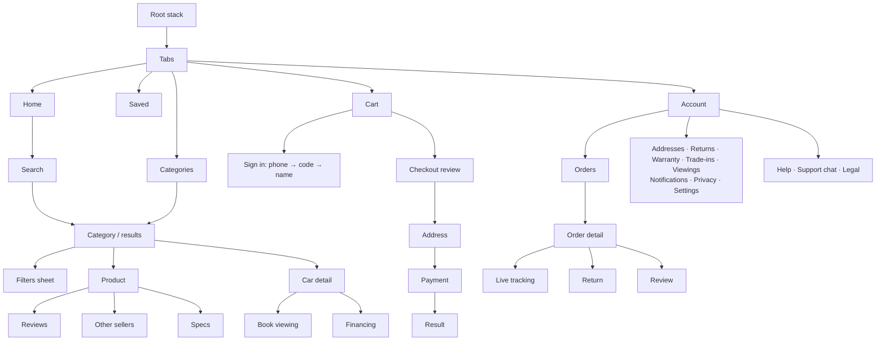
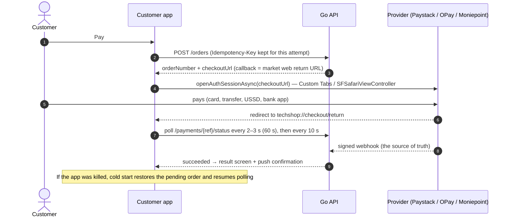
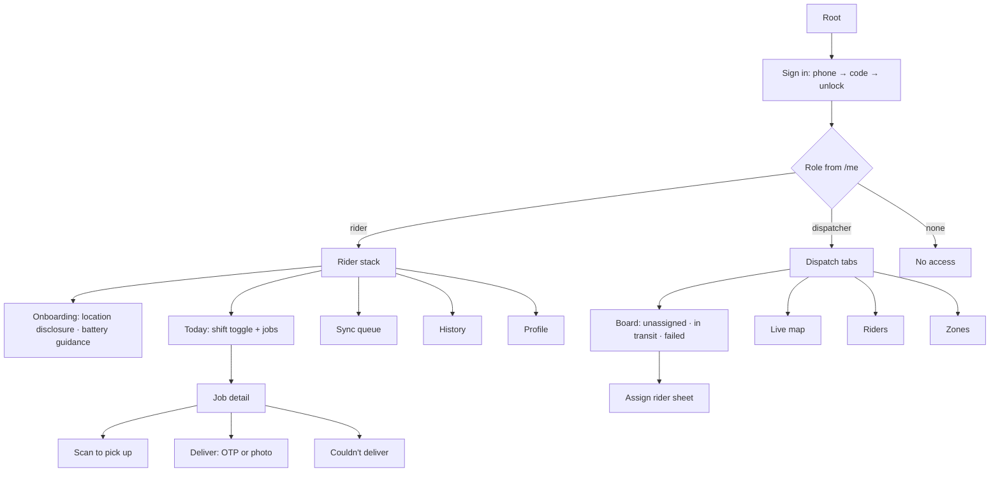
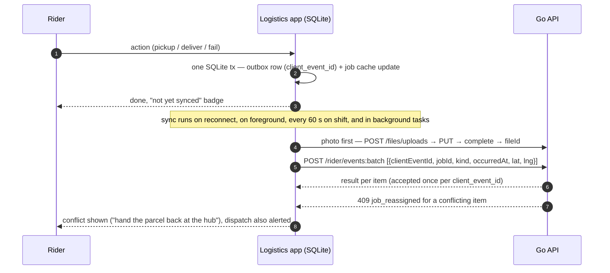
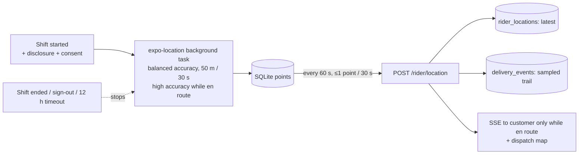

# TechShop mobile apps plan

The complete plan for the two Expo apps in `mobile/`:
- **Customer app** (`mobile/apps/customer`): shopping, like the market site.
- **Logistics app** (`mobile/apps/logistics`): for riders and dispatchers, one app with role-based screens.

Both are built on Expo SDK 57, React Native 0.86 and React 19.2.3 (pinned).

**Status:** plan. Both apps are empty shells today.

**Related docs:**
- Backend: [`backend.md`](backend.md)
- Data model: [`database.md`](database.md)
- Proposed schema deltas: [`schema-changes.md`](schema-changes.md)
- Cross-plan decisions: [`architecture-decisions.md`](architecture-decisions.md)
- Recommendations: [`recommendations.md`](recommendations.md)

---

## 0. What the repo has today

1. **Both apps are shells.** Each has the same `src/theme/index.ts` and `src/lib/api.ts`; these move into one shared mobile package.
2. **Sample data is web-only.** It lives in `frontend/packages/fixtures`, which mobile can't import (separate install roots). It moves to `shared/fixtures` ([`architecture-decisions.md`](architecture-decisions.md)).
3. **Client types disagree with the schema** (`uk-used` vs `uk_used`, `techshop`/`vendor` vs `first_party`, a product flattened to one listing). One wire format is decided in [`architecture-decisions.md`](architecture-decisions.md).
4. **The API client lacks:** token refresh, idempotency keys, typed errors, a query builder, timeouts and pagination types.
5. **Platform minimums:** Android 7.0 (SDK 24) and iOS 15.1. The real target is mid-range Android 10+ (Tecno, Infinix, itel, Samsung A).
6. **Schema issue for logistics:** a delivery job could be marked delivered without the OTP ever being checked. Fixed in [`schema-changes.md`](schema-changes.md) (`otp_verified_at`, `proof_method`).

---

## 1. Core decisions

| Area | Decision | Why |
|---|---|---|
| Server data | TanStack Query v5, cache persisted to `expo-sqlite/kv-store` | Caching, retries, offline pause and resume |
| Client state | Zustand v5 for small UI state only | Server data stays in the query cache |
| Logistics offline writes | SQLite queue + sync engine, with a client-generated ID per event | Retrying never duplicates |
| Auth | Phone OTP; access token in memory; rotating refresh token in `expo-secure-store` | Phone-first users; refresh tokens stored only as hashes on the server |
| Forms | `react-hook-form` + `zod` (schemas shared with web) | One rule set everywhere |
| Lists | `@shopify/flash-list` v2 | Fast on low-end Android |
| Images | `expo-image` (disk cache, placeholders, sized URLs) | Data-light |
| Sheets and modals | expo-router `formSheet` / `modal` | Native, no extra library |
| Icons | `react-native-svg`, paths ported from the web `Icon` | Same icons everywhere |
| Payments | API returns the provider checkout URL → `expo-web-browser` auth session → poll payment status | Works for Paystack, OPay and Moniepoint; no card data in the app; bank-app and USSD hand-offs keep working |
| Push | `expo-notifications` via Expo Push Service, sent by the API outbox worker | Simplest path |
| Realtime | **SSE** (`react-native-sse`), falling back to polling | Matches the backend (see decisions doc) |
| Crash reporting | `@sentry/react-native` with personal data scrubbed (owner to confirm) | Source maps uploaded during EAS builds |
| Analytics | First-party events to `POST /api/v1/events` (batched) | Feeds recommendations; NDPA; data-light |
| Localisation | i18next + `expo-localization`. English first, then Pidgin, then Hausa, Yoruba, Igbo | No hard-coded strings |
| Config | `app.config.ts` per app, varying by `APP_VARIANT` | Dev, staging and prod install side by side |

**Installing libraries:**
- Install Expo and native modules with `npx expo install <pkg>` inside the app, so versions match SDK 57.
- Plain JavaScript libraries install with npm.
- Run `npm run doctor` after every addition.

---

## 2. Shared mobile architecture

**Providers**, from the outside in:
1. Sentry
2. Gesture handler
3. Safe area
4. i18n
5. Persisted query client
6. Auth (session state machine)
7. Theme (navigation theme from tokens)
8. Network banner
9. Stack

The splash screen stays until fonts, session and cache are restored, with a timeout of about 2 s.

**API client upgrades** (`shared/api-client`, platform-neutral):
- Refresh once on 401, then retry.
- Default headers: client, language, install ID, guest cart token.
- 15 s timeout and abort signal.
- Errors: problem+json `ApiError`, plus `NetworkError` and `TimeoutError`.
- `Idempotency-Key` on every POST that creates something.
- Typed endpoint groups and `Page<T>`.

**Offline:**
- The customer app shows cached data with an offline banner. Cart and saved changes are optimistic and resume when back online. Checkout only runs online.
- The logistics app has a full offline queue (§4.3).
- Data saver: smaller images, no auto-playing carousels.

**Analytics:**
- Batched events (every 30 s, when the app goes to the background, or at 50 events).
- Event names shared with web.
- Consent toggles in Account › Privacy.

**Accessibility:**
- Every control has a role and label.
- Prices are read in full ("₦1,250,000, was ₦1,400,000, 11% off").
- Announcements for cart changes.
- Font scaling tested at 200%.
- Touch targets: 44 px in the customer app, **52 px in the logistics app**.
- Reduced motion respected.
- High-contrast outdoor theme for riders.

**Theming:**
- `useColors()` and the navigation theme move to `mobile/packages/ui`.
- Light and dark follow the OS, with an in-app override.

**Performance targets:**
- Android download under 25–30 MB per architecture split.
- Cold start under 2.5 s on a mid-range phone.
- FlashList everywhere.

**Logging rule:** no `console.log` in app code. `src/lib/logger.ts` wraps Sentry, and ESLint `no-console` enforces it, mirroring the backend's slog-only rule.

---

## 3. Customer app (`mobile/apps/customer`)

Routes mirror the market website paths, so web links open in the app 1:1.



### 3.1 File layout (`src/app`)

```text
_layout.tsx · +native-intent.tsx · +not-found.tsx
(tabs)/_layout.tsx · index.tsx · categories.tsx · saved.tsx · cart.tsx · account.tsx
search.tsx · filters.tsx
c/[category]/index.tsx · c/[category]/[sub].tsx
p/[slug]/index.tsx · reviews.tsx · offers.tsx · specs.tsx
deals.tsx · best-sellers.tsx
cars/[slug]/index.tsx · viewing.tsx · financing.tsx
auth/_layout.tsx · phone.tsx · verify.tsx · profile.tsx
checkout/_layout.tsx · index.tsx · address.tsx · payment.tsx · return.tsx · [number]/result.tsx
orders/index.tsx · track.tsx · [number]/index.tsx · track.tsx · return.tsx · review.tsx
account/profile.tsx · addresses/{index,new,[id]}.tsx · returns/{index,[rma]}.tsx
account/warranty/{index,new,[claim]}.tsx · trade-ins/{index,[ref]}.tsx · viewings.tsx
account/notifications.tsx · privacy.tsx · settings.tsx
trade-in.tsx · notifications.tsx · delivery-location.tsx
help/index.tsx · [topic].tsx · article/[slug].tsx
support/index.tsx · new.tsx · [ticket].tsx · legal/[doc].tsx
```

Feature code lives in `src/features/<domain>/`, with data hooks in `queries.ts`.

### 3.2 Screens

Every data screen has four standard states:
- **Loading:** a skeleton shaped like the content.
- **Empty:** a state with a next action.
- **Error:** retry, plus a support link on server errors.
- **Offline:** cached data with a banner.

| Screen | Purpose and key parts | API (tables) |
|---|---|---|
| Home | Search, banners, category tiles, deals with countdown, best sellers, recently viewed, recommendations, cars teaser, trade-in promo | `GET /home` (banners, promotions, listings); recommendation shelves |
| Categories | List → subcategory chips | `GET /categories` |
| Search | Suggestions (250 ms debounce), recent and popular searches, zero-result help | `/search/suggest`, `/products?q=` |
| Listing | 2-column grid, sort, filters with active count, infinite scroll; filters live in the URL | `/products?…` with facets |
| Product | Gallery, price + compare-at, condition, variant picker, buy box (seller, warranty, stock, delivery fee and ETA), sticky add-to-cart bar, specs, reviews, other sellers, related | `/products/{slug}`, `/delivery/estimate`, recommendations |
| Cars | Car card, inspection checklist, verified documents, **Book viewing / Financing / Call** (never add-to-cart) | `/cars`, `/cars/{slug}`, viewings, financing |
| Cart | Grouped by seller, stepper, remove with undo, per-seller delivery fee, coupon, totals | `/cart…`, `/coupons/validate` |
| Saved | Grid, move to cart; guests saved locally and synced at sign-in | `/me/saved` |
| Checkout | Address (state → LGA pickers, "use my location"), delivery per seller, totals **from the server only** | `/checkout/preview`, `/me/addresses` |
| Payment & result | Provider list → secure browser → result (success, pending with polling, failed with retry using another provider) | `POST /orders`, `/payments/{ref}/status` |
| Orders & tracking | Status timeline per seller, delivery OTP shown in the app, live rider map while en route (v1.1) | `/me/orders`, `/tracking`, `/tracking/stream` |
| Guest tracking | Order number + phone | `/orders/track` |
| Returns · Warranty · Trade-in · Reviews | Forms and status lists, matching the web flows | after-sales and review endpoints |
| Notifications · Help · Support chat | Inbox, articles (cached offline), ticket threads | notifications, help, tickets |
| Privacy | Analytics toggle, download my data, **delete account** (store requirement) | `/me/privacy/*` |

### 3.3 Payment flow



**What's ruled out:**
- **Embedded WebView checkout:** it breaks 3-D Secure and bank-app redirects and is weaker for security.
- **Unofficial provider SDKs:** an official React Native SDK could later sit behind the same `PaymentLauncher` interface.
- **In-app purchase:** physical goods are exempt from app-store payment rules.

### 3.4 Deep links, sharing and push

- **Deep links:**
  - Scheme `techshop://`.
  - Universal links on `market.<domain>` for `/p`, `/c`, `/cars`, `/orders`, `/checkout/return`, `/help` and `/trade-in`.
  - The market site serves `/.well-known/apple-app-site-association` and `assetlinks.json`.
  - `+native-intent.tsx` normalises incoming URLs.
- **Sharing:** shares the market web URL, so it works without the app.
- **Push:**
  - Ask for permission **after the first order** (never at first launch).
  - Android channels: orders, delivery (high importance, includes the OTP), promotions (opt-in only), account.
  - Tokens registered with `PUT /me/push-tokens` and removed on sign-out.

---

## 4. Logistics app (`mobile/apps/logistics`)

Riders get a task-focused stack. Dispatchers get tabs. Pick a role per session; a role switcher sits in Profile.



### 4.1 Rider screens

| Screen | What it does | API |
|---|---|---|
| Today | Big **Start/End shift** toggle (also starts and stops location tracking); jobs grouped Pickup / To deliver / Done with window and SLA chip; works offline | `/rider/shift/*`, `/rider/jobs` |
| Job detail | Recipient first name, address + landmark, window, notes; **Navigate** (opens Google Maps or Apple Maps) and **Call**; **one primary action per state**; screen kept awake | `/rider/jobs/{id}` |
| Scan | Camera with QR + Code128, torch, haptics, clear mismatch message, manual entry fallback | queued `picked_up` event; server checks the parcel label |
| Deliver | **OTP keypad** (52 px+ keys), or **Photo** (compressed to ~150 KB, recipient name, GPS required). Offline, OTP can't be verified safely, so photo proof is used | `/rider/jobs/{id}/deliver` |
| Couldn't deliver | Reasons: unreachable, refused, wrong address, rescheduled, unsafe, vehicle problem, other (note required); attempts shown (max 5) | queued `attempt_failed` |
| Sync | Pending, uploading, failed and conflict items; "Sync now" | batch endpoint |

There's no cash on delivery today. If it's added, it needs a rider cash ledger (a future schema need).

### 4.2 Dispatcher screens

| Screen | What it does |
|---|---|
| Board | Key figures (as on the staff web), segmented lists, zone and window filters, multi-select assign |
| Assign sheet | Riders on shift sorted by zone, load and distance; vehicle; last seen |
| Job detail | Event trail; reassign, unassign, reschedule, return to hub; call rider or customer |
| Map (v1) | Riders (stale ones greyed) and unassigned jobs by zone; SSE feed |

Heavy dispatch work stays on the staff web portal. The mobile dispatcher view is for field supervisors. Every action is audited.

### 4.3 Offline queue and sync



**Retries and data on the device:**
- Exponential backoff with jitter, capped at 5 min. Nothing is dropped silently.
- Customer data on the device:
  - only for jobs in the active shift;
  - purged 24 h after the job closes and on sign-out;
  - the SQLite database is encrypted (SQLCipher) with its key in secure storage.

### 4.4 Background location



- **When it runs:** only during a shift, with a foreground-service notification ("On shift: sharing location").
- **Permissions:** the Google Play disclosure screen comes before the OS prompt, and consent is recorded.
- **Device setup:** guidance for phones that kill background apps (Tecno, Infinix, Xiaomi); a warning if no location fix arrives within 5 min.
- **Privacy:** customers only see the rider while their job is en route. Raw location points are kept about 90 days (proposal), and an employee-tracking DPIA is required.

**Logistics push channels:**
- Job assigned or unassigned (high priority).
- Shift reminder.
- Sync conflict.
- Dispatch only: job failed, rider location stale.

---

## 5. Where shared code lives

| Location | Contents |
|---|---|
| `shared/api-client` (extended) | Client, endpoint groups, generated contract types, errors, idempotency, pagination, query types, money and phone utilities, recommendation tracker |
| `shared/domain` (new) | zod request schemas, **status labels and tones** matching `database/states.md`, analytics event names, failed-delivery reasons, Nigerian states |
| `shared/fixtures` (moved from web) | Sample data + `createFixtureClient()` with the same interface as the real client; switch with `EXPO_PUBLIC_API_MODE=fixtures\|live`; screens show the sample-data notice while on fixtures |
| `mobile/packages/ui` (new) | Theme hooks + React Native components mirroring the web UI names: Text, Button, Price, Rating, Badge, StatusPill, ProductCard, CarCard, QuantityStepper, EmptyState, ErrorState, OfflineBanner, Skeleton, Countdown, TextField, PhoneField, OtpField, Timeline, SampleDataNotice… |
| `mobile/packages/core` (new) | App API factory (token wiring), session store, query client + persister, network bridge, analytics transport, logger/Sentry, i18n, push registration, query keys |
| Per app | Routes, feature components, strings, `app.config.ts`, `eas.json` |

`mobile/package.json` workspaces become `apps/*` + `packages/*`. The per-app theme and API files are deleted.

---

## 6. Backend endpoints the apps need

| Group | Endpoints | Phase |
|---|---|---|
| Auth | OTP request and verify, refresh, logout, `/me`, sessions, data export | M1 |
| App config | `/app-config` (minimum versions, enabled providers, flags) | M1 |
| Reference | `/states` (with LGAs) | M1 |
| Catalogue | `/home`, `/categories`, `/products`, `/products/{slug}`, offers, search, deals, best sellers | M1 |
| Delivery estimate | `/delivery/estimate` | M1 (zones needed early) |
| Cart & saved, addresses | cart CRUD + merge + coupon; saved; addresses | M1–M2 |
| Checkout & payments | preview, orders, payment status, retry; provider webhooks | M2 |
| Orders | my orders, detail, tracking (+ stream), cancel, guest tracking | M2 / tracking M3 |
| Devices & notifications | push tokens, inbox, preferences | M2 |
| Files | upload intent and complete | M3 |
| Rider & dispatch | shift, jobs, actions, events batch, location batch; board, assign, riders, zones, stream | M3 |
| After-sales, reviews | returns, warranty, trade-ins, reviews, ratings | M4–M5 |
| Cars, support | cars, viewings, financing; help articles, tickets | M5–M7 |
| Events | `/events` (batched) | M1 |

---

## 7. Build, release, CI and testing

**Config:**
- `app.config.ts` replaces `app.json`. The variant (`development`, `staging`, `production`) sets:
  - app name suffix;
  - bundle ID (`…dev`, `…staging`);
  - icon badge;
  - Maps key;
  - associated domains;
  - update URL;
  - `runtimeVersion` fingerprint policy.
- Plugins:
  - router, splash, secure store, notifications, font, localization, Sentry;
  - logistics adds location (background), camera and maps.
- Unused permissions are blocked.

**EAS profiles:**
- `development`: dev client.
- `preview`: staging API, internal builds.
- `production`: AAB and App Store, auto-increment.

Public values (`EXPO_PUBLIC_*`) never hold secrets. Build-time secrets are EAS secret variables.

**Versioning:**
- Each app has its own version.
- Over-the-air updates only for JavaScript changes that match the fingerprint.
- `/app-config` can force an update.

**CI** (checks only, extending the mobile job):
- Jest + React Native Testing Library.
- Optional bundle smoke export.
- Shared-package tests.
- `make check` updated to match.

**CD (separate workflows):**
- `mobile-update.yml`: OTA to staging on `main`.
- `mobile-release.yml`: build + submit on tags or manual dispatch; production OTA promoted manually.

**Testing:**

| Kind | Coverage |
|---|---|
| Unit | Schemas, money and phone, label maps, sync engine, payment poller, URL mapping |
| Component | ProductCard, Price accessible label, cart grouping, OTP field, deliver states |
| E2E (Maestro, nightly or pre-release) | Browse → checkout (test card); guest tracking; rider shift → scan → OTP delivery; offline photo delivery → reconnect → synced |
| Device matrix | 2–3 GB Android 10 phone, mid-range Samsung, recent iPhone; slow 3G; outdoor sunlight |

**Stores and compliance:**
- **Accounts:** Google Play and Apple Developer as an organisation. Apple needs a D-U-N-S number, which takes weeks, so start now.
- **Bundle IDs:** confirm before the first submission; they can't change afterwards. Proposed: `ng.techshop.customer`, `ng.techshop.logistics`.
- **Store declarations:**
  - privacy labels and Play data safety;
  - the background-location declaration (with a demo video);
  - account deletion in-app and on the web.
- **Distributing the logistics app:** Play private app or closed track (owner decision).
- **NDPA:** privacy policy, records of processing (Expo, Sentry, Google), DPIA for rider tracking, retention schedule.

---

## 8. Milestones

| Milestone | Backend dependency | Customer app | Logistics app |
|---|---|---|---|
| **M0 Foundations** (start now) | None | Shared packages, client upgrades, config, CI, Sentry, i18n; full navigation on sample data: home, categories, search, product, cart, saved, cars | Navigation skeleton, role gate on mocked `/me`, rider screens on sample data, offline queue engine with tests |
| **MVP** | M1–M2 | Phone OTP, live catalogue and search, cart, addresses, checkout with Paystack (others behind the same launcher), orders and timeline, guest tracking, order push, saved, account deletion, help | — |
| **v1** | M3–M5 | Delivery timeline, in-app OTP, returns, warranty, trade-in, reviews, all three providers, inbox | Rider (shift, jobs, scan, OTP/photo, failures, offline sync, location); dispatcher (board, assign, detail) |
| **v1.1** | Realtime | Live rider map, live support chat | Live dispatch map, real-time assignment push |
| **v2** | M6–M7 | Car viewings and financing, coupons, promotions, banners, price-drop alerts, recommendations, Pidgin | Route ordering, zone analytics, more languages |

---

## 9. Risks

| Risk | Mitigation |
|---|---|
| API not built yet | Contract-first types + fixture client; agree the wire format now |
| Phones killing background apps | Onboarding guidance, stale-location alerts, foreground service |
| SMS OTP delivery (DND, delays) | Transactional sender ID, voice or WhatsApp fallback, 60 s resend |
| Payment return failures | Webhook as truth, polling result screen, stored pending order, push confirmation |
| Lost rider phones holding customer data | Encrypted database, purge policy, biometric unlock, remote session revocation |
| Library compatibility | Always `npx expo install`; `expo-doctor` in CI |
| Google Maps cost and key exposure | Hand off navigation to the Maps app; restrict keys; SDK only for the dispatch map |
| Data volume (location, analytics) | Thinning, partitioning, retention |

## 10. Open decisions for the owner

1. Production domains and final bundle IDs.
2. Sign-in required at checkout in the app (recommended), or guest checkout as on the web.
3. Payment providers at MVP: Paystack only, or all three.
4. SMS/OTP provider and fallback (voice or WhatsApp).
5. Crash reporting vendor; analytics destination.
6. When customers see the live rider map (proposal: only while en route, from v1.1).
7. Offline delivery policy (photo accepted?) and phone-number masking for calls.
8. Logistics app distribution; company phones for riders?
9. Object storage and image CDN vendor.
10. Location and analytics retention periods; NDPA basis for analytics.
11. Moving sample data to `shared/fixtures` (touches the web apps).
12. Whether cars come before backend milestone M7.
13. Pay-on-delivery stays out (confirm).
