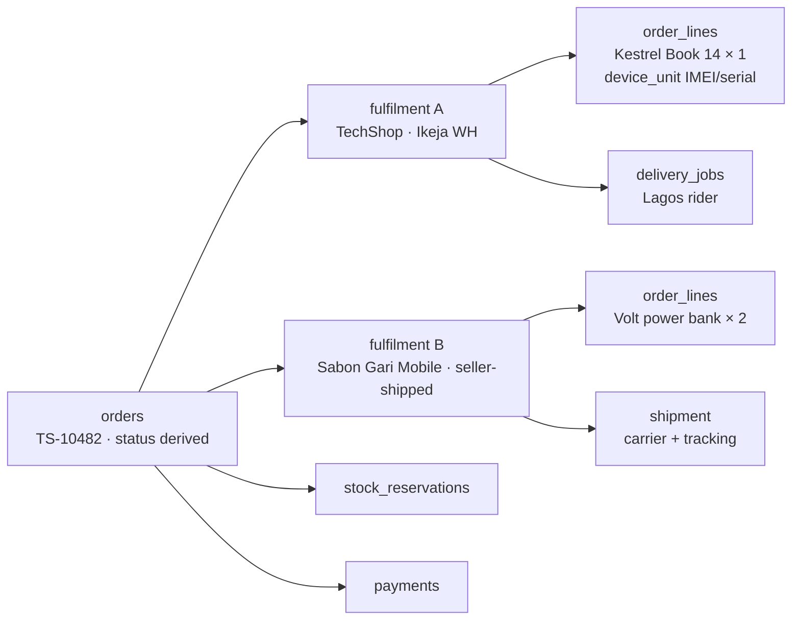
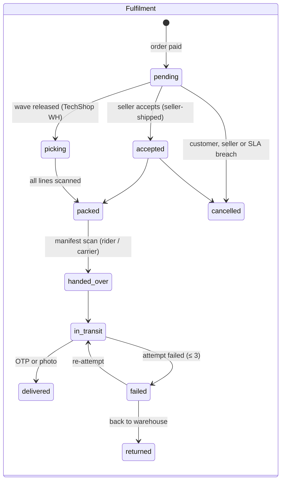
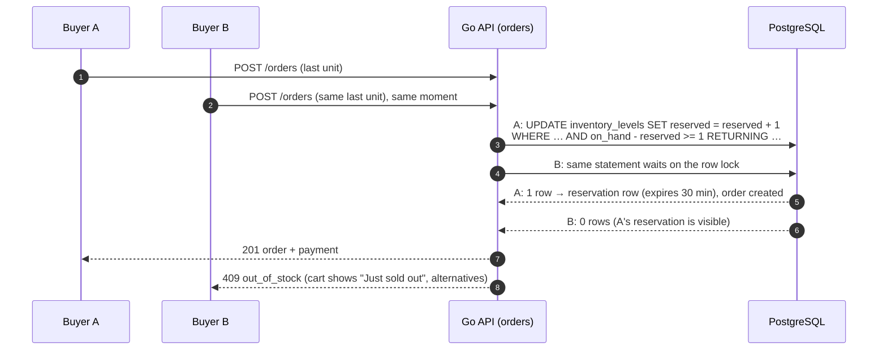
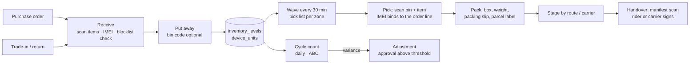
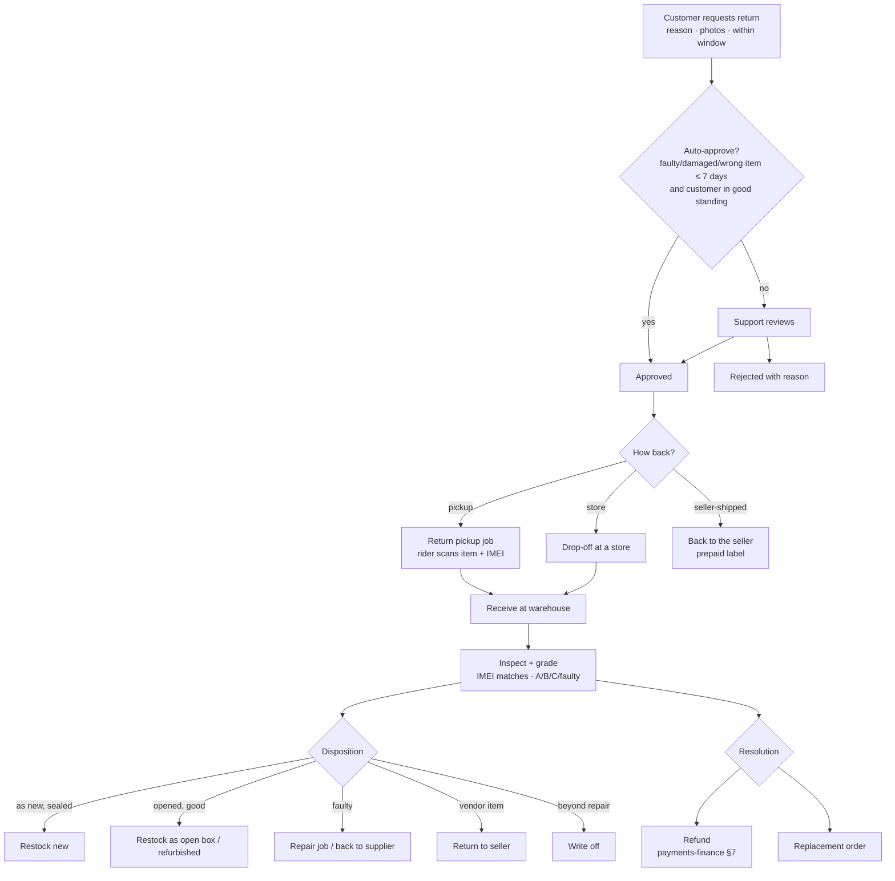

# TechShop orders, inventory and fulfilment system

The plan for everything between "Pay" and "Delivered", and back again for returns:
- order and fulfilment lifecycles for multi-seller carts;
- **stock reservation** without overselling;
- warehouse operations (receive, pick, pack, dispatch, count);
- the fulfilment models (TechShop warehouse, seller-shipped, click and collect, interstate carriers);
- cancellations and returns (RMA) with inspection and grading;
- B2B and POS orders;
- inventory accounting.

**Status:** plan. Nothing is built. Orders, fulfilments, order lines, warehouses, inventory levels, stock movements, device units, transfers, delivery jobs and return requests exist in [`database/schema.sql`](database/schema.sql). Earlier proposals are in [`schema-changes.md`](schema-changes.md) (#12, #18, #35, #52, #53); new ones are in §8.

**Interactive mockup and simulation:** [`mockups/orders-fulfilment.html`](mockups/orders-fulfilment.html).

**Related docs:** [`database/flows.md`](database/flows.md) §1–§4, [`database/states.md`](database/states.md), [`mobile.md`](mobile.md) (riders and dispatch), [`payments-finance.md`](payments-finance.md) (when money moves), [`search-catalogue.md`](search-catalogue.md) (listings and stock), [`messaging-marketing.md`](messaging-marketing.md) (status messages).

---

## 1. Summary

- **An order is split by seller into fulfilments.** Each fulfilment moves on its own (TechShop's laptop can arrive today while a vendor's power bank arrives tomorrow). **The order's status is derived** from its fulfilments, never set by hand.
- **Stock can't be oversold.**
  - Reservations happen inside the checkout transaction with a conditional update (`on_hand − reserved ≥ qty`), so two buyers racing for the last unit can't both win.
  - Unpaid reservations expire and release exactly what was reserved (`stock_reservations`).
- **One code path changes stock:** every change writes a `stock_movements` row and updates `inventory_levels` in the same transaction. A nightly job proves Σ movements = on hand.
- **Serialised goods are tracked per unit.** Every phone, laptop and console has a `device_units` row (IMEI or serial). It is scanned at receiving, at picking and on return. The blocklist check happens at receiving.
- **Warehouse work is scan-driven:**
  - wave pick lists every 30 minutes;
  - scan to pick (the wrong item can't be packed);
  - pack with weight and box;
  - print a parcel label;
  - scan the manifest at handover to a rider or carrier.
- **Four ways to fulfil, one model:**
  - **TechShop warehouse** (own stock and vendor stock held by TechShop);
  - **seller-shipped** (TechShop rider pickup or the seller's own carrier with tracking);
  - **click and collect** at a TechShop store;
  - **interstate carrier** (third-party logistics adapter).
- **Returns are a reverse fulfilment:** request → approval → pickup job or store drop-off → receive → inspect and grade → restock as refurbished or open-box, repair, return to seller or write off → refund or replacement.
- **Seller SLAs are enforced:** accept and pack within the listing's handling time, or the line is auto-cancelled, refunded and counted against the seller.

---

## 2. The order model

**Channels:**

| Channel | How the order is created |
|---|---|
| `market` | Customer checkout on the website |
| `app` | Customer checkout in the app |
| `wholesale` | Business checkout or an accepted quote |
| `pos` | In a store: the shift's warehouse is the store, and the order is delivered on the spot |

**Line snapshots:** order lines copy the product name, variant, SKU, price, commission rate and condition at purchase time. Later catalogue edits never change a past order.

### 2.1 Lifecycles

**Order status derivation** (from the fulfilments, after every fulfilment change):

| Fulfilments | Order |
|---|---|
| Payment not confirmed | `pending_payment` |
| All `pending`, `accepted` or `picking` | `paid` / `processing` |
| Some shipped, some not | `partially_shipped` |
| All shipped | `shipped` |
| All `delivered` (ignoring cancelled ones) | `delivered` |
| All cancelled | `cancelled` |
| Refunds | `refunded` / `partially_refunded`, from the refunds |

The existing check values on `fulfilments.status` add `accepted` and `picking` ([`schema-changes.md`](schema-changes.md) §8).

---

## 3. Stock reservation

**Where the stock comes from:**
- **TechShop warehouses** reserve against `inventory_levels` with the conditional update above. Warehouse choice:
  1. a single warehouse that can ship the whole fulfilment;
  2. if none, the nearest to the delivery state;
  3. only then split across warehouses (two parcels cost more).
- **Seller-held stock** reserves against `listings.stock_quantity` with the same conditional pattern. Sellers keep it accurate from Seller Centre or via CSV/API; a seller whose cancellations for "out of stock" exceed 2 % is flagged.

**Releasing reservations:**
- An expiry job (every minute) releases reservations for unpaid orders, **after verifying with the payment provider** ([`payments-finance.md`](payments-finance.md) §3).
- **On payment, reservations are committed:** `on_hand −= qty`, `reserved −= qty`, plus a `sale` stock movement.
- **Flash deals:** per-user claims (`flash_claims`) and a `claimed ≤ stock_limit` counter use the same conditional update ([`backend.md`](backend.md) §4.4).

---

## 4. Fulfilment models

| Model | Who holds stock | Who packs | Who delivers | Tracking |
|---|---|---|---|---|
| **TechShop warehouse** | TechShop (own, or vendor stock with `owner_seller_id`) | TechShop | TechShop riders (same city) or carrier (interstate) | Delivery job / carrier tracking |
| **Seller-shipped, TechShop pickup** | Seller | Seller | TechShop rider picks up from the seller (`seller_pickup` job), then delivers | Delivery jobs |
| **Seller-shipped, own carrier** | Seller | Seller | The seller's carrier | Seller enters carrier + tracking; status from carrier webhooks or polling |
| **Click and collect** | TechShop store | Store staff | The customer collects with a code | Collection OTP (same as the delivery code) |

**Interstate carriers:**
- behind a `carrier.Port` (quote, book, label, track, cancel), with adapters added per partner (a Nigerian 3PL first; the choice is an owner decision);
- rates come from the carrier quote, or from `delivery_rates` by zone and weight;
- tracking events map to fulfilment statuses.

**Seller SLAs (seller-shipped):**
- Accept within 24 hours, and pack within `handling_days`.
- A breach auto-cancels the line, refunds the customer automatically, notifies the seller and records an SLA event.
- Three breaches in 30 days put the seller's listings under review ([`trust-safety.md`](trust-safety.md)).

---

## 5. Warehouse operations

| Step | Rules |
|---|---|
| **Receive** | Against a purchase order (`goods_receipts`) or a return or trade-in. Serialised items need an IMEI (15 digits, Luhn-checked) or serial number. **A blocklisted IMEI can never enter stock**; a risk case is opened instead. Over-receipt above 5 % needs approval |
| **Pick** | Wave pick lists group fulfilments by zone and carrier cut-off. The picker scans the bin then the item; a wrong SKU or condition is rejected. For serialised items the scanned unit is bound to `order_lines.device_unit_id` (unit `reserved` → `sold` at handover) |
| **Pack** | Box size suggestion from the item dimensions; weigh; a weight more than 10 % off the expected weight is flagged (wrong or missing item). Packing slip without prices for gift orders. Parcel label with a `label_code` (proposal #18) |
| **Handover** | The rider or carrier scans the parcels on a manifest; the counts must match. Then the fulfilment is `handed_over` and delivery jobs are created ([`mobile.md`](mobile.md)) |
| **Cycle count** | Daily counts by ABC class (A: phones and laptops weekly; C: accessories monthly). A variance creates an adjustment; above ₦100,000, `inventory.adjust` ★ approval |
| **Transfers** | `stock_transfers` between warehouses and stores, in transit as a separate state, received by scanning |

**Performance targets:** pick accuracy ≥ 99.5 %; dispatch the same day for paid-by-14:00 orders in Lagos; dock-to-stock within 24 hours.

---

## 6. Cancellations and changes

| Who and when | Result |
|---|---|
| **Customer, before picking or acceptance** | Instant cancel; reservation released; automatic refund |
| **Customer, after packing** | Cancel request: staff decide (often converted into a return after delivery) |
| **Seller cancels** (out of stock) | Line cancelled, automatic refund, SLA event, a sorry message to the customer with alternatives |
| **Partial** | Per line. Order totals, VAT, commission and journals adjust per line |
| **Address change** | Allowed until `handed_over`. The delivery fee is recalculated; a higher fee needs payment of the difference |

---

## 7. Returns (RMA)

**Rules:**
- **Return windows:**
  - 7 days for faulty, damaged, wrong or not-as-described items;
  - change-of-mind only for eligible categories, unopened, at the customer's cost (the owner decides the policy);
  - warranty claims after that go to the warranty flow (`warranty_claims`, `repair_jobs`).
- **The IMEI or serial must match** the unit sold, otherwise the return is rejected and a risk case is opened (swap fraud).
- **The refund amount** follows the grade for change-of-mind returns (restocking fee only if the policy allows it); faulty returns are refunded in full.
- **Vendor items:** the vendor's payable is debited ([`payments-finance.md`](payments-finance.md) §7). A vendor can dispute the inspection within 3 days.

---

## 8. B2B and POS orders

**B2B:**
- a quote becomes an order on acceptance (`quote_id`);
- payment by invoice and credit, or prepayment;
- partial deliveries are allowed: one fulfilment per shipment, with a delivery note PDF;
- the proof of delivery needs the business recipient's name and signature or OTP.

**POS:**
- the order is created at the till with `channel = pos` and paid immediately (cash, terminal or transfer);
- stock moves from the store's warehouse;
- serialised items are scanned at sale;
- the receipt is printed or texted.

---

## 9. Inventory accounting

- **Each serialised unit keeps its acquisition cost** (`device_units.cost_kobo`, proposed). Non-serialised stock uses **weighted average cost** per variant, condition and owner (`inventory_costs`, proposed).
- **On a sale of own stock:** a COGS journal (`Dr expense:cogs / Cr asset:inventory`). **On a purchase receipt:** `Dr asset:inventory / Cr liability:accounts_payable`. These accounts and templates are added to the ledger ([`payments-finance.md`](payments-finance.md) §4) once finance confirms the costing method.
- **Vendor stock held by TechShop** (`owner_seller_id`) is not TechShop's inventory and posts no COGS.
- **Write-offs and count variances** post adjustment journals with approval.

---

## 10. Data model

**Existing:** `orders`, `fulfilments`, `order_lines`, `order_status_history`, `warehouses`, `inventory_levels`, `device_units`, `stock_transfers`, `stock_transfer_lines`, `stock_movements`, `purchase_orders`, `goods_receipts`, `delivery_jobs`, `delivery_events`, `return_requests`, `return_items`, `warranty_claims`, `repair_jobs`, `quotes`, `pos_*`.

**Already proposed:** #12 `stock_reservations`, #13 `flash_claims`, #18 `parcels`, #35 `owner_seller_id`, #39 `payment_due_at`, #52 fulfilment carrier and tracking, #53 delivery job kinds and OTP.

**New** ([`schema-changes.md`](schema-changes.md) §8):

| Table | Purpose and key columns |
|---|---|
| `fulfilments` (change) | Status adds `accepted`, `picking`; add `accept_by`, `pack_by` (SLA deadlines), `collection_store_id null` |
| `listings` (extend) | `stock_quantity` (seller-held stock) with `check (stock_quantity >= 0)` |
| `pick_lists`, `pick_list_items` | `warehouse_id, wave_at, zone, status (open, picking, done), picker_id`; items `fulfilment_id, order_line_id, bin_code, qty, picked_qty, device_unit_id, scanned_at` |
| `pack_records` | `fulfilment_id, parcel_id, box_code, weight_grams, expected_weight_grams, packed_by, packed_at` |
| `manifests`, `manifest_parcels` | Handover batches: `warehouse_id, carrier or rider, signed_by, created_at` |
| `carriers`, `shipments`, `shipment_events` | Third-party carriers: `carrier, tracking_number, label_file_id, status`; events from webhooks or polling |
| `bin_locations` (optional) | `warehouse_id, code, zone` (+ `inventory_levels` gains an optional bin) |
| `inventory_counts`, `inventory_count_lines` | Cycle counts: expected, counted, variance, approved_by |
| `inventory_costs` | Weighted average cost per variant × condition × warehouse × owner |
| `device_units` (extend) | `cost_kobo`, `grade (A, B, C) null`, `owner_seller_id` |
| `return_inspections` | `return_item_id, device_unit_id, imei_match bool, grade, disposition (restock_new, restock_open_box, repair, return_to_seller, write_off), notes, photos, inspected_by` |
| `seller_sla_events` | `seller_id, fulfilment_id, kind (late_accept, late_pack, seller_cancel), created_at` |

## 11. API

| Who | Endpoints |
|---|---|
| Customer | `GET /me/orders`, `/me/orders/{n}` (fulfilments + tracking), `POST /me/orders/{n}/cancel`, `POST /me/orders/{n}/lines/{id}/cancel`, `PATCH /me/orders/{n}/address`, `POST /me/returns`, `GET /me/returns/{rma}`, `GET /track/{n}?phone=` (guest tracking) |
| Seller | `GET /seller/{id}/fulfilments?status=`, `:accept`, `:pack` (+ parcel), `:handover` (pickup requested or carrier + tracking), `:cancel` (reason), `PATCH /seller/{id}/listings/{lid}/stock`, `POST /seller/{id}/stock:bulk` (CSV) |
| Warehouse (staff) | `/staff/wms/receipts` (+ scan), `/staff/wms/waves` (release), `/staff/wms/pick-lists/{id}` (+ `:scan`), `/staff/wms/pack` (+ label), `/staff/wms/manifests` (+ `:sign`), `/staff/wms/counts`, `/staff/wms/transfers` |
| Staff orders | `/staff/orders` (search, filters), `/staff/orders/{n}` (timeline, fulfilments, payments, messages), `:cancel-line`, `:reassign-warehouse`, `/staff/returns` (+ `:approve`, `:reject`, `:inspect`, `:resolve`) |
| Carriers | `POST /webhooks/carriers/{carrier}` (signed tracking events) |

## 12. Screens

Shown in the mockup:
- **Customer:** an order with two fulfilments moving separately, line cancellation and return request.
- **Staff › Orders:** order timeline and derived status.
- **Warehouse (tablet):** wave pick list with scanning (wrong-item rejection, IMEI binding), pack with weight check and label, manifest handover.
- **Seller Centre › Orders:** accept and pack before the SLA deadline (or watch it auto-cancel), hand over to a TechShop pickup.
- **Inventory:** on-hand, reserved and available by warehouse; a live **last-unit race** between two buyers; cycle count with a variance.
- **Returns:** inspection, IMEI match, grade and disposition.

## 13. Delivery plan

| Milestone | Scope |
|---|---|
| **O1** (backend M2) | Orders + fulfilments + lines, derived status, reservations with expiry, commit on payment, single stock code path, staff order view |
| **O2** | Seller fulfilment (accept, pack, handover, SLAs), TechShop rider pickup, customer tracking |
| **O3** | Warehouse: receiving with IMEI, waves, pick and pack scanning, labels, manifests; cycle counts |
| **O4** | Returns: RMA, auto-approval rules, return pickups, inspection and grading, dispositions; cancellations per line |
| **O5** | Interstate carriers adapter, click and collect, B2B partial deliveries, inventory costing and COGS journals |

## 14. Risks and open decisions

**Risks:**
- **Seller stock accuracy** (marketplace overselling): SLAs, stock APIs, automatic penalties.
- **Serialised-unit discipline** in busy warehouses: scanning is mandatory at each step, and the system won't advance without it.
- **Interstate delivery quality** depends on partners: multi-carrier adapter and tracking SLAs per partner.

**Open decisions for the owner:**
1. The return policy for change-of-mind (eligible categories, who pays shipping, restocking fee).
2. The first interstate carrier partner(s).
3. Click and collect at launch, or later?
4. Inventory costing method (weighted average recommended) and when to start COGS journals.
5. Seller SLA penalties (warning, then ranking demotion, then listing review).
