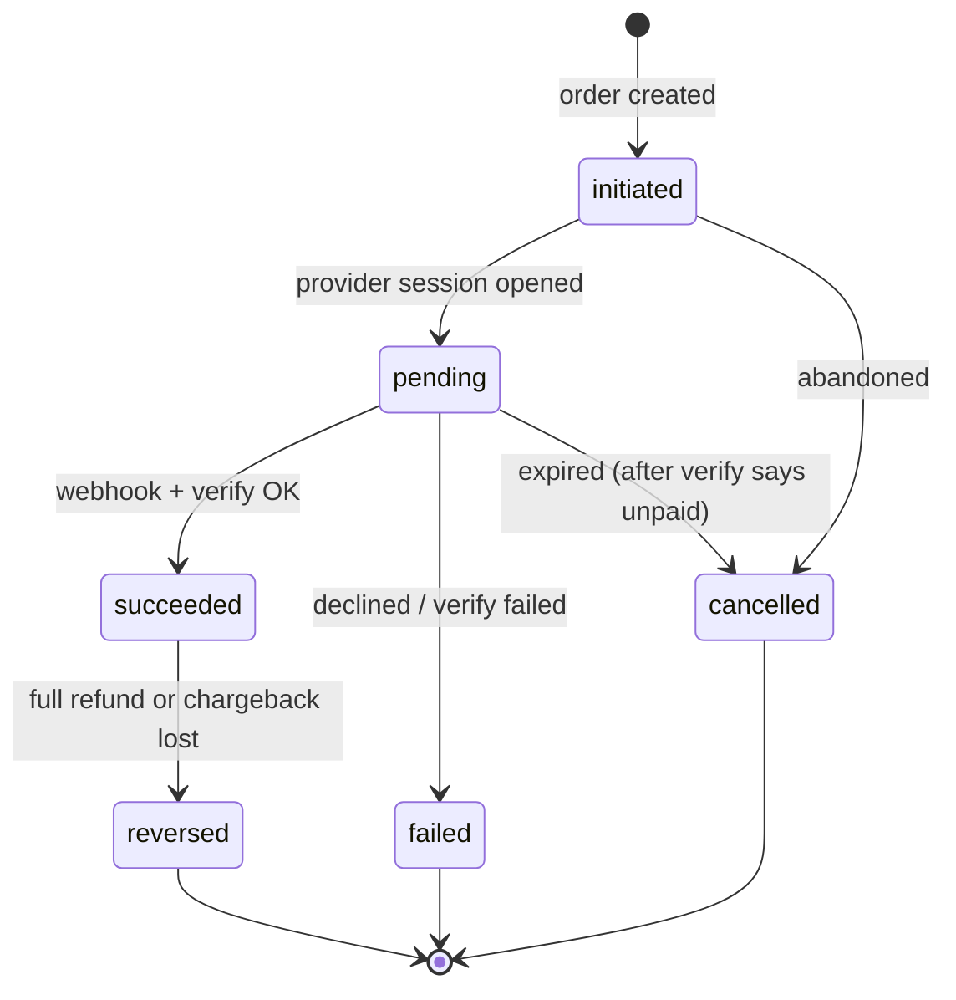
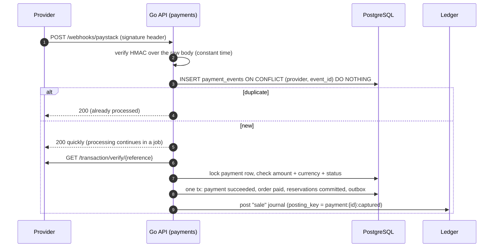
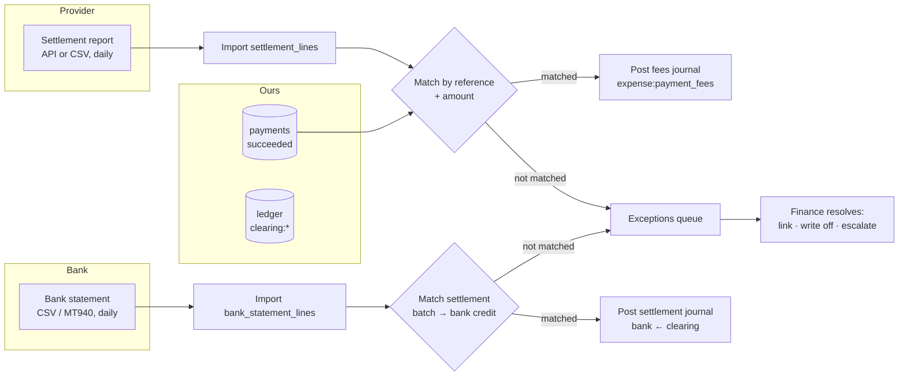
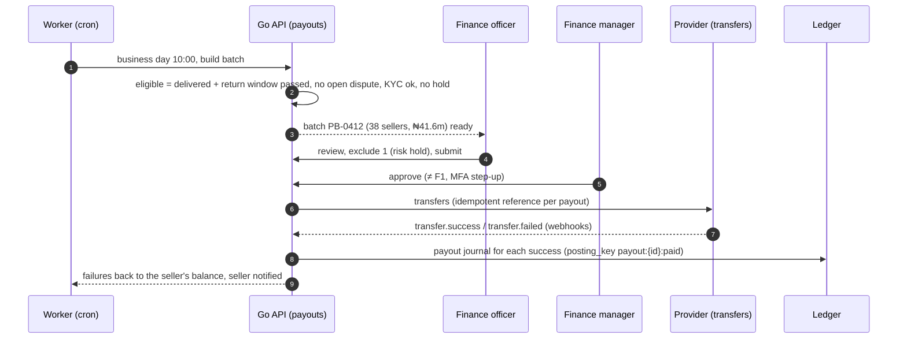

# TechShop payments and finance system

The plan for taking money, keeping the books and paying it out:
- **payments**: card, transfer, USSD and wallets through Paystack, OPay and Moniepoint (Monnify); B2B invoices on credit; POS;
- the **double-entry ledger**;
- daily **reconciliation** against provider settlements and the bank;
- **refunds**, **chargebacks** and **seller payouts**;
- **finance controls** and exports.

It builds on [`backend.md`](backend.md) §3.1 and the money flow and journal templates in [`database/flows.md`](database/flows.md).

**Status:** plan. Nothing is built. The payments, ledger, refunds, payouts, invoices and credit tables exist in [`database/schema.sql`](database/schema.sql). Earlier proposed changes are in [`schema-changes.md`](schema-changes.md) §2 (#38–#48); new ones are in §6.

**Interactive mockup and simulation:** [`mockups/payments-finance.html`](mockups/payments-finance.html).

**Related docs:** [`identity-access.md`](identity-access.md) (step-up, separation of duties), [`orders-fulfilment.md`](orders-fulfilment.md) (when money moves), [`trust-safety.md`](trust-safety.md) (payment risk), [`messaging-marketing.md`](messaging-marketing.md) (receipts).

---

## 1. Summary

- **Every naira is in the ledger.** Every money event posts a balanced journal: debits equal credits, enforced by a deferred database trigger. Each has a unique `posting_key`, so a retry can never post twice. Journals are never edited, only reversed.
- **The provider is never trusted blindly.** Webhooks are signature-checked, stored once, then **re-verified with the provider's API**, and the amount and currency are compared before an order is marked paid. A sweep job catches missed webhooks.
- **Customers can pay how Nigerians pay:**
  - card, bank transfer and USSD (Paystack);
  - the OPay wallet;
  - Moniepoint (Monnify) cards and **pay-by-transfer to a one-time account number**;
  - for businesses, **invoices on credit** with a permanent virtual account.
- **Three-way reconciliation every day:** our payments ↔ the provider's settlement report ↔ the bank statement. Anything that doesn't match lands in a queue with a reason and an owner.
- **Sellers are paid on a schedule, with dual control:**
  - earnings become payable after delivery and the return window, minus commission;
  - a finance officer prepares a payout batch and a **different** finance manager approves it with an MFA step-up;
  - transfers go through the provider, and failures return money to the seller's balance.
- **Refunds and chargebacks** follow the same rules: requested by one person, approved by another. Evidence for disputes (delivery code, photo, IMEI, invoice) is collected automatically.
- **Month-end close** locks a period. Corrections go into the next period as adjustments. Journals export to the accounting package.

---

## 2. Payment methods

| Method | Provider | Used for | Confirmation | Notes |
|---|---|---|---|---|
| Card (Visa, Mastercard, Verve) | Paystack (primary), Monnify | Market, app, wholesale | Webhook + verify | 3-D Secure by the provider; card data never touches TechShop |
| Bank transfer (pay with transfer) | Paystack or Monnify **dynamic account** | Large orders, customers without cards | Webhook when the transfer lands | One account number per order, valid 30–60 minutes, exact amount. Under- or overpayment rules in §4.3 |
| USSD | Paystack | Feature phones, no internet banking | Webhook | Bank-dependent limits |
| OPay wallet / card | OPay cashier | Customers with OPay | Webhook + query | Popular wallet; separate settlement |
| Moniepoint (Monnify) | Monnify | Card, transfer; **reserved accounts** for B2B | Webhook + verify | "Moniepoint" in the UI, `moniepoint` provider value ([`architecture-decisions.md`](architecture-decisions.md) #5) |
| Invoice on credit | Internal | Approved businesses | Payment to the business's reserved account | Terms 7–90 days; credit limit; dunning |
| Cash / POS terminal | Internal / Moniepoint POS | Physical stores | Shift close | Separate POS terminal integration |
| Store credit | Internal | Trade-ins, goodwill | Instant | A ledger liability per customer |

**Which providers to show:**
- **Customer choice first.** The checkout lists methods with the provider names the customer recognises.
- **Health-aware:** each provider has a circuit breaker on initialisation calls. A provider that is failing right now is shown as "temporarily unavailable" with another method suggested, instead of letting the customer fail at the last step.
- **Amount rules:** transfer is preferred above ₦1,000,000, where card limits often fail. Large B2B orders default to invoice.

---

## 3. Payment lifecycle

**Order payment window:**
- 30 minutes for card, wallet and USSD;
- the account's validity window (30–60 minutes) for dynamic transfer accounts;
- 24 hours only for B2B proforma.

When the window ends, the **expiry job asks the provider first**. It only cancels and releases stock when the provider confirms nothing was paid.

**Late payment** (the money arrives after the order was cancelled) is an owner decision ([`schema-changes.md`](schema-changes.md) #57):
- **Recommended:** reinstate the order if all its stock can be reserved again; otherwise refund automatically within 24 hours.
- Either way, it is audited.

### 3.1 Webhook processing

**Rules:**
- **Raw body** is kept for signature verification; signatures are checked before any parsing.
- **Respond fast, process in a job**, so providers don't time out and retry storms don't build up.
- **Out-of-order events are safe:** state transitions only move forward. A late `charge.failed` after `success` is recorded and ignored.
- **The payment status sweep** (every 5 minutes) verifies every `pending` payment older than 10 minutes, so a missed webhook never strands an order.
- **Amount mismatch** (paid ≠ expected) is never auto-accepted: the payment is set to `pending_review` and a reconciliation exception is raised.

---

## 4. The ledger

### 4.1 Chart of accounts

| Code pattern | Kind | Meaning |
|---|---|---|
| `clearing:paystack`, `clearing:opay`, `clearing:moniepoint` | asset | Money the provider holds for us, not yet settled |
| `bank:operating`, `bank:payouts` | asset | Our bank accounts |
| `receivable:b2b:<business>` | asset | Unpaid B2B invoices |
| `cash:store:<code>` | asset | Cash in each store till |
| `revenue:first_party_sales` | revenue | TechShop's own stock |
| `revenue:delivery` | revenue | Delivery fees |
| `revenue:commission` | revenue | Marketplace commission |
| `seller_payable:<seller>` | liability | What we owe each seller |
| `liability:vat` | liability | Output VAT collected |
| `liability:customer_refunds` | liability | Approved refunds not yet paid |
| `liability:store_credit:<user>` | liability | Customer store credit |
| `expense:payment_fees` | expense | Provider fees |
| `expense:chargebacks`, `expense:write_offs` | expense | Lost disputes, bad debt |

### 4.2 Posting rules

- **Journal templates** are in [`database/flows.md`](database/flows.md) ("Journal templates"). Each template is one Go function with typed inputs. No free-form postings, except `ledger.adjust` ★, which needs a memo and the step-up.
- **`posting_key` is unique** (proposal #40). It is built from the event, for example `payment:{id}:captured`, `refund:{id}:paid` or `payout:{id}:paid`. A retry returns the existing journal.
- **Never edit; reverse.** A wrong journal gets a reversal journal (same lines, negated) and a corrected one, both linked through `reverses_journal_id`.
- **Balances** are sums of entries. A `ledger_balances` materialized view (refreshed every 5 minutes) serves dashboards; money decisions (payout amounts) always sum the entries live, under a per-seller advisory lock.
- **Period close:** `accounting_periods` (month, status `open`/`closing`/`closed`). Posting into a closed period is rejected by a trigger. Corrections go to the current period with a memo pointing back.
- **Nightly checks:**
  - trial balance = 0;
  - every `succeeded` payment has exactly one sale journal;
  - every `paid` payout has exactly one payout journal;
  - clearing balances are within tolerance of the provider-reported balance.

### 4.3 Transfers: under- and overpayments

| Case | Handling |
|---|---|
| Exact amount | Paid |
| Underpaid (e.g. ₦1,180,000 of ₦1,200,000) | The order stays `pending`. The customer is told the remaining amount, payable to the same account within the window. If the window expires, the partial amount is refunded automatically (transfer to the sender's account from the provider's payer details) or held as store credit if the customer chooses |
| Overpaid | The order is paid; the excess is refunded automatically (or held as store credit on request) and posted to `liability:customer_refunds` until it is paid back |
| Paid to an expired account | Provider-dependent. Treated as a late payment (§3) |

---

## 5. Tax

- **VAT 7.5 %** on TechShop's own sales, and on commission and delivery fees charged to sellers. Marketplace sellers' own VAT is their responsibility (the platform shows the seller's VAT status).
- **Prices are VAT-inclusive** for consumers. B2B invoices show VAT separately.
- **`order_lines.vat_kobo`** (proposal #38) stores VAT per line, so refunds reverse exactly the VAT charged.
- **To confirm with finance and a tax adviser before launch:**
  - which fees attract VAT;
  - whether withholding tax applies to commission;
  - the FIRS e-invoicing requirements for TechShop's size.

  These are placeholders in the journal templates until confirmed (as already noted in `flows.md`).

---

## 6. Reconciliation

**Daily, at 03:00 WAT:**
1. Fetch each provider's settlement report for the previous day.
2. Match every line to a payment by provider reference. Check the amount, fee and currency.
3. Post the fee journal per batch.
4. Match the provider's payout to our bank statement line and post the settlement journal (`bank:operating` ← `clearing:*`).

**Exception types** (each with an owner and a 48-hour target):

| Exception | Meaning |
|---|---|
| `missing_in_provider` | We think it was paid; the provider didn't settle it |
| `missing_in_ours` | The provider settled a payment we don't know: a webhook was missed and the sweep failed, or a test transaction |
| `amount_mismatch` | Amounts differ |
| `fee_mismatch` | The fee differs from the contracted rate by more than ₦1 |
| `duplicate` | The same reference appears twice |
| `unsettled_batch` | The provider says it paid out; the bank doesn't show it after 2 business days |

**Resolutions** (audited):
- link to a payment;
- create the missing payment (needs `reconciliation.resolve`);
- post an adjustment (`ledger.adjust` ★);
- mark as a provider issue with a ticket reference.

---

## 7. Refunds

| Step | Who | Rules |
|---|---|---|
| Request | Support (return approved, cancellation after payment, goodwill) or the system (overpayment, late payment) | Amount ≤ captured − already refunded; reason required |
| Approve | Finance officer up to ₦500,000; finance manager above (configurable) | **Approver ≠ requester** (database check, proposal #42); sensitive → MFA step-up |
| Execute | Payments job | The provider refund API for card and wallet. For transfers and USSD: a bank transfer to the customer's verified account (account name resolved first), or store credit if the customer chooses |
| Confirm | Provider webhook / transfer status | Ledger: approve journal (to `liability:customer_refunds`), then pay journal. Customer notified |

**Who bears the cost:**
- Partial refunds and per-line refunds reverse the right revenue or seller payable and VAT.
- Vendor-fault refunds come out of `seller_payable`. If the seller's balance goes negative, the next payout nets it off.

## 8. Chargebacks (disputes)

- **The provider notifies a dispute** (webhook or the dashboard export). A `disputes` row is created with its deadline, typically a few days, depending on the provider.
- **Evidence is gathered automatically:**
  - the order and invoice PDF;
  - delivery proof (OTP verified time, rider, photo);
  - device IMEI or serial from `device_units`;
  - the customer's sign-in history around the order;
  - message logs.
- **Decision:** finance accepts or contests within the deadline.
  - Lost: a `chargeback` journal, debiting `expense:chargebacks` or `seller_payable` (seller fault).
  - Won: nothing.
- **Fraud feedback:** a lost fraud chargeback feeds the risk rules ([`trust-safety.md`](trust-safety.md)).

## 9. Seller payouts

**Rules:**
- **Schedule:** twice a week (Tuesday and Friday), business days only (`public_holidays`). Minimum ₦5,000. Sellers see "available", "pending (in return window)" and "on hold" balances.
- **Holds:**
  - KYC incomplete;
  - an open risk case;
  - **a bank account changed in the last 24 hours, or a phone, email or password change in the last 24 hours** (account-takeover protection, [`identity-access.md`](identity-access.md) §6);
  - a negative balance.
- **Bank accounts are verified** by name enquiry before first use (resolved name ≈ KYC name). The provider recipient code is stored (proposal #45).
- **Statements:** per payout, line by line (order, item, price, commission, fees, refunds netted). Monthly commission invoices with VAT go to sellers.

## 10. B2B finance

- **Credit:**
  - a business applies with company details;
  - finance approves a limit and terms (`credit_accounts`);
  - orders above the remaining limit need prepayment.
- **Invoices:** generated as PDFs on order confirmation (proforma) or on dispatch (tax invoice); due date from the terms.
- **Each business gets a Monnify reserved account.** Transfers to it are matched to the oldest open invoice (or to the one quoted in the narration), with partial payments supported (`invoices.amount_paid_kobo`).
- **Dunning:** reminders at due −3, due, +7 and +14 days. At +30 days, a **credit hold** blocks new orders on credit. Write-off needs `ledger.adjust` ★.

## 11. Store credit, trade-ins and POS

- **Store credit** is a per-customer liability account. It is spent at checkout as a payment method (`provider = credit`), and expires only if the terms say so.
- **Trade-ins:** paid by bank transfer or store credit (proposal #48); the device enters inventory at its assessed value.
- **POS:**
  - cash sales post to `cash:store:<code>`;
  - shift close compares counted cash with expected and posts the variance (proposal #56);
  - terminal card payments reconcile like any provider.

## 12. Controls

| Control | Where |
|---|---|
| Separation of duties: refund request ≠ approve; payout prepare ≠ approve; adjustment request ≠ post | Go service + database checks |
| Step-up MFA on `refunds.approve`, `payouts.approve`, `ledger.adjust`, `finance.period_close` | [`identity-access.md`](identity-access.md) §7 |
| Approval thresholds (refund ₦500k; payout batch ₦50m; adjustment any) | Configurable in Finance › Settings, audited |
| Idempotency keys on every money-moving endpoint | [`backend.md`](backend.md) §2.3 |
| Daily alerts: trial balance ≠ 0, clearing drift, exceptions older than 48 h, failed transfers, unusual refund volume | Monitoring |
| Read-only auditor role | Auditor sees everything, changes nothing |

## 13. Reporting and export

- **Finance dashboard:**
  - cash position (clearing accounts, banks);
  - owed to sellers;
  - VAT collected;
  - revenue by stream;
  - fees;
  - refunds and chargebacks.
- **Reports:** trial balance, general ledger by account, seller statements, VAT report, provider fee report, ageing of B2B receivables.
- **Accounting export:** monthly journal export (CSV in the accounting package's import format; the package is an owner decision) after period close.

## 14. Data model

**Existing:** `payments`, `payment_events`, `refunds`, `ledger_accounts`, `ledger_journals`, `ledger_entries`, `commission_rules`, `payouts`, `payout_items`, `invoices`, `credit_accounts`, `seller_bank_accounts`.

**Already proposed:** #38 `order_lines.vat_kobo`, #39 `orders.payment_due_at`, #40 `posting_key`, #41 store credit and cash accounts, #42 refund SoD, #43 payment channel, fees and checkout URL, #44 payout and refund on events, #45 bank account recipient, #46 payout approval, #48 trade-in bank details.

**New** ([`schema-changes.md`](schema-changes.md) §6):

| Table | Purpose and key columns |
|---|---|
| `virtual_accounts` | Dynamic (per order) and reserved (per business) account numbers: `provider, account_number, bank_name, owner_type (order, business), owner_id, expected_kobo null, expires_at null, status` |
| `settlement_reports`, `settlement_lines` | Imported provider settlements: `provider, report_date, batch_ref, gross, fees, net`; lines with `provider_reference, amount, fee, payment_id null, match_status` |
| `bank_statement_lines` | Imported bank lines: `bank_account, value_date, amount, narration, reference, match_status, matched_type, matched_id` |
| `reconciliation_exceptions` | `kind (§6), subject refs, amount, status (open, resolved, escalated), owner_id, resolution, resolved_by, resolved_at` |
| `disputes`, `dispute_evidence` | `payment_id, provider_dispute_id unique, reason, amount, due_by, status (open, evidence_submitted, won, lost, accepted)`; evidence `file_id, kind` |
| `payout_batches` | `id, status (draft, submitted, approved, processing, done), prepared_by, approved_by (≠ prepared_by), total_kobo, count`; `payouts.batch_id` |
| `payout_holds` | `seller_id, reason, until null, created_by` |
| `accounting_periods` | `month (date pk), status, closed_by, closed_at` |
| `ledger_journals` (extend) | `posting_key unique` (#40), `reverses_journal_id null`, `period date` |
| `provider_health` | `provider, breaker state, last_failure_at` (for checkout display; could live in memory, persisted for multiple instances) |

## 15. API

| Who | Endpoints |
|---|---|
| Customer | `POST /orders/{n}/payments {method}` → checkout URL or virtual account; `GET /payments/{ref}/status` (polling); `GET /me/store-credit`; `GET /me/refunds` |
| Webhooks | `POST /webhooks/paystack`, `/webhooks/monnify`, `/webhooks/opay` |
| Seller | `GET /seller/{id}/balance`, `/statements`, `/payouts`, `/bank-accounts` (+ verify) |
| Business | `GET /business/{id}/invoices`, `/statement`, `/virtual-account` |
| Staff finance | `/staff/finance/dashboard`, `/journals` (+ `:reverse`), `/accounts/{code}/ledger`, `/reconciliation/runs`, `/reconciliation/exceptions` (+ `:resolve`), `/refunds` (+ `:approve`, `:reject`), `/payout-batches` (+ `:submit`, `:approve`), `/payouts/{id}:hold`, `/disputes` (+ `:evidence`, `:accept`, `:contest`), `/periods/{month}:close`, `/exports/journals` |

## 16. Screens

Shown in the mockup:
- **Checkout payment step:** method list with provider health, a card provider screen, and pay-by-transfer with a one-time account, countdown, and under- and overpayment.
- **Staff › Finance:**
  - dashboard;
  - reconciliation (run the daily match, resolve exceptions);
  - journals explorer with a live trial balance;
  - refunds queue (dual control);
  - payout batches (prepare, then approve);
  - disputes (evidence pack, accept or contest).
- **Seller Centre:** balance (available, pending, on hold) and payout history.

## 17. Delivery plan

| Milestone | Scope |
|---|---|
| **F1** (backend M2) | Paystack card, transfer and USSD; webhooks + verify + sweep; sale journals with `posting_key`; trial balance check |
| **F2** | OPay, Monnify (cards, dynamic accounts), under- and overpayment handling, provider health at checkout |
| **F3** | Refunds with dual control, store credit, daily reconciliation (provider settlements), exceptions queue |
| **F4** | Seller payouts (batches, holds, verification, statements), commission journals and invoices, bank statement import |
| **F5** | B2B credit, invoices, reserved accounts, dunning; disputes; period close; accounting export; POS cash |

## 18. Risks and open decisions

**Risks:**
- **Missed or forged webhooks:** signature check + verify API + sweep + reconciliation (four layers).
- **Provider outages at checkout:** multiple providers, health-aware display, transfer as a fallback.
- **Account-takeover payout fraud:** 24-hour hold after credential or bank changes, name enquiry, dual approval.
- **Tax treatment** not yet confirmed: templates are isolated so they can change without touching services.

**Open decisions for the owner:**
1. Late payment after cancellation: reinstate or refund (#57)?
2. Refund approval threshold, and the payout schedule and minimum.
3. Accounting package for exports.
4. Which provider is primary for cards, and fee negotiation.
5. B2B credit policy (who approves limits; maximum terms).
6. VAT and withholding treatment (finance and tax adviser).
