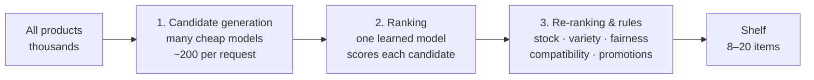
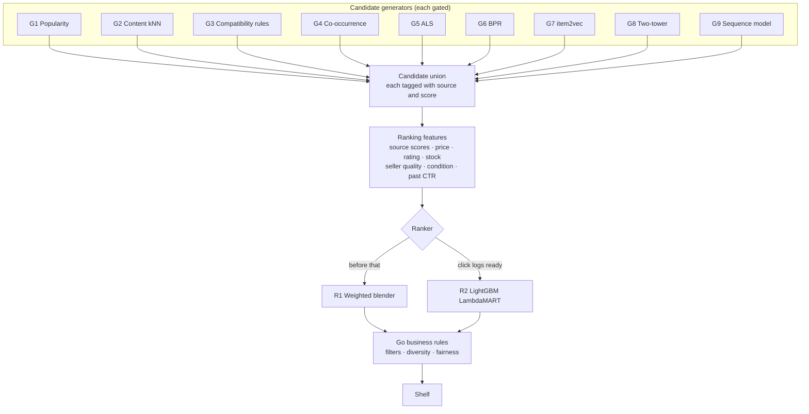
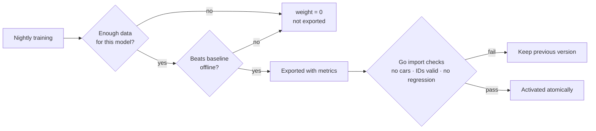
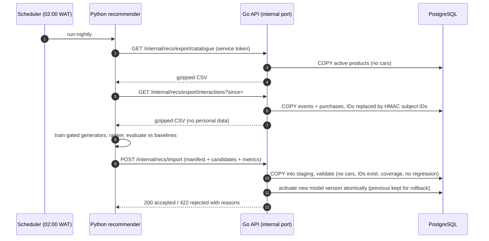
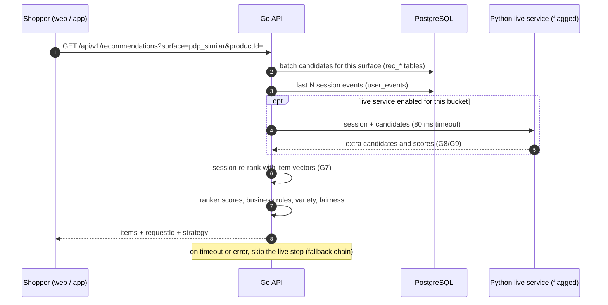

# TechShop recommendation system

The plan for product recommendations across the market site, wholesale site and customer app. It covers:
- what problem recommendations solve and how large companies approach it (we adopt every pattern);
- every model we use, with pros, cons and trade-offs, and how they combine into one hybrid system;
- how the Python recommender plugs into the Go backend without breaking the "only Go touches the database" rule;
- tracking and privacy, fairness between TechShop's own stock and vendors;
- evaluation, the `recommender/` project structure, project impact, cost, roadmap and risks.

**Status:** plan. Nothing is built yet.

**Related docs:**
- Data model: [`database.md`](database.md)
- Proposed new tables: [`schema-changes.md`](schema-changes.md)
- Backend: [`backend.md`](backend.md)
- Mobile: [`mobile.md`](mobile.md)
- Decisions log: [`plan.md`](plan.md)

---

## 1. Summary

- **One architecture, every industry pattern.** Candidates come from many models. A ranking model orders them. Go applies business rules last, at request time.
- **One hybrid ensemble, every model.** Popularity, content similarity, co-purchase, ALS/BPR, item2vec, two-tower and a sequence model all feed a LightGBM ranker.
- **Each model is gated.** It only gets a say once it has enough data **and** beats the simple baseline offline. Until then its weight is zero, so adding a model can never make launch-day quality worse.
- **Python never touches the database.**
  - A nightly Python job receives pseudonymised snapshots from Go and sends scored candidates back.
  - Go re-ranks live within each shopping session.
  - A live Python service for the real-time models is built behind a feature flag, with a timeout and automatic fallback to Go.
- **Safety rules always run in Go:** in stock, active, never cars mixed with gadgets, accessories must fit, variety, fairness. A broken or stale model can never show something wrong. Go falls back to rules automatically.
- **Tracking starts at launch, with consent.** Personal shelves only for people who opt in. Everyone gets non-personal shelves (similar items, trending, bundles).

---

## 2. How companies approach recommendations (and what we take from each)

Large retailers and platforms converge on the same **multi-stage funnel**:



| Approach | Who made it famous (public papers and blogs) | What it is | How TechShop uses it |
|---|---|---|---|
| **Heuristics + logging first** | Most early-stage shops | Best sellers, similar items by attributes, recently viewed; record behaviour from day one | **v0 at launch.** Tracking ships with the first backend phase. |
| **Item-to-item collaborative filtering** | Amazon (2003, "Item-to-Item Collaborative Filtering") | "Customers who bought X also bought Y", computed offline in batch from co-purchases | "Bought together", "Complete your setup", cart cross-sell |
| **One strategy per shelf** | Netflix | Each row ("Because you viewed…", "Trending") has its own algorithm; another model orders the rows | Each shelf has its own candidate mix and fallback chain (§5) |
| **Two-stage retrieval → ranking** | YouTube (2016, "Deep Neural Networks for YouTube Recommendations") | A recall model finds a few hundred candidates; a separate model ranks them | Our generators → LightGBM ranker split |
| **Learning-to-rank** | Etsy, Instacart, Airbnb (engineering blogs) | Gradient-boosted trees rank candidates using many signals (scores, price, rating, clicks) | LightGBM LambdaMART ranker (§3.3) |
| **Embeddings + nearest neighbours** | Pinterest, Spotify | Products as vectors; similar = close vectors | item2vec and two-tower vectors; Go re-ranks the session with them |
| **Business-rule re-ranking** | Every retailer | Hard filters and diversity applied last | Always in Go, at request time (§3.4) |
| **Online experiments** | Everyone at scale | A/B tests, interleaving, guardrails | Bucketing through `feature_flags.rules` (§8) |

The typical infrastructure path, which we follow in order:
1. Log events.
2. Nightly batch job.
3. Precomputed results in the main database.
4. Live session features.
5. Live model service.

Most companies stay at step 2–3 for years. We build all the steps, but switch each one on only when it pays off.

---

## 3. The hybrid ensemble: every model, combined

### 3.1 Model catalogue: pros, cons and trade-offs

| # | Model | What it produces | Pros | Cons | Switches on when |
|---|---|---|---|---|---|
| G1 | **Popularity** (time-decayed, τ = 7 days; weights view 1, save 3, cart 5, buy 10; Bayesian-smoothed rating) | Trending overall, by category, by state | Works on day one; never empty; cheap | Same for everyone; popular items get more popular | Day one |
| G2 | **Content kNN** (TF-IDF over `brand category attr=value`, scaled numeric specs, cosine) | Similar products | No behaviour data needed; handles brand-new products; explainable | Only "more of the same"; only as good as the spec data | Day one |
| G3 | **Compatibility rules** (`product_compatibility`) | Accessories that fit a device | Never recommends a cable that doesn't fit; trusted | Needs curated data | Day one (catalogue team) |
| G4 | **Co-occurrence / association rules** (lift with minimum support of 3 orders or sessions, plus shrinkage) | Bought together, also viewed | Best for bundles; explainable; cheap | Needs volume; noisy without G3 | ~2k orders or ~20k sessions |
| G5 | **ALS** (implicit feedback matrix factorisation, `implicit`) | "For you" candidates per user | Personal; fast on CPU; proven | Cold start for new users and products; less explainable | ~5k users with 3+ interactions, ~50k events |
| G6 | **BPR** (Bayesian personalised ranking, `implicit`) | "For you" candidates | Often better top-of-list order than ALS | Same cold-start limits; more tuning | Same as G5 |
| G7 | **item2vec** (word2vec over browsing sessions, `gensim`) | Item vectors; also viewed | Captures intent; powers live session re-ranking in Go | Needs many sessions | ~100k sessions |
| G8 | **Two-tower retrieval** (user and item towers, PyTorch, CPU) | Candidates from rich features (state, device, price sensitivity) | Uses many features; good recall | Heavier training; needs a live service for fresh user vectors | ~50k active users and the live service on |
| G9 | **Sequence model** (SASRec, PyTorch) | "What next" in the session | Best next-item quality | Data-hungry; needs the live service; highest cost | ~500k sessions and the live service on |
| R1 | **Feature-weighted blender** | Combined score | Works without click logs; transparent | Hand-tuned weights | Day one |
| R2 | **LightGBM LambdaMART ranker** | Final ordering of all candidates | Industry favourite for ranking; shows which signals matter | Needs labelled impression and click logs | ~4–8 weeks of recommendation impressions and clicks |
| ✗ | LightFM (hybrid) | — | Elegant cold start | **Excluded:** effectively unmaintained and breaks on recent Python. G2 + G5 blending gives the same hybrid effect. | — |

These thresholds are starting points. The real gate is the offline evaluation (§8): a model is only switched on when it beats the baseline.

### 3.2 How the models combine



**Gating, so the combination is always the best available:**



### 3.3 Ranking features (for R1 and R2)

- **Generator scores:** each one, or zero if not a source.
- **Product:** price, price relative to the anchor product, discount %, Bayesian rating and review count, condition match.
- **Stock and seller:** stock band, seller rating, `fulfilled_by` TechShop (delivery speed).
- **Popularity:** in the shopper's state.
- **History:** past click-through on this shelf.
- **Session:** session vector similarity (G7).

Margin is **never** a main feature; at most a tie-breaker, to protect trust.

### 3.4 Business rules (always Go, at request time)

1. **Hard filters:**
   - product active, with at least one active, in-stock listing;
   - seller active;
   - `categories.kind = 'product'` (no cars);
   - not the anchor product;
   - not blocked by staff (`rec_overrides`);
   - not something the shopper already bought (unless the category's `repurchase_days` have passed);
   - accessories must be compatible with the anchor device.
2. **Best offer per product:** lowest effective price in the preferred condition, weighted by seller rating and TechShop fulfilment.
3. **Variety (MMR, λ = 0.7):** at most 2 per brand and 3 per seller in the top 8. Mix conditions where relevant.
4. **Fairness policy (§7).**
5. **Staff pins** (`rec_overrides`, time-boxed and audited).
6. **Fallback chain per shelf (§5).** The response records which strategy produced each item.

---

## 4. Integration with the Go backend

### 4.1 Options considered

| Option | How it works | Verdict |
|---|---|---|
| **A. Live Python service** | Go calls FastAPI on each request | **Adopted for real-time models only** (G8, G9), behind a feature flag, 80 ms timeout, circuit breaker and Go fallback |
| **B1. Python reads a read replica** | The batch job queries a copy of the database | **Rejected:** breaks "only Go touches the DB", needs a replica (~$15–50/month) and a second credential set, and makes personal data easy to expose |
| **B2. File drops in object storage** | Go writes Parquet files; Python reads them; Go imports results | **Kept as the scale-up path** if HTTP exports get too big (~10M+ events per night) |
| **B3. Go-mediated internal API** | Python pulls pseudonymised exports from Go and pushes results back to Go | **Adopted: the nightly backbone** |
| **C. Go session re-ranking** | Go re-ranks candidates live using vectors from the batch | **Adopted** |
| **E. Go SQL rules only** | No Python | **Adopted as v0 and as the permanent fallback** |

**Combined result:** E (fallback) + B3 (nightly) + C (live session) + A (gated live models). Every adopted option is one where Python never connects to Postgres.

### 4.2 Nightly batch (B3)



**Contract:**
- The import carries a manifest (`model_kind`, `trained_at`, `data_cutoff`, `metrics`, `code_version`, `row_counts`) and records of type `item_neighbour`, `subject_candidate`, `item_vector`, `popularity` and `ranker_model`.
- JSON Schemas for these live in `backend/internal/modules/recommendations/contract/`. Python's tests validate its output against them, so the formats can't drift.

**Internal port:**
- `INTERNAL_PORT` (e.g. 8081), never routed by nginx.
- Bearer service token compared in constant time.
- Go maps HMAC subject IDs back to users in SQL, so the key never leaves Go.

### 4.3 Live serving



**Failure behaviour:**
- **Live service slow or down:** skipped. The circuit breaker opens after repeated failures.
- **Batch job failed:** yesterday's version keeps serving.
- **Batch older than `RECS_STALE_AFTER` (72h):** automatic fallback to v0 rules.
- **No surface ever returns empty:** global popularity is the last fallback.

---

## 5. Shelves and their strategies

| Shelf (surface) | Where | Candidate sources (when gated on) | Fallback chain |
|---|---|---|---|
| `home_for_you` | Market home, app home | G5, G6, G8, G9, G1 (state) | → category popularity → global popularity |
| `trending` | Home | G1 by state and category | → global |
| `recently_viewed` | Home, product page | `user_events` | → hidden |
| `pdp_similar` | Product page | G2, G7, G4 (also viewed) | → G2 → same category, best rated |
| `pdp_bundle` "Complete your setup" | Product page | G3, G4 (bought together, filtered by G3) | → G3 only → accessory category popularity |
| `cart_cross_sell` "Works with your …" | Cart | G3, G4 basket | → G3 → cheap add-ons |
| `saved_similar` | Saved items | G2, G7 | → G2 |
| `search_rerank` | Search results | Text relevance × G1 × personal affinity (G5/G7) | → text relevance × popularity |
| `similar_cars` | Car pages | Go SQL only (make, model, body, year ±2, price ±20%, state) | → same body type |
| `b2b_reorder` | Wholesale | Repurchase from orders + `repurchase_days`, G4 at business level | → best sellers in purchased categories |
| Email and push | Re-engagement | Abandoned cart, back in stock, price drop on saved, "picked for you" | Marketing consent only |

---

## 6. Behaviour tracking and privacy (NDPA 2023)

**Events recorded** (table `user_events`, see [`schema-changes.md`](schema-changes.md)):
- `product_view`, `list_impression`, `rec_impression`, `rec_click`, `search`, `search_click`
- `add_to_cart`, `remove_from_cart`, `save`, `unsave`, `begin_checkout`, `purchase`
- `car_view`, `car_enquiry`, `share`

**Who records what:**
- **Clients** (web via `sendBeacon`, app via `fetch`) batch events to `POST /api/v1/events`. A shared tracker in `shared/api-client` flushes every 10 s or 20 events.
- **The server** records purchases, carts and saves itself, inside the same transaction as the action. These are never trusted from the browser.

**Identity:**
- A random anonymous ID (cookie on web, secure storage on mobile).
- The user ID is added when signed in.
- Sign-in links the two (`identity_links`).

**Consent:**

| Purpose | Basis | Without consent |
|---|---|---|
| Essential (cart, recently viewed on this device) | Contract / legitimate interest | Always on |
| Personalisation ("For you", cross-device history) | **Consent** (banner + account toggle) | Non-personal shelves only |
| Marketing email and push | **Consent** (`users.marketing_opt_in`) | No re-engagement messages |

**Retention (proposal):**
- Raw events: 13 months.
- Anonymous events never linked to an account: 90 days.
- Aggregates (no personal data): kept.

**Deletion:**
- Deleting an account deletes its events, links, consents and personal candidates.
- Python only ever sees pseudonymised IDs.
- Search text is scrubbed of phone numbers and emails before storage.
- Banner wording needs legal review.

---

## 7. Fairness: TechShop stock vs marketplace vendors

The policy combines all three options, each configurable by the owner through `feature_flags`:

| Control | Default | Effect |
|---|---|---|
| **Neutral ranking** | On | TechShop and vendors are scored on the same signals (relevance, rating, price, stock, seller quality) |
| **Vendor exposure floor** | e.g. ≥ 2 of 8 slots when qualifying vendor items exist | Keeps marketplace sellers visible early on; never shows an out-of-stock or blocked item |
| **First-party boost** | **0** (off) | Optional, capped (e.g. at most +10% score). Owner-set. **Legal review** (FCCPA self-preferencing) before enabling |
| **Exposure dashboard** | On | Staff Analytics shows each side's share of impressions, clicks and revenue versus share of listings |

---

## 8. Evaluation and monitoring

**Offline** (every nightly run):
- **Split:** time-based (train before T, test T → T+7 days) plus leave-last-out per user.
- **Metrics at k = 8:** precision@k, recall@k, NDCG@k, HitRate@k; catalogue coverage; novelty; intra-list diversity; vendor exposure share.
- **Baselines every model must beat:** global popularity and "same category, best rated" (today's `relatedProducts` fixture logic).
- **Import gates in Go:**
  - no vehicle categories;
  - IDs exist;
  - scores finite;
  - row counts within ±50%;
  - coverage above the threshold;
  - no metric regression beyond tolerance.

**Online:**
- **Bucketing:** a deterministic hash of the anonymous ID, configured in `feature_flags.rules`.
- **Primary metrics:** recommendation click-through, add-to-cart from recommendations.
- **Secondary metrics:** conversion, revenue per session, average order value.
- **Guardrails:** return rate, p95 latency, fallback rate.
- **Low-traffic tactics:** interleaving for ranking changes, and longer tests.

**Monitoring:**
- Fallback rate and empty-shelf rate per surface.
- `/recommendations` p95 latency (target < 50 ms without the live service).
- Model age (alert above 48h; automatic fallback above 72h).
- Live-service timeout rate.
- Batch run status and drift in event volume and category mix.

---

## 9. The `recommender/` project

```text
recommender/                          # 3rd independent root (like frontend/, mobile/)
├── pyproject.toml                    # Python 3.13; deps; ruff, mypy, pytest config
├── uv.lock                           # pinned dependencies (uv)
├── README.md
├── Dockerfile                        # python:3.13-slim, non-root, CPU only (batch + serving images)
├── .env.example                      # TECHSHOP_INTERNAL_URL, RECS_SERVICE_TOKEN, ARTIFACT_DIR — never DATABASE_URL
├── configs/
│   ├── surfaces.yaml                 # candidate sources + fallback chain per shelf
│   ├── gates.yaml                    # data thresholds per generator
│   └── models/                       # hyper-parameters: content, cooccurrence, als, bpr, item2vec, two_tower, sasrec, ranker
├── src/techshop_recs/
│   ├── cli.py                        # techshop-recs run-nightly | train <model> | evaluate | sample
│   ├── settings.py                   # typed settings (pydantic-settings)
│   ├── io/
│   │   ├── api.py                    # streaming export/import client (httpx, gzip)
│   │   └── contracts.py              # pydantic models mirroring Go's JSON Schemas
│   ├── data/
│   │   ├── load.py                   # exports → polars DataFrames
│   │   ├── sessions.py               # sessionisation, de-duplication, bot filtering
│   │   └── splits.py                 # time-based + leave-last-out
│   ├── features/
│   │   ├── catalogue.py              # spec flattening, price bands, TF-IDF / one-hot
│   │   ├── interactions.py           # weighted user × item matrix
│   │   └── ranking.py                # feature rows for R1/R2
│   ├── models/                       # each implements fit() / candidates() / save() / load()
│   │   ├── base.py                   # CandidateModel protocol + gate check
│   │   ├── popularity.py             # G1
│   │   ├── content.py                # G2 (scikit-learn)
│   │   ├── cooccurrence.py           # G4 (polars)
│   │   ├── als.py                    # G5 (implicit)
│   │   ├── bpr.py                    # G6 (implicit)
│   │   ├── item2vec.py               # G7 (gensim)
│   │   ├── two_tower.py              # G8 (PyTorch, CPU)
│   │   ├── sequence.py               # G9 SASRec (PyTorch)
│   │   ├── blender.py                # R1 feature-weighted blend
│   │   └── ranker.py                 # R2 LightGBM LambdaMART
│   ├── gating.py                     # data thresholds + beat-the-baseline checks
│   ├── evaluation/
│   │   ├── metrics.py                # precision/recall/NDCG/HitRate@8, coverage, novelty, diversity, vendor share
│   │   ├── baselines.py              # popularity + same-category-best-rated
│   │   └── report.py                 # metrics → import manifest + markdown report
│   ├── pipelines/
│   │   └── nightly.py                # export → train → gate → evaluate → import
│   └── serving/                      # live service (flagged on per bucket)
│       ├── app.py                    # FastAPI: POST /v1/score (session + candidates → scores)
│       ├── loader.py                 # loads the active model version's artifacts
│       └── health.py                 # /health, /ready
├── notebooks/                        # exploration only; never imported by src/
├── artifacts/                        # model files per run (gitignored; keep last 7)
└── tests/
    ├── fixtures/                     # tiny synthetic catalogue + events
    ├── test_models.py                # each generator on synthetic data
    ├── test_gating.py
    ├── test_metrics.py
    ├── test_contracts.py             # output validates against backend JSON Schemas
    ├── test_serving.py               # FastAPI contract + latency budget
    └── test_no_db_access.py          # fails if a DB driver is installed or DATABASE_URL is set
```

**Libraries:**
- **Data and ML:** polars, numpy, scipy, scikit-learn, implicit, gensim, lightgbm, torch (CPU).
- **Plumbing:** pydantic, httpx, typer, fastapi + uvicorn (serving).
- **Dev:** ruff, mypy, pytest.
- **Not used:** faiss/annoy (brute-force cosine is fine below ~100k products) and LightFM (unmaintained).

---

## 10. Project impact

| Area | Change |
|---|---|
| **New root** | `recommender/` (Python, `uv`), a third independent install root |
| **`CLAUDE.md`** (proposed wording, owner to approve) | *"Only the Go API (`backend/`) touches PostgreSQL. … The recommender (`recommender/`) never gets a DB driver or `DATABASE_URL`: its batch job reads pseudonymised snapshots from the API's internal export endpoints and returns results through the internal import endpoint; its live service receives candidates from the Go API and returns scores."* Install-roots rule: add `recommender/` (`pyproject.toml` + `uv.lock`; no repo-root `pyproject.toml`). |
| **Schema** | New: `user_events`, `identity_links`, `consents`, `rec_model_versions`, `rec_item_neighbours`, `rec_subject_candidates`, `rec_item_vectors`, `rec_popularity`, `rec_overrides`, `product_compatibility`, staging tables. Plus `categories.repurchase_days`. See [`schema-changes.md`](schema-changes.md). The events migration ships in **phase 1**, so history builds from launch. |
| **Backend** | `internal/modules/events` (ingestion: validation, consent, bot filter, rate limit); `internal/modules/recommendations` (strategies, ranker, export/import, contract schemas, experiments, live-service client with circuit breaker); internal listener on `INTERNAL_PORT`; anonymous-ID middleware. Config: `RECS_ENABLED`, `INTERNAL_PORT`, `RECS_SERVICE_TOKEN`, `RECS_PSEUDONYM_KEY`, `RECS_STALE_AFTER`, `RECS_LIVE_URL`, `RECS_LIVE_TIMEOUT`, `EVENTS_ENABLED`, `EVENTS_MAX_BATCH`. |
| **Shared client** | `shared/api-client`: `RecommendationSurface`, `RecommendationResponse`, `TrackEvent`, `ConsentState` types; `recommendations()`, `trackEvents()`, consent calls; a platform-neutral `tracker.ts` (transport injected, so no DOM APIs in `shared/`) |
| **Web** | Market: "For you", "Trending in {state}", "Recently viewed" (home); "Similar" and "Complete your setup" (product page); "Works with your …" (cart); saved and search tracking; consent banner and account privacy toggle. Wholesale: "Reorder" and "Often bought in bulk with". Staff: recommendations dashboard (click-through, revenue, fallback rate, model version, exposure share, overrides editor). The `relatedProducts` fixture stays as the mock and baseline. |
| **Mobile** | Same tracker and shelves in the customer app (anonymous ID in `expo-secure-store`) |
| **Infra** | `infra/docker/compose.yml`: `recommender` (batch) and `recommender-serve` services under a `recs` profile, with no Postgres credentials; an artifacts volume. A nightly scheduler (host cron or a Kubernetes CronJob; hosting is undecided). |
| **CI / CD** | CI: a `recommender` job (uv sync, ruff, mypy, pytest, contract tests). CD: a separate `deploy-recommender.yml`. `make check` gains the Python checks. |

**Cost and team:**

| Stage | Infrastructure | Approx. monthly |
|---|---|---|
| v0 | None (Go and SQL) | $0 |
| v1 | Nightly batch, ~2 vCPU / 4 GB for 5–20 min | $0–10 |
| v2 | Same, plus a little Go memory for vectors | $0–10 |
| v3 | Live service always on (when flagged on) | +$20–60 |

The team needs one engineer comfortable with Go, SQL and Python data tools. No feature store, Kafka or MLflow until a specific need appears.

---

## 11. Roadmap

| Phase | Depends on | Delivers | Exit criteria |
|---|---|---|---|
| **v0: rules + tracking** | Backend identity, catalogue and sales migrations | Events endpoint and tracker, consent banner, G1/G2/G3 in Go SQL, all shelves with fallbacks, similar cars, B2B reorder, overrides, compatibility data | Every shelf served by the API; fallback rate < 5%; events flowing |
| **v1: nightly hybrid** | v0 + 4–8 weeks of events | `recommender/` root, internal export/import, `rec_*` tables, G2/G4 in Python, G5/G6 when gated, R1 blender, evaluation and gates, staff dashboard | Beats baselines offline; A/B ≥ v0 with guardrails holding |
| **v2: session + ranker** | v1 stable, enough sessions and click logs | G7 vectors, Go session re-ranking, R2 LightGBM ranker, personal search boost, re-engagement digests | A/B lift on "For you" and search |
| **v3: live models** | Data thresholds for G8/G9 | FastAPI live service, G8 two-tower, G9 SASRec, flag rollout by bucket | Offline gain ≥ 10% NDCG and online lift, within the latency budget |

**Success metrics:**
- recommendation click-through; add-to-cart from recommendations;
- accessory attach rate on phone and laptop orders;
- share of revenue influenced by recommendations; average order value with bundles;
- search click-through and zero-result rate;
- catalogue coverage; vendor exposure share;
- p95 latency.

---

## 12. Risks and mitigations

| Risk | Mitigation |
|---|---|
| Too little data at launch makes ML no better than rules | Gating: a model counts only after it beats the baseline |
| Wrong accessory recommended | Compatibility filter on bundle and cart shelves; verified pairs preferred |
| Out-of-stock or blocked items shown | Live filters in Go at request time; batch output is only candidates |
| Cars leaking into gadget shelves | `categories.kind` filter at export, import validation and the ranker, with tests at each layer |
| Live service slows pages | 80 ms timeout, circuit breaker, per-bucket flag, Go fallback |
| Marketplace distrust (favouritism either way) | Neutral default, vendor floor, capped optional boost, exposure dashboard |
| NDPA non-compliance | Consent table, pseudonymised exports, retention jobs, deletion cascade, legal review |
| Event volume bloats Postgres | Batching, rate limits, bot filter, BRIN index, retention, partition later |
| Someone gives Python database access | `CLAUDE.md` rule, `test_no_db_access.py`, code review |
| Silent batch failure | Staleness alert and automatic fallback; runs recorded in `rec_model_versions` |
| Two languages for a small team | Narrow contract (two file formats, one scoring endpoint); Python is offline-first |

---

## 13. Open decisions for the owner

1. Approve the proposed `CLAUDE.md` amendment wording (§10).
2. Consent basis: consent for everything, or legitimate interest for non-personal analytics with consent for personalisation (needs legal sign-off).
3. Retention periods (13 months raw, 90 days for unlinked anonymous events).
4. Vendor exposure floor size, and whether a first-party boost is ever enabled.
5. How much promotions may influence ranking.
6. Who maintains accessory compatibility: the catalogue team, or sellers when listing.
7. Production hosting and scheduler for the nightly job and the live service.
8. Seller-side insights (views, saves, conversion per listing): v1 or later.
9. B2B reorder visibility: all business members, or buyers only.
