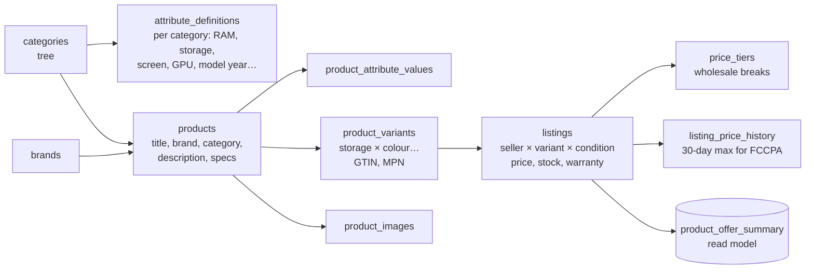
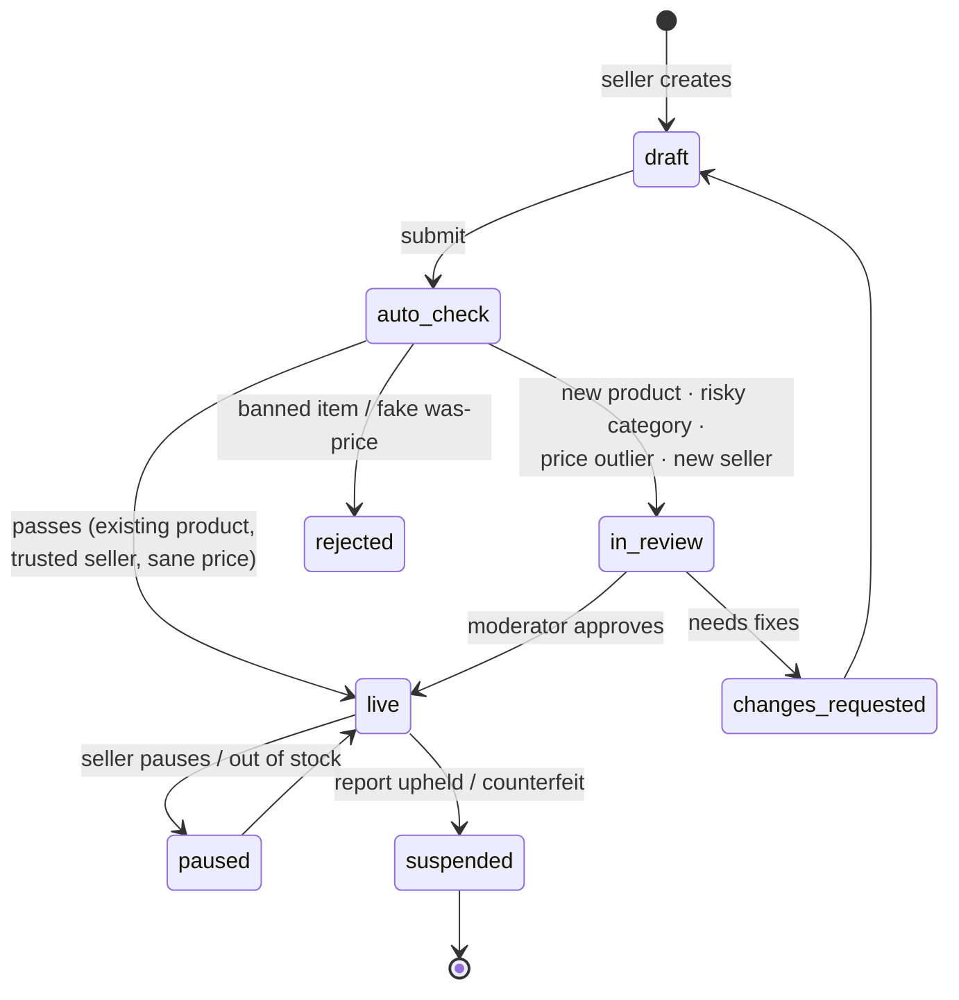

# TechShop search and catalogue system

The plan for how products get into TechShop and how people find them:
- the **product information model** (products, variants, listings, offers);
- **seller listing and moderation**;
- the **search read model**, query understanding (Nigerian synonyms, typos), **ranking**, facets and autocomplete;
- the **buy box** for products sold by several sellers;
- price integrity;
- search analytics;
- SEO;
- when to move beyond Postgres search.

**Status:** plan. Nothing is built. The catalogue tables (`categories`, `brands`, `attribute_definitions`, `products`, `product_attribute_values`, `product_variants`, `product_images`, `listings`, `price_tiers`, `listing_price_history`) exist in [`database/schema.sql`](database/schema.sql). The read model `product_offer_summary` is proposal #11 in [`schema-changes.md`](schema-changes.md); new items are in §7.

**Interactive mockup and simulation:** [`mockups/search-catalogue.html`](mockups/search-catalogue.html).

**Related docs:** [`backend.md`](backend.md) (catalogue module, FCCPA guard), [`recommendations.md`](recommendations.md) (personal re-ranking, similar items), [`architecture-decisions.md`](architecture-decisions.md) #7 (`ProductSummary` / `ProductDetail` with `offers[]`), [`trust-safety.md`](trust-safety.md) (counterfeit and listing abuse).

---

## 1. Summary

- **One product, many offers.** A *product* (Nova X5 Pro 5G) has *variants* (12 GB/256 GB, colours). Each seller sells a variant in a condition through a *listing* (price, stock, warranty). Customers see one product page with a **buy box** and "other sellers", not 15 duplicate pages.
- **Sellers propose; TechShop curates.**
  - Sellers attach listings to existing products, or propose new products;
  - new products, risky categories and suspicious prices go through **moderation** before going live;
  - an automated pre-check catches most problems: banned words, fake "was" prices, duplicate products, missing required attributes.
- **Search runs on Postgres at launch,** on a denormalised read model, `product_offer_summary`:
  - one row per product and channel, updated through the outbox;
  - full-text search for relevance, trigram similarity for typos, a curated **synonym dictionary** for Nigerian usage ("tokunbo" = UK-used, "pc" = laptop, "ps5" = Play 5);
  - facet counts in one query.
- **Ranking is explainable:** text relevance × business signals (sales velocity, rating, availability, seller quality, margin-neutral), then the personal re-rank from the recommender, then rules (vendor exposure floor, no out-of-stock at the top). Staff can see "why is this ranked here".
- **Zero-result and low-click searches are a work queue.** Staff fix them with synonyms, redirects or catalogue gaps. Every fix applies instantly.
- **Move to a dedicated engine (Meilisearch or OpenSearch) only when measured:** p95 above 300 ms, more than about 200k offers, or the need for vector or hybrid search. The Go `search.Port` interface makes that a swap, not a rewrite.

---

## 2. Product information model



**The model:**
- **Category attributes are typed** (number with unit, enum, boolean, text) and marked `required`, `filterable` and `variant_defining`.
  - Phones: brand, model, storage, RAM, colour, network (4G/5G), SIM slots, battery health (used only).
  - Laptops: CPU family, RAM, storage, GPU, screen size, use (business, gaming, workstation).
  - Cars use their own `car_listings` and never mix with gadgets.
- **Conditions:** `new`, `uk_used` ("tokunbo"), `nigerian_used`, `refurbished`, `open_box`. Used phones need battery health and grade (A/B/C). Refurbished needs a refurbisher warranty.
- **Identifiers:**
  - GTIN/EAN and MPN are optional but used for duplicate detection.
  - Each listing gets a seller SKU.
  - IMEI or serial numbers live on `device_units` (inventory), not on listings.
- **Content ownership:** TechShop owns product titles, images and specs (sellers can suggest edits). Sellers own price, stock, condition, warranty and handling time.

---

## 3. Getting products in: listing and moderation



**Automated checks:**

| Check | Rule |
|---|---|
| Required attributes present | Per category |
| Duplicate product | Same GTIN, or title similarity > 0.85 within the brand: suggest attaching to the existing product |
| **Price outlier** | More than 40 % below the category median for that variant and condition: review (scam signal); more than 60 % above: warn the seller |
| **Fake "was" price (FCCPA)** | Compare-at must be ≤ the listing's 30-day maximum price from `listing_price_history`, otherwise rejected |
| Banned or restricted words | Replica, "first copy", "clone", counterfeit brand misuse, prohibited items |
| Images | At least 3 for new products; minimum 800 px; EXIF stripped; perceptual-hash duplicate check against other sellers' photos (stolen images) |
| Seller standing | New sellers' first 10 listings always reviewed; sellers with a high cancellation or return rate are reviewed |

**Moderation queue:**
- in Staff › Catalogue, ordered by risk score, then age;
- reviewer actions: approve, request changes (with templated reasons) or reject;
- target: under 24 hours;
- every decision is audited and visible to the seller.

---

## 4. The search read model

`product_offer_summary` has one row per product × channel (`retail`, `wholesale`). It is rebuilt by an outbox subscriber whenever a product, listing, price, stock, rating or promotion changes. That happens within seconds; there is also a nightly full rebuild for safety.

| Column group | Contents |
|---|---|
| Identity | `product_id, channel, slug, category_path (ltree), brand_id` |
| Offer | `best_listing_id` (the buy box winner), `min_price_kobo, max_price_kobo, compare_at_kobo, promo_price_kobo, discount_pct, offer_count, conditions text[], seller_types text[], in_stock, stock_band` |
| Quality | `rating_avg, rating_count, sales_30d, return_rate_90d` |
| Facets | `attrs jsonb` (filterable attributes, normalised units), `facet_keys text[]` |
| Search | `search_vector tsvector`: weighted A title + brand + model, B attributes + category names, C description. Plus `title_trgm` for typos |

Indexes:
- GIN on `search_vector`, `attrs` and `facet_keys`;
- GiST/GIN trigram on the title;
- B-tree on `(category_path, channel, in_stock)`.

### 4.1 Query pipeline

```mermaid
flowchart LR
  Q[raw query] --> N[normalise<br/>lowercase, ₦/k/m prices,<br/>256gb → 256 GB]
  N --> SYN[synonyms + intents<br/>tokunbo → uk_used<br/>under 200k → price filter<br/>ps5 → Arcadia Play 5]
  SYN --> RED{exact redirect?<br/>e.g. 'cars' → /c/cars}
  RED -- yes --> R[redirect]
  RED -- no --> FTS[full-text match<br/>websearch_to_tsquery]
  FTS --> FEW{fewer than 3 results?}
  FEW -- yes --> TRG[trigram fuzzy fallback<br/>'did you mean …']
  FEW -- no --> RANK
  TRG --> RANK[score: relevance × signals]
  RANK --> PERS[personal re-rank<br/>recs module, consented]
  PERS --> RULES[rules: in stock first,<br/>vendor floor, pins/blocks]
  RULES --> F[facets in the same query<br/>brand · condition · price · RAM…]
  F --> OUT[results + facets + suggestion]
  OUT --> LOG[(search_queries log)]
```



**Query understanding:**
- **Synonyms** are both two-way ("laptop ↔ notebook") and one-way ("tokunbo → UK-used", "infinix → brand:Infinix").
- **Intents** become filters: price phrases ("under 200k", "between 100k and 300k", "₦1.5m"), conditions ("new", "used"), storage ("256gb") and network ("5g").
- **Spelling:**
  - trigram similarity against product titles and the brand/model dictionary;
  - "did you mean" shown above 0.45 similarity;
  - results are auto-replaced only when the original query has zero hits.

**Ranking formula** (weights in configuration, tuned with click logs later):

```
score = text_rank(ts_rank_cd, field weights A>B>C)
      × (1 + 0.25·log1p(sales_30d) + 0.15·rating_bayes + 0.10·seller_quality)
      × availability (in stock 1.0 · low 0.9 · out 0.2)
      × condition_match (1.0 if the query asked for it)
```

After that:
- recommendations re-rank the top 100 for consented users (bounded: position changes of at most ±5);
- rules apply: pinned results, blocked results, and a vendor exposure floor in the top 20 ([`recommendations.md`](recommendations.md) fairness policy).

**There is no paid placement in organic results.** Sponsored listings, if ever added, would be labelled and kept separate (open decision).

**Autocomplete** (`/search/suggest`, target < 50 ms):
- prefix matches on popular queries (`search_suggestions`, built nightly from logs);
- category names;
- top 4 products;
- the customer's recent searches (stored on the device).

### 4.2 Buy box

When several listings offer the same variant, one wins the buy box (shown first; "Add to cart" uses it):

```
offer_score = landed_price_score (price + delivery to the customer's state)
            + 0.20·seller_rating + 0.15·on_time_delivery + 0.10·(1 − cancel_rate)
            + 0.05·warranty_months + fulfilled_by_TechShop bonus 0.05
```

- **Eligibility:** in stock, seller in good standing, price not an outlier.
- **No hidden first-party preference:** TechShop's own listings compete on the same formula. The optional capped boost is the same owner decision as in recommendations, default 0.
- **Other offers** are listed below with condition, seller, delivery estimate and warranty.

### 4.3 Prices and integrity

- **Every price change is written** to `listing_price_history`. The **FCCPA guard** rejects a compare-at price above the 30-day maximum.
- **"Deal" badges and countdowns** come only from real promotions with a real `ends_at`.
- **Price drops** feed the "price drop on saved item" journey ([`messaging-marketing.md`](messaging-marketing.md)).
- **Wholesale tier prices** are only visible to approved business accounts (`channel = wholesale`).

---

## 5. Search analytics and merchandising

- **Logging:** every search is logged in `search_queries`: normalised query, filters, result count, latency and session. Clicks and add-to-carts on results come from `user_events` (consented).
- **Dashboards (Staff › Catalogue › Search insights):**
  - top queries;
  - **zero-result queries**;
  - queries with low click-through;
  - queries ending in exits;
  - slow queries.
- **One-click fixes** (applied instantly; the read model and synonym cache refresh via NOTIFY):
  - add a synonym;
  - add a redirect (query → category or landing page);
  - pin or bury a product for a query (time-boxed, audited);
  - mark a catalogue gap ("customers search for 'starlink'; we don't sell it"), which goes to purchasing.
- **Quality metrics:** zero-result rate < 3 %, search CTR, search-to-cart rate, p95 latency < 300 ms.

## 6. SEO and performance

- **Server-rendered** category and product pages with `Product`/`Offer`/`AggregateRating` structured data (only real ratings), canonical URLs (one per product, not per listing), and a breadcrumb list.
- **Sitemaps:** products, categories and brands, split at 50,000 URLs and regenerated nightly. Out-of-stock products stay indexed with availability marked; permanently discontinued ones return 410 or redirect to the category.
- **Faceted URLs:** only a curated set is indexable (brand + category, e.g. `/c/phones/nova`). Other filter combinations are `noindex` so crawl budget isn't wasted.
- **Caching:** category and search API responses carry `Cache-Control` with short TTLs plus `stale-while-revalidate`; product pages use Next.js revalidation on catalogue events. Personalised parts are fetched separately and never cached at the CDN.

## 7. Data model

**Existing:** listed in the status line above. **Proposed:** #11 `product_offer_summary`, #26 `product_compatibility`, #27 `stock_alerts`, #28 `review_images`.

**New** ([`schema-changes.md`](schema-changes.md) §7):

| Table | Purpose and key columns |
|---|---|
| `listings` (extend) | `moderation_status (draft, auto_check, in_review, changes_requested, live, paused, suspended, rejected)`, `risk_score`, `handling_days`, `warranty_months`, `battery_health_pct null`, `grade null` |
| `listing_reviews` | Moderation decisions: `listing_id, reviewer_id, decision, reasons text[], note, created_at` |
| `product_suggestions` | Seller-proposed products and edits awaiting catalogue approval |
| `search_synonyms` | `terms text[], kind (two_way, one_way), target, created_by, active` |
| `search_redirects` | `query_norm unique, url, created_by, expires_at null` |
| `search_pins` | `query_norm, product_id, action (pin, bury), position null, starts_at, ends_at, created_by` |
| `search_queries` | `id, session_id, user_id null, query_norm, filters jsonb, results_count, latency_ms, created_at`; partitioned monthly, 13-month retention |
| `search_suggestions` | `prefix, suggestion, weight` (rebuilt nightly) |
| `catalogue_gaps` | `query_norm, searches_30d, status (new, sourcing, wont_stock), owner_id` |
| `image_hashes` | `product_image_id, phash` (stolen-image detection) |

## 8. API

| Who | Endpoints |
|---|---|
| Public | `GET /search?q&category&brand&condition&minPrice&maxPrice&attr.<k>&inStock&sort&cursor`; `GET /search/suggest?q`; `GET /categories/{slug}/products` (same engine); `GET /products/{slug}` (`ProductDetail` with `offers[]` and the buy box); `GET /products/{slug}/offers` |
| Seller | `GET /seller/{id}/catalogue/match?gtin|q` (find an existing product), `POST /seller/{id}/listings` (attach), `POST /seller/{id}/product-suggestions` (new product), `PATCH /seller/{id}/listings/{lid}` (price, stock, pause), `GET /seller/{id}/listings/{lid}/moderation` |
| Staff | `/staff/catalogue/products` (CRUD), `/staff/catalogue/moderation` (queue; `:approve`, `:request-changes`, `:reject`), `/staff/catalogue/attributes`, `/staff/search/synonyms`, `/staff/search/redirects`, `/staff/search/pins`, `/staff/search/insights`, `/staff/search/explain?q` (score breakdown) |

## 9. Screens

Shown in the mockup:
- **Market search:**
  - autocomplete;
  - typo tolerance with "did you mean";
  - synonym and intent handling ("tokunbo iphone under 700k");
  - facets with live counts and sort;
  - a **"why this order"** explain toggle with score breakdowns.
- **Product page:** buy box with "other sellers" and why the winner won.
- **Seller Centre:** list a product. Price outliers and fake "was" prices are caught live; the listing goes to moderation.
- **Staff › Catalogue:**
  - moderation queue (approve, request changes, reject);
  - synonyms manager (search uses new synonyms immediately);
  - search insights with zero-result queries recorded from your own searches and one-click fixes.

## 10. Delivery plan

| Milestone | Scope |
|---|---|
| **S1** (backend M1) | Categories, attributes, products, variants, listings (staff-managed); `product_offer_summary` + outbox refresh; FTS + facets; category pages |
| **S2** | Seller listing flow, auto-checks, moderation queue, FCCPA guard, image pipeline |
| **S3** | Synonyms, intents, trigram "did you mean", autocomplete, search logging and insights, redirects and pins |
| **S4** | Buy box with multiple offers, "other sellers", wholesale channel |
| **S5** | Personal re-rank from recommendations, explain tool, SEO hardening; engine review against the thresholds in §1 |

## 11. Risks and open decisions

**Risks:**
- **Postgres search quality ceiling** (no learning-to-rank, limited typo tolerance). Mitigated by synonyms, logs and the swap-ready `search.Port`.
- **Catalogue quality drift** when many sellers create products. Mitigated by TechShop owning product content and by duplicate detection.
- **Read model lag:** outbox-driven updates within seconds; checkout always re-prices from listings (never from the read model).

**Open decisions for the owner:**
1. Will sponsored listings ever exist? If yes, they must be clearly labelled and separate from organic ranking.
2. Moderation staffing and the 24-hour target.
3. Which conditions to allow at launch (is `nigerian_used` allowed?).
4. Buy box weights, and whether a first-party boost (default 0) is ever used.
5. Search engine choice when thresholds are met (Meilisearch is simpler; OpenSearch is more powerful).
