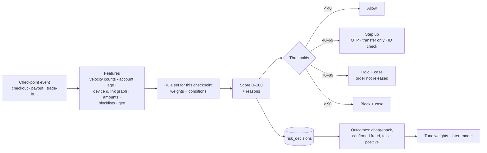
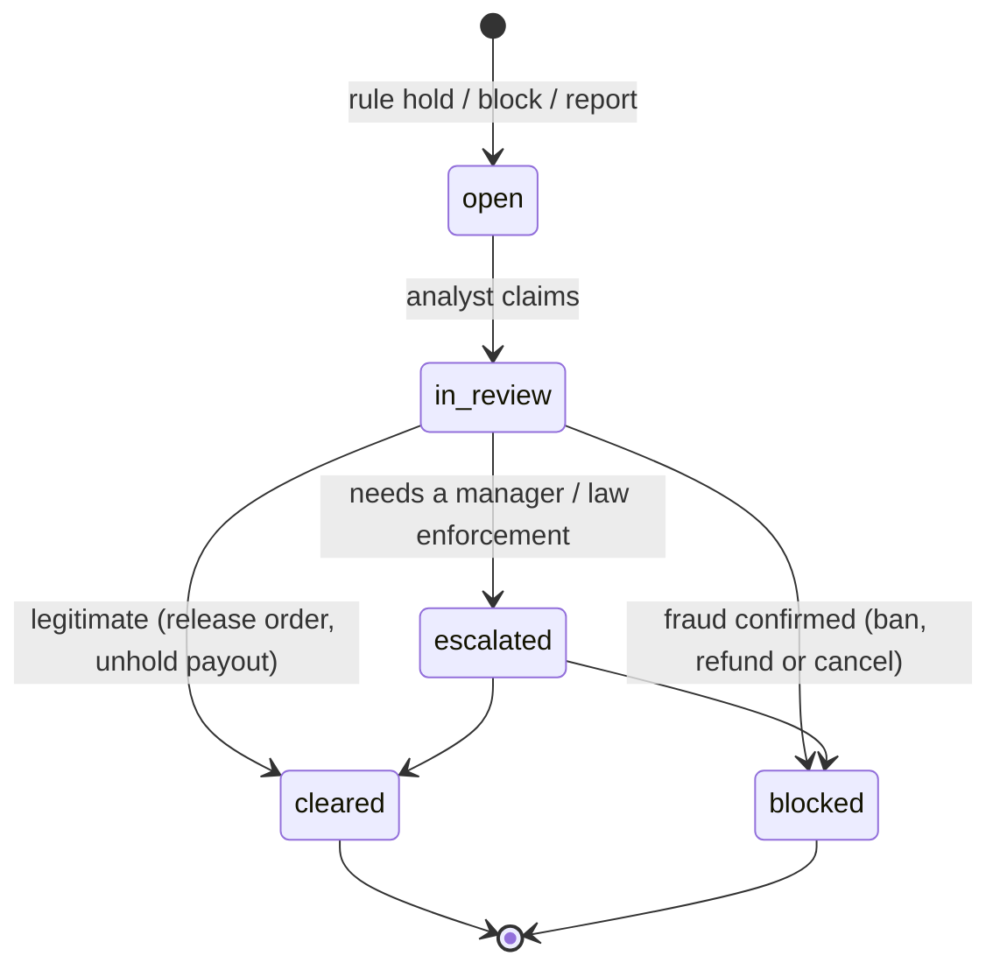

# TechShop trust and safety system

The plan for keeping buyers, sellers and TechShop safe:
- **KYC** for sellers, businesses and riders;
- the **risk engine**: real-time rules at sign-up, checkout, payout, trade-in and returns;
- **case management**;
- the **device blocklist** (stolen IMEIs);
- **counterfeit and listing abuse**;
- **review integrity**;
- **seller performance and enforcement**;
- buyer–seller disputes.

**Status:** plan. Nothing is built. `seller_kyc_submissions`, `kyc_documents`, `risk_cases`, `device_blocklist` and `product_reviews` exist in [`database/schema.sql`](database/schema.sql). Earlier proposals: #47 (KYC hashes and provider). New ones are in [`schema-changes.md`](schema-changes.md) §9.

**Interactive mockup and simulation:** [`mockups/trust-safety.html`](mockups/trust-safety.html).

**Related docs:** [`identity-access.md`](identity-access.md) (account takeover, staff permissions), [`payments-finance.md`](payments-finance.md) (chargebacks, payout holds), [`orders-fulfilment.md`](orders-fulfilment.md) (IMEI at receiving, return swap fraud), [`search-catalogue.md`](search-catalogue.md) (listing moderation).

---

## 1. Summary

- **Know who you trade with.**
  - Sellers verify identity (NIN or another ID), a selfie liveness check, bank account name match, and for registered businesses CAC registration and a director check.
  - Businesses buying on credit verify CAC and directors.
  - Riders verify ID, guarantor and address.
  - ID numbers are encrypted; staff see the last 4 digits; full reveal needs a permission, MFA step-up and an audit entry.
- **One risk engine, many checkpoints:**
  - **checkpoints:** sign-up, sign-in (with identity), checkout, payout, bank change, trade-in, return and review;
  - **how it scores:** each checkpoint runs a rule set that adds up a **score from 0 to 100** with reasons;
  - **outcomes:** allow, **step up** (OTP, transfer instead of card, manual verification) or **hold for review**, or block;
  - **where it runs:** inside the request, in Go, within a 30 ms budget.
- **Rules first, models later.**
  - Launch with transparent rules (velocity, device and account links, amount anomalies, blocklists, mismatches). Staff tune weights and thresholds in a rules editor, with a **test bench** that replays recent events.
  - A trained model is added once there are enough labelled outcomes (chargebacks, confirmed fraud), as one more scored signal.
- **Every review lands in one case queue,** prioritised by score and money at risk, with linked entities (accounts, devices, cards, phones, addresses, IMEIs) shown as a graph.
- **Stolen phones are not resold.**
  - Every IMEI entering stock (purchase, trade-in, return) is Luhn-checked and checked against the blocklist (our own plus external sources where available).
  - Blocked devices are quarantined and the case is reported.
- **Sellers are measured and held to standards:** order defect rate, late shipment, cancellation, return and counterfeit reports. Enforcement escalates from warning, to ranking demotion, to listing review, to suspension, with an appeal.

---

## 2. KYC

| Who | Required | Checks | Result |
|---|---|---|---|
| **Individual seller** | Full name, NIN, selfie, phone, address, bank account | NIN lookup (name and date of birth match), selfie vs NIN photo (liveness), bank name enquiry ≈ NIN name, phone OTP | `approved`, `rejected`, `more_info` |
| **Business seller** | CAC number, company name, director(s) KYC as above, business bank account | CAC registry lookup, director in the CAC record, account name = company name | As above |
| **Business buyer (credit)** | CAC, directors, trade references, bank statement (for limits above ₦5m) | CAC lookup, director KYC, finance review | Credit limit |
| **Rider** | ID, address, guarantor, licence (motorbike or car) | ID lookup, guarantor phone OTP, licence check | Active rider |

**How it runs:**
- **KYC provider port:** `kyc.Port` with `VerifyNIN`, `MatchSelfie`, `LookupCAC` and `ResolveAccount`.
  - The launch adapter is **manual review with document upload**; a Nigerian identity verification provider (for example Smile ID, Dojah, Prembly or VerifyMe; to be chosen) is added behind the same port.
  - Bank name enquiry uses the payment provider's resolve-account API.
- **Duplicates:** `id_number_hmac` and `account_number_hmac` (proposals #45, #47) find the same NIN or bank account across sellers. That is a strong signal of a banned seller returning.
- **Data handling:**
  - documents go to private storage (presigned, 5-minute download links, every view audited);
  - the NIN is encrypted (envelope encryption);
  - only the last 4 digits are shown;
  - `vendors.reveal_id` ★ needs step-up and a reason;
  - KYC documents are kept for the legal retention period after the relationship ends, then deleted.
- **Reviewer rules:**
  - automated checks pre-fill a verdict;
  - the reviewer can approve, reject or request more information;
  - the approver may not be the seller's account manager (separation of duties);
  - a target of 2 working days.

---

## 3. The risk engine

**Signals:**
- **Velocity** comes from Postgres counters, in windows of 10 minutes, 1 hour and 1 day:
  - orders per account, device, phone, address and card fingerprint;
  - failed payments per account;
  - OTP requests.
- **Identity:** account age, verified phone and email, MFA, recent credential change (from [`identity-access.md`](identity-access.md)).
- **Device and links:**
  - a device ID (app install ID or web fingerprint cookie) and IP;
  - a **link graph** of accounts sharing devices, phones, addresses, bank accounts or card fingerprints;
  - accounts linked to blocked accounts score high.
- **Order shape:**
  - amount vs the account's history;
  - high-resale categories (phones, consoles, laptops);
  - multiple units of the same high-value item;
  - delivery address vs billing state vs IP state;
  - new account + high value + express delivery.
- **Payment:** card BIN country ≠ NG, several cards tried, the provider's own risk flag.
- **Lists:** IMEI blocklist, banned phones, emails, bank accounts and addresses, disposable email domains.

**Launch rule sets** (all editable, versioned and audited):

| Checkpoint | Example rules (weight) |
|---|---|
| **Checkout** | New account (< 24 h) and order > ₦500k (+30) · 3+ cards tried in 10 min (+35) · device linked to a blocked account (+50) · IP state ≠ delivery state and express delivery (+10) · 2+ units of the same phone (+15) · foreign card BIN (+20) · verified repeat customer (−20) |
| **Payout** | Bank account changed < 24 h ago (hold, deterministic) · payout > 3× the 30-day average (+30) · seller account linked to a banned seller (+60) · chargeback rate > 1 % (+25) |
| **Trade-in** | IMEI on the blocklist (block) · IMEI fails Luhn (block) · seller of the device is a new account with 3+ trade-ins this week (+40) |
| **Return** | Returns > 30 % of orders in 90 days (+25) · serial mismatch (block, case) · "item not received" after a verified OTP delivery (+40) |
| **Sign-up** | Phone or email on a ban list (block) · 5+ accounts from one device in 24 h (+40) · disposable email (+15) |
| **Review** | Reviewer didn't buy the item (not shown as verified) · 5+ reviews from one device for one seller (+50) · text near-duplicate of other reviews (+30) |

**Outcomes at checkout:**
- **Step up:** require phone OTP, switch to bank transfer only (no card), or call verification for very high value.
- **Hold:** the order is paid but not released to the warehouse until cleared. The customer sees "We're confirming your order", and the target is under 2 hours in working time.
- **Block:** never silently. A neutral message and a support path.

**Performance:**
- feature lookups are indexed counters and joins;
- the budget is 30 ms. **If the engine errors or times out, the checkpoint falls back** to "allow + flag for async review" for low-value actions and "hold" for high-value ones (configurable);
- decisions are logged with the rule-set version.

**Test bench:**
- before publishing a rule-set change, staff replay the last 30 days of decisions against the draft;
- the bench shows how many decisions would change, and how many known-fraud and known-good outcomes would be caught or wrongly blocked.

---

## 4. Case management

**How cases are worked:**
- **Queue:** in Staff › Risk, sorted by score × money at risk, with SLA timers.
- **Case view:**
  - the decision trace (rules fired, with weights);
  - a timeline;
  - the **linked-entity graph** (accounts, devices, phones, cards, addresses, bank accounts, IMEIs);
  - orders and payments;
  - messages.
- **Actions** (audited):
  - clear (releases holds);
  - block (bans selected identifiers, cancels and refunds open orders, freezes payouts);
  - request ID;
  - escalate.

  **Every clear or block is a label** that feeds rule tuning.
- **False-positive review:** weekly sampling of cleared cases for each rule. A rule with more than 80 % false positives is re-weighted.

---

## 5. Devices and counterfeit goods

- **IMEI blocklist** (`device_blocklist`):
  - our own reports (customers report a stolen phone with a police extract) and confirmed fraud;
  - external sources where available (an industry or regulator stolen-device list; integration to be confirmed);
  - checked at receiving, trade-in, return, repair intake and seller listing of used phones (sellers enter the IMEI for used devices).
- **Counterfeits:**
  - "report this listing" from buyers;
  - brand-owner reports (a brand protection contact);
  - mystery shopping for high-risk brands;
  - listing moderation flags (banned phrases, price outliers, stolen images; [`search-catalogue.md`](search-catalogue.md) §3).

  A confirmed counterfeit means listing removal, open orders refunded and a seller strike (3 strikes = suspension).
- **Grey imports and warranty:** sellers must state warranty terms; UK-used and refurbished require condition grade and battery health.

## 6. Reviews

- **"Verified purchase"** only if the reviewer has a delivered order line for that product. Unverified reviews are allowed, but shown separately and weighted lower in ratings.
- **Detection:** review velocity, device or IP clusters, near-duplicate text (shingles), incentivised-review keywords. Suspicious reviews are hidden pending moderation.
- **Sellers can't remove reviews.** They can respond once, and report a review for policy breach (abuse, personal data, off-topic).

## 7. Seller performance and enforcement

| Metric (rolling 60 days) | Target | Warning at |
|---|---|---|
| Order defect rate (refund for fault, dispute lost, 1–2 star rating) | < 1 % | 1 % |
| Late shipment rate | < 4 % | 4 % |
| Seller cancellation rate | < 2.5 % | 2.5 % |
| Valid tracking / handover on time | > 95 % | 95 % |
| Counterfeit strikes | 0 | 1 |

**Enforcement ladder** (each step notified with reasons; appeals reviewed by a different person within 3 working days):
1. Warning.
2. Ranking demotion (search and buy box).
3. Listing review: new listings moderated.
4. Payouts held.
5. Suspension.

## 8. Buyer–seller disputes

- **The A-to-Z guarantee:** if a vendor item isn't delivered or isn't as described and the seller doesn't resolve it within 48 hours, the buyer can escalate. TechShop decides from the evidence (delivery OTP, photos, messages).
- **Outcomes:** refund (from the seller's payable), replacement or rejection. Each feeds the seller's defect rate.

## 9. Data model

**Existing:** `seller_kyc_submissions`, `kyc_documents`, `risk_cases`, `device_blocklist`, `product_reviews`, `seller_ratings`. **Proposed:** #45, #47.

**New** ([`schema-changes.md`](schema-changes.md) §9):

| Table | Purpose and key columns |
|---|---|
| `kyc_checks` | Each automated check: `subject_type (seller, business, rider), subject_id, kind (nin, selfie, cac, bank_name, director), provider, result (match, partial, no_match, error), score, raw_ref, checked_at` |
| `risk_rule_sets`, `risk_rules` | `checkpoint, version, status (draft, active, retired), thresholds jsonb, published_by`; rules with `key, condition jsonb, weight, action (score, hold, block)` |
| `risk_decisions` | `checkpoint, subject refs, score, outcome, reasons jsonb, rule_set_version, latency_ms, created_at`; partitioned monthly |
| `risk_cases` (extend) | `money_at_risk_kobo, decision_id, sla_due_at, label (fraud, legit, unclear)`; status adds `in_review`, `escalated` |
| `risk_entities`, `risk_links` | The link graph: entity `kind (account, device, phone, email, address, card_fp, bank_hmac, imei)` + `value_hash`; links `entity_a, entity_b, first_seen, last_seen` |
| `risk_lists` | `kind (phone, email, bank, address, email_domain, device), value_hash, reason, expires_at null, created_by` |
| `velocity_counters` | `key, window_start, count` (shared with auth rate limits, or a separate table) |
| `seller_metrics_daily` | Per-seller daily rates for §7 |
| `enforcement_actions` | `seller_id, step, reason, created_by, appeal_status, appealed_at, decided_by` |
| `listing_reports`, `review_reports` | Buyer or brand reports with status |

## 10. API

| Who | Endpoints |
|---|---|
| Seller | `POST /seller/register`, `/seller/{id}/kyc` (documents via presigned upload, selfie), `GET /seller/{id}/kyc/status`, `GET /seller/{id}/performance`, `POST /seller/{id}/appeals` |
| Customer | `POST /listings/{id}/report`, `POST /reviews/{id}/report`, `POST /me/devices/report-stolen` (IMEI + police extract) |
| Staff | `/staff/vendors/kyc` (queue, `:approve`, `:reject`, `:request-info`, `:reveal-id` ★), `/staff/risk/cases` (+ `:claim`, `:clear`, `:block`, `:escalate`), `/staff/risk/rule-sets` (+ `:test`, `:publish` ★), `/staff/risk/lists`, `/staff/risk/devices` (blocklist), `/staff/risk/entities/{id}/graph`, `/staff/sellers/{id}/enforcement` |
| Internal (Go) | `risk.Evaluate(ctx, checkpoint, subject) → Decision`, used by orders, payouts, trade-ins, returns, auth, reviews |

## 11. Screens

Shown in the mockup:
- **Risk › Checkout simulator:** build an order (account age, amount, cards tried, device links, states) and watch the score, reasons and decision change live.
- **Risk › Rules:** edit weights and thresholds; test against 30 days of labelled history; publish (step-up).
- **Risk › Cases:** queue, case detail with a linked-entity graph, clear or block.
- **Vendors › KYC review:** automated check results, masked NIN with audited reveal, approve, reject or request info.
- **Devices:** IMEI checker (Luhn + blocklist) and stolen-phone reports.
- **Seller performance:** metrics against targets and the enforcement ladder.

## 12. Delivery plan

| Milestone | Scope |
|---|---|
| **T1** (with sellers in backend M3) | Seller KYC (manual adapter), encrypted IDs, reveal with audit; device blocklist with IMEI checks at receiving and trade-in |
| **T2** | Risk engine with checkout and payout rule sets, decisions log, cases queue, holds wired into orders and payouts |
| **T3** | Link graph, lists, rules editor with versioning and test bench, review integrity, listing reports |
| **T4** | KYC provider adapter (NIN, selfie, CAC), seller metrics and enforcement ladder, appeals, A-to-Z disputes |
| **T5** | Learned model as an extra signal once at least ~500 labelled fraud outcomes exist; external stolen-device list |

## 13. Risks and open decisions

**Risks:**
- **False positives hurt good customers:** holds instead of blocks for uncertain cases, fast review targets, weekly false-positive sampling.
- **KYC provider outages:** a manual fallback is always available.
- **Privacy:** link-graph values are hashed; access needs `risk.view`; retention limits (decisions 24 months, then aggregated).

**Open decisions for the owner:**
1. KYC provider choice and which checks are mandatory for individual sellers at launch.
2. Thresholds (allow, step up, hold, block) and who can publish rule changes.
3. Risk appetite for first orders above ₦1m from new accounts (hold all, or transfer-only?).
4. Which stolen-device sources to integrate.
5. The seller enforcement ladder and appeal timelines.
